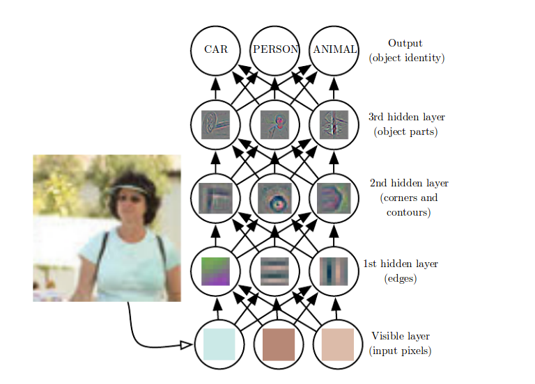
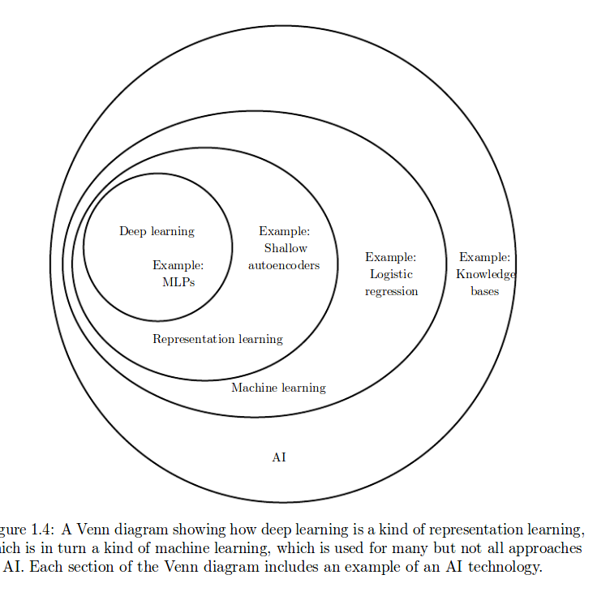
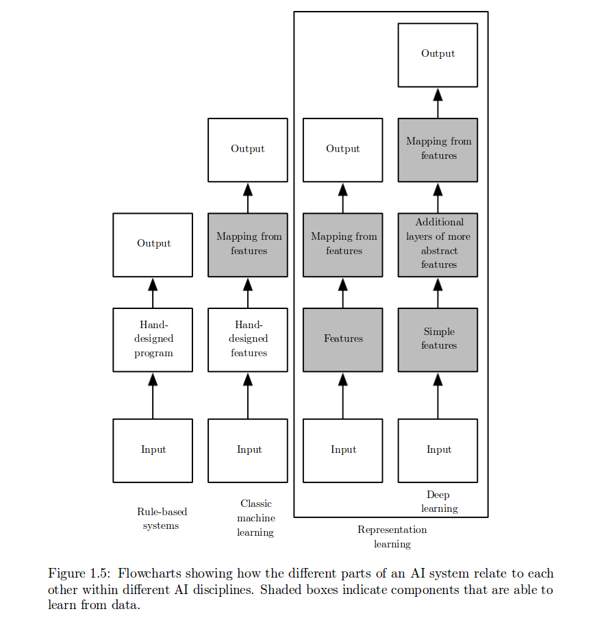
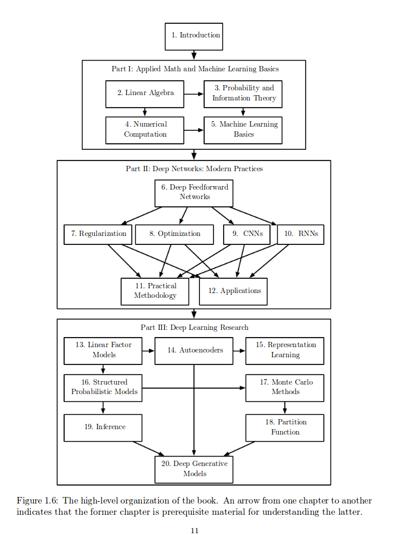
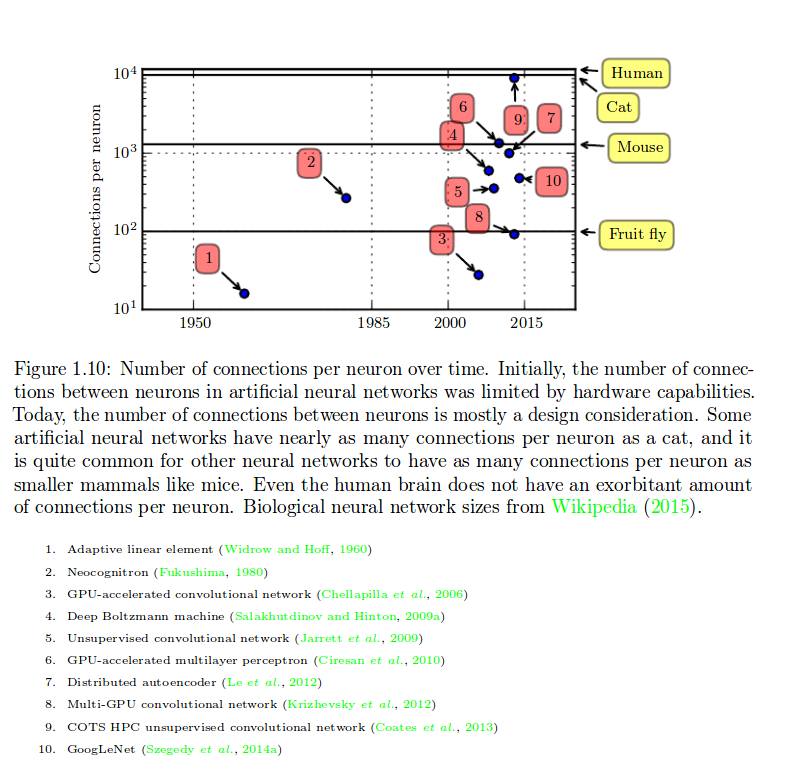
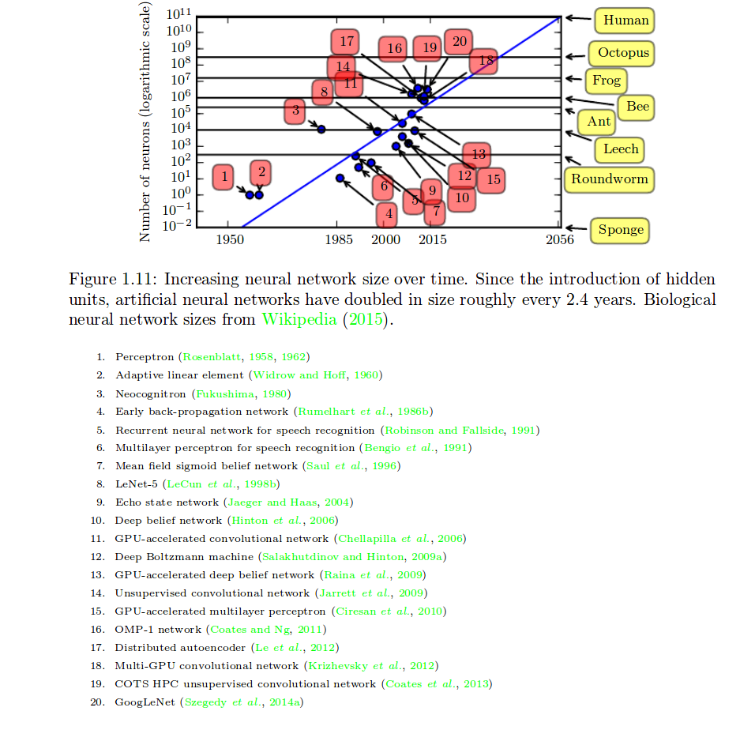

## Introduction
- The true challenge to artificial intelligence proved to be solving the tasks that are easy for people to perform but hard for people to describe formally—problems that we solve intuitively

- 让计算机从经验中学习,以一个层次的概念去理解世界,每个层次的定义都与一些更低层次的概念有关.(有点稀疏表达的意思).概念的层次性使得计算机能够从一些就简单的规则学习并建立复杂的规则.如果我们用一个图去表示这些概念是如何建立在彼此之上的,这个图会是一个具有很多层次的深图,因此,称这个方法为**[deep learning]**即**[深度学习]**

- The knowledge base approach to artificial intelligence:有基于规则的人工智能理论,即,based on hard-code kownledge(基于硬编码的知识),失败了,迄今为止没有一个取得好的成果的基于规则的系统,因此应该建立一个系统可以从经验数据中去获取知识.

- 在机器学习中提到了一个重要的话题,那就是在拥有特征响亮的模型中,如何去定义特征的问题,比如剖腹产的预测中,就不能使用MRI图像去做特征,因为图像中的像素点之间没有时间联系的意义.特征的选择是影响模型效果的一个极其重要的因素.

- 下一个问题在于,并不是所有的特征的可以轻易的规则化表示,有些是很难表示的.因此这里又牵扯到另外一个重要概念**[representation learning]**即**[特征向量的训练]**.这个技术有两个优点:
  1. 可以提高模型性能.
  2. 节省了很多人力,不用费力地去找特征了,计算机可以很快实现
- **[encoder-decoder]**是实现,特征向量训练的一个例子.

- 定义特征向量的目标是,找出影响结果的**[factors of variation]即[影响结果的特征]**.这些因素影响了我们对结果的判断.这些因素也许是隐含的.They can be thought of as concepts or abstractions that help us make sense of the rich variability in the data.这些因素可能并不是一些具体的物体.例如,分析一个语音时,这个因素可能是性别,声调,单词,等等等. ​
- 在现实世界中,经常出现这种情况,即,许多的[factor of variation]都会影响每一小块数据.这就导致了,难以从数据中去抽出特征向量,甚至于抽取的难度达到了人类的识别的难度.比如说,在识别车时,我们认为有轮子,是他的一个因子,那么首先就要识别轮子,这种高层次的特征向量,甚至比识别车还难,这时,我们认为没有必要抽取特征向量.
- 深度学习,通过提取一些更简单的特征来进行表示,通过增加模型层次,使得每层比每层处理的特征要高级,最后便可以得到我们要的结果.举例,见下图:
  
  - The idea of learning the right representation for the data provides one perspective on deep learning. Another perspective on deep learning is that depth enables the computer to learn a multistep computer program. Each layer of the representation can be thought of as the state of the computer’s memory after executing another set of instructions in parallel. Networks with greater depth can execute more instructions in sequence.简而言之,也就是上面那个图说的意思,中间的层次对于输入而言没有实际的解释意义,只是帮助整个模型构建起来.
- ​
- 紧接着上面,如何定义一个模型的深度呢?两个主要方法:
  1. The first view is based on the number of sequential instructions that must be executed to evaluate the architecture.  就是说,基于逻辑,有多少层是根据其应该被分为几步实现.例如,类比到程序设计中,实现线性回归,在C中只有加减乘除等基本工具,那么就要有很多层去实现,但是若是用python,就可以调用回归模块,一步到位.-> 这是一种基于现有工具的表达方式,不牵扯认知问题
  2. Another approach, used by deep probabilistic models regards the depth of a model as being not the depth of the computational graph but the depth of the graph describing how concepts are related to each other. 即,不是基于计算的流程,而是基于一一些更本质的,认知相关的东西.

- 讲到这里,有人问了,深度学习与机器学习不同在哪里呢?

  答:深度学习可以被视为比传统的机器学习更多地涉及学习功能或学习概念的模型的研究。(原文是:deep learning can be safely regarded as the study of models that involve a greater amount of composition of either learned functions or learned concepts than traditional machine learning does.)
- Deep learning is a particular kind of machine learning that achieves great power and flexibility by representing the world as a nested hierarchy of concepts, with each concept defined in relation to simpler concepts, and more abstract representations computed in terms of less abstract ones.即,深层学习把世界认为是一个由概念组成的具有层次性的网状结构,并且这里的每个概念都有更简单的概念组成,更抽象的概念由抽象等级较低的概念组成.
- 下面给出一个人工智能的领域包含关系图以及各种方法的区别示意图:
  
  

### 1.1 who should read this book?
- 下面给出该书的组织图
  
### 1.2 Historical Trends in Deep Learning
#### 1.2.1 The Many Names and Changing Fortunes of Neural Networks
###### 第一个时期,cybernetics-[控制论] (1940s-1960s)

- 最开始的应用是simple linear models,就是说从参数没有经过非线性转换,并且,权重韩式人为定制的.(McCulloch-Pitts neuron 1943)
- 出现了可以自己学习参数的算法,这个时期提出了,stochastic gradient descent(随机梯度下降法)(adaptive linear element 1960)
- 发现了线性感知器的不足,有时会出现矛盾.这是深度学习的第一次大转变(1969)
- 福岛从哺乳动物的视觉神经体系中得到一个新的视觉分析模型(1980)后变成著名的卷积神经网络(1998)
- 发现,将雪貂的视觉神经的输入改为从听觉系统输入,雪貂仍然可以看见,说明大脑各部分的细胞基本结构是相同的,因此,深度学习的各个领域可以说是九九归一.(2000)
- 如今,神经学对于深度学习的帮助已经不会有更多了,因为人们对大脑的认识停滞不前.并且要想模拟大脑,至少需要几千几万的细胞同时链接,这是不现实的.(2005)
- 09-11年的几个研究简化了如今的视觉模型,加入了更多工程学的内容,但是神经理论仍然是模型很重要的原型之一,现在的神经网络中的神经元多是**[rectified linear unit]**.
- 现在的神经学已经启发我们建立起了几个神经网络框架,但是还不够,我们对神经的认识还不能够为我们提供更好的建议.我们不能过分强调神经学对深度学习的影响,现在的深度学习更多的是线性代数,信息论,概率论,数值分析扥等学科的集合.
- 计算神经学是一门与深度学习无关的学科.computational neuroscience is primarily concerned with building more accurate models of how the brain actually works
###### 第二个时期 connectionism-[联结主义] or parallel distributed processing-[并行分布处理] (1980s)

- 联结主义这个词出现于认知科学中,在1980s早期,认知学专家都学习了符合推理,但是发现还是无法去描述大脑的逻辑,因此,他们转向了利用神经的实现去完成认知模型的研究方向(1985)
- 基本理念是,将大量简单的神经元模型进行连接之后,便可以实现复杂的推理功能.在这个时期发现可几个重要的概念.
  1. **[distributed representation]**-**[分布式表征]**,即,一个物体的描述可以分为几步来进行,比如说对于,[红色的车],[黄色的车],[白色的车],[红色的飞机],[黄色的飞机],[白的飞机]这六个物体组成的数据库,一般来说需要六个位置(记忆位置)去标记.但是若是将,这个数据库中的所有问题分为3[颜色]\*2[物体],就可以只有五个记忆位置,颜色中的三个以及物体中的两个.即将物体的描述语言分层进行描述.可以说,词向量就是这个模型的高级版.(1986,87)
  2. **[back-propagation]**-**[反向传播理论]**,这是另外一个极其重要的概念.(1986,87)
  3. **[modeling sequences]**-**[记忆性的神经网络结构]**,LSTM(1997)
- 1990s中期左右,该时期结束,之后的一段时间,**[Kernel machines]**和**[graphical models]**持续走热,直到2007.
###### 第三个时期 [deep learning]

- 2006年,Geoffrey Hinton提出了**[greedy layer-wise pretraining]**理论,解决深度网络难以调参的问题.
- 深度学习本质还是机器学习的一种,这里之所以叫做深度学习,是为了强调现在的深度学习可以解决更深层次的神经网络问题
- 最新的发展趋势:The third wave began with a focus on new unsupervised learning**(无监督学习)**techniques and the ability of deep models to generalize well from small datasets**(利用深层模型从小样本数据中学习)**, but today there is more interest in much older supervised learning algorithms**(更老的监督学习算法)** and the ability of deep models to leverage large labeled datasets**(利用大型标记数据集)**
#### 1.2.2 Increasing Dataset Sizes
- 是数据集的急剧上升造就了今日的深度学习
- 一个粗略的经验法则:在每个类别下的标注数据达到5000时,将可以拿到可以接受的模型,当每个类别下的标注数据集超过一千万时,将会超过人的水平
- 反而言之,现在的下一步的目标是,如何利用小数据集去达到好的效果,现在的主要方向是,利用非监督或是半监督算法去训练未经标注的数据集.
#### 1.2.3 Increasing Model Sizes
- Biological neurons are not especially densely connected.生物的神经链接不是那么紧密地,这也是我们能够利用神经元去模拟大脑功能的原因之一.几十年来，我们的机器学习模型的链接数量是在哺乳动物大脑中的数量级上的，每个神经元都有大量的连接。下图是一个关于链接数量的说明:
- Since the introduction of hidden units, artificial neural networks have doubled in size roughly every 2.4 years.This trend looks set to continue for decades. artificial neural networks will not have the same number of neurons as the human brain until at least the 2050s.这个是关于神经元数量的分析
#### 1.2.4 Increasing Accuracy, Complexity and Real-World Impact
- 现在的模型已经可以识别至少1000种类的物体了.
- 在物体识别上,2012年,依靠卷积网络,准确率得到大幅度上涨,错误率仅有15.3%.但在2015年,准确率已经上涨到97%左右.
- 不仅模型精度与规模提高了,其可以解决问题的复杂度也提升了.
- reinforcement learning:In the context of reinforcement learning, an autonomous agent must learn to perform a task by trial and error, without any guidance from the human operator. 