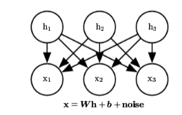
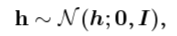
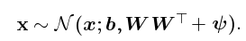
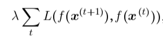
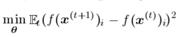
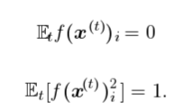
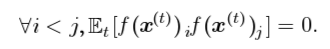

## Chapter 13 Linear Factor Models

### 0. Introduction

目标是解决有潜变量的概率分布模型:

$p_{model}(x)=\mathbb{E}_hp_{model}(x|h)$

这一节只将一些简单的模型 : linear factor models

这个模型通常作为建立更大的概率模型的基本单元的形式存在. 

#### 0.1 模型基本形式

- $p(h)$ : factorial distribution:

  - $p(h)=\prod_ip(h_i)$

- 概率图模型:

  

### 1. Probabilistic PCA and Factor Analysis

#### 1.1 Factor Analysis 

对于潜变量的假设:

对于噪音的假设 :

$\text{noise}\sim \mathcal{N}(0,\phi)$, 其中:

$\phi = \text{diag}(\sigma^2)$, $\sigma^2=(\sigma_1^2,...,\sigma_n^2)$

得到的关于 x 的结果:

#### 1.2 PCA

就是简单的将 :

$\phi = \text{diag}(\sigma^2)\to \phi = \sigma^2 I$

两者均可用 EM 算法求解, 方法见 PRML

### 2. Independent Component Analysis (ICA)

ICA不是一个具体的模型, 而是一类模型的定义. 

他指的是, 对于一个观察数据, 可能会有多个独立的 factor 在对他产生影响. 

不同的 factor 产生的影响被 scale 以及 叠加, 产生了最后的 observation.

一般通过最大似然法去学习参数. 

上面的模型其实也是 ICA 的一种形式, 除此之外还有很多变种. 

### 3. Slow Feature Analysis

Slow feature analysis (SFA) is **a linear factor model that uses information from time signals** to learn **invariant features**

利用时间信号去学习不变的特征. 

#### 3.1 目的

在一些有时序性的场景里面, 我们需要提取一些这些场景都有的共通特征. 比如, 一个斑马在奔跑的视频里面, 我们需要从中提出斑马的特征, 但是如果采用像素点的方式的话, 每一帧之间的变化是极大的.

那么, 这里采取的方法就是, 定义一个特征提取函数 $f(x^{(t)})$, 使得每一帧之间的特征距离最小, 也就找到了斑马的共同点.

#### 3.2 Cost function

目标函数:

L 是两个时间之间的distance. 

#### 3.3 linear feature extractor

对于一个线性的特征提取函数而言, 可以得到 closed form 的解. 

优化目标:

两个限制:

- 第一个限制是为了让它只有一个 unique 解.
- 第二个限制是为了防止所有的解都 collapse 为0

在如果想学习多个 特征函数的情况下, 必须要有一下形式的约束:

这样可以使得多个特征函数之间独立, 并且, 这里的 ij是有顺序的, 如果不加约束, 所有的特征函数学得到的都是最慢的特征. 而这里样的话, $f_0$ 最慢, 之后会越来越大.

#### 3.4 Nonlinear

SFA 多用于非线性的情况, 这里介绍了两种非线性的方法:

- 核函数

  例如, 多项式的话, 就是用 $x_ix_j$ 去代替, x, 但是在优化上还是线性优化. 

- Deep SFA

  将一个 SFA 的特征提取的结果作为下一个输入, 这样多个特征之间就有了交互, 就不再是线性的了. 

#### 3.5 Explaination

SFA 最好的一个地方就是 对于 特征函数的可解释性. 

对于不同的输入, 其分别学到的不同的特征函数具有相当的特征性. 

SFA 的先验知识 就是,  **输入在短时间内没有发生质的变化, 其主要特征依保留.**

