## Chapter 3 Probability and Information Theory

### 3.1 Why Probability?

#### 1. some basic concepts

-   use it in two major ways:
    -   First, the laws of probability tell us how AI systems should reason.we can use probability theory to derive various expression which we need in AI system.(设计系统)
    -   Second, we can use probability and statistics to theoretically analyze the behavior of proposed AI systems.（检验系统）

-   概率论让我们去理解不确定性,信息论使我们去定量分析不确定性.

-   三种不确定性的来源

    -   Inherent stochasticity in the system being modeled.(固有的随机性)
    -   Incomplete observability.(不完整的可观察性)(we cannot observe all the variables that drive the behavior of the system.)
    -   Incomplete modeling(模型的不完整性),若是模型建立的不够合理,会产生不确定性.

-   在人为的系统中,不确定性有时要比一个确定系统更加有效

    ​

#### 2. Bayesian  VS frequentist 
- 解释1-理论层面
  频率学派与贝叶斯学派探讨「不确定性」这件事时的出发点与立足点不同.

  频率学派出发点为**[事件本身是随机的]**,立足于**[无限次的实验]**,对**[事件的随机性]**进行建模.
  贝叶斯学派出发点为**[观察者本身的知识不足]**,立足于**[先验知识]**,对**[基于先验知识的推理系统]**进行建模

|      | Bayesian probability | frequentist probability |
| :--- | :------------------- | :---------------------- |
| 出发点  | 事件本身是随机的             | 观察者本身的知识不足              |
| 立足点  | 无限次的实验               | 先验知识                    |
| 建模方法 | 事件的随机性               | 基于先验知识的推理系统             |

-   解释2-数学层面

    贝叶斯观点与频率观点其本质区别在于：

    贝叶斯学派认为参数是变量，而频率学派认为参数是定常的，只是我们不知道其取值而已.

-   更加详细的解释见,[Bayesian  VS frequentist]

### 3.2 Random Variables

### 3.3 Probability Distributions

**3.3.1 Discrete Variables and Probability Mass Functions**

**离散变量和概率质量函数**

-   一般用概率质量函数去描述离散变量的概率分布.

**3.3.2 Continuous Variables and Probability Density Functions**

连续变量和概率密度函数

-   一般用概率密度函数去描述连续变量的概率分布.
    ​

### 3.4 Marginal Probability

边缘概率就是指一个变量单独的概率.

对于离散变量而言:

$p(x) = \sum_yp(x,y)$

对于连续变量而言

$p(x)=\int p(x,y)dy$

### 3.5 Conditional Probability

### 3.6 The Chain Rule of Conditional Probabilities

想象n-gram的理论基础公式

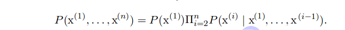

###　3.7 Independence and Conditional Independence
** 独立性以及有条件的独立性**
- 独立性:$x\perp y$ : $p(x,y) = p(x) * p(y)$
- 有条件的独立性:$x \perp y | z$ : $p(x,y|z)=p(x|z)*p(y|z)$

### 3.8 Expectation, Variance and Covariance
#### Expectation
期望
#### Variance
方差
standard deviation = $\sqrt (variance)$

#### Covariance

-   The covariance gives some sense of how much two values are linearly related to each other, as well as the scale of these variables.:

    ​	$Cov(f(x),g(y))=E[(f(x)-E[f(x)])(g(y)-E[g(y)])]$

-   独立和相关系数有关系,但不是一个概念.

    -   如果说,两个变量之间非线性独立,那么其相关系数定不为0

    -   若,两个变量之间相关系数为0,只能说明其非线性相关,有可能有其他的相关关系.

        例如,$x\in [-1,1]$遵从均匀分布,$=s-1,1$,概率均为0.5,设$y=sx$:

        则,$Cov(x,y)=0$,但是明显两者具有依赖关系.

-   covariance matrix:相关系数矩阵

    ​		$Cov(x)_{i,j} = Cov(x_i,x_j)$

### 3.9 Common Probability Distributions

**常见的概率分布**

#### 1. Bernoulli Distribution

**伯努利分布** 非0即1,下面是该分布的一些性质:

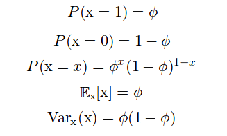

#### 2. Multinoulli Distribution

该分布是伯努利分布的进阶版,变量有k个,分别为$[x_1,x_2,...,x_k]$.

只有一个的值为1,假设这k个变量的概率分布放在一个向量p里面.p的形式为						

​						$[0,0,...,1,...,0]^T$

则,k个变量的联合概率可以表示为:

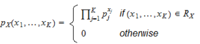

这里对上面的公式进行解释:

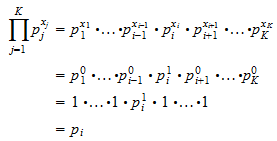

也就是说,这个累乘看似复杂,不过因为其中$0^0=1$,因此就是指出了总概率和.

相关系数如下,不解释了,自己看着都费劲:

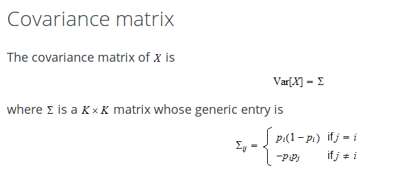

#### 3. Gaussian Distribution

关于高斯分布的更多内容祥见:[6.2.2.1小节笔记]

-   大名鼎鼎的高斯分布

    下面是公式:

    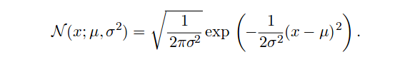
    但是在平时的计算中,若经常替换参数以评价PDF的质量,因此简化为以下的公式.

    

- 有时,在缺少先验知识但需要对某个参数或者变量的分布进行模拟时,都会采用高斯分布.原因如下

    - First, many distributions we wish to model are truly close to being normal distributions.central limit theorem(中心极限定理) shows that the sum of many independent random variables is approximately normally distributed.

        就是说中心极限定理证明了,各种独立的随机变量的分布之和接近于正态分布(即高斯分布)

    -   在所有拥有相同方差的分布中,正态分布有最大的不确定性,因此,**使用正态分布可以认为是对模拟的变量设置了最少的先验知识(本身就没有一点的先验知识)**,证明方法见19.4.2.

-   将高斯分布推广到高维空间,得到:

    ​				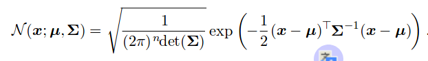
    其中

    ​	$\sum$是相关系数矩阵.

    如同在单变量下一样,可以对公式进行简化,可以用精度矩阵$\beta$代替$\sum$:

    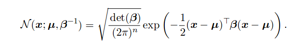

    我们经常会把相关系数矩阵转为一个对角矩阵.

    An even simpler version is the isotropic Gaussian distribution, whose covariance matrix is a scalartimes the identity matrix.(这个就不细追究了)

#### 4. Exponential and Laplace Distributions

-   指数分布

    ​				$p(x;\lambda )=(\lambda 1_{x\ge 0}) ^{-\lambda x}$		
    其中			$1_{x\ge 0} = 1$  $if$ $ x \ge 0$

-   Laplace distribution

    拉普拉斯分布就是两个指数分布背靠背的形状.公式为

    ​				$Laplace(x; µ, γ) =\frac{1}{2γ} exp(\frac{−|x − µ|}{γ})$

    形状是:

    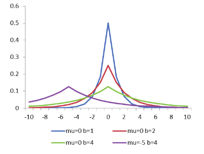fen
    拉普拉斯分布用于:声音辨识和JPEG图像压缩

#### 5. Dirac distribution and empirical distribution 

-   **狄拉克分布**:all the mass in the probability distribution clusters around a single point

    ​							$p(x) = δ(x −µ).$

-   Dirac分布不是一个用于描述真是数据的分布函数,而是作为一种用于数学分析的广义函数.

-   Dirac分布被用于**empirical distribution**的一个组成部分.经验分布函数是在n个数据点中的每一个上都跳跃1 / n的阶梯函数。 其在测量变量的任何指定值处的值是小于或等于指定值的测量变量的观测值的数。Dirac分布在其中的作用相当于一个把连续函数变成一个离散函数的作用.

  -   In statistics, an empirical distribution function is the distribution function associated with the empirical measure of a sample. This cumulative distribution function is a step function that jumps up by 1/n at each of the n data points.经验分布不是一个拥有固定形状的分布,这个要依靠数据集的特性.这个函数的特点是,将数据集中的数据顺序排列,每到下一个数据点,该数据点对应的y值上升1/n.公式如下.对被测变量的某个值而言，该值的分布函数值表示所有观测样本中小于或等于该值的样本所占的比例。	

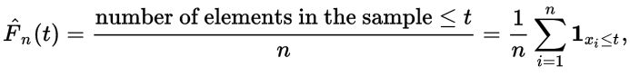

-   最后 empirical distribution的值趋近于零.分布图如下,其中经验分布函数 Fn(x) 的图形（如下图所示）是一条呈跳跃上升的阶梯形曲线.若数据量趋近于无限大,那么圆滑曲线是总体 X 的理论分布函数 F(x) 的图形.

    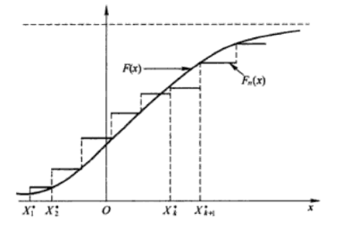

#### 6. Mixtures of Distributions

混合分布**

-   A distribution is made up of several component distributions.On each trial, the choice of which component distribution should generate the sample is determined by sampling a component identity from a multinoulli distribution.

    也就是说,哪一部分的样本应该遵从什么分布,这个可以由下面这个公式去标识,注意,是标识,不是判断.

    ​					$P(x) = \sum_i P(c=i)P(x|c=i)$

    就是说,$P(c=i)$是说分布为i的概率,$P(x|c=i)$是说,在分布为i的情况下,x的概率,也等同于上面说到的multinoulli 分布.

-   想想看,刚才我们是不是已经见过一个混合分布了?对!!!!,你没有猜错,去吧,拉普拉斯分布,就决定是你了(甩帽).在第16章,我们会讨论从简单的概率分布构建复杂概率分布的艺术!艺术,就是构建分布!!

-   混合模型牵扯到一个非常重要的概念--潜在变量,我在这里的理解是,潜在变量是不能直接观测到的变量,那么什么是可以直接观测到的变量呢?因为,在分析数据概率分布的时候,人们需要去假定该数据符合某种分布,所有说,首先这个模型就被确定了,在这个假定模型上的参数变量,我认为就是直接变量.即,**由确定模型和确定数据确定的变量**

    而潜在变量是指,影响模型决定的变量,和上面的不一样,以上面的公式举例,

    ​					$P(x) = \sum_i P(c=i)P(x|c=i)$

    这里的c就是那个潜在变量,$P(c=i)$是说分布为i的概率,即决定模型的变量,而在这个公式中,直接变量被隐藏在 $i$ 中,没有写出来.详细的内容见16.5

-   这里举了一个混合高斯的例子,今天早上还刚想过这个,应用在我构想的动词向量网络中,与动词共现的每个名词便可以作为混合高斯中每个高斯的均值.具体的算法细节参见还没有写的PRML笔记(估计半年后会开始写).:smirk:

    混合高斯模型可以认为是一个空间密度的通用逼真器.理论上,只要是平滑分布的密度,只要有足够多的子高斯分布,混合高斯可以零差错的描述任何空间密度分布.

-   这里还有必要介绍,三种不同类型的协方差矩阵所控制的高维高斯分布的特性.

    -   首先要清楚,这个部分要研究的是什么?

        我们平时的最简单的高斯分布,就是正态分布是一个一维分布,也就是说,只有一个变化方向,但是在高维中便不同,n维高斯分布控制的密度变化方向有n个,那数据的密度向哪个方向伸展,这个决定因素就在高维高斯分布的协方差矩阵中体现.再具体介绍各个矩阵之前,回顾一下协方差矩阵的性质,矩阵的中 $x_{i,j}$ 代表的是第i个因子和第j个因子的相关性,那么这里的因子便可以类别为维度信息.

    -   第一个类型: isotropic covariance matrix,各项同性协方差矩阵

        -   顾名思义,这个协方差矩阵控制下的分布,具有各维度均衡发展的特性,那什么是 isotropic covariance matrix呢?

        -   covariance matrix的特性为:

            ​		$C = \lambda I$

            即,这是一个单位矩阵,单位矩阵有什么特性呢?对单位矩阵进行坐标系转换,仍然是单位矩阵.

    -   第二个类型:diagonal covariance matrix,对角矩阵

        -   考虑刚才说到的协方差矩阵的本质,可以知道,这是一个,维度与维度之间互不干扰的分布,即每个维度之间是独立的,那么若设其中一些对角元素为0,便可以使数据朝其他维度集中.

    -   第三个类型:a full-rank covariance matrix,满秩协方差矩阵

        -   即,每个维度上都有分部信息,互相之间也许有干扰也许没干扰,这种矩阵也是最常出现最复杂的矩阵,可以控制各个方向的分布.

    -   更详细的参见[博客](http://blog.csdn.net/u010182633/article/details/45937051)

###　3.10 Useful Properties of Common Functions

**介绍了一些在处理概率分布时,通常用到的函数,特别是在深度学习中激活函数**

-   逻辑sigmoid

    ​					$σ(x) =\frac{1}{1 + exp(−x)}$

    逻辑函数通产用于产生伯努利分布的结果,常用于逻辑回归,以及二元判断里面.

    ​

    softplus function	:也是属于sigmoid系列的函数:

    ​					$ζ(x) = log (1 + exp(x))$

    这个函数可以说是,sigmoid的改进,这个改进是基于脑神经科学.模拟出了脑神经元接受信号更精确的激活模型.有三个改进:

    -   **单侧抑制**,和sigmoid不同,他在右侧是没有抑制的
    -   **相对宽阔的兴奋边界**
    -   **稀疏激活性**:这里是指神经元之间,虽是紧密链接,但是当信号出现时,只有一小部分神经元能够接受,即,激活的稀疏性,这也是现在深度网络排斥全连接的原因之一.

    其他的关于softplus以及网络稀疏性的信息见[链接](https://www.cnblogs.com/neopenx/p/4453161.html)

    下面是两个函数的图像:

    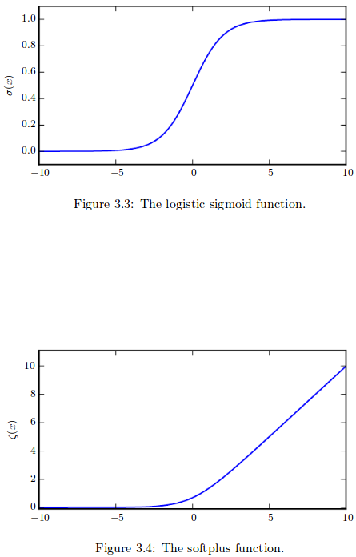

    还有一些重要的函数性质,先忽略吧,贪多嚼不烂,详见书本.

### 3.11 Bayes’ Rule

-   公式如下:

    ​				$P(X|Y) = \frac{P(X)P(Y|X)}{P(Y)}$

    上面我也介绍过贝叶斯学派和频率学派的区别,下面从公式来看一下:

    贝叶斯最大的不同在于,他考虑了参数对Y对与X的影响,并且基于经验引入了先验知识,P(Y|X),这里P(Y|X)并不是简单地,在X出现的情况下,Y出现了多少次这样的,大一课本上的计算概念,而是基于某种模型给出的,即,在已知某模型下,模型参数为X时,Y发生的概率,借由之前X,Y的数据来完善模型信息,而这个模型中蕴含的东西,就是先验知识!!!!

### 3.12 Technical Details of Continuous Variables

**这一节主要讲了测度论的一些内容.**

-   首先讲了,对于连续变量的概率质量函数上的一个悖论,首先,根据连续变量的概率质量函数的定义,变量x出现在集合S中的概率为,S中所有点发生概率的积分.

    但是在,范围[a,b]的集合中,集合是由大量的无穷的拥有无穷精度的点组成,反正他就是说在这种情况下会造成一个悖论,悖论如下:

    ​					$		p(x ∈ S1) +p(x ∈ S2)>1$

    具体为啥会有这个悖论我就不纠结了,此生若有幸,定精度测度论

-   测度论通过定义了一个描述具有无穷小的可忽略不计的集的方式去解决了悖论.测度论中称这样的集为**零测度**,例如,在三维空间中,一条直线是一个点集,这个点集的体量便可以忽略不计,另外另外个可数的零测度的单位相加的结果也是零测度.

-   另外一个测度论中很有意思的术语叫做,**几乎处处(almost everywhere)**.这个定义是指,一个集合,拥有定义域中的所有元素,除了一个**零测度**集合.这个集合发生的概率也可以说等于1.

-   最后讲了个啥,没看懂,差不多也是解决了一个悖论.(??)

### 3.13 Information Theory

-   在这本书中,主要是利用信息论中的一些想法去描述概率分布,或是定量分析概率分布之间的相似性.

    In this context, information theory tells how to design optimal codes and calculate the expected length of messages sampled from specific probability distributions using various encoding schemes.在接下来的文章中,信息论告诉我们如何设计最佳编码以及,不同编码方案下,如何计算,从不同的概率分布生成的样本的期望信息长度.

-    信息论背后的基本直觉 非常有意思:去学习一个不可能事件要比学习一个经常发生的事件更有价值,即,低概率事件中蕴含着更多的信息.

    We would like to quantify information in a way that formalizes this intuition.

    -   Likely events should have low information content, and in the extreme case, events that are guaranteed to happen should have no information content whatsoever.
    -   Less likely events should have higher information content.
    -   Independent events should have additive information.即,相互独立的时间应该还有更多的信息,比如说,[今天晴天]&[今天很热]包含的信息量要比[今天晴天]&[我爱吃苹果]少.

    满足这三个规则的量成为自信息量:

    ​				$I(x) = −log P (x)$

    ​				$lim_{x\to 0}xlogx=0$

    ​	从公式来看,信息量的基本单位是nats,是概率为1/e的事件所蕴含的信息量.

    ​	但是,为了人类的使用方便,我们常取2为对数的底,称这个单位为比特或者香农.

-   自信息量是描述一个发生值已定的事件所蕴含的信息量.而香农熵是用来描述一个概率分布所含的信息量,即:

    ​				$H(P) = E(x) = E_{x∼P}[I(x)] = −E_{x∼P}[log P (x)]$

    >   注意:这里的E是期望,就是说把,每个事件的信息量做了一个加权和,十分容易理解.

    当x为连续变量时,称熵为differential entropy(不均匀熵)

-   Kullback-Leibler (KL) divergence

    用来描述两个概率分布的距离,公式如下:

    ​				$DKL(P||Q) = E_{x∼P}log\frac{P(x)}{Q(x)}= E_{x∼P}[logP(x)-log Q(x)]$

    ​							$=\sum_i P(x_i)*[logP(x_i)-log Q(x_i)]$

    >   注意:这里的KL距离也很好理解,就是简单的信息量相减,再求和

    需要注意的是,The KL divergence is asymmetric.即:

    ​				$DKL(P ||Q)\neq DKL(Q||P)$

    在这里,如何确定计算的方向是一个问题,这个要根据情况来定下面是一个例子:

    ​

    

    先解释这里的p和q,这里的应用场景为,已知一个实际分布p,现在要得出一个q去拟合p.p为已知是一个双高斯混合分布,q没有画出来,想着是用一个高斯分布去模拟,好了情景交代结束.

    左边的这个图,表示的是,在计算从p到q的距离的时候,若要使得其距离最小,就要使得q成为绿色的模样,是一个均匀分布在整个空间的形状.左边这个图,q的选择是依据p的拥有高的概率的地方来设计的.左图中q这个函数的想法是,**他p高的地方我也得高,要和他保持同步,他多低我不管,我就是不能在高的地方输给他.即使他有好几个能力(峰值,模式),每个我也不能输给他!!**虽然心有余,但力不足,使得q的高处没有这么高,但是做到了与p同步发展,不偏科.

    右边的这个图表示的是,q的选择是依据p的拥有低的概率的地方来设计的.就是说右边的q想的更多的是,**不能把我自己概率放在他不需要的地方(avoid putting probability mass in the low-probability areas between modes of p)**.因此,当p拥有多个模式时,q就会放弃另外的模式,只去尽量的匹配最合适的模式.The effect of minimizing DKL(q||p). In this case, we select a q that has low probability wherephas low probability. When p has multiple modes that are sufficiently widely separated, asin this figure, the KL divergence is minimized by choosing a single mode, to avoid puttingprobability mass in the low-probability areas between modes of p.

-   另外一个计算距离的计算量是交叉熵(cross-entropy)

    ​					$H(P, Q) =H(P) +DKL(P||Q)$

    与					$DKL(P||Q) = E_{x∼P}log\frac{P(x)}{Q(x)}= E_{x∼P}[logP(x)-log Q(x)]$

    相比,少了左边 $logP(x)$ 的部分.这个的拟合的结果,和上面一样,因为消失的部分里面没有q(x)的信息.

### 3.14 Structured Probabilistic Models 

**结构概率模型**:因为在实际的机器学习中,经常会有很多变量在影响结果,并且变量之间多有相关性,用一个公式去解释这种现象是不可描述的.

-   一个简单的例子,n-grams

    我们认为一个句子是由很多词组成的,每一个词在句子中的出现都是有一定概率的,而词汇之间又是互相影响的,这个看似复杂的模型,若是将整个所有的词汇作为一个变量那确实复杂,但若是因式分解,解成多个变量因子通过某种结构连接在一起互相影响的形式,便可解决.

    n-gram采取的就是最简单的,连乘的方法,以1-gram为例子:

    ​					$p(a, b, c) = p(a)p(b | a)p(c | b)$

-   更为一般的模型是,将图论引入概率论,产生了大名鼎鼎的**概率图理论**.

    模型的基本形式为:There are two main kinds of structured probabilistic models: directed and undirected. Both kinds of graphical models use a graph G in which each node in the graph corresponds to a random variable, and an edge connecting two random variables means that the probability distribution is able to represent direct interactions between those two random variables.有,有向和无向两种,图中的点代表的是随机变量,之间的链接代表两者可以直接影响.

-   **Directed**:就是将上面的那个基于连乘的结构模型化,公式为:

    ​					$p(x) =\prod p (x_i| P aG(x_i))$

    这里的 $PaG(x_i)$ 指的是 $x_i$ 的parents, 看下面这个图就直接明白了.

    ​

    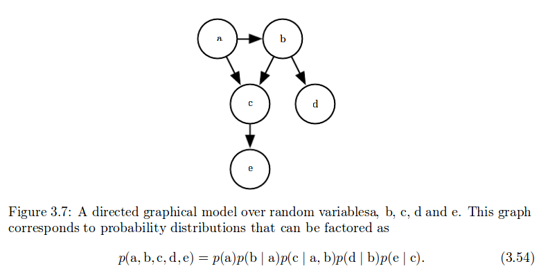

-   **Undirected**:无向的概率图结构要复杂一些.

    -   Any set of nodes that are all connected to each other in graph is called a clique.就是说,图结构中那些互相之间全部有连接的小集团,称为clique( $C^{(i)}$ ).一个概率图可以分为很多个这样的小集团(clique).每个小集团都会被分配一个因子(factor) $φ^{(i)}(C^{(i)})$ ,这些factor代表的是什么呢?

        首先我们要区别开,多参数分布与这里的概率图连接之间的关系,是,他们之间有共同点,就是

    |      |   多参数分布(例如混合高斯)   | 多参数分布(例如混合高斯) |
    | :--- | :---------------: | :-----------: |
    | 共同点  | 有**多个**参数(例如多个均值) |  有**多个**随机变量  |
    | 不同点1 |     只有一个随机变量      |    有多个随机变量    |
    | 不同点2 |   参数之间以共存在一个分布中   | 分布之间共存在一个函数中  |

    -   也就是说,概率图的一个集团之间的连接形式是**函数**,且其子单位为**分布**,即将概率分布的结果作为变量.

        可以用下面的公式形象表示:

        ​			$f[d_1(a_1,...,a_n),d_2(b_1,...,b_m),d_3(c_1,...,c_k)]$

        ​其中,f是集团之间的函数,$d_i$是概率分布函数,$a_1,a_2,a_3$ 是概率分布 $d_1$ 中的参数.

    -   其次,集团和集团之间可以采用乘法:

        ​			$p(x) = \frac{1}{Z} \prod_iφ^{(i)}(C^{(i)})$

        这里的Z是为了使,最后的所有x的p(x)的和能够为1,而设置的归一化参数.

    -   具体的以下图为例:

        ​

        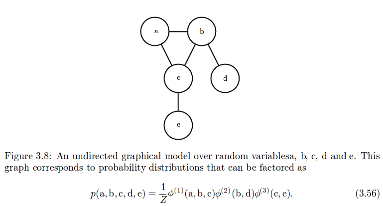

    -   这里的概率图模型是一种描述分布的语言,是个概率分布属于一个类别的术语.后面的第二章, 我们只使用结构化概率模型作为一种语言,来描述不同的机器学习算法所代表的直接概率关系.

        就是不同的机器学习算法中,计算集团里面的那个函数的定义方式不同.(我猜的,原话如下,实在是不知道怎么翻译):

        we use structured probabilistic models merely as a language to describe which direct probabilistic relationships different machine learning algorithms choose to represent.