## Chapter 4 Numerical Computation

### 4.0 简介

这部分内容是为了在计算机中解决实际的问题所必须的环节,因为一般的解析性的抽象的推导难以在计算机中实现,计算机更擅长用迭代的方式处理数据.

### 4.1 Overflow and Underflow

**溢出和下溢**

#### Rounding error

-   在计算中,因为上面提到的无限的小数以及有限的内存的问题,对数据进行约入是一个必须要进行的.若仅仅采取四舍五入的方法,会出现Rounding error(舍入错误).因为,若该数据与很多数据compound在一起的话,就会引发蝴蝶效应,发生较大错误.Rounding error有两种:

    -   underflow

        这种错误出现在当数据极其接近于零时,计算机将其直接等于0的情况

    -   overflow

        这种错误出现在当数据非常大时,被计算机认为是接近于无穷大或无穷小,这时便会出现一个数字变成not-a-number-value的情况.

-    一个例子,softmax:

    ​					$softmax(x)=\frac{exp(x_i)}{\sum_j exp(x_j)}$

    在某个 $x_i$ 非常大的时候,会导致上下都为无穷大的情况,这样这个式子变成一个代号没有实际的值.

    若 $x_i$ 都为一个负的很大的值,则会使得分母为0,造成错误.

    解决方法为,使得:

    ​					$z = x - max_i x_i$

    原理是,这样的分式再将变量减去一个标量时,比值不变,这样也解决了溢出的问题.在应对logmax函数的时候可以采取一样的方法

-   本书不会给出太多的数值计算的算法,但是读者在设计深度学习算法的时候要时刻注意这个问题,一般可以用库函数解决计算稳固性的问题.

### 4.2 Poor Conditioning

**poor conditioning:不利条件**

-   在一些函数或者系统中,输入的极小的误差都会造成结果的很大的变化.

-   例子:矩阵求逆

    在对矩阵求逆时,如果该矩阵的绝对值最大的特征值与绝对值最小的特征值的比值很大时,那么这个矩阵就是一个敏感的矩阵,求逆过程中极小的误差,在这个逆矩阵的后续运算中都会出现很大的误差.

    敏感性本身就是矩阵的一个固有性质(intrinsic property),不利条件(敏感)矩阵会放大出现在求逆过程中的错误.

    这里的涉及的理论是[矩阵的条件数(P239)]以及[矩阵扰动P245]

    ​

### 4.3 Gradient-Based Optimization

**基于渐变的优化**

-   接下里讲基本上都见过的概念,损失函数.这里的基于渐变的优化就是指,通过逐渐改变x的方式,最小化或者最大化函数的值.标准公式如下:	

    ​					$x^*=argmin f(x)$

    这里的 $x^*$ 就是损失函数的标准形式.

    利用微分的方式逐渐下降的算法叫做梯度下降法(gradient descent).当导数为0时,且邻居点都大于自己的点称为,critical points,或者stationary points.但这个只能成为局部最优解.对于global minimum,因为对于一个高维的处理问题,求出正确的全局最优解很难,我们一般不要求,一定求出是在任何形式意义下都最小的那个点,我们通常会选择一个很低的,但不一定是全局最小的点作为结果.

-   计算高维下的求最小值问题.

    这里要用到偏微分以及方向导数的概念.

    高维变量的函数的微分(梯度值)也是一个向量,其中包含了各个方向的偏微分.在计算高维变量函数时,我们要知道函数的前进方向就要用到偏微分出的这个偏微分向量,他指向了函数最快发展的方向.

    也就是使函数按照其梯度方向的反方向（也就是梯度增长最快的方向）改变自变量.为什么是反方向呢?从公式来看也可以理解:

    ​					$\theta'=\theta-\alpha	\triangledown_x f(x)$

    这里的 $\alpha$ 是步长也叫作下降速率,这里的$\theta$是自变量.

-   下降速率的设置方法:

    -   最简单的方法是设置为一个定值

    -   其次,还可以使用line search的方法,公式如下:

        ​				$minϕ(α)=f(\theta-\alpha	\triangledown_x f(x))$

        就是说,在$\theta$ 和$\triangledown_x f(x)$已知的情况下,只把步长作为未知数,迭代求出最优解.具体的方法见[链接](http://blog.csdn.net/tsroad/article/details/50249393)

-   需要知道的时候,有的时候我们可以直接通过解方程求出最优解,即:x

    ​					$∇_xf(x) = 0$

>   下面在书上全部为4.3.1节的内容,但是为了方便,进行了分节

#### 4.3.1  Multidimensional output 

-   我们上面讨论的是,output是一个标量,input是一个向量的情况.那么当output与input都为向量的啥时候该怎么处理呢?

    -   先来笨想,之前的一个output标量对应了一个偏导数向量,那么在这里,output向量中的每一个维度也应该对应一个偏导数向量 -> Jacobian矩阵.

    -   即:目标函数f为一个函数向量，它的每一个元素都是关于自变量向量x=(x1,x2,⋯,xn)T的函数，此时，函数向量f对向量x求梯度，得到的结果为一个矩阵，行数为函数向量f的维度，列数为自变量x的维度，称之为Jacobian矩阵

    -   公式为:对于$f:\mathbb{R}^m \rightarrow \mathbb{R}^n$,有 $J \in \mathbb{R}^{m\times n}$.其中$J_{i,j}=\frac{∂}{∂x_j} f(x)_i$

    -   梯度向量与Jacobian矩阵的关系是,梯度向量是Jacobian矩阵的一行.

        ​		即 		$梯度向量 \in Jacobian$

#### 4.3.2  positive definite matrix

**正定矩阵:**

-   定义:

    若对于矩阵**实对称矩阵** A 有,任意x都有:

    ​		$x^TAx > 0$

    那么,称A矩阵为正定矩阵.(这里的A可以理解二次型的矩阵)

-   性质1:

    对于A的任何大小为1的单位特征向量(将基础解系归一化后的全体特征向量),都有:

    ​		$x_1^TAx_1 = \lambda_1$

-   性质2:

    正定矩阵的所有特征值都大于0.

    证: $0<x^TAx=x^T\lambda x=\lambda ||x||^2$

    因此 $\lambda >0$

-   性质三:

    实对称矩阵A为正定矩阵的充要条件是存在可逆矩阵M,使得:

    ​		$A=M^TM$

#### 4.3.3 Hessian matrix 

**Hessian 矩阵又是什么呢?**

Hessian讲解相关链接:[链接](https://zhuanlan.zhihu.com/p/23866364)

-   **二次导数**

    这个和二次导数有关系,首先要明白二次导数对于$\alpha$的指导意义.若一个函数的二次导数中同时存在小于0和大于0的情况的话,该函数非凸.

    先以一个简单的$f: \mathbb{R} \rightarrow \mathbb{R}$	为例子.见下图,具体每个图的意义见下面的注释,简单来说就是,当$f''>0$是,$\alpha>实际变化$,反之$\alpha>实际变化$:

    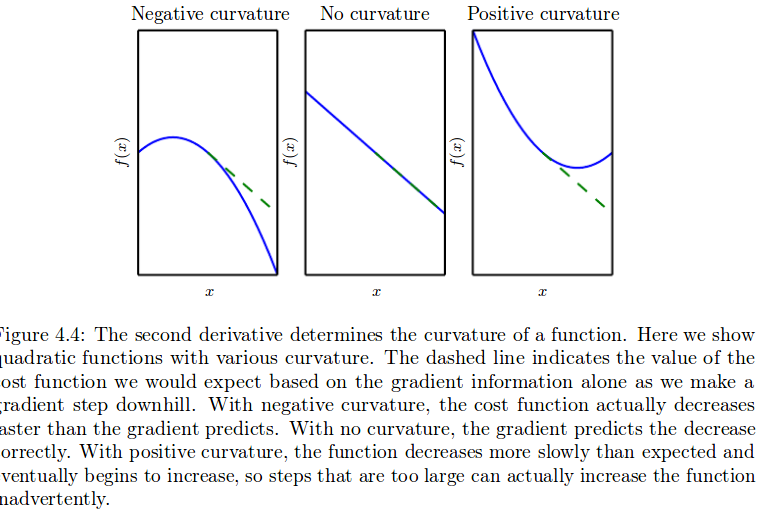

    那么对于一个$f:\mathbb{R}^m \rightarrow \mathbb{R}^n$而言,则需要一个矩阵去记录,自变量的每个维度对因变量的每个维度的,变化速率信息,这个矩阵就叫做 Hessian矩阵.

    ​				$H(f)(x)_{i,j}=\frac{∂^2}{∂x_i∂x_j}f(x)$

    因此,可以看出,对于有多个输出的情况,这个 $H(f)(x)$ 应该是一个三维张量.但是每次分析的时候,只需要考虑一个输出造成的Hessian就可以了,也就是一个二维矩阵.

-   **何时正定**

    Hessian反映的是函数曲率,不会因为梯度的正负而改变.并且对于: $g^THg$ ,这里要求g必须是要大于零的,因为曲率这种东西,正的和负的是一样的,即:

    ​					$(-g)^TH(-g)=g^THg$

    因此对于局部曲面是下凸平面的点,其Hessian矩阵必然是正定的.而连局部曲面都是非凸的点的话,就只有马鞍面了.

    **重点要强调强调再强调,Hessian的正定负定性质与梯度值无关,例如函数 $z=3x^2+2y^2$ 的Hessian矩阵处处相等**

#### 4.3.4 Hessian and Jacobian

-   **这里的Jacobian与Hessian有什么关系呢?**

    -   它的自变量：x=(x1,x2,⋯,xn)T

    -   因变量有两种情况:

        -   一维

            f(x)： 

            -   此时的一阶导数构成的向量为**梯度向量**g(x)
            -   二阶导数构成的矩阵为**Hessian矩阵**

        -   多维

            f(x)=(f1(x),f2(x),⋯,fm(x))T： 

            -   此时的一阶导数构成的矩阵为**Jacobian矩阵**

    -   就是说,首先Jacobian与Hessian用的地方就完全不同,这个要注意.

    -   那么,接下来就清楚了,Hessian矩阵是对Jacobian矩阵中的某一行进行二次求偏导数得到的矩阵.

-   **神经网络中的Hessian矩阵:**

    对于神经网络中的Hessian而言,其储存的是在某一次的训练数据的传导下,关于模型参数的二阶导数矩阵,也就说:

    -   Hessian里面储存的全都是损失函数对模型参数,比若说W的二阶导数.
    -   每用新的数据训练一次,Hessian矩阵就会变一次.

    正常来说,原始输入的情况下,Hessian矩阵不会是对角矩阵,对角矩阵意味着各输入变量之间无相关性,但是我们可以通过PCA来将原始输入转化为各变量无相关性的方法.

-   **利用Hessian决定下降方向:**

    >   若Hessian矩阵为正定矩阵,则函数为凸函数,反之为非凸函数.

    首先我们知道,H(i,j) = H(j,i),并且Hessian是一个实对称方阵,因此Hessian矩阵可以进行特征值分解,设分解后的矩阵为 $\Lambda$ ,这是一个单元正交矩阵.其中的每一个列向量(即特征向量),设为 $d^i$ .设特征值向量为 $\lambda^i$ .则:

    ​					$H = \Lambda diag(\lambda)\Lambda^{-1}$

    现在假设某个方向上的二阶导数为 $c^i$ 

    -   若这个方向存在于特征向量中.,则:

        ​					$c^i = \lambda^id ^i$

        其中 $d^i$ 代表方向,是单位向量, $\lambda^i$ 是这个方向分量上的值.相当于下降速率.

    -   若这个方向不存在于特征向量中,则:

        可以通过他在各个方向的加权和进行计算,权重由夹角确定.

####4.3.5 Steepest descent , gradient descent , Newton method 

**为了方便理解,这里只考虑一维情况**

   -   **梯度下降法**

       梯度下降法认为梯度的反方向就是下降最快的方向，所以每次将变量沿着梯度的反方向移动一定距离，目标函数便会逐渐减小，最终达到最小。

       >   他用平面去拟合当前的局部曲面.其公式为:

       ​   $f(x+\bigtriangleup{x}) = f(x) + f'(x)\bigtriangleup{x}$

       这个时候,以 $f'(x+\bigtriangleup{x})=0$ ,即当 $\bigtriangleup{x}=f'(x)$ 时,才会有 $f(x+\bigtriangleup{x})$ 的最小值.即:

       ​   $f(x+\bigtriangleup{x}) = f(x) - f'(x)^2$

       ​   $x_{n+1} = x_n - f'(x_n)$

-   **最速下降**:

     **最速下降和梯度下降基本上是一致的,不过在细微处有差异**,见[链接](http://blog.csdn.net/timingspace/article/details/50963564)

     差异在于,下降方向的选取.

     

     这里的 $||v||$ 当是欧式范数的时候,最速下降是等于梯度下降的.但是当Hessian矩阵为poor condition时,使用欧式范数就会出现下面[poor condition]解释的情况.

     这个时候使用Hessian范数，牛顿法正是使用Hessian范数的最速下降法，所以牛顿法会比梯度下降法收敛更快！ 

     也就是:

     因此,**最速下降法是一个广义定义**

   -   **牛顿法**

       >    他用二次曲面去拟合当前的局部曲面。其公式为:

       ​   $f(x+\bigtriangleup{x}) = f(x) + f'(x)\bigtriangleup{x} + 1/2f''(x)\bigtriangleup{x}^2$

       这个时候,以 $f'(x+\bigtriangleup{x})=0$ , 即$f'(x)+f''(x)\bigtriangleup{x}=0$,也就是 $\bigtriangleup{x}=-f'(x)/f''(x)$ 时,才会有 $f(x+\bigtriangleup{x})$ 的最小值,即:

       ​   $x_{n+1}=x_n−f′(x_n)/f″(x_n)$

       由此可见牛顿下降法是梯度下降法的最优情况，因此牛顿下降法的收敛的速度必然更快。

#### 4.3.6 poor condition

-   **直观理解poor condition**

     在平面模拟的局部平面中易出现这样的问题,这个和poor condition有关系,这里可以联想到上面说道的矩阵扰动性相关讨论,也就是4.2节,对矩阵求逆的讨论.也就是当:

     ​			$||\lambda_{max}||/||\lambda_{min}|| >> 1$ 时,会出现这样的情况:

     梯度方向变化就会较大，当然梯度下降的方向便不再是最好的方向。

     下面是图像:

     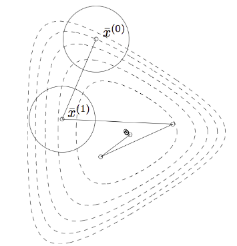

     也就是在进行第一次跳跃之后,下一点出的梯度和原来所在的点是不一样的这时候再用之前的梯度去下降就不合适了.

-   **Hessian矩阵的condition number**:

    **The condition number of the Hessian at this point measures how much the second derivatives differ from each other.When the Hessian has a poor condition number, gradient descent performs poorly**.

    我们可以想象一个普通的球面,那么在这个球面上的任一点,我们都可以认为他在各个方向上的梯度且二阶导数都是相同的,也就是condition number比较小.但是实际的情况多不是这样的曲面,而是在各个方向的曲率都是不同的.

    也就是说梯度的变化是不均衡的.这里需要注意,梯度是说数值的变化速率,而这里讨论的是梯度的变化速率.也就说,只凭梯度值是无法得知梯度值的变化速度的,也就是无法得知所在点的曲率.

    可能现在这个点在 i 方向上的梯度还挺大,但是在这个方向上移动 $\epsilon$ 之后,梯度就变得很小了.那么这个时候就会走弯路.这个时候,有些人也许要说,那我们可以通过设置很小的 $\epsilon$ 来避免啊!但是这样又会造成学习速率慢的问题.

    具体见下图:

    

#### 4.3.7 Newton’s method

上面讲了一维的情况,现在扩展到多维.[note:Hessian_正定] 笔记中有补充内容.

- **模型函数的二次泰勒展开**

    其实就是设定局部曲面为二次曲面

    ​    Taylor展开

    ​    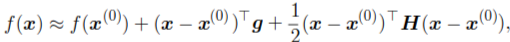

    其中 $g$ 是一次导数, $H$ 是二次导数(Hessian矩阵). 这里需要注意的是,这里扩展到了多维的情况.

- **直接求解-曲面最小值的角度去理解**

    牛顿下降法总而言之就是这样的(上面也讲过了):

    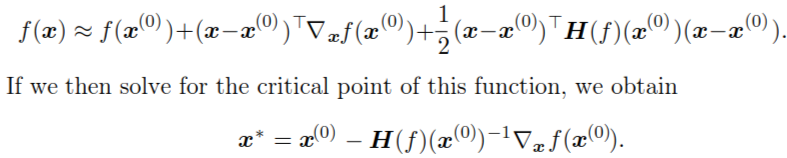

    ----

    >    **一维情况下的类比:**
    >
    >    可以得到 $f(x^{(0)}-\epsilon g)$ 的最小值.
    >
    >    那么,此时,
    >
    >    ​		$\epsilon g = \frac{g^Tg}{g^THg}*g = \frac{g}{H}$
    >
    >    这里的结果也就相当于在一维情况下的 $f'(x)/f''(x)$

    -----

- **几个和Hessian矩阵有关的性质**

    1.  当 $f$ 是正定二次函数时(也就是二次函数的二次型矩阵为正定矩阵的时候),仅需要执行上面的公式一遍就可以跳到最小值的地方.(也就是处于局部最小值的附近区域的时候,因为可以认为局部最小值附近的区域是二次曲面)

    2.  当 $f$ 是一个不是真的二次函数,但是可以局部看作是一个正定二次函数的时候,可以通过迭代应用上面的公式达到最小值.(比梯度下降要快)

    3.  但是在鞍点,也就是在这个点上既有正特征值又有负特征值(上面有图)的情况下,是不适用的.

    4.  我们问题是,在Hessian矩阵为负定矩阵的时候如何处理呢?以及为什么不能处理Hessian矩阵为负定的情况呢??只要取,负定Hessian的绝对值最大特征值对应的特征向量的反方向作为梯度下降的方向不就好了??

        -> 答,在负定的时候采用梯度下降法即可,在到达局部最小值临近区域时,再使用牛顿法.

    5.  基于梯度下降的方法叫做first-order optimization algorithms

        基于牛顿法的方法叫做second-order optimization algorithms

        由于牛顿法只能在局部最小值附近使用,所有在前面可以使用梯度下降法进行快速下降.

- **扩展到非二次曲面的情况**

    下面的讨论均是基于 $\delta f/\delta \theta=0$ ,即一阶导数为0的基础上,不为0的情况在4.3.3节的最后有讲.

    那么, $g^THg$ 代表着下降方向g在f上的下降速率.暂时先设 $g$ 为单位向量

    g是某一个梯度方向,而$g^THg$ 代表的是这个梯度方向的下降速率.(若为负值,则代表上升).证明在本章附录.

    并且可以知道对于任何方向的 $g_i$都有(因为由附录的证明可知,任何方向都可以表示为各个特征向量方向的加权和.),

    ​						$\lambda_{max} \ge g_i^THg_i \ge \lambda_{min}$

    我们可以通过判断某一参数的 $g^THg$ 来判断该参数处于局部最小值(正定)还是局部最大值(负定)还是鞍点 or 直线)(半正定).这个叫做 **second derivative test**.

    通过这个证明我们还可以知道,可以通过分析某一点处的hessian,而对该处的局部函数形状有个大致的判断

    -   正定:所有的梯度方向均为正,所有的特征向量整体处于下降趋势,因此为局部凸,有局部最小值.若是按照梯度下降的思想,是可以采用 $\lambda_{max}$ 对应的特征向量(即梯度)作为下降方向的.

    -   负定:所有的梯度方向均为负,所有的特征向量整体处于上升趋势,因此为局部凹,有局部最大值.需要注意的是,不能取这个里面最大的 $||\lambda_{max||}$ 对应的特征向量(即梯度)作为下降方向的,因为反方向的曲率不等于负的该方向的曲率.

    -   可正可负:有的梯度方向上的值可以为正,也有的可以为负.图像如下:

        在这种情况下,我们就无法确定该点的极性.就像单变量情况下,$f''(x)=0$ 的情况一样,可能是鞍点,也可能是局部直线.

    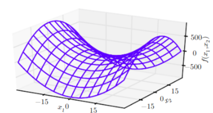

#### 4.3.8 Newton's method2 

**这里是书中的内容,是从牛顿法的本质去理解的,但是写的太简单没看懂,这里又加了很多内容.**

**本小节的内容都是基于Hessian是正定矩阵,即局部曲面为下凸曲面的假设进行的**

这里的能看到本质就是指,能够从更加数学的角度去理解为什么:

​				$x^*=x^0-gH^{-1}$

将二阶泰勒展开式转化为下面的形式,其中$ 为下降步长:

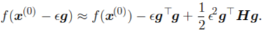

**强调强调再强调:这里的g不是函数在x点的一阶导数,而是一个任意的方向,在这种情况下求出来的最忧点 $x^{(0)}-\epsilon g$ 不一定是最小值点,而是从点 $x$ 出发,沿着 $g$ 这个方向,所能到达的最小值点.**

-   **最快的方向 $gH^{-1}$ 到底代表着什么?**

    首先我们在上面这个公式中,有两个变量: $\epsilon$ 和 $g$ .而我们要求的应该是:

    ​				$f_{min} = min_{g}min_{\epsilon}f(x^0-\epsilon g)$

    -   首先来看后面部分 $min_{\epsilon}f(x-\epsilon g)$

        利用 $\delta f(x-\epsilon g)/\delta \epsilon=0$

        可以得到:

        ​			$\epsilon=g^Tg/g^THg$

    -   再看 $min_g$ 的部分:

        将 $\epsilon=g^Tg/g^THg$ 带入:

        ​			$f=f(x^0)-(g^Tg)^2/g^THg+\frac{1}{2}(g^Tg)^2/g^THg=f(x^0)-\frac{1}{2}(g^Tg)^2/g^THg$

        现在:

        ​			 $f_{min}=min_g\bigg(f(x^0)-\frac{1}{2}(g^Tg)^2/g^THg\bigg)$

        记下来分析 $g^THg$ 和 $g^Hg$ 的意义

-   **$g^THg$ 的意义 (假设$||g|| =1$)**

    下一小节会分析 $g$ 不为方向向量的情况.

    ​				$f=f(x^0)-\frac{1}{2}(g^Tg)^2/g^TH=f(x^0)-\frac{1}{2}\frac{1}{g^THg}$

    那么现在,最小化问题就变成了:

    ​				$f_{min}=min_g\bigg(f(x^0)-\frac{1}{2}(g^Tg)^2/g^THg\bigg)=min_g\bigg(f(x^0)-\frac{1}{2}\frac{1}{g^THg}\bigg)$

    而任何 $g$ (方向向量)都可以写成这样的形式):

    ​				$g = \alpha1h_1+,...,+\alpha_nh_n$

    其中, $\lambda1,...,\lambda_n$ 为 H 的特征值,而 $h_1,...,h_n$ 为H 的特征向量.

    且我们知道:

    ​				$h_i^THh_i=\lambda_i$	 

    因此:

    ​				$g^THg=\alpha1\lambda_1+,...,+\alpha_n\lambda_n$

    因此:

    ​				$\lambda_{max} \ge g_i^THg_i \ge \lambda_{min}$

    因此,要想取得:

    ​				 $f_{min}=min_g\bigg(f(x^0)-\frac{1}{2}(g^Tg)^2/g^THg\bigg)=min_g\bigg(f(x^0)-\frac{1}{2}\frac{1}{g^THg}\bigg)$

    就要使得:  

    ​				$g_i^THg_i = \lambda_{min}$ 

    那么最差的情况就是 g 取到 最大特征值对应的梯度方向的时候.

-   **$g^Tg$ 不是单位向量的情况**

    这个情况下的分析很简单.

    设 $g = ||g||e_g$ . 其中 $e_g$ 为 g 方向的单位向量.

    $f_{min}=min_g\bigg(f(x^0)-\frac{1}{2}(g^Tg)^2/g^THg\bigg)=min_g\bigg(f(x^0)-\frac{1}{2}||g||^2e_g^Te_g/||g||^2e_g^THe_g\bigg)\\=min_g\bigg(f(x^0)-\frac{1}{2}\frac{1}{e_g^THe_g}\bigg)$

    **一个直观的解释**

    特征值大的特征向量就是,曲率大的方向.

    特征值小的特征向量就是,曲率小的方向.如下图:

    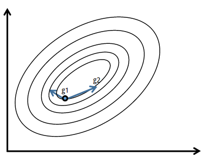

    g1 方向就是曲率大的方向,g2方向就是曲率小的方向.当然这个是个三维图,g2应该是在z轴负方向的分量不小,而 g1 在z轴的分量比较小.

    三维的图如下:

    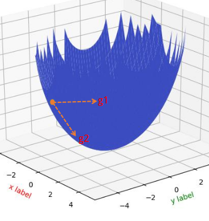

    >   注意,g1,g2 肯定不是特征向量的方向,因为特征向量肯定是这个椭圆的短轴和长轴方向.

-   **$gH^{-1}$ 的意义**

    这个地方就很有意思了.先对 $gH^{-1}$ 进行推导:

    1.  对hessian进行特征值分解,由于Hessian矩阵为对称矩阵,所以 Q 为单位正交矩阵.

        ​				$gH^{-1} = g(Q^Tdiag(\lambda)Q)^{-1}=gQdiag(1/\lambda)Q^T$

        我们知道, $Q$ 为Hessian矩阵的特征向量,所以 $gQ$ 就相当于将原来的梯度投射到了特征向量空间.即:

        ​				$gQ=\alpha_1q_1+,...,\alpha_nq_n$

    2.  而接下来再乘以 $gQ*diag(1/\lambda)$ 就相当于按照特征值的倒数对各个特征向量的维度进行拉伸.

        其中,曲率大的方向(即特征值大的方向,类似与上图中的 $g1$ )拉伸的少,而对曲率小的方向(即特征值小的方向,类似与上图中的 $g2$ ) 拉伸的多,这样就减少了曲率对预测作出的影响.

        这里需要注意的是,Hessian矩阵在所有的下凸面处都正定,意思是任何方向的 $g$ 去计算都有:

        ​				$g^THg>0$

        原因在4.3.3节的最后有讲.

    3.  最后再通过 $gQdiag(1/\lambda)*Q^T$ 将拉伸过后的梯度还原到基空间中.

    这样,下降梯度就会向最接近最小值的方向偏移.

    ​

### 4.4 Constrained Optimization

#### 4.4.1 Constrained Optimization 

**什么是约束优化?**

在优化的时候,对输入变量有一定的限制.通过各种规则将 $x$ 限制在某个集合上.

simple methods:

​	简单的方法,简单来说就是先得出所有可能的 $x$ ,然后将这些值映射回约束的集合.

---

>   线搜索是一种迭代的求得某个函数的最值的方法. 对于每次迭代, 线搜索会计算得到搜索的方向pk以及沿这个方向移动的步长αk.

---

sophisticated approach:

​	设计一个非约束算法,可以将原来的约束优化问题转换为这个非约束优化问题.针对不同的问题,会有不同的设计方法.4.4.4介绍一种较为通用的方法:KKT

#### 4.4.2 Lagrangian Dual problem 

**拉格朗日对偶**

拉格朗日对偶问题是研究KKT条件的一个基础知识,具体链接见[对偶松弛](https://www.cnblogs.com/zzrnature/p/5109076.html),[拉格朗日松弛法](https://zhuanlan.zhihu.com/p/28958014)

下面进行简单介绍,具体见笔记[note:Largangian]

这里描述了将约束问题转为拉格朗日函数的原理和思想精髓.一定要看!!

#### 4.4.3 Generalized Lagrangian

-   上面说到了,这是一个通用方法,因此就要考虑到各种各样的约束条件.约束条件分为两种,等式约束(equality constraints) 和不等式约束(inequality constraints).因此,将 $x \in \mathbb{S}$ 的约束条件抽象为:

    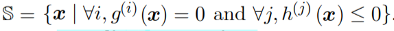

    拉格朗日函数就是在每个约束上乘以一个新的变量,再与 $f(x)$ 相加得到下面这个通用拉格朗日公式:

    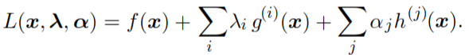

    那么,这个时候,原来的最小化 $f(x)$ 的优化问题就变成了下面这个形式:

    ​				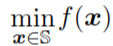 $\to$ 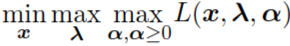

    这个公式成立的原因是,因为小于0的不等式只有其系数等于0时,才会有最大值,而等式一直等于0:

    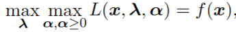

-   但是这个公式成立的条件还有两个:

    -   必须要有点满足约束条件,即 $\mathbb{S}$ 不能是空集:
    -   $f(x)$ 的值不能是无穷大.

    这些特性保证了,最优点一定是可行的点.

-   最大化 $f(x)$:

    -   这个时候只需要将优化目标变为 $-f(x)$ 即可.

    -   也可以通过如下的公式:

        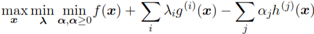

#### 4.4.4 Karush–Kuhn–Tucker(KKT) 

-   **KKT条件:**

    而KKT条件是说最优值必须满足以下条件:

    1.  The gradient of the generalized Lagrangian is zero.(最优点关于L的导数为0)

        $\mathcal{L}'(x^*) = 0$

    2.  All constraints on both x and the KKT multipliers are satisfied.(满足约束条件)

        $g^{(i)}(x)=0$

        $h^{(j)}(x)\le 0$

    3.  The inequality constraints exhibit “complementary slackness”: $α\odot h(x) =0.$

        $\alpha_i h_i(x^*)=0$

        $\alpha\ge 0$

        $\lambda_i \ne 0$

- **KKT条件对应的求解过程**

    我们知道拉格郎日求解方法是:

    对于函数 $\mathcal{L}(x) = f(x) + \sum_i\lambda_ig(x)+\sum_j\alpha_jh(x)$

    $\delta \mathcal{L}/\delta x = 0$

    $\delta \mathcal{L}/\delta \vec\lambda = 0$

    $\delta \mathcal{L}/\delta \vec\alpha = 0$

    这个里面的后两条就是针对的KKT第三条件.

- **active constraints**

    有效约束

    对于inequality constraints,设 $x^*$是满足约束条件的极值点.

    我们认为,当 $h^{(i)}(x^*)=0$ 的时候, $h^{(i)}(x)$ 是 active 的,

    这里的有效也就是说,在有该约束条件和没有该约束条件时的结果是不同的.

-   **如何在KKT条件下求得极值**

    方法是,梯度下降法,或者如下[链接](http://www2.imm.dtu.dk/courses/02711/lecture3.pdf)中的例子.具体见4.5节最后(非常详细).

    一般的简单问题都可以通过将几种限制条件下的可行解罗列出来,再挑选其中的$f(x)​$最小值就好了.

- **KKT条件的理解**

    这里只考虑了不等式约束,等式约束就是再加一个等式约束描述的超平面即可,只采用在等式约束超平面上的点.

    在这个线性组合中，等式约束梯度的权值 $\lambda_j$ 没有要求.不等式约束梯度的权值 $\alpha_j $要求是是非负的，并且如果某个 $h(x^*)$ 严格小于0,那这个约束不会出现在加权式中，因为对应的权值 $\alpha_j $ 必须为0。也就是说只有当极值点出现在 $h(x)$ 的边界上的时候,才会将该不等式纳入考虑.那么,为什么会有这样的要求呢?前两个条件很好理解,第三个条件不能理解?看下面.

    我们假设, $x^*$ 是极值点,而设 $F(x^*)$ 为该点在约束条件下可以行走的方向,设每次行走的距离为 $\epsilon \to 0$ ,这样的话,如果 $x^*$ 是极值点的话,其可以行走的方向的结果都必然是大于 $f(x^*)$ 的(求极小值问题),也就是: $f(x^* + \epsilon F(x^*)) >f(x^*)$.将这个条件进行严格数学描述就得到了KKT条件.更具体的内容见[链接](https://www.zhihu.com/question/23311674/answer/235256926)(这里解释的可以说是很棒了),和[链接](https://www.zhihu.com/question/58584814),这个链接中也有个很好的几何解释.

    -----

    >   KKT条件的几何理解:
    >
    >   1.  **下面通过图来看,首先去理解第三条:**
    >
    >       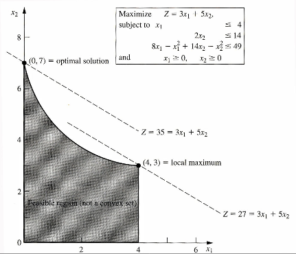
    >
    >       首先看这里的局部最大值,依据上面说的,这里的能够成为局部最大值的原因是,此点 $\epsilon$ 距离范围内的 $f(x^*+\epsilon)$ 值,没有值能够比 $f(x^*)$大. 但是若是在黑色范围内部,我们可以发现,向上移动 $\epsilon$ 距离是可以使得 $f(x^*+\epsilon)>f(x^*)$ 的.也就是非最优点, 从这里我们可以看出,最优点必定在边界上,也就是在某些个约束条件上,可以满足:$h_i(x^*)=0$
    >
    >       那么, $\alpha\ge 0$ 是怎么来的呢?
    >
    >       我们看到在局部最小点,完全和 $x_1 \ge 0$ 这个条件没有关系,是无效约束,也就是可以忽略这一项.但是在 $x^*$ 点, 
    >
    >       $x^1 \ne 0$.那么这个时候便可以通过加一个权重使其为0,也就是 $\alpha=0$.那么就得到了 $\alpha_i h_i(x^*)=0$ 的依据:
    >
    >       当 $h_i(x^*)=0$ 时,$\alpha_i h_i(x^*)=0$;当 $h_i(x^*)\ne 0$ 时,$\alpha_i=0$,所以$\alpha_i h_i(x^*)=0$.
    >
    >   2.  **理解第一条:**
    >
    >       从下面这个图像去理解第一条:
    >
    >       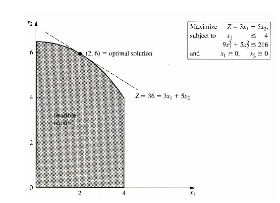
    >
    >       这个图像中,我们可以看出,在最大点的地方 ,目标函数的导数和某个约束函数在最大点的导数是一致的,设这个约束为 $h_k$. 也就是说这里的 $h_k(x^*)=0$ ,对于其他的约束,按照上面说的,$\alpha_i =0(i\ne k)$ .那么这个时候就会出现:
    >
    >       ​					$\mathcal{L}'(x^*)=0$
    >
    >       这个是一个特殊情况,最大点只和一个边界相交,这个情况下, $\alpha_k=1$ .
    >
    >       而在一般情况下,我们知道的只是:目标函数 $f(x)$ 在最优解出的梯度与约束区域边界在$x$ 点处的梯度**共线**.而,共线的特点就是,虽然值不能保证相同,但是方向相同,因此可以通过 $\alpha$ 的放缩来实现, 也就是:
    >
    >       ​					$\mathcal{L}'(x^*)=0$
    >
    >   3.  **去理解第三条中的 $\alpha_i\ge 0$**
    >
    >       我们的目标公式是最小化:
    >
    >       
    >
    >       由于不等式小于0,如果不等式的系数再小于0,那么可能是 $\lambda$ 越大越好,没有了极限.

    -----

    ​

### 4.5 Example: Linear Least Squares

-   **目标函数:**

    ​				$min(f(x))$ 

    ​				$f(x) = 1/2||Ax-b||_2^2$

    下面用几种进行计算推导:

-   **用梯度下降法:**

    计算梯度:

    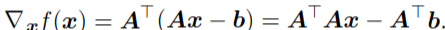

    算法为:

    

-   **用牛顿下降法:**

    由于这里本身就是一个二次项问题,因此可以通过:

    $f(x+x_0) = f(x) + x_0^Tf'(x)+1/2x_o^Tf''(x)x_0$

    那么,当

    $x_0=-f'(x)/f''(x)$ 的时候,就可以直接达到最小值只需要一步.

-   **用约束优化:**

    对问题加一个约束条件:

    ​					$x^Tx \le 1\to x^Tx-1 \le 0$ 

    转化为拉格朗日函数:

    ​					$\mathcal{L}(x,\lambda) = f(x)+\lambda (x^Tx-1)$

    优化问题就变成了:

    ​					$min_xmax_{\lambda,\lambda\ge 0}\mathcal{L}(x,\lambda)$

    smallest-norm solution to the unconstrained least-squares problem(无约束最小二乘问题的最小范数解)需要用到Moore-Penrose pseudoinverse(伪逆,见2.9)

    因为,$f(x) = 1/2||Ax-b||_2^2$ 一定是大于等于0的,那么,当 $Ax-b=0$ 时,也就得到了最小值.

    也就是, $x=b/A=A^{-1}b$,由于这里的A不一定是方阵,因此这里用伪逆代替,也就是:

    ​					$x=A^+b$

    下面就有两种可能:

    -   约束条件为 inactive, 即最优点与约束无关,即 $\lambda=0$ 的情况.

        这个时候,就要可以直接以上面的公式为结果.

    -   约束条件为 active.

        对拉格朗日函数关于 $x$ 进行微分

        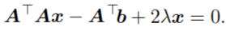

        得到:

        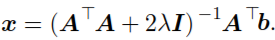

        对拉格朗日关于 $\lambda$ 进行积分,得到:

        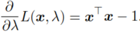

        下面如何对这个公式进行求解并没有看懂(好像还是通过梯度下降?),截图如下:

        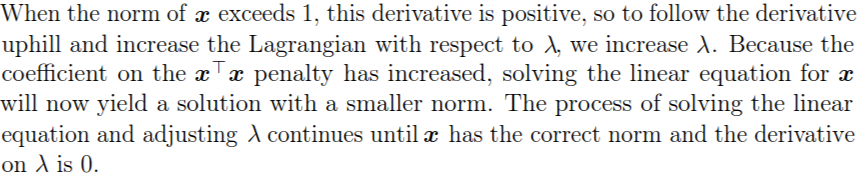

        ->更新,看懂了,如下:

-   **梯度下降求解KKT条件**

    -   使用梯度下降法,将

        

        和

        

        迭代处理.

        在第一个公式的地方,我们看到我们得出了在第一次计算时,便用第二个式子对 $\lambda $ 进行修改,若

        1.   $x^Tx>1$ 则, $\lambda_i=\lambda_i+\epsilon \frac{\partial{\mathcal{L}}}{\partial{\lambda}}$ ,其中 $\epsilon$ 为正数.那么,在下一次迭代时,我们就会发现,$x$ 变小.最后使得,$\frac{\partial{\mathcal{L}}}{\partial{\lambda}}$ 趋近于0.
        2.   $x^Tx<1$ 则, $\lambda_i=\lambda_i-\epsilon \frac{\partial{\mathcal{L}}}{\partial{\lambda}}$ ,其中 $\epsilon$ 为正数.那么,在下一次迭代时,我们就会发现,$x$ 变大.最后使得,$\frac{\partial{\mathcal{L}}}{\partial{\lambda}}$ 趋近于0.

        直到, $x$ 得到最优解.

        **这里有一个问题:为什么要使用第二个公式,即计算拉格朗日关于 $\lambda$ 的梯度?**

        有两个想法三个点,(后两个点属于一个想法,都是对于迭代条件以及其停止条件的分析):

        1.  要获得$\lambda$ 的最大值,也就是求解 $max_{\lambda}$ 需要计算导数.

        2.  使用该公式,配合条件一进行迭代,可以达到条件三的状态$\alpha_i h_i(x^*)=0$.即:

            1). 考虑通过n次迭代后, $\lambda=0$ 的情况,这个时候 $\frac{\partial{\mathcal{L}}}{\partial{x}} = \frac{\partial{f}}{\partial{x}}$.那么,现在的极值就是 $f(x)$ 本身的最小值,也就是说这个时候的约束条件是无用的,属于无效约束.这个时候达到全局最小值,停止迭代.按书中的话说就是: *until x has correct form*.

            2). 考虑通过n次迭代后, $\frac{\partial{\mathcal{L}}}{\partial{\lambda}}=0$ 的情况,这个时候,不等式为0.就是约束条件起到作用的时候.这个时候,迭代达到稳定,x达到稳定值..按照4.4节对于条件一的理解,应该是在最优解处,目标函数的切线和约束函数的切线相同的时候.

            综合来看,无论是 $\lambda=0$ 还是 $\frac{\partial{\mathcal{L}}}{\partial{\lambda}}=0$ ,约束条件项都是0.实现了条件三中的 $\alpha_i h_i(x^*)=0$ 

            但是这里还没有实现 $\lambda > 0$,这个也能通过迭代实现吗?

        3.  使用该公式,配合条件一进行迭代,可以达到条件三的状态 $\lambda > 0$.即: 

            1). 首先考虑,初始 $\lambda > 0, x^Tx-1>0$ 的情况,这个时候, $\frac{\partial{\mathcal{L}}}{\partial{\lambda}}>0$. $\lambda$ 变大,不会出现小于0的情况.

            2). 考虑, $\lambda > 0, x^Tx-1<0$ 的情况,这个时候,$\frac{\partial{\mathcal{L}}}{\partial{\lambda}}<0$ , $\lambda$ 变小,只有当 $x^Tx-1$ 再次大于0时, $\lambda$ 才会停止减小的步伐.首先,我们先来看,如果出现 $\lambda < 0, x^Tx-1<0$ 的情况,将会发生什么 ->  $\lambda$ 会无限下降下去.这样就出现一个情况就是函数没有极值.所以为了防止这种情况,我们需要在 $\lambda$

            从正数变为负数(或者0)的一瞬间,停止迭代.也就是稳定解停在了 $lambda=0$ 的情况,该约束条件为无效约束.

        一个利用SVM将KKT求解的[链接](http://blog.csdn.net/on2way/article/details/47729419)

    ​

### 5. 附录:

$g^THg$ 代表的是 梯度方向(单位向量)的下降速率的证明.(若 $g^THg$ 为负值,则说明上升)

