## Chapter 5 Machine Learning Basics

### 5.0 Introduction

机器学习是一个重视利用计算机去统计学地解决复杂公式,不怎么重视置信区间.

### 5.1 Learning Algorithms

对于学习,Mitchell提出过一个精确地描述:

对于**某类任务T**和**性能度量P**，如果一个计算机程序在T上以P衡量的性能随着**经验E**而自我完善，那么我们称这个计算机程序在经验E中**学习**

下面来看一些实际的例子:

#### 5.1.1 The Task, T

Machine learning tasks are usually described in terms of how the machine learning system should process an example.An example is a collection offeaturesthat have been quantitatively measured from some object or event that we wantthe machine learning system to process.

这里的任务就是指的是完成一些特定的目标(example),这里的目标可以理解为一些标注好的数据库,用来检测算法性能.

下面来看一些具体的例子.

-   Classification:分类大体可分为两类.
    -   $f:R^n→ \{1, . . . , k\}$,直接输出类别
    -   f outputs a probability distribution over classes.输出的是各个类别上的概率分布.
    -   一些具体的应用实例:物体识别

-   Classification with missing inputs:缺少某些输入的分类
    -   如果一个分类需要N个输入变量,而在使用分类的模型的时候却不能次次获得N个变量.这样的分类,叫做Classification with missing inputs.
    -   例如,在医疗诊断中,有一些人体测试可能由于某种原因无法获得,这时便是这种分类.
    -   解决方案是:分析输入与输入之间的概率关系,建立概率分布模型,争取边缘化(marginalize)缺失的变量,即用其他变量的函数代替这个变量.
    -   对于N个变量的分类问题,可能需要有$2^N$个函数去描述在各种缺失输入的情况,但是只需要一个函数去描述输入之间的联合概率分布.

-   Regression:回归

    -   $f:\mathbb{R}^n \rightarrow \mathbb{R}$,根据一个输入给出一个预测值.
    -   例子是:索赔额的预测以及证券价格的预测,房价的预测

-   Transcription:转录

    -   就是把相对而言非结构化的数据转录为一些离散的数据
    -   比如说,optial character recognition 和speech recognition

-   Machine translation

-   Structured output:结构化输出

    -   这是一个广义范畴的概念,指的是输出为一个向量(或是其它包含多个变量的值)和不同元素之间的相关性.它包含了上面说到的转录以及翻译.
    -   例子是:语法树的分析,pixel-wise segmentation(即把每个像素点分配给一个类别),在卫星图片中标记出道路,图像字幕

-   Anomaly detection:异常检测

    -   例如:信用卡消费异常检测

-   Synthesis and sampling:合成以及取样

    -   可以生成一些与训练数据相似的新的样本
    -   例如,游戏中的自动生成新的建筑物以及物体.
    -   在有些情况下我们也会生成一些与输入完全不同类型的输出,例如从文本生成发音

-   Imputation of missing values:缺失值插补

    -   就是说本身该有n个输入却少了几个,这是要对输入进行预测

-   Denoising:去躁

    -   判断样本中的好坏,or more generally predict the conditionalprobability distribution 

        $p(x|˜x)$

- Density estimation or probability mass function estimation:密度估计或者概率密度函数估计

    -   这个是$f:\mathbb{R}^n \rightarrow \mathbb{R}$,是求出一个input出现的概率
    -   可以用于上面说的缺失值插补,在得到密度估计后,并且在输入中失去某几个维度信息后,可以利用概率函数进行最大似然得到可能的结果.

>    **切记:这里只是一个介绍,并不是严格的分类,还有很多其他类型**

#### 5.1.2 The Performance Measure, P

-   这里就是指的是评价模型质量的一个标准
-   一般我们都是用错误率去描述评价一个模型,但是这个仅限于一些0-1损失的评价任务,例如这个模型在对检验数据集中的某个数据进行处理后得到了错误的答案,则标为1.但是有些task是无法用这个标准评价的,比如上面说道的,概率分布函数的模型,这个时候多采用log-probability去评价任务.
-   一般都是通过从训练数据集中分离出一部分做test set
-   有时候,这个性能指标是难以决定的
    -   例如在speech->text转录的情况,需要对每个转录的结果进行评价而不是简单的字符匹配评价.
    -   又例如,在回归任务中,对于微小偏差,中等偏差,严重偏差应该怎么去评价?这都是问题
-   在某些情况,我们知道我们想要一个什么结果,但是去评价结算结果确实不切实际的,这里提到了,概率密度函数估计的模型中,许多最好的概率模型仅隐含地表示概率分布。就是说,无法对于一个准确的输入给出一个准确的概率值.

#### 5.1.3 The Experience, E

-   数据集只有一种，但是可以根据对数据集的适用方法,分为两种:

-   Unsupervised learning algorithms(**无监督学习算法**)
    -   计算概率分布,合成以及去噪,聚类,都属于这类算法

-   Supervised learning algorithms(**监督学习算法**):
    -   这里的数据集与上面不同的是,这个每个特征实例对应了一个lable和target,与无监督最大的不同是,他有老师.
    -   应该注意的是,无监督和监督算法的界限,并不是那么明显,例如在一个概率密度估计的函数中,若变量可以分为众多子变量,就比如n-grams模型,那么在这个里面,表面上,概率密度估计是一个无监督模型,但是在求具体的$P(x_i | x_1,x_2,x_3...x_n)$的过程就牵扯到先验知识,就是一个监督模型
    -   还有一种叫做 semi-supervised learning(半监督学习),不是每个训练样本都有标记，而是只有一部分被标记，而另一部分只有数据本身，标记缺失掉了。
        -   multi-instance learning(多示例学习):简而言之就是说,不对每一个数据进行标记,而是对打包的数据进行标记,就是一堆一堆的,我不知道每个individual数据应该标记为什么,但是我知道他们组合在一起应该标记为什么,这里的标记只有正和负,若一个包中的数据全为负,则这个包为负;若一个包中的数据有一个为正,则包为正.这是一种很普遍的性质,虽然正的包中或许只有一个正元素,但是可以通过学习获得"正"的标准.

-   reinforcement learning(**增强学习**)

    -   增强学习是基于奖励机制,他既不像监督学习那样一一对应,也不想无监督学习那样不需要标签,也是不半监督学习一样.增强学习对于正确的事件有奖励机制,但是存在着时间延迟.并且,增强学习里面含有更多的影响因素,reinforcement learning algorithms interact with an environment.

-   需要说明的是,上面虽然给出了多个定义,但是他们之间的区分并没有这么明确.

    无监督,监督,增强学习的关系如下:

    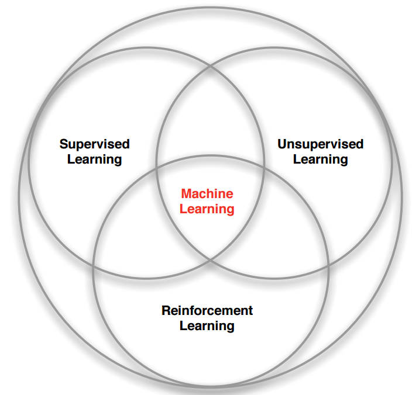

#### 5.1.4 线性回归的例子

总而言之就是一个公示的推导:

这个是误差公式:

​		$MSE_{test}=\frac{1}{m}||\hat{y}^{(test)}− y^{(test)}||^2_2$

下面是误差最小化的推导公式,最后得出了正规方程:

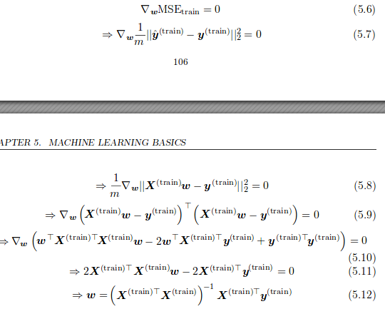

### 5.2 Capacity, Overfitting and Underfitting

这一节好长好长好长啊啊啊啊啊啊!

#### 5.2.0 what is thatVC

-   **generalization(泛化)**:The ability to perform well on previously unobserved inputs is called generalization.一个模型在一个新数据集上的效果成为泛化能力.

-   **generalization error(test error)**:让一个模型在新的数据集上获取高的泛化误差是我们的追求.

-   **i.i.d assumption(独立同分布的假设)**:根据统计学习理论(statistical learning theory),这里假设,训练集中的数据与测试集中的数据是相互独立其基于同一概率的数据生成过程(data-generating process)生成的,所以对于一个参数列表来说,理应有如下结果:在参数的计算下,test error = training error

-   **underfitting and overfitting**:这里对应了模型应该具备的两种能力:

    1.  Make the training error small
    2.  Make the gap between training and test error small

    在1能力不足的时候,将会出现underfitting的情况,在2能力不足的情况下将会出现overfitting的情况.

-   **capacity(容量)**:模型的容量控制着该模型的欠拟合和过拟合的程度

-   **example(linear regression)**:

    -   **假设空间(hypothesis space)**:the set of functions that the learning algorithm is allowed toselect as being the solution. For example, the linear regression algorithm has theset of all linear functions of its input as its hypothesis space. We can generalizelinear regression to include polynomials, rather than just linear functions.在线性回归中增加使用的多项式的最大幂级,可以提高模型的容量
    -   在使用的多项式的项数过高时,就会出现那个经典的过拟合图片,自行脑补

-   **representational capacity(表征容量)**:目前提到的增加性能的方法是通过增加特征项以及与其对应的参数.模型也可以通过改变学习算法选择的假设空间(即选择不同的函数簇)的方式,来改变性能.这个(假设空间)代表了模型的表征能力.剩下的就是如何选择这个函数簇(假设空间)下的最佳函数,这个并不是一个简单的事情,因此选出的往往不是最优的,因此一般而言**effective capacity(有效容量)**通常要低于该模型的表征容量.

-   **Ocrcam’s razor(奥卡姆剃刀)**:最简单的是最好的?->如无必要，勿增实体.

-   **Vapnik-Chervonenkis dimension(VC维)**:一个量化模型容量的指标.VC维反映了函数集的学习能力，VC维越大则学习机器越复杂（容量越大），遗憾的是，目前尚没有通用的关于任意函数集VC维计算的理论，只对一些特殊的函数集知道其VC维。例如在N维空间中线性分类器和线性实函数的VC维是N+1。传统的定义是：对一个指示函数集，如果存在H个样本能够被函数集中的函数按所有可能的2的H次方种形式分开，则称函数集能够把H个样本打散；函数集的VC维就是它能打散的最大样本数目H。

-   统计学习理论中最重要的结果表明，训练误差和泛化误差之间的差异在一定范围内是随着模型容量的增加而增加的，但随着训练样本数的增加而减小。

-   **如何选择?**:

    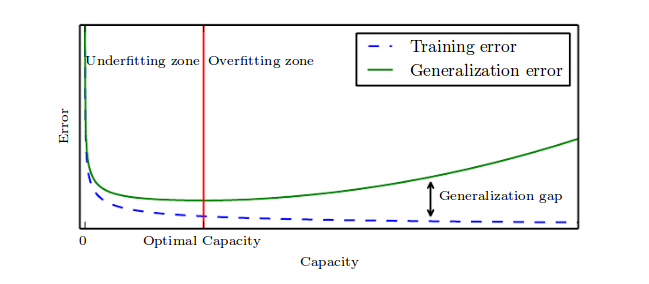

-   **nonparametric model(非参数模型)**:非参数模型简单来说就是没有参数,即没有提前假定好的分布以及形式,例如,线性回归里面的假设分布是多项式形式,曲线拟合里面首先要设定要去拟合的曲线.非参数模型具有the most extreme case of arbitrarily high capacity,具有最高的容量.但是,非参数模型实际是几乎不可能实现的.

    我们也可以通过打包参数模型来实现非参模型,比如可以设置一个外部的循环去根据学习的结果自动改变模型所需要的的参数项.

-   **Bayes error**:即使在正确的1分布下,由于噪声的存在也会出现一定的错误率,这个叫做贝叶斯错误,是最好模型下的固有错误率.

    对于一个非参数模型而言,错误率会随着训练集的增大而减小,但当达到一个最小的错误率(贝叶斯错误率)时将会停止减小.但是一个固定参数模型的效果会渐进于一个大于bayes error的错误率.

    即使对于最好的模型,有时候trainning set和test set之间也有gap,这时可以通过增加训练集来减小差距.

    

    通过上面的的一个实验,作者得出了几个结论:

    -   一个比实际分布要简单的模型,随着训练数据的加大,其错误率会稳定到一个大于bayes error的值
    -   最佳的模型可以在test集上获得bayes error.在训练集上获得0错误率.
    -   在训练数据不停增大时,一个模型的最优解的容量也会上升。

#### 5.2.1 The No Free Lunch Theorem

这个理论简单来说就是：NFL定理最重要的寓意，是让我们清楚地认识到，脱离具体问题，空泛地谈论”什么学习算法更好“毫无意义，因为若考虑所有潜在的问题，则所有的算法一样好. 要谈论算法的相对优劣，必须要针对具体问题；在某些问题上表现好的学习算法，在另一问题上却可能不尽如人意，学习算法自身的归纳偏好与问题是否相配，往往会起到决定性作用.

#### 5.2.2 Regularization

这一节要解决的是容量过大的问题，也就是过拟合的问题。

------

>   首先回顾一下，一个模型的训练方式是根据下面这样的误差函数去修改参数，以达到误差最小值：
>
>   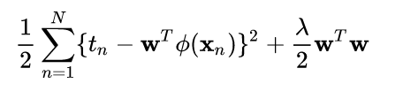
>
>   也就是说求其中的 $argmin_w$ .我们下面来考虑一点，即w拥有什么性质。
>
>   在训练集中，x和y都是固定的，因此决定x和y之间关系的w的体量在一定程度上也是固定的，不可能通过训练让w无限的大下去或者小下去。因此，上面这个式子可以转化为：
>
>   ​			$argmin_w ||t_n -w^Tx_n||$   $s.t.||w||_2 \leq C$
>
>   这里的C是一个常数，具体的推导公式就不说了，我也不会，这里只要希望能够正确传达理念。
>
>   那么，后面的那个正则项，就是规定小于C的那一项究竟代表着什么？
>
>   -> 代表着先验知识！！！这里感觉有点玄乎，为什么一个范数就有先验知识呢？确实，一个范数只是代表着某种距离，不存在先验知识，但是，$s.t.||w||_2 \leq C$ 这个里面就有了，这个传到了人们对与这个参数的一个希望，什么希望呢？根据范数种类的不同而不同，分别可以表达稀疏，低秩，平滑等等，从而约束模型的容量。所以说，这里的与其说正则化不如说是规则化，就是给参数制定一个规则
>
>   具体的看[链接](blog.csdn.net/zouxy09/article/details/24971995).下面开始书上的文章,我也写了另外一文专门讨论正则化问题。

-----

解决过拟合的方式有很多种，比如说

1.  模型参数：减少特征、权值衰减、Early stopping
2.  数据集：数据集扩增（源头取数、复制数据+随机噪声、重采样、分布估计）、验证数据（验证最小误差的迭代次数，常用交叉验证）
3.  增加罚项：正则化方法、Dropout（修改神经网络本身结构）

这里介绍的方法是：

-   **weight decay**:公式为$J(w) = MSE_{train}+ λw^Tw$ 

    这里的 $\lambda$ 就是调整优先级的。这里的优先级很好理解，就是说，参数的优先级，通过增加正则项可以使得一些参数的值接近0，也就是优先级低了一些。可以说，这个就是自动实现了从函数的假设空间中选择参与训练函数项的功能，因为当某多项式（还是以多项式为例子）的参数为0时，就可以理解为忽略这个多项式。

    这就简化了模型，调整了模型的容量。

-   **regularization(正则化)**:Regularization is any modification we make to alearning algorithm that is intended to reduce its generalization error but not itstraining error.正则化就是我们用来降低测试集错误率但不增高训练集错误率的方法，也就等同于降低模型容量。这里的这个只是其中一个方法，还有很多。

-   **general-purpose forms**：在机器学习中按照上面的no free lunch thereom是不存在一个通解（即，最好的公式，最好的正则化方法）。但是，深度学习的哲学认为正如同人类的认知过程一样，应该有一个更通用的形式的正则化方法来解决大部分问题。

-   正则项的效果可以通过下面这个实验了解：

    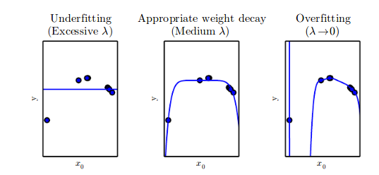

    在这个实验中给出的数据是根据二项式产生的,但是给出的参数却有九个之多,在 $\lambda$ 较大的情况下,即使w只有一点点也会有很大的值,所有w都几近与零,这里的函数变成一个实数.在 $\lambda$ 较小的时候,便会出现过拟合的情况.而在适中的情况下,九个多项式中的一些项数被忽略,很好的预测了分布.

    ​

### 5.3 Hyperparameters and Validation Sets

-   **Hyperparameters(超参数)**:是指不根据训练而被调整的参数,而是在训练之初就被确定好的参数,例如多项式回归中的,多项式的个数,以及正则项中 $\lambda$的大小,都属于超参数.这种参数不能在训练中调整的原因有两个:

    -   难以在训练中调整
    -   在训练中调整不合适(比如,$\lambda$,他会使模型容量变大)

-   **超参数的确定:验证集(validation sets)**:

    上面提到了需要用到超参数,且超参数不能在训练过程中进行,那么超参数该如何确定呢?

    这里,我们会从training set中提取一部分作为用来确定超参数.值得注意的是,验证集的英文是**validation sets**.是复数,这是因为,被抽出来的这部分数据会大概有20%.剩下的部分还是叫做训练集,用来训练普通参数.20%是用来评价在某个超参数下的泛化错误率的.通过不停的训练,测试,去修改超参数.

####　5.3.1 Cross-Validation

-   **交叉验证**

当样本量小的时候，为了防止数据量小而导致的泛化误差不客观的问题，这里采用交叉验证的方法来计算泛化误差．其实就是想办法增加测试集的数据，核心理念就是重复测试．较常用的方法是k-fold cross-validation algorithm．

简单来说，就是将数据分成ｋ份,在第i份做测试集的时候,剩下的k-1份就作为训练集,这样重复k次,将每次的泛化误差取平均值,作为最后的泛化误差.

### 5.4 Estimators, Bias and Variance

除了在training set上可以实现强国梦之外,一些统计工具也可以让我们通过测试集来增进模型.一些基础的概念,比如parameter estimation(参数估计), bias(偏差) and variance(方差)对于正式地描述泛化,过拟合和欠拟合的概念很有用.

#### 5.4.1 Point Estimation

-   **quantity of interest**:是参数模型中的一个单个的参数或是一个参数向量.例如线性回归中的权重,除了是参数之外,还可以是一个方程.

-   **Point estimation**:目的就是提供最好的预测去预测single of interest.点估计（point estimation）是用样本统计量来估计总体参数，因为样本统计量为数轴上某一点值，估计的结果也以一个点的数值表示，所以称为点估计。

    A point estimator or statistic is any function of the data:

    ​		$\hat{\theta}_m = g(x^{(1)},...,x^{(m)})$

    这里的g并没有任何限制,任何公式都有资格成为g,但是我们要的是最接近于$\theta$的g.

    忘了说了,这里的x是真实数据,就是测试集中的数据.

    除此之外,point estimation还可以提供输入和输出之间的关系的估计,这个叫做function estimation

-   **function estimation**:这个其实和Point estimation是差不多的.就是说,这个是用来提供输入和输出之间的关系的估计.这个func可以是一个函数也可以是一个模型.

#### 5.4.2 Bias

这里的bias指的是样本与总体之间的关系,总体的意思就是说当样本趋近于无穷大时的情况,也就是真实分布.样本是指在进行一次抽样后测得的一些数据,不是最真实的分布,有一定偏差.

**有偏与无偏**

如果一个变量的样本期望等于他的理想期望值，那么就称该变量无偏；否则称为有偏.

-   **偏差的定义**

    $bias(\hat{θ}_m) = E(\hat{θ}_m) − θ$

    当公式成立时称为无偏差,当m趋近于无穷大是公式成立的情况,称为渐进无偏差.

-   **几个例子:**

    最能体现其中思想的一个例子是高斯分布的关于均值和方差的样本偏差推导,见下图:

    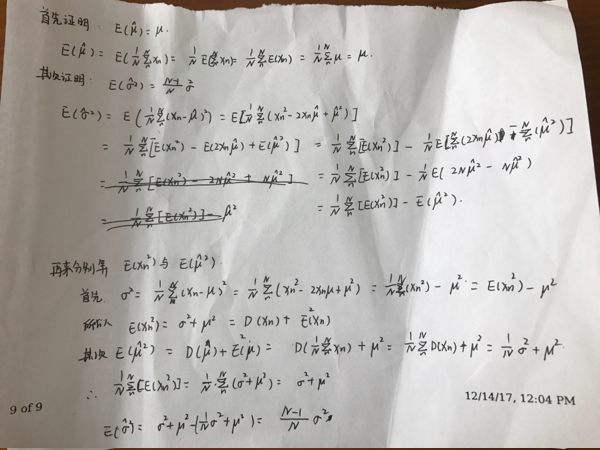

    但是需要注意的是,虽然一般我们认为$\hat{\sigma}^2$是有偏差的,但是我们还是会使用这个值.因为真正无偏的$\sigma ^2$并不是最好的estimator.

-   偏差的计算方式给我们提供了一种有样本参数推导总体参数的一个途径,思想非常重要.

#### 5.4.3 Variance and Standard Error

方差和标准差

标准差就是$SE(\hat{\theta})$

-   我们从同一个数据分布下生成的数据中,分不同次抽取数据时,不同样本数据会有不同的统计特性.正如我们希望偏差值小一样,我们也希望样本数据的统计特性的方差也小.

-   在机器学习中,平均值的标准差是一个很重要的统计特性.

    平均值的标准差为:

    

    式子中的 $\sum$ 代表的是每次sample的数据的平均值,也就是将每次采样结果的均值作为基本元素,计算多次采样的方差.

-   我们通常通过计算样本均值的误差来估计泛化误差.正如上面这个公式所展示的,样本的个数也决定了精确度.考虑到中心极限定理,我们认为样本均值应该是服从正态分布的,我们可以用标准差计算总体均值的95%置信区间:

    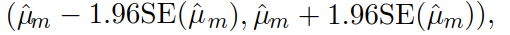

    我们认为,当一个算法A的置信区间上限小于算法B的置信区间上限时,A算法比B算法好.

    ​

#### 5.4.4 Trading off Bias and Variance to Minimize Mean SquaredError

偏差和方差计算了估计值的两种不同的错误来源.偏差计算了总体和样本之间的期望偏差.方差计算了随机抽取的样本数据可能的值.

-   **偏差：**

    bias描述的是根据样本拟合出的模型的输出预测结果的期望与样本真实结果的差距.偏差越大,越偏离真实数据.

    另外的一个理解是:偏差描述的是,根据模型拟合出的模型的统计参数,与实际分布模型的统计参数的差值,这时候是有一个标准的,就是下图中的靶心,那么这个靶心可以认为代替的总体模型参数,可以理解为机器学习中的训练集.因此,偏差描述的是训练过程中,模型的误差.当出现high bias时,可以理解为欠拟合.

-   **方差：**

-   对象是多个模型(一组样本对应得出一个模型),描述的是预测值的变化范围，离散程度，也就是离其期望值的距离。方差越大，数据的分布越分散.由下图可知,方差并不关心靶心在什么位置,他只在乎数据的分散程度,这个代表的是什么呢?代表的是模型在一个新的样本中,即测试集中的测试结果,参数的均值是由模型确定的,而测试集和训练集的数据又都是由一个模型产生的,因此总体参数应该是差不多的,但是每个小样本确实离总体模型参数很远,说明模型过拟合(high variance).

-   **方差与bias的关系**

这个靶子上的点(hits)可以理解成一个一个的拟合模型对测试集的预测结果，这些模型的结构是相同的,就是因为训练集不同,参数不同.

如果许多个拟合模型都聚集在一堆,位置比较偏,如图中 high bias low variance 这种情景，意味着无论什么样子的数据灌进来，拟合的模型都差不多:

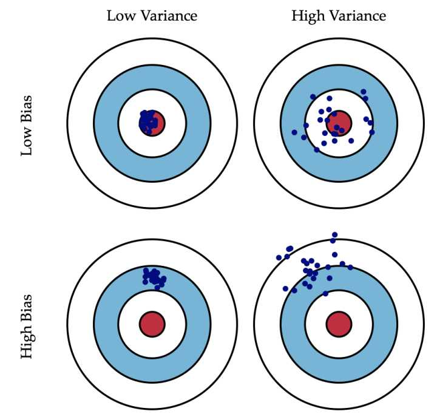

所以说,bias和variance的选择是一个tradeoff，过高的variance代表着模型对于数据的选择有着强烈的依赖性,数据稍微不合格式,便会出现很大误差.而过高的bias代表,无论是什么数据,来了之后都是有一个误差,说明这个误差是模型固有的,属与欠拟合状态.

-   **误差**:

error=bias+variance

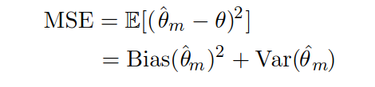

下面是上面说的过拟合和欠拟合关系的示意图:

#### 5.4.5 Consistency

上面都是讨论的是在固定数目的训练集下的一些估计量.下面讨论当训练集数目上涨时估计量的行为.

-   **依概率1收敛**:然后书里面给出了一个我感觉是废话,但是隐隐约约可能蕴含某种真理的公式:

  ​		$plim_{m \to \in \infty}\hat{\theta}_m=\theta$

  这个就被称为连续性.但是是弱连续性.

-   **几乎必然收敛**:强连续性要求$\hat{\theta}$到$\theta$的almost sure convergence(几乎必然收敛性).

    必然收敛性的公式为:

    ​		$p(lim_{m→∞}\hat{\theta}_{(m)}= \theta) = 1$

-   **两者关系**:

    概率的收敛为1（依概率1收敛）  <<  收敛的概率为1（几乎必然收敛）

    几乎必然收敛要强于依概率1收敛的原因是:

    **几乎必然收敛**计算的是:极限的概率

    **依概率1收敛**计算的是:概率的极限.

-   **在机器学习中的理解**:

    -   首先要知道的是,这里的m是训练集的数目,而$\hat{\theta}$实际是一个随机变量,这里可以表示的是模型的参数.例如在一个多项式回归模型中,这个代表的是多项式的参数集.

    -   连续性意味着随着样本数据的增长,bias会逐渐减小.

    -   但是反过来,**渐进无偏差性并不意味着连续性**.

        比如,现在计算有m个样本的正态分布数据.分别是$x^{1},x^{2},...,,x^{m}$,那么如果我们只取第一个值来看的话,$\hat{\theta}=x^1$,因为正态分布的样本均值是一个无偏估计量.就是说,不论是计算多少个样本的均值,这里的均值都具有无偏估计性.但是,如果,$m\to\infty$时,$\hat{\theta}=x^m$,这时的$\hat{\theta}$依然是只观察了一个样本,因此不能说$plim_{m \to \in \infty}\hat{\theta}_m=\theta$.

    -   其实我还是理解不了,这个牵扯到测度论的内容,省略吧.详见[链接](http://www.algorithmdog.com/%E5%87%A0%E4%B9%8E%E5%BF%85%E7%84%B6%E6%94%B6%E6%95%9B%E5%92%8C%E4%BE%9D%E6%A6%82%E7%8E%87%E6%94%B6%E6%95%9B)

    ​

### 5.5 Maximum Likelihood Estimation

最大似然估计

-   上面一直在说对于参数进行估计的问题,但是参数是由何而来的呢?答案就是最大似然估计.公式如下:

    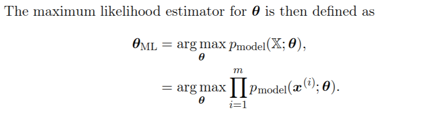

    这个公式虽好不过容易造成数值下溢(numerical underflow).(Underflow:值低于该类型所能表示的最小值)

    因此采取log形式:

    

    对其除以m,选出来的theta值应该是不变的,因此:

-   现在通过另外的方法来推导这个公式:

    计算这个公式的原理在于,通过改变参数最小化模型真实分布和经验分布(真实数据)的不相似性,这里的描绘相似度的函数就是KL距离:

    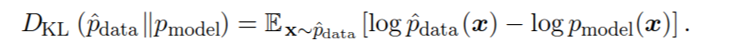由于左边的关于真实数据的情况是不会变的,因此可以只剩下右边的被减式:

    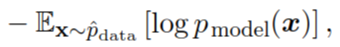

    绕了一圈,又回到了上面的那个公式.

-   由负对数似然构成的任何损失都是由训练集定义的经验分布和模型定义的概率分布之间的交叉熵。尽管这两个函数是不同的,但是最后求得的值应该是一样的,我们的目标就是匹配经验分布与设定的模型.在软件层面,我们都称这个为损失函数.因此,最大似然问题就变成了负对数函数的最小化问题,或者说交叉熵的最小化问题.

#### 5.5.1 Conditional Log-Likelihood and Mean Squared Error

条件对数似然和均方误差

-   一般的监督性学习算法的求参似然函数可以抽象为下面的公式:

    $θ_{ML}= argmax_θP (Y | X; θ).$

    如果样本点都是独立同分布,则:

    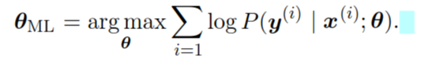

-   举例:线性回归的最大似然

    根据中心极限定理我们认为,真实数据与理想分布的误差是正态分布,因此define下式:

    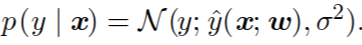

    在这个里面,$y(x;w)$决定了分布的mean.并且我们假定,分布的方差是固定的.

    下面我们就这个式子进行推导:

    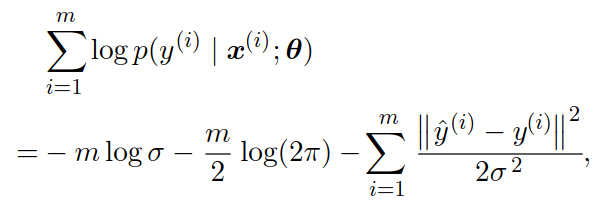

    可以看到,在方差固定的情况下,$p(y|x)$的取值取决于

    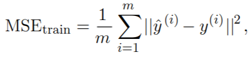

    而这个就是误差函数,因此可以看出来,由极大似然可以推导到误差函数(即最小二乘),他们本质是一致的.事实上，最小二乘可以由高斯噪声假设+极大似然估计推导出来.

-   从上面的例子,注意一个很重要的点.

    极大似然是通用函数,是最高级抽象,他的思想就是利用概率去最小化经验分布和实际分布的差距.

    而根据不同函数中的误差分布的不同形式(例如在线性回归中误差是正态分布)可以推导出不同的误差函数(在线性回归中误差函数是最小二乘)

#### 5.5.2 Properties of Maximum Likelihood

最大似然的最吸引人的地方在于他的渐进性,即$m\to\infty$的时候,可以获得最好的估计.

-   在合适的条件下,最大似然拥有连续性的特性:

    meaning that as the number of training examples approaches infinity, the maximum likelihood estimate of a parameter converges to the true value of the parameter.

     那么合适的条件是什么呢?

    -   真实的分布必须在设定的模型族里面,就是说必须把分布的类型搞正确,参数可以再调
    -   真实分布的参数必须是一个精确的实值

-   相比于不连续的估计值,连续性的估计值可以在固定的样本数下获得更低的泛化误差.

    一般我们判定一个假定参数下的模型与真实模型的方法就是,计算假定参数下的值和真实数据的平方差.一般来说,m即样本数越大时,这个平方差越大.

-   Cramér-Rao lower bound(即证明了无偏估计量与真实分布的差值的下限)显示,非持续性估计值比最大似然有更低的均方误差(MSE)

-   当样本数量小到会产生过拟合的情况的时候,我们就会采用权重衰减等等的泛化策略,去获得一个有更低方差的最大似然的有偏版本.

### 5.6 Bayesian Statistics

#### 5.6.0 Introduction

-   之前的讨论都是建立在固定一个参数$\theta$的基础上,这个属于频率派统计的做法.另外的一种方法是贝叶斯统计方法,即,考虑所有的可能的$\theta$

----

>    就像之前的那个靶心的图一样,之前认为,靶心就只有圆内的一个点,我们知道一个点是没有面积的,因此,$plim_{m \to \in \infty}\hat{\theta}_m=\theta$,这里的只能是无限趋近于,而不能画出等号.As discussed in section 5.4.1, the frequentist perspective is that the true parameter value θ is fixed but unknown, while the point estimate  $\hat{θ}$ is a random variable on account of it being a function of the dataset (which is seen as random).
>
>    现在认为$\theta$不只是一个点,而是以某种分布分布在整个圆内.

----

-   **频率派与贝叶斯派的区别**:

    -   在频率派的方法里面:
        -   $\theta$ 是一个固定的值
        -   点估计值$\hat{θ}$是一个随机变量
        -   数据集也别看为是一个随机变量,因为,使用样本去估计总体
    -   在贝叶斯派的方法里面:
        -   $θ$是一个随机变量
        -   不存在$\hat{θ}$
        -   数据集是被整体观察的,不存在样本的概念,因此数据集是一个固定变量

-   **prior probability distribution**:

    在贝叶斯派中,我们经常会对随机变量$\theta$设置一个先验分布,这个分布是未知,因此我们通常采取熵最高的概率分布作为先验分布.*确定均值和方差下,高斯函数是熵最大的函数*

    例如,一个人也许假设$\theta$是在一定范围内的均匀分布(均匀分布也是经常使用的),后面提到了:

    ​	*Many priors instead reflect a preference for “simpler” solutions (such as smaller magnitude coefficients, or a function that is closer to being constant)*

    可能是因为这个把.即,许多先验分布都更倾向于采用简单的分布,例如更小的系数和更接近于常数的函数.

-   得出的公式如下,这个也是我们最后要argmax来求得$\theta$分布的公式:

    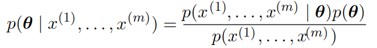

    常用的先验分布就是均匀分布和高斯分布,在根据观察到的数据进行处理后,先验的熵往往会减少,最后集中在一小部分值上.

    ----

    >   1.  为什么可以假设p满足均匀的先验分布:
    >
    >       概率论本质上是关于信息的描述。因此均匀先验假设是在对p一无所知的情况下最优（满足最大熵）的假设。
    >
    >   2.  什么是先验分布?
    >
    >       先验分布是关于参数的分布

    ----

    ​

-   **预测$x^{(m+1)}$**

    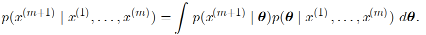

    -   通过这个公式可看出,和最大似然不同,贝叶斯派考虑到了$\theta$所有的取值情况.(这个是针对的预测模型)
    -   频率派对待过拟合的方法,就是计算varriance,然后调整模型去减小varriance.而贝叶斯的方法就是很简单的直接整合所有的$\theta$(加权和).

-   **如何求$p(y^{(train)}|X^{(train)},w)$**

    当然我们的目的是最大化这个$p(y^{(train)}|X^{(train)},w)$,现在先看这个公式的形状是什么:

    以线性回归为例子:

    -   基本的公式:

        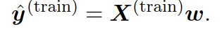

        这里的w是线性回归的各项的参数

    -   正态分布的误差概率公式:

        和最大似然一样,认为真实数值和实际数值之间的误差呈正态分布:

        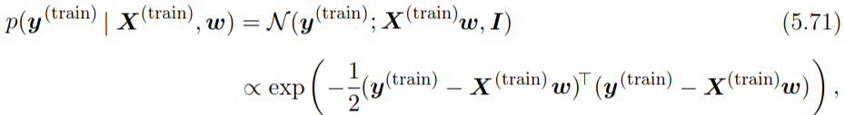

    -   对参数的分布进行建模,设:

        

        ​

        这里假设w遵循的正态分布,其中均值为$µ_0$,设为0,方差为$Λ_0=1/α*I$

        那么接下来,求w的分布就变成了求$µ_0$和$Λ_0$

    -   引入正则化

        将上面的 $p(w)$ 引入 $p(Y;X,w)$.推导出来我们最后要argmax的式子:

        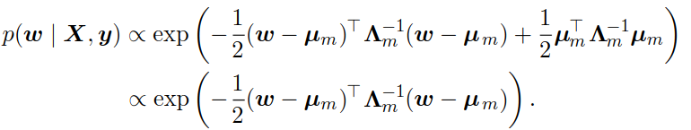

        那么接下来,求$µ_0$和$Λ_0$就变成了求$µ_m$和$Λ_m$

        ​

        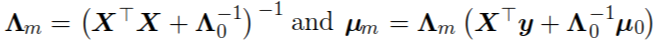

        这其中的$µ_m$就相当于频率派中的惩罚项$αw^Tw$

        这里的这个式子就对应是贝叶斯理论(下面这个式子)在多变量线性回归中的应用,里面已经含有了先验信息:

        

    -   贝叶斯的比频率派的好在

        通过协方差矩阵可以分析各个变量之间的关系,这个是频率派办不到的.

#### 5.6.1 Maximum a Posteriori (MAP) Estimation

- 什么是MAP Estimation?

  原则上来说,利用全部的后验分布去进行计算(full Bayesian inference)是最合适的,但是,在计算和优化上有很大的问题.所以采用点估计(MAP Bayesian inference )还是最合理的.

  公式的形状为(p(x)省略):

  

  现在回到上面的那个线性回归的例子,在那个里面:

  

  那么,$logp(\theta)$就对应着,exp()中的那一个式子,也就是对应着频率派中的L2惩罚项.

-   MAP的优点:

    -   和full Bayesian inference相比,有易于计算的优点
    -   和ML(最大似然)相比,有加入先验知识,使得varriance变小的优点.(但是,同时确增大了bias)

    这里就可以总结出:

    加了L2惩罚项的最大似然就可以解释为加入了先验信息的贝叶斯推导.

    当然,并不是所有的惩罚项都等同于$logp(\theta)$,也不是所有的先验分布都是高斯分布.有一些惩罚项不是概率分布的log形式,还有一些惩罚项是依靠数据的,这个更不可能和先验知识有关系了.

-   MAP提供了一个直接构造interpretable regularization terms(可解

    ​

### 5.7 Supervised Learning Algorithms

监督学习就是把输入和输出联系起来的学习算法,强调的是有输出,而不是有训练集,训练数据是都有的.

#### 5.7.1 Probabilistic Supervised Learning

概率监督学习

这本书中的大部分监督学习算法都是基于估计概率分布p(y|x)来实现的,这个就叫做概率监督学习.比如说线性回归以及逻辑回归(实际是二分类问题)

对于线性回归来说,我们可以采用解一般方程的方法去解得最佳权重,但是对于更一般的问题,我们通常采用梯度下降的方式去最小化负对数函数.

#### 5.7.2 Support Vector Machines

**什么是支持向量机?**

回忆一下之前学的内容,支持向量机其实就是在一个高维空间中(维数等同于输入变量数),利用了一个超平面去解决分类问题的算法.最简单的方法就是利用$w^Tx+b$ 做出一个超平面,不过很多情况下,超平面并不是线性的,有些有很多特殊的形状,这时便可以通过核函数进行高维空间的变化,将非线性的SVM问题变成一个线性的SVM问题.下面是书中的内容.

**基于距离而非概率的分类算法**

SVM与上面提到的概率监督学习不同的地方是:

SVM不计算概率,The SVM predicts that the positive class is present when $w^Tx+b$ is positive. Likewise, it predicts that the negative class is present when  $w^Tx+b$  is negative.

基础的SVM只能解决二分类问题,正如上面说的positive or negative.还有,这里说的不计算概率,只判断正负的原因是,SVM的机理是计算两个类别的点都分类超平面的最小距离,因此,只和距离有关,和概率无关.

**kernel trick**

-   最一般形式

    -   将SVM的最后的判断公式抽象化之后就是:

        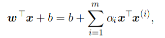

        其中,前说过了$w^Tx+b$ 是一个超平面,是我们的理想结论.而这个模型的获得方法是,后面的公式:

    -   $x^{(i)}$是我们的训练集数据,在这里是个矩阵,$x$ 是输入数据.可以认为后面的这个$x^Tx^{(i)}$就是计算训练数据与输入数据之间的点积(也就是距离).前面再加一个$\alpha$ 来进行加权.这里的$\alpha$就是要训练的参数.

    -   优化方式:

        通过计算每个实例在当前w和b下的分类结果来调整w和b.

        $w^Tx+b$可以看做是点x到超平面的距离.那么,对于一个训练集中的实例而言:

        ​			$\hat{\beta}  = y(w^T+b)= yf(x)$

        这里的$\hat{\beta}$就相当于损失函数.y是该x对应的实际的分类值,只有0或1.这个叫做函数间隔.

        为了归一化,进行下面的约束:

        ​			$\hat{\beta}  = y(w^T+b)/||w||= yf(x)/||w||$

        这个最后的值,代表的是某个训练集中的点距离超平面的距离乘以正确错误判断符号,判断错了就是负的,判断正确就是负的,因此我们想要精确的超平面就要,最大化$\hat{\beta}$的总和,最后通过种种,才能推导出来.

        至于具体的细节,是一个特殊的优化问题,有点难,等之后学数值最优化理论时再详细解说

-   核:

    在不同的情况下,这里的$x^Tx^{(i)}$是不同的,因为针对的是线性情况,这样的话只要进行dot production操作就可以了.在非线性的情况下就要把 $x^Tx^{(i)}$ 映射到一个另外的内积特征空间.公式如下:

    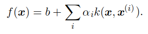

    其中:

    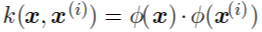

    这里k()有两个点需要注意:

    -    $\phi()$是一个映射函数,用于x到特征空间的映射.
    -    $\cdot$(内积)也是一个重要的点,在一般的情况下这个是点积,但是也可以用其他操作代替.例如,在一些无限维的空间,这里的$\cdot$就可以表示为积分.在高斯核中还可以表现为完全不同的形式.

-   **核具有两个优点**:

    -   将非线性问题转化为线性问题.
    -   在计算性能的层面上,核函数的"内积"计算方式比起真正的内积能够简化计算.

-   **Gaussian kernel**:

    在某些情况下$\phi()$会变成无限维,这是如果还用简单的内积就会需要无限的计算性能.因此我们对Kernel函数的一个要求是,其必须为可处理的函数.

    对于刚才提到的这个无限维的情况,我们构建高斯核作为其处理的方法:

    -   高斯核要求$\phi()$处理的对象,即,变量x必须是非负整数.

    -   对于原始变量u,v,计算如下:

        ​			$k(u, v) = \mathcal{N}(u − v; 0, σ^2I)$

        在这个计算中,u,v被映射到无穷维.

    -   高斯核又被称为radial basis function(径向基函数).高斯核可以看做是一个匹配模型,当输入和训练集实例相近时,则会有较大的高斯值,则这个实例在他的判断中就会起到更大的作用.

-----
>   之所以说,高斯核能将函数扩展到无穷维,是因为泰勒展开后是无穷的多项式.说白了,高斯核就是一个超大的多项式核,而SVM所构建的超平面归根结底就是有这些多项式构成的)
>
>   例如,一个圆形的分布,如下图
>
>   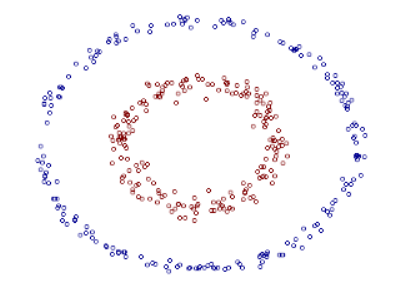
>
>   在这个里面可以认为是将原来的输入向量$x:(x_1,x_2)$映射到一个高维空间,这个空间的各个维度分别是:
>
>   $x_1,x_2,x_1x_2,x_1^2	,x_2^2$,那么就是说$\phi(x)=(x_1^2,\sqrt{2}x_1x_2,x_2^2)$.也就是一个椭圆形.
>
>   接下来,样本的数据和实际的数据再进行内积操作.
>
>   ​		$k(x,y) = \phi(x)\cdot \phi(y)=x_1^2y_1^2+2x_1x_2y_1y_2+x_2^2y_2^2$
>
>   而高斯核却有些特殊,他将两步$\phi()$和$\cdot$合成了一步,即$k(u, v) = \mathcal{N}(u − v; 0, σ^2I)$

_____

-   除了SVM之外还有很多用到kernel的算法,这些算法统称核方法或者核机器.核方法的一个缺点是,决定一个分类的运行时间和样本数据量呈线性关系.
    但是SVM可以通过学习一个包含着很多0的向量来解决这个问题,这个向量是对每一个样本数据进行标记,SVM可以只对离超平面几何距离为1的样本点进行计算,而这些向量就叫做支持向量,大致如图:

    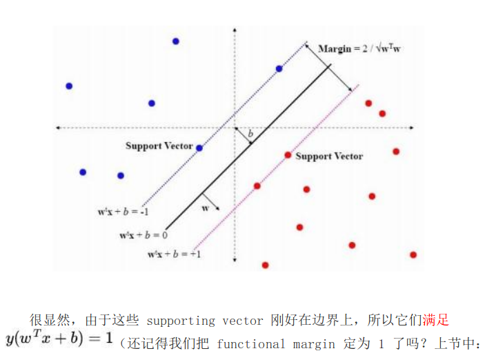

**kernel 缺点**

当样本数据大时计算量大(5.9)

并且,SVM很难得到较低的泛化误差(5.11)

现在的深度学习可以很好的分类

#### 5.7.3 Other Simple Supervised Learning Algorithms

-   **k-nearest neighbors**:

    -   这个是用于分类和回归的一类的算法,属于和非概率监督学习算法和非参数学习算法.

    -   k-nearest neighbors的基本原理是:

        1.  没有训练和学习的步骤,只在输入数据时进行一个参数为样本集的函数

        2.  这个函数的主要内容是:

            找到输入实例在样本集中的最相近的k个邻居,然后根据他们的标签来决定输入实例的标签.

        3.  根据临近样本标签来决定输入实例的标签的方法是:**

            将样本的标签用one-hot **Z** 标签向量表示,若该样本的标签为i,则 $Z_i 为1,其他项都为0.然后,在判断输入实例的标签时,将其临近的k个邻居的标签向量进行平均值化,则得出来的平均标签向量为该实例的概率分布.

    -   k-nearest neighbors虽然是一个非参数学习算法,但是可以实现很高的容量,例如:

        在一个1-neighbor算法中,当数据集趋近于无限时,算法的贝叶斯错误会提升一倍,原因是,         1-neighbor忽略了相同距离的样本点,相当于在相同距离的样本点中随机选了一个.当数据集无限大时,距离为0的点就有无线多个,如果我们允许所有的点参与评估,则可以渐进于最小贝叶斯错误.

        高容量使得k-nearest neighbors在样本数量极大的情况下可以获得很高的准确率.however, and it may generalize very badly given a small finite training set.

        ----

        >   Bayes error:
        >
        >   具体见notebook:Bayes error

        ----

    -   k-nearest neighbors的一个缺点是,一个是在数据量大时,计算消耗很大.另外一点是,他不能学习出不同输入之间的辨别力的强弱.考虑一个100维空间下的分类问题,如果实际分类只和一个因素有关,就是说该分类问题可被一个99维的线性平面分割.但是依靠最短距离为判断准则的KNN法是无法获得维度对结果的影响信息的.

-   **decision tree**:

    也是一种将输入分为几个区域,并且对于每个区域都有单独的参数.有很多变种.常见的决策书算法有ID3、C4.5、CART。一般用来分类，其中CART可以用来做回归。

    树种介绍了两种决策树,第一种是离散属性,按照节点分割,给出的是二分割的图示.另外一种是连续变量的决策树,是按区域分割.图示如下,上面的为离散变量,下面的为连续变量(二维):

    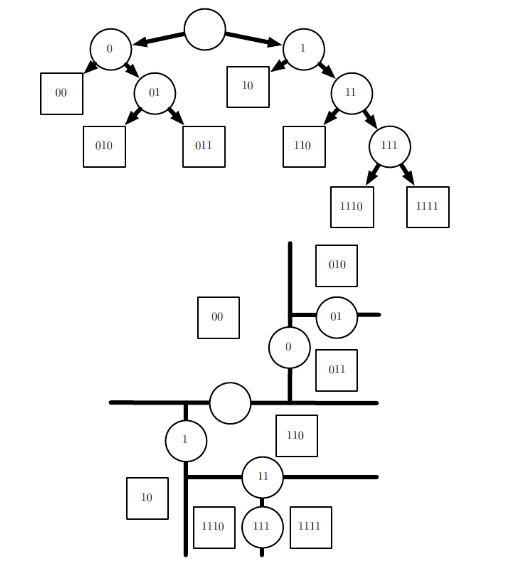

    -   Decision trees are usually trained with specialized algorithms that are beyond the scope of this book.就是上面说的**ID3**、**C4.5**、**CART分类树**,**CART回归树**算法.分别使用了信息增益,使用增益率的信息增益等等

    -   决策树的优势在于构造过程不需要任何领域知识或参数设置，因此在实际应用中，对于探测式的知识发现，决策树更加适用.虽说,决策树是一个非参数模型,他的模型的size是任意的,但是在实际问题中通常通过限制其size将其转变为参数模型.

    -   决策树的一个很大缺点在于无法联系起来输入的各个维度信息的关联性,在这种情况下,即使对于一个简单的二分类问题,决策树也很难做到想逻辑回归一样准确,例如:

        对于一个只拥有两个维度的输入的而分割问题,当$x_2>x_1$时,我们分类为**类别1**,反之我们分类为类别2,这个对于决策树来说是很难的,因为决策树是一个轴对齐分割,见下图:

    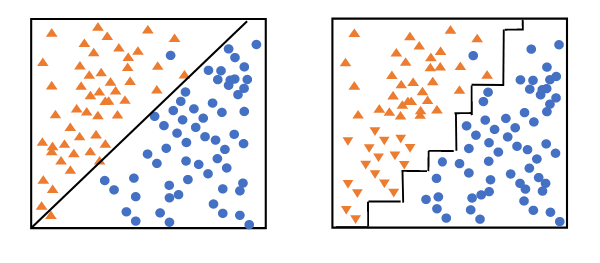

    ​	左边的是逻辑回归,右边的是决策数分类

### 5.8 Unsupervised Learning Algorithms

非监督学习算法

#### 5.8.0 Introduction

-   非监督学习算法就是只有输入没有对应输出的算法.但是,除此之外,非监督学习和监督学习的另外一个很大的不同是非监督学习偏向于从数据集的分布中提取信息,并且在这个过程中,不需要人力去标注一些东西.

-   与该概念有关的概念有:

    -   density estimation:即,从可观察到的数据集中估计不可观察到的潜在的概率密度函数.简单的有直方图估计,复杂的有核密度估计.
    -   learning to draw samples from a distribution:从分布中抽取样本
    -   learning to denoise data from some distribution:去除噪声
    -   finding a manifold that the data lies near:找到数据附近的流形
    -   clustering the data into groups of related examples:聚类

-   非监督学习的本质在于,找到一个数据的最佳的表征形式.(即,操作对象只有数据)这里的最佳有很多含义,共同点在于,是要找到一个含有数据集X尽可能多信息的,但同时,基于某种惩罚和限制,使得数据的表征形式能够尽可能的简单.

-   下面介绍三种最常见的表征形式:

    -   lower-dimensional representations:降维表征
    -   sparse representations:稀疏表征,Sparse representations embed(嵌入) the dataset into a representation whose entries aremostly zeros for most inputs.想一想one-hot向量
    -   independent representations:独立表征,试图解开数据分布背后的变化来源，使得表示的维度在统计上是独立的。混合高斯的各个维度是独立的,但是可以通过协方差矩阵找到维度间的相关性.

    三者并不是互相排斥的.

-   [表征]这个概念是深度学习的一个核心概念,这也是认知科学中的一个很基本的概念,而深度学习的基本思想来源于认知科学,之后会写[科学哲学:心理学与认知科学]的系列笔记.在本小节中,会就上面的三个标准分别举一个例子进行介绍,在剩下的章节中,介绍的有关representation learning algorithms的算法也是上述三个标准的延伸.

    ​

#### 5.8.1 Principal Components Analysis

PCA不仅实现了降维,还消除了各维度之间的非线性关系.

在2.12节我们学习了如何实现的降维,接下来学习如何消除各维度之间的非线性关系,可以实现如下图的转变:

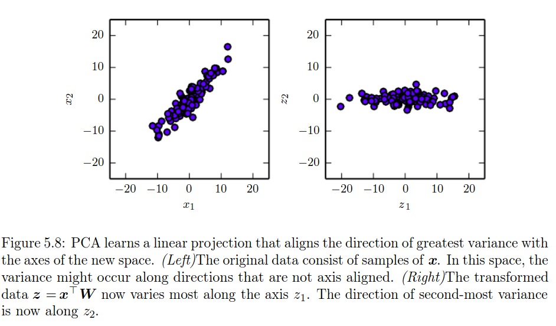

-   **无偏协方差估计**:

    对于输入数据集X,有$X \in \mathbb{R}^{m*n}$,其中,一个数据的维度为n.共有m个样本,则,可知各个维度之间的相关性为:

    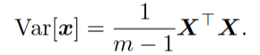

-   **PCA的本质-线性变换**:

    我们通过2.12的推导知道:

    最后的结果是要通过下面这个公式:

    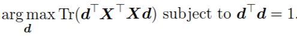

    其中,要想获得d,则需要把$x^Tx$进行特征值分解,而d就是其中的最大的特征向量,而特征值分解本质也离不来矩阵乘法(即线性变换),因此,PCA这个本质上是一个线性变换:

    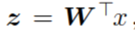

    注意,这里的$W$不是一个随便的矩阵,而是$X$奇异值分解后的,右奇异矩阵.为啥?细节看2.12编码解码那里,最后的D,就是decoder就是右奇异矩阵,或是左奇异矩阵.

-   **证明Var[z]为对角矩阵**:

    即可证明,PCA实现了各维度变量之间的去相关化

    由2.8节可知:

    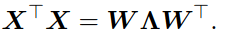

    其中,$U$和$W$都是单位正交矩阵:

    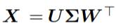

    则:

    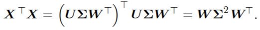

    其中$\sum$为对角矩阵.那么可以得到$X$的协方差矩阵:

    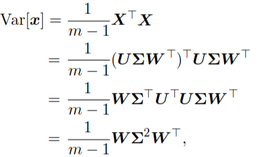

    ​

    进而求$Z$的协方差矩阵:

    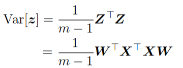

    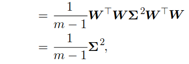

    这样便得出了结论.

#### 5.8.2 k-means Clustering

-   **K-means性质**:

    我们知道是一个聚类算法,但是其实可以将其看作是一个表征学习算法,最后学的表征是一个one-hot向量,其中one-hot向量的维度就是k,即类别数.因此,可以将K-means法归类为sparse representation,即稀疏表征.

-   **算法内容:**

    while(convergence):{

    ​	随机选定k个点作为k个类别的中心

    ​	其次根据距离,将所有的点归属到一个类别

    ​	计算每个类别的均值,更换中心点.

    }

-   **缺点:**

    -   **ill posed:不适定问题.**:

        ---

        >   不适定问题:
        >
        >   适定问题是指满足下列三个要求的问题：
        >
        >   ①解是存在的（存在性）；
        >
        >   ②解是惟一的（唯一性）；
        >
        >   ③解连续依赖于初始值条件（稳定性）。
        >
        >   这三个要求中，只要有一个不满足，则称之为不适定问题。

        ----

        由于,K-means法的结果严重依赖初始设定,造成解不是唯一的,因此是不适定问题.

    -   **缺少类别之间的相关信息以及分类只依赖于一个维度的信息**:

        我们可以通过分类的结果去重建训练数据,也就是说,即使我们再加入一个新的实例,我们也能够对其进行分类.

        但是我们无法将分类结果与实际世界的属性挂钩.

        此外我们希望能够获得一个我们对应着我们所需要的属性的分类结果.而不是对应着一个不同的,但同样可以进行正确分类的特征.例如,红色飞机,红色汽车,黄色飞机,黄色汽车.当我们只关注交通方式时使用2-means的结果,却有可能是关于颜色的分类.

        即使,我们可以通过某种算法得出我们可以将其分为四类,但是同样会失去[红色汽车]和[红色飞机]之间的相似信息.

        造成这个结果的原因在于,K-means法虽然最后将数据可以分成几类,实际的判断标准却只有距离一点,因此,无法获得类别与类别之间的关系.

        ---

        >   上面的这一点揭示了我们更喜欢用分布表征而不是用one-hot表征的原因.

        ----

### 5.9 Stochastic Gradient Descent

随机梯度下降法,随机梯度下降法是梯度下降法的一个扩展.更多的内容见第六章以及[note:梯度下降相关概念]

-   机器学习中的一个很重要的矛盾就是.大的数据量可以提供更好的泛化性能,但是会增加计算量.

    cost function:

    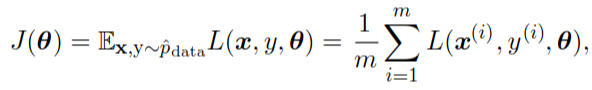

    求导则为:

    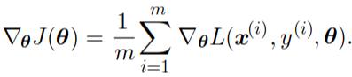

    这个求导公式的复杂度为O(m).当数据量增长到十亿级别时,仅仅是一个梯度下降的时间就是无法实现的.

-   随机梯度下降

    随机梯度下降在每次迭代时只均匀的选择一部分样本进行梯度下降计算.设每次选取$m'$个点,这个数量一般是1到几百.则

    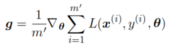

    则梯度下降的情况为,后面的那个为学习速率: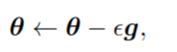

-   随机梯度下降曾经被认为是无原则的蛮干,但是实际证明,虽然在规定时间内,梯度下降法甚至无法达到一个局部最小值,但是已经足够使用了.而,随机梯度下降法的训练时间不取决于数据量的大小.

    一般来说,数据集越大,模型的size也会越大一些.(经验之谈)

    其次,在数据量接近无限是,在所有数据都被采用训练之前,算法就能达到最优解.样本数据集的总数,和达到稳定所需要的时间无关.因此我们可以说,随机梯度下降的算法复杂度为O(1),虽然这个1的单位基数会很大.

-   在深入深度学习之前,解决非线性问题的主要方法就是利用核方法,但是一般的核方法需要构建一个$m \times m$的矩阵,其中m为样本集数量.这样就给训练带来了困难.但是随机梯度下降为深度学习带来了曙光.

----
> 核方法的相关介绍:
>
> 一般地，我们可以把分类（或者回归）的问题分为两类：参数学习的形式和基于实例的学习形式。参数学习的形式就是通过一堆训练数据，把相应模型的参数给学习出来，然后训练数据就没有用了，对于新的数据，用学习出来的参数即可以得到相应的结论；而基于实例的学习（又叫基于内存的学习）则是在预测的时候也会使用训练数据，如KNN算法。而基于实例的学习一般就需要判定两个点之间的相似程度，一般就通过向量的内积来表达。从这里可以看出，核方法不是万能的，它一般只针对基于实例的学习。
>
> 因此像神经网络就无法使用核方法.
-----

### 5.10 Building a Machine Learning Algorithm

所有的深度学习算法都可以由下面几个基本元素组成:

a specification of a dataset, a cost function, an optimization procedure and a model.

-   还是以线性回归为例子:

    1.  a specification of a dataset:包含着输入和预测值的数据集

    2.  a cost function:

        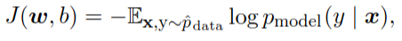

        我们最直观的关于线性回归的损失函数是最小二乘,但是其实他是源于对数似然的,详见5.5.1

    3.  an optimization procedure:normal equation(矩阵方程法),详见5.1.4.

        在线性模型下可以采用这个方法,但是在非线性模型下,就需要用迭代数值优化算法,例如梯度下降法.

    4.  a model:

        
        ​

    通常的损失函数这里还会加上惩罚项.

-   在非监督学习的例子,详见p151,不多说了,累

-   所有的算法都可以由这四项构成,只不过有些难以直观得知其中的值而已.

    ​

### 5.11 Challenges Motivating Deep Learning

这一章主要说DL在大数据下如何厉害,和传统ML算法多么的不行

#### 5.11.1 The Curse of Dimensionality

当数据的维数特别高时,许多机器学习算法会变得非常困难.这个就叫做维度灾难.

看下面这个图:

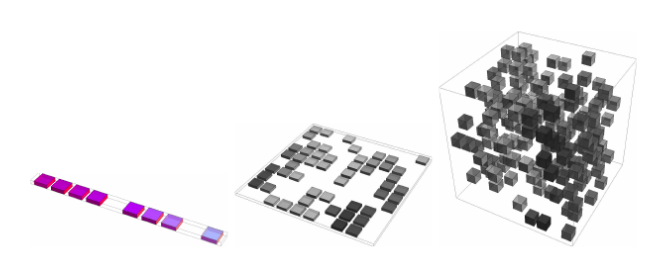

在这个图里面,三个图分别代表着一维变量,二维变量和三维变量的输入.

我们假设变量的每个维度上我们有10个感兴趣的区域.那么,在一维变量中我们会得出10个cells,在二维变量中我们可以获得100个cells,在三维变量下可以获得1000个cells.

更一般的,我们假设输入变量共有d个维度,其中平均下来每个维度有v个区域,那么,在整个特征空间中就有 $v^d$ 个cells.随着变量维度的增加,cells数会指数上升.导致cells数目会比样本数目更大,这就是维度灾难.

维度灾难在传统机器学习中的体现:

-   分类问题:

    我们在分类时,输入新的实例x,通常根据和x相近的训练集样本点(即处于同一个cell)的类别来进行判断,比如KNN中,取拥有cell中的最多样本点的类别为x的类别.

    但是当cells太多,会造成可能新的x所在的cell中没有样本点,岂不是尴尬

-   概率密度函数估计:

    采用新的实例所在的cell中的样本数,除以,总样本数,得到估计概率.

    同样的,cells数太多时,该算法失效

-   回归问题:

    采用新的实例所在的cell中的所有样本的平均值.

造成这个矛盾的原因是:

​	**许多传统ML算法的设计思想就是,一个输入的输出,渐进相等于,这个新的输入在样本集中相近点的输出.**

####  5.11.2 Local Constancy and Smoothness Regularization

-   **先验知识**:

    一般,为了得到更好的泛化,我们通常需要需要设置一个先验知识,基于模型参数的概率分布,比如在线性回归里面,模型是:

    

    模型的参数就是w,就是各个维度的权重.

    线性回归的假设方法是很简单的,他的先验知识(误差正态分布)之间影响了模型和参数.但是更一般的情况下,**我们加入先验知识也许是通过选择模型和模型中使用的函数(函数类型)来实现的**,比如说误差函数的选择,以及,是采用KNN还是SVM(仅限于分类问题),等等.下面我们来看看在传统机器学习算法中常用的一种先验.

-   **Smoothness prior (local constancy prior)**:

    先看英文定义:

    *This prior states that the function we learn should not change very much within a small region*

    在5.11.1中,我们讨论了在各个传统学习算法中cell的问题,可以认为cell就是上面的这个**a small region**,也就是说通过学习算法得出的值是连续的,即,若输入在微小范围发生改变,输出也只会发生微小变化,公式表达为:

    ​					$f*(x) \approx f*(x+\epsilon)$

    一个极端的例子就是KNN,KNN可以认为是这样的公式:

    ​					$f*(x) = f*(x+\epsilon)$

    也就是说,在同一cell中,即使有一点误差也直接忽略,直接相等!!太粗了.

    另外一个例子是核方法中的local kernel,

    >   **local kernels**: where $k(u, v)$ is large when $u=v$ and decreases as u and v grow further apart from each other.A local kernel can be thought of as a similarity function that performs template matching, by measuring how closely a test example $x$ resembles each training example $x^{(i)}$.

    而deep learning的一个大的任务就是解决,平滑先验或者说local template matching(局部样本匹配法)不适用的问题.

    >   其实,仔细想一想,平滑分布和维度灾难在本质上是共通的.

-   **Smoothness prior 的限制**:

    对数据量有要求,这是在维度灾难里面已经讨论过问题了.

    例如决策树中,我们可以认为决策树是一个Smoothness prior ,因为也是在连续空间的空间分割算法.如果问题要求,要通过决策树把空间分为n块,也就是n个leaves,就至少需要n个样本数据.

    从决策树出来,看更一般的分类问题说,

    >   to distinguish O(k) regions in input space, all these methods require O(k) examples.
    >
    >   Typically there are O(k) parameters, with O(1)  parameters associated with each of the O(k) regions.

    以下为纯个人猜测(不是推测)

    >    这里其实涉及到了一个非常重要的思想:
    >
    >    在认知科学和心理学中,早就已经证明,心理表征不可能只有连续状态,离散状态是必不可少的,突出的问题就是只应用连续表征在AI中不适用,那么DL,这么强调经验注意和联结主义的科学的目的之一,应该就是要重建表征方式,在其中加入离散信息.吗?

-   **高维数据"不平滑"不是真正的不平滑,是太过复杂**:

    在低维的情况下,我们有足够的数据可以表示在函数的高峰有较多(或是值较大)的样本点,在函数的低估有low points.这是可以达到足够的平滑.

    但是在高维的情况下,我们假设函数是及其平滑的,但是,由于维度态度,无法保证每个维度变化的方向能够相近,这样函数就会出现及其复杂的变化情况.使得函数在不同区域表现的完全不同,使得其在描述训练集显得异常复杂.

    >   可以理解为,变量增大导致熵增,导致系统变得复杂,这个是本质原因.

    那么是否可以在这种复杂函数下也能实现良好的泛化呢?

-   **在复杂函数下的泛化方法存在吗?**:

    答案是存在的

    现在认为,一个拥有 $O(2^k)$ region 的问题,可以在只有 $O(k)$ 的样本数据下得到解决.

    需要做的就是,通过假定的(assumption)潜在的数据生成分布,找到各个region之间的依赖关系.

    >    这里是指层次性,上面的 $O(k) \to O(2^k)$ 有二叉树的感觉.
    >
    >    这种思想就直接指向了,DL中多层网络的结构,因为多层网络可以体现层次性思想

    那么,也就是说,不同的DL会提供各种假设(assumption)去解决这个问题,tanosimi.

    注意,DL中的这种assumption具有广泛性,不想传统的机器学习一样,做一些强关系,任务指定型的assumption.

-   **DL算法中的假设具有广泛性**:

    接上文,一般来说,AI中的任务都过于复杂,很难找到简单的,可以认为定制的先验假设.所以我们需要体现一些更深层次的,更general-purpose(通用)的假设.

    那么,深度学习给出的这种更深层次的假设是什么呢?就是上一节说的层次性,即 **composition of factors, or features**,potentially at multiple levels in a hierarchy.

    也就是说将特征层次化,而不是像传统的ML的cell一样,都处于同一个等级,或者更严谨的说.维度和维度之间的关系,不止步于相似度.(因为ML中也有度量维度之间关系的要素,但是没有层次性.)

    DL要让特征和特征之间产生等级关系.

    这种层次性给样本和region之间的关系分析效果,带了指数增益(exponential gain)

#### 5.11.3 Manifold Learning

 流行学习

-   **什么是流形**:

    流形是一个互相连接着的区域.一个低维流形往往嵌入在一个更高维的空间中,例如,下面这个图:

    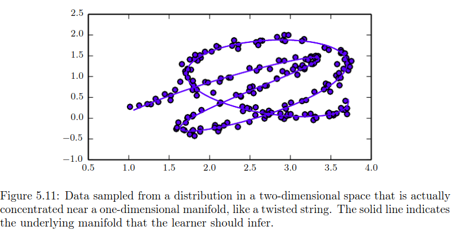

    如图的注释所说,这个图是一个二维的点分布图,但是通过将图中的点串起来,点集构成了一个一维流形.

    还有一个很生动的例子是,地图,我们看到的地图是,将三维空间中的地理坐标点集看作是二维流形,进而在二维空间中展示的结果,如下图:

    ​

    下面是一个我自己想出的定义:

    在n+k维空间中的n维流形是指,在将n+k维中的点按相近点相连的起来之后,这个点集串起来的图形在任意小的一个范围内(微分),是可以用n维来表示的.

-   **流形中的交点**:

    在上图中可以看到,一维流形在一些点与自身相交,可以认为交点处的维度为2维.也就是说:

    >   we allow the dimensionality of the manifold to vary from one point to another.
    >
    >   即, 我们允许流形上的所有点的维度可以有所不同

-   **什么是流行学习**:

    我们希望通过所有的维度去学习数据的变化模式,但是对于很多机器学习算法来说是不可能的.

    而流形学习算法克服了这个障碍,通过假设**大部分的输入数据中包含着很多无用的维度(注意是大部分而不是全部)**,有意义的输入在一个小的点集构成的流形才能得到观察,并且有意义的输出数据的变化模式信息,都储存在着一部分的有意义的输入上,那就是在流形所在的方向上.或者说,有意义的数据变化只有在输入从一个流形移动到另外一个流形上时才有意义.

    流形学习通常用于连续数据形式以及非监督性学习.但是也可以用用于离散的数据以及监督性学习,这就要求数据的概率质量分布是高度集中于某一个区域.

    ----

    >   这一节看到不是很懂??,但是我从网上看到的信息总结来说,流形学习就是:
    >
    >   将高维的数据看做一个嵌入在高维空间的低维流形,通过某种算法将高维数据转为低维数据,使该低维的数据能够反映原高维数据的某些本质结构特征。如下图所示:
    >
    >   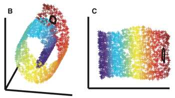

    ----

-   **流形学习的应用:**

    -   研究在流形假设下的机器学习问题，数据流形$M\in R^N$

    -   聚类:$f \to {1,...,k}$

        例子：图像分割，社会网络分析，数据挖掘等等

    -   分类/回归$f:M→{−1,+1}$ 或者 $f:M→R$  

        例子：语音识别，手写体识别，文本分类等等

    -   降维:$f:M→R^n,n<<N$

        例子：可视化,数据压缩.

-   **流形学习的局限性:**

    在一些任务上,都无法保证数据在一个低维流形上,不过在处理文本,声音和文字的问题上,我们至少可以说是接近流形的.支持这个数据是流形的这个假设需要两个支撑点:

    **流形假设条件**:

    -   有关数据,图片和声音的概率分布是高度集中的(也同时以为这种类型的流形也可以用于离散和监督性学习)

    -   一个样本的周围有和这个样本一样相近的点(以便于连接为流形,这一点是可以想象的,因为自然中的色彩,声音和文字,都是连续的).拿图像来举例,我们只可能逐渐的调强或调弱光色,缓慢的移动物体,或者在人脸识别中,人的脸和猫的脸肯定不是相似的,不是一下子可以转变成的.例如下图:

        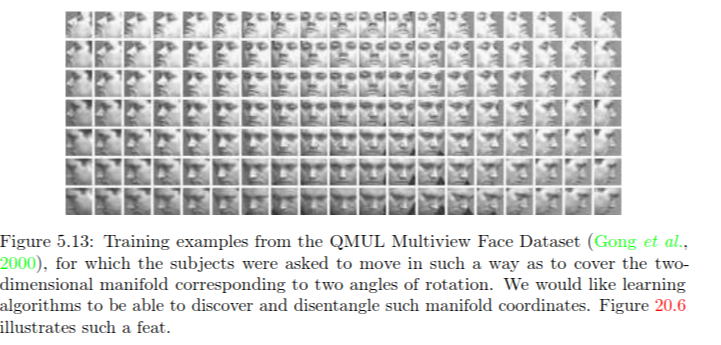

        ​

-   之后会有具体的章节讲解这个算法.而流形学习的本质就是找到各个维度之间的相似度.然后把n维下的坐标转换为流形下的坐标,就这样.

### 这一章终于完了,我个ML小白看了快半个月了!!!!!!!

