## Deep Feedforward Networks

### 6.0. Introduction

-   深层前向网络,又叫做前向神经网络或者多层感知机.

    最基本的深层前向网络没有反馈机制,有反馈机智的叫做循环神经网络.

    DFN的任务就是训练一个 $f(x)$ 使得其渐进于真正的 $f^*(x)$,这里的 $f(x)$ 为:

    $f(x) =f^{(3)}(f^{(2)}(f^{(1)}(x))).$

    这个例子是一个三层神经网络,因为中间层的layer无法之间显示出,output和input之间的关系,因此称其为hidden layers.

-   **深层前向网络的的作用:**

    能够扩大模型的容量.我们通过前面的学习知道,通过知道kernel trick可以利用线性模型去解决非线性问题$(φ(x))$.我们可以认为这是一个**赋予输入一个新的表征形式的过程**.实现这个过程的方法有:

    -   One option is to use a very generic φ.利用高斯核.这个确实可以适用于任何问题,因为模型的容量是无限的,但是,高斯核拥有局部平滑的缺点(具体见5.7.2),没有向模型中加入足够的先验信息,因此无法解决更难的问题

    -   Another option is to manually engineer.手动定制,缺点是没有通用性

    -   用深层学习去学习 $φ(x)$ .

        **深层学习的模型是**:		$y=f(x;θ, w) =φ(x;θ)^Tw$

        这里的 $φ(x)$ 是x的一个新的表征形式,而w,是将 $φ(x)$ ,映射到了输出.这里的 $φ(x)$ 定义了隐含层网络.深度学习放弃了训练问题的凸性,他的优点大于缺点.首先,深层网络可以实现方法1中的一般化,我们可以定义一个a  very broad family function就可以达到1的目的.深层学习也可以达到第二个方法的效果,实现者可以根据先验知识去设计一个family function,但是不必那么确定,可以更广泛一些.

-   DFN是从x到y的确定性映射,在后面也会介绍一些随机映射,含有反馈的函数和在一个向量上的概率分布.

-   **本章节任务:**

    -   先介绍DFN在一个简单的线性模型下的应用.
    -   介绍在设计一个DFN中需要解决的设计问题:
        -   选择优化方法.
        -   选择代价函数
        -   选择输出单元的形式
    -   在设计隐含层时:
        -   选择激活函数
        -   设计网络的结果,包括网络应该设计多少层,在每层中应该用多少个单元.
    -   介绍网络中复杂函数的梯度时,使用的后向传播算法

### 6.1 Example: Learning XOR

-   **什么是异或:**

    [0,0] -> 0,[1,0] -> 1,[0,1] -> 1,[1,1] -> 0

-   **为什么选择这个问题:**

    因为这个模型是一个极端的非线性的案例.如下图:

    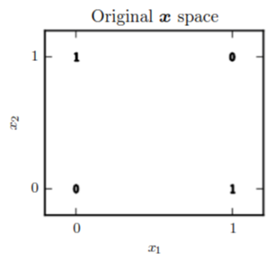

-   **模型简介:**

    loss function:均方差loss

    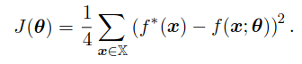

    这其中的 $f(x;\theta)$ 代表的是模型.应该使用什么模型呢?

    -   线性模型:

        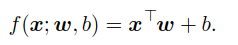

        还记得之前说的算法四要素嘛?

        不记得了...

        恩.我猜也是的.

        算法四要素有四点,loss,模型,a specification of a dataset,an optimization procedure

        这四点中,现在已经有了三点,还差一个优化算法,这里采用的是正规方程.就是通过矩阵方法一次性根据所有数据求出所有参数的一个方法.

        结果是,w=0,b=0.5,不对

        因此需要一个,在线性模型可以使用的,新的特征空间下进行操作.

    -   非线性模型

        这里采用的一层感知器.该模型分为两层

        -   从输入到隐含的一层,实现了非线性的特征空间转换
        -   从隐含到输出的一层,还是使用了线性回归模型.(这个不同与分类问题,不能使用logisic或softmax)

        这里实现非线性转变的函数,一般在神经网络中通常是ReLU,图像如下,这个在[收藏的博客](http://www.cnblogs.com/neopenx/p/4453161.html)有详细解释:

        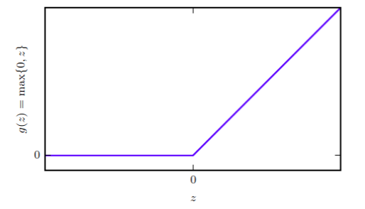

        最后转换过的特征空间大致如下:

        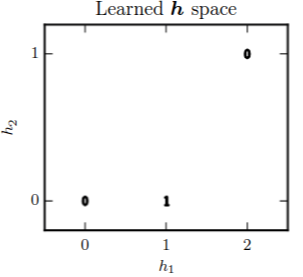

### 6.2 Gradient-Based Learning

-   **非凸优化**:

    在神经网路的训练中,由于面临的是非凸优化问题,神经网路的优化方法多是利用迭代的基于梯度的优化方法可以使得方程到达一个非常小的值.

    但是这种基于梯度下降的方法和SVM,线性回归中的正规方程,等等不同,无法保证得到最优解,并且,根据初始点的不同,结果也许会不同.

-   **初始值设定:**

    网络中的权重参数通常被设定的特别小的随机值,biased通常被设定为0,或者一些小的正值.具体的初始相关的证明详见8.4.

-   **梯度下降的其他信息:**

    目前用来训练神经网络及深度网路的主要方法.在4.3节和5.9节有具体讲解其内容和变种.

    虽然上面说,linear问题和SVM问题都不需要梯度下降,但是对于数据量很大的情况,也还是可以用梯度下降的方法去解决参数问题的.

-   **损失函数:**

    没有损失函数,就没法梯度下降,下面介绍loss 函数.

#### 6.2.1 Cost funcitons

介绍在各种模型下的各种loss

有关正则化的课题在5.2中已经说到,更多种类的正则化方法见第七章.

##### 6.2.1.1 Learning Conditional Distributions with Maximum Likelihood

-   **为何用交叉熵做为最为抽象的最大似然函数?**

    我们之前说过,机器学习模型无非就是想获得一个最佳的 $p(y|x,\theta)$ ,因此我们希望,样本数据同时发生的概率最大.也就是:

    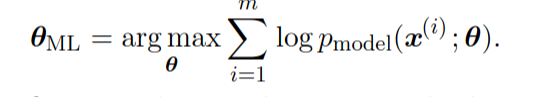

    对其除以m,选出来的theta值应该是不变的,因此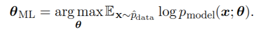

    ​

    将该模型扩展到监督性模型.根据Maximum Likelihood,可以将损失函数设计为,也就是求log(p)的期望:

    

    这个也可以看作是交叉熵,首先我们知道交叉熵是用来计算两个分布,理想分布和实际分布之间的距离的函数,函数为:

    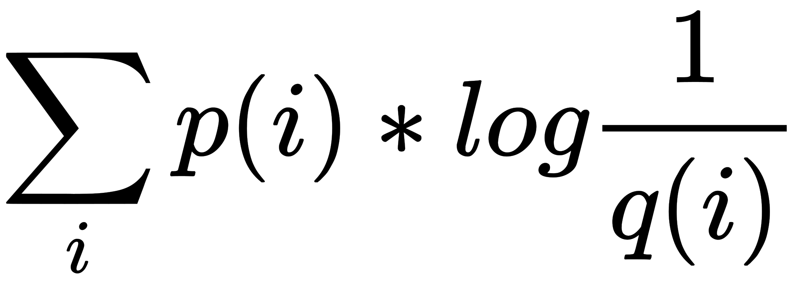

    可以发现,将这个交叉熵函数做平均后和我们的损失函数的本质是一样的.

-   **交叉熵函数在各模型中的具体表现形式:**

    上面介绍的是一个通用loss,那么如何应用到各模型呢?这就要看模型的函数

    ​				**$p_{model}(y|x)$**

    这个函数指的是,在输入为x的情况下输出y的可能性.首先,这个是要基于一个理想输出 $\hat{y}$的.

    也就是说要根据 $\hat{y}$ 的值去估计,在输入为x的情况下输出y的可能性.这个在不同模型下的情况是不一样的.

    例如,如果我们认为误差遵循中心极限定理,也就是说:

    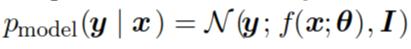

    那么:

    

    ----

    >   这里我有一个问题(???):
    >
    >   按这个推理,应该所有的误差函数都应该用L2 loss才对啊,为什么还有这么多其他的损失函数

    ----

-   **loss函数saturate(flat)的问题(也就是梯度消失):**

    -   什么是saturate:

        这个词描述的情况可以直观理解为：当Sigmoid和tanh等激活函数值接近其边界（对于Sigmoid函数来说，就是接近0和1）的时候，会导致算法在反向传播时梯度消失。

        在生物学中的意义为饱和.

        当loss函数过于平坦时就会出现难以训练的问题,出现这个问题的原因多是网络中的激活函数过于flat.这个时候...(下面看不太懂,先放下???)

        The negative log-likelihood helps to avoid this problem for many models. Several output units involve an exp function that can saturate when its argument is very negative. 

        The log function in the negative log-likelihood cost function undoes the exp of some output units. We will discuss the interaction between the cost function and the choice of output unit insection 6.2.2.

        上网查了查,对于梯度下降有两方面的解释((好像都有道理):
        - 在深层网络中由于层数太多,如层与层之间的权重小于1,那么在多层的传递中,梯度会消失,导致底层的参数无法得到训练.
        - 第二个是说,这个是激活函数的问题,因为sigmod的函数你也知道,如果给sigmod中的参数的值太大,那么,就会造成两边极缓慢,中间极陡的情况.两侧的梯度几乎为0.,传播几层之后就没有梯度了

        而本书中提到的,应该是第二种.(Several output units involve an exp function that can saturate when its argument is very negative. )

    -   这一段中提到的负对数函数与这个output units的关系我没有看懂,但是大致是想说:经过负对数之后,之前的sigmod之类的output激活函数造成的flat,得到了拯救?验证一下:

        ​		$-log(1/(1+e^{(-z)})) = log(1+e^{(-z)}) - log(1) = log(1+e^{(-z)})$

        这样一看,确实是,被saturate之后flat的梯度,经过log的还原,两侧的值变得没有那么平缓了.

    -   这里的我们举的例子是,loss是负对数似然,output unit的激活函数是sigmod,成功解决了梯度消失.那么,在不同的loss和激活函数下,其对应的应该是不一样的,

        具体的在什么cost函数下选择什么output的问题详见6.2.2.

        >   现在真正可以解决梯度消失的方法是**Batch Normalization **,标记一下.

-   **离散情况下的计算方法:**

    在离散情况下,虽然我们的 $p_{model}(y|x)$  不能像连续的模型一样,但是可以逼近它.例如,逻辑回归,我们还是选择用对数似然的方式去解决,不过与上面的不同的是,我们计算输出的方式变了,不是正态分布,而是通过sigmoid函数

    ---

    >   sigmoid 与 logistic:
    >
    >   sigmod是函数,logistic是模型,就这样

    ---

    我突然想明白了离散情况和连续情况的不同!!!!:

    -   离散情况:

        离散情况最后生成的值,一定是真是数据中出现过的(例如分类).

        因此, $p_{model}(y|x)$ 要计算的是,理想y在网络中的那个概率,例如,逻辑回归,我们在确定他的输出

        的时候,用的是sigmod函数,本身就计算的是一个为0为1的概率.这里的这个概率刚好可以用到,$p_{model}(y|x)$的计算中去.

    -   连续情况:

        连续情况是,理想y不一定在真实数据集中出现.

        因此, $p_{model}(y|x)$ 要计算的是, 基于中心极限定理的,实际y与理想y的误差.

        就是说,这里的 $p_{model}(y|x)$ 是要重新计算的,无法使用之前在网络中的任何结果.

-   **$log(0) -> \infty$**:

    当数据的预测和实际数据完全吻合之后,就会得到一个无限小的loss结果,这会对结果造成干扰,解决这个问题的方法是,利用正则化,这个将会在第7章中讨论.

##### 6.2.1.2 Learning Conditional Statistics

-   **复杂分布的情况**:

    上面我们求得是y关于x的概率分布,但是当网络结构机器复杂的时候,我们往往不去计算整个分布,因为我们不知道分布是一个什么样的形式.我们去用复杂的网络结构去实现一个很广泛的映射,也就是说通过这个复杂的网络的参数调整,可以得到各种各样复杂的函数.

    因此在这种复杂的情况下,尤其是不拥有想正态分布这样的有意义的分布的情况下,我们不需要必须计算,两个分布的交叉熵距离,而可以只计算在给出 $x$ 下的结果为 $y$ 的条件概率.

    而这些个复杂函数的共同特性是由输入数据的特性(比如说,连续性或者局限性等等)决定的.因此,与上面的通过网络训练挑选参数不同,我们可以通过这个复杂网络选择,处理的函数和这个函数的参数.

-   **cost函数->泛函:**

    从这个观点来看,我们可以把cost函数看成一个泛函.那么什么是泛函呢?

    泛函是从函数到实值的映射,看其符号:

    ​						$y = \int f(x,\dot{x},t)dt$

    从这个函数可以看出来,他是一个积分形式,就是,考虑到了所有的最原始输入t的情况.因此,这里注明的是cost函数,而不是loss 函数.loss和cost的区别如下

    ---

    >   1.  损失函数(Loss function)是定义在单个训练样本上的，也就是就算一个样本的误差，比如我们想要分类，就是预测的类别和实际类别的区别，是一个样本的哦，用L表示
    >   2.  代价函数(Cost function)是定义在整个训练集上面的，也就是所有样本的误差的总和的平均，也就是损失函数的总和的平均，有没有这个平均其实不会影响最后的参数的求解结果。

    ---

    在这一节浪费了好长时间,其实是理解的方向错了.

    文中说道:

    We can design our cost functional to have its minimum occur at some specific function we desire. For example, we can design the cost functional to have its minimum lie on the function that maps $x$ to the expected value of $y$ given $x$.

    这里是说,吧cost函数看作是一个泛函,也就是说,输入为一个函数,输出为实值.我们再回顾一下之前的cost函数.

    

    这个里面的自变量只有模型 $x$.但是在这个泛函的cost函数中

    整个 $p_{model}(y|x)$ 都成为了参数(输入变量). $x$ 是最原始的参数,也就是上面的泛函公式处的 $t$ ,一个固定值.

    举个例子,我们可以设计这个 model 为一个使得x等够逼近期望(真实数据)中的y值.(有点过拟合的感觉)

    而解决这个优化问题就要用到变分法

-   **变分法解决上述优化问题:**

    变分法可以用于推导出下面两个结论:

    -   解决下面这个优化方程,被成为**mean squared error**:

        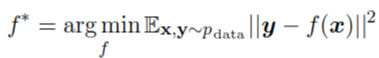

        从这个式子可以推导出(这个公式什么意思不懂??):

        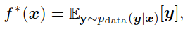

        如果我们可以从真实的数据分布中生成无限多的样本数据,我们就可以通过最小化平方差函数来预测出x对应的y的平均值.

        结合上面这句话,上面的式子就看懂了.

    -   另外一种形式的优化方程:

        ​					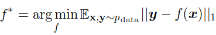

        这个优化方程可以预测出真实数据中的中位数(前提是数据集无线大).这个方程被称为绝对值均值误差(**mean absolute error**).

    -   **上面的两种error方程和负对数似然有什么不同:**

        正如6.2.1.2最开始所说,这里的目标分布是及其复杂,首先是不存在一个很正规的分布,虽然可以用但是没有必要用负对数似然去计算真实分布和实际分布的距离.

-   **上述两个error的缺点**

    但是,这两个error有一个缺点,一些输出单元的结果配合这个error计算方法后,会产生梯度消失的情况.这也是为什么负对数似然更火的原因,**即使!!!!!没有必要去计算整个的分布!!!!**.

    也就是说,不计算真实分布和理想分布的距离的原因不是不行,而是没必要??

    ​

#### 6.2.2 Output Units

-   前面提到了,为了防止梯度消失的出现,loss函数和output unit的配合使用是需要经过设计的,不能随意使用.下面一段很重要:

    Most of the time, we simply use the cross-entropy between the data distribution and the model distribution. The choice of how to represent the output then determines the form of the cross-entropy function.

    -> 

    我们大部分时候都会使用交叉熵去计算数据分布和模型分布之间的距离作为损失函数.而选择什么样的output unit决定了使用使用什么样的交叉熵公式.

    这个是很容易理解的,首先,我们知道,交叉熵公式为:

    

    这个里面的 $p_{model}(y|x)$ 就是模型,而模型包含了output单元.并且和u不知道其所云的中间层相比,最后的output unitはあきらか重要なんだ！！

-   其实所有的感知机都既可以作为hidden unit也可以作为output unit,这里先只考虑output,在6.3节再考虑作为hidden的情况.

    ​

##### 6.2.2.1 Linear Units for Gaussian Output Distributions

-   **简单的仿射函数.**

    ---

    >   仿射函数:
    >
    >   $\hat{y} = W^Tx + b$ 
    >
    >   是一个把输入的x的m维空间,线性映射到y的k维空间.
    >
    >   仿射函数与线性函数的区别.
    >
    >   只有b=0时，仿射函数才可以叫“线性函数”（“正比例”关系）。

    ---

    这个线性输出单元通常用于计算高斯分布的平均值.例如在线性回归模型中,我们可以使用该线性单元作为模型的输出单元.因为,非线性变换已经在隐含层进行过了.

    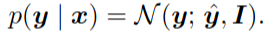

    在这种情况下,计算loss,也就是对数死然就是计算均方差,这个在之前已经讨论过很多遍了.

-   **多维单高斯分布的情况:**

    上面的结果只是用于单维单高斯分布,而是多维单高斯.(介绍见下方暗方块)

    若要解决多维单高斯的问题,就不一样了.为什么不一样呢?我们来看下.

    在之前的单维的情况下,我们知道了由于:

    

    再经过负对数似然函数,损失函数才可以变成L2 loss.并且这里假设正太分布的方差为1.

    那么在高维下,由于各个维度间也许存在着一定关联,那么协方差矩阵不能全为 $I$ .因此在-log(p)的时候还要计算出协方差矩阵.这个协方差矩阵应该是有数据集为输入计算出来的.

    并且这个协方差矩阵还必须满足,正定矩阵的性质.为什么??

    ----

    >   协方差矩阵必为对称正定阵或者半正定.
    >
    >   首先要知道正定的定义是:
    >
    >   -   所有特征值大于零的对称矩阵（或厄米矩阵）也是正定矩阵。 
    >   -   X=(x_1,...x_n) 都有 X′MX>0，就称M正定(Positive Definite).
    >
    >   证明如下:
    >
    >   对于样本集: $X=(X_1,X_2,...,X_n)$
    >
    >   其各维均值: $\mu = (\mu_1,\mu_2,...,\mu_n)$
    >
    >   则协方差为: $\sum = E[(X-\mu)(X-\mu)^T]$
    >
    >   对任意向量$y^T$有: 
    >
    >   ​		$y^T\sum y = y^TE[(X-\mu)(X-\mu)^T]y$
    >
    >   ​			$=E[y^T(X-\mu)(X-\mu)^Ty]$
    >
    >   ​			$=E[y^T(X-\mu)(y^T(X-\mu))^T]$
    >
    >   ​			$= E(||y^T(X-\mu)||^2) \ge 0$				

    ----

    与高维高斯对应的output不能是线性的,具体在6.2.2.4节中讲.

    ----

    >   ***多维单高斯(SGM):***
    >
    >   多维高斯分布是指,假设输入有m维,假设每个维度上都有一个自己的单维单高斯分布.
    >
    >   最后结果如下:
    >
    >   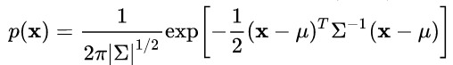
    >
    >   其中,u就是均值向量, $\sum$ 就是协方差矩阵.直观来看,二维混合高斯的形状是椭圆.三维高斯的形状是椭球.
    >
    >   这里还有很重要的一点是,维度间信息是否独立的问题,只有相互独立才能成为多维单高斯.具体见[链接](https://zhuanlan.zhihu.com/p/26193492):
    >
    >   ***混合高斯:***
    >
    >   混合高斯是由多个SGM混合而成的,也就是加权和:
    >
    >   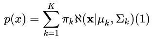
    >
    >   大致形状如下:
    >
    >   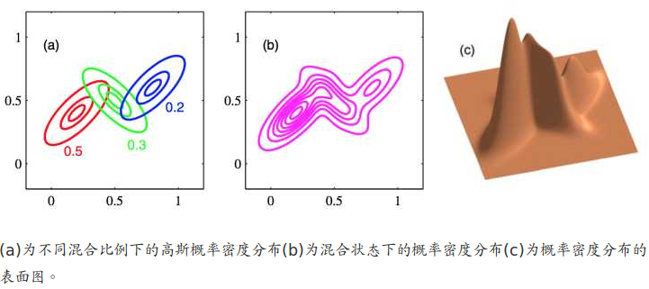

    ---

#####6.2.2.2 Sigmoid Units for Bernoulli Output Distributions

-   **线性函数 -> sigmod:**

    我们上一节讨论的output unit是线性(仿射)的,就是 $\hat{y} = W^Tx + b$ ,如果只使用这个的话,是无法运用于二分类的..原因和解决方案如下:

    -   **原因:**

        二分类问题的本质就是决定一个伯努利分布.我们必须要求经过处理的 $x$ ,也就是 $\hat{y} = W^Tx + b$. 要处于0和1之内.如下式:

        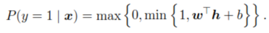

        这就出现了一个很大的问题,对于超出范围的 $\hat{y} = W^Tx + b$ ,无论是多大($\hat{y} >> 1$),或者多小($\hat{y} << 0$) . 梯度的变化都不会变.

    -   **解决方案:**

        因此,需要一个,把所有可能的取值都包含在定义域内,并映射到值域为[0,1]的函数.并且希望该函数能够拥有尽可能大的梯度.

        这个函数就是sigmod函数,**要配合最大似然使用(负对数似然)**.图如下:

        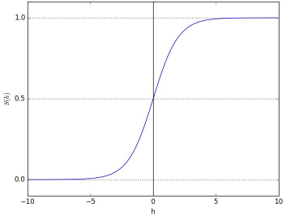

        公式为:

        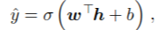

        下面的这里的S,就是上面的 $\sigma$ ,不是一个网站的图.

        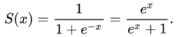

        从这个图中可以看出它将实数范围内的所有值都映射到了[0,1].

    -   **一般形式下的推广:**

        设 $z = w^Tx +b$

        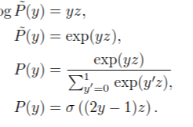

-   **logitsic回归损失函数详解:**

    sigmod函数是二分类问题中,output的输出函数.那么的cost function长什么样呢?上面也说过是,使用最大似然法,我还是从最开始一步一步推导.

    >   最原始的最大似然函数:
    >
    >   
    >
    >   那么,这里的  $p_{model}(x;\theta)$ 的推到过程是:
    >
    >   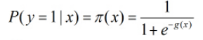
    >
    >   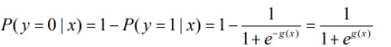
    >
    >   所以cost函数就是:
    >
    >   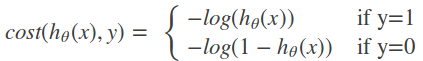

-   **损失函数 -> softplus函数(只是碰巧):**

    上面的cost函数再化简就是softplus函数:

    softplus的公式为: $log(1+e^x)$

    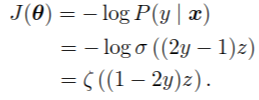

    接下来我们看这个函数的性质,与sigmod函数的输出函数单元的性质不同,这里softplus是作为损失函数存在的.这里并不是说,sigmod和softplus不是一个类型的函数(激活函数).而是说,这里的激活函数sigmod经过最大似然的负对数处理后,碰巧变成了softplus函数,于是我们可以通过观察softplus函数来观察性质.

    图如下.

    我们分两种情况来讨论:

    -   当真实的y=1时:

        这个时候,我们希望 $z=w^Tx +b$ 的值尽可能的大.在 $\sigma(z)$ 中表现为尽可能的接近1.

        而在损失函数中,当真实的y=1时, $J(\theta)=\zeta(-z)$ ,也就是说,z越大, $J(\theta) \to 0$ ;而z越小,梯度越大.可以尽快梯度下降来调整错误的参数.

    -   当真实的y=0时:

        这个时候,我们希望 $z=w^Tx +b$ 的值尽可能的小.在 $\sigma(z)$ 中表现为尽可能的接近0.

        而在损失函数中,当真实的y=0时, $J(\theta)=\zeta(z)$ ,也就是说,z越小, $J(\theta) \to 0$ ;而z越大,梯度越大.可以尽快梯度下降来调整错误的参数.

    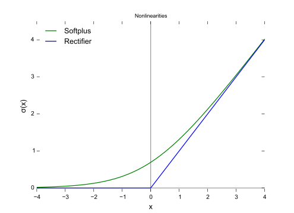

-   **logit函数和logitsic函数**:

    logit和logitsic互为反函数:

    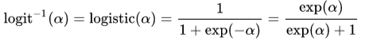

    其中$logit(\alpha) = log(\frac{\alpha}{1-\alpha})$ 为发生比(odds)的对数.

    整个推导过程为:

    设 

    

    

    也就是

    ​						$p(y|x) = \sigma((2y-1)z)$

    其中 $z=w^Tx +b$ .

    那么:

    ​		$logit(\sigma(z)) = log[\sigma(z)/(1-log(\sigma(z)))] = z$

-   **为什么不能用其他损失函数?**

    在用其他的损失函数比如说,平方损失函数的时候,损失函数会随着logitsic饱和而饱和.

    比如说当实际y=0的时候,损失函数的公式是, $(\sigma(z))^2$图像如下:

    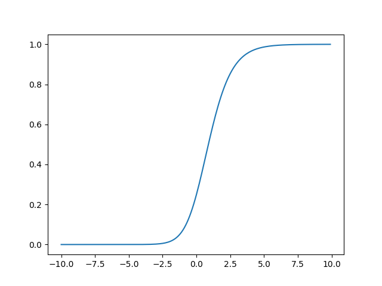

    和上面的softplus相比我们发现在$\sigma(z)$极大也就是,偏差很大的时候,反而梯度下降的很小.不对了不是.

-   **实际值域是(0,1)而不是[0,1]**:

    这也可以防止出现数值错误,因为log(0)趋近于无限小.也就是当 $z \to \infty$ 的时候,$softplus(z) = \zeta(z) \to \infty$的情况.

##### 6.2.2.3 Softmax Units for Multinoulli Output Distributions

-   **用途:**

    -   最一般的就是用于多分类问题.
    -   在很罕见的情况下用于模型内部,用来选择某个选项(不太懂??)

-   **剖析softmax:**

    首先,softmax是:

    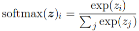

    其中 $z_i$ 是经过线性单元计算的初级概率估计:

    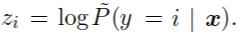

    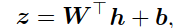

    上面的 $z$ 是一个向量分别指向不同的类别.而 $z_i$ 是一个值.

    这个和logitsic的本质是一样的,下面我将会用线性回归的损失函数和训练过程,与softmax进行对比.

    首先要明白神经网络的训练方式:

    -   神经网络出来的结果一般都不是对 $f(x;\theta)$ 不是对 $y$ 直接的预测.而是对 $y$ 的概率分布的参数的一个计算.即 $f(x;θ) =\eta$
    -   真正的这个是概率分布 $P_{model} = p(y; \eta(x))$
    -   下面才进行loss函数计算 $loss=−log p(y; \eta(x)).$

    |                      |                          连续性分布                          |                          离散性分布                          |
    | :------------------- | :----------------------------------------------------------: | :----------------------------------------------------------: |
    | $\eta=f(x;θ)$        |                           $w^T+b$                            |                      $z=\sigma (w^T+b)$                      |
    | $P_{model}(y;\eta)$  |        $p(y|x)=\mathcal{N}(y;\hat{y}(x;w),\sigma^2)$         |               $p(y|x)=exp(z_i)/\sum_jexp(z_j)$               |
    | 似然函数             |      $\theta= argmax_{\theta} \sum log P_{model}(y|x)$       |      $\theta= argmax_{\theta} \sum log P_{model}(y|x)$       |
    | $loss=-logP_{model}$ |                    $loss= (y-\hat{y})^2$                     |                 $loss=z_i-log\sum_jexp(z_j)$                 |
    | 两者区别             | 对于每个x都有一个对应的也许不寻在的y可以被计算出来,因此有一个显式的 $y$ 出现在loss函数里 | 每个x都必须被分到已经有的类别中, $y$ 的信息被隐藏在 $\sum$ 里面了.如何隐藏的见下面. |
    | $logP_{model}$本质   |                 距离真实值越近说明预测越准确                 |                            见下面                            |

-   **$p(y|x)=exp(z_i)/\sum_jexp(z_j)$中隐藏的信息:**

    和逻辑回归中可以利用 $(1-2y)$ 来表示所有的状态不同.softmax无法用一个公式,表现出所有的y.多分类的结构是:

    首先输入只经过一层的线性单元后便可以分类为n类,这个n类已经是全部的类别,下一步就只是将这个线性单元处理过的概率转换为softmax处理的概率.

    因此,这里将实际数据的分布信息隐藏在 $p(y|x)=exp(z_i)/\sum_jexp(z_j)$ 里面.怎么隐藏呢?

    我们想想,对于每组数据 $(x,y)$ 而言,这个 $x$ 根据实际的分类效果可能被分到n个类别中,但是loss函数的值只能是一个标量,只能利用 $z_i$ 去减去模型得出的概率.这个$z_i$ 是何方妖孽?如何能呈此大能.答案是,此乃数据 $y$ 的真实类别,也就说,真实的 $y$ 的信息是用 $z_i$ 来表示了,还省去其他的类别为0的信息.

    $p(y|x)=exp(z_i)/\sum_jexp(z_j)$ 经过log之后,变成了:

    $loss=z_i-log\sum_jexp(z_j)$

    首先这个公式中, $z_i$是毫无疑问对loss有直接影响的,即使 $z_i$在后面的 $log\sum_jexp(z_j)$ 中所占值较小.当最小化loss时, $z_i$ 被增大,而 $log\sum_jexp(z_j)$ 被减小.

    我们认为,在这种逐渐的改变下, $log\sum_jexp(z_j)$这一项可以粗略地约等于 $z_i$,因为这里以 z 为 e 的指数.在最大的 $z_j$ 相比较大的时候,可以想象:

    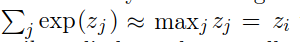

    **但是身为一个信仰科学的人,不能想象,在下下小白点处证明**

-   **为什么要用log作为损失函数:**

    -   原因和logitsic一样,具体可以看上面的解释.类比logitsic,sigmod在输入极大或者极小时都会出现梯度消失.

        softmax在输入之间相差很大(各个 $exp(z_j)$ 的值相差很大)的情况下也会出现梯度消失的情况.只有使用能够消除exp效果的负对数似然,才能缓解.

    -   **并且,softmax的易饱和情况很严峻**

        当 $\max z_k$较大且$z_i=z_k$ 时,则softmax很容易向1饱和.

        当 $\max z_i$较大且 $z_i\ne z_k$ 时,则softmax很容易向0饱和.

-   **softmax数值稳定的变种**

    为了看在输入的不同下,也就是经过线性单元得出的n个初级概率,之间的不同,对softmax带来的影响.我们给softmax加上一个标量来看看结果.

    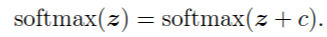

    也就是分数的分子分母都有 $e^c$,结果约掉了.

    那么,下面这个公式就能保持softmax数值的稳定:

    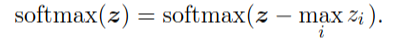

    这个变种可以让我们产生更小的数值错误.什么是**数值错误??**

    ----

    >   对于softmax数值稳定性的解释见如下[链接](http://freemind.pluskid.org/machine-learning/softmax-vs-softmax-loss-numerical-stability/)
    >
    >   下面是总结:
    >
    >   总而言之就是,当 $z_i$ 非常大是, $e^{z_i}$ 会发生overflow的情况.但是,将 $z-\max_iz_i$ 之后, $\sum$ 里面最大的数就成为0,虽然其他的正常的 $z_i$ 会underflow,不过$e^{z_i}$会变成0,对结果没有影响,

    ----

-   **softmax模型的过度参数化**:

    上面的数值稳定其实还有一层其他的含义,那就是解决了softmax模型的过度参数化.详见[链接](http://ufldl.stanford.edu/wiki/index.php/Softmax%E5%9B%9E%E5%BD%92)

    Softmax 回归有一个不寻常的特点：它有一个“冗余”的参数集。为了便于阐述这一特点，假设我们从参数向量  中减去了向量 ，这时，每一个  都变成了 ()。此时假设函数变成了以下的式子：

    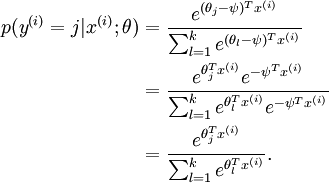

    换句话说，从$\theta_j$ 中减去 $\psi$ 完全不影响假设函数的预测结果！这表明前面的 softmax 回归模型中存在冗余的参数。更正式一点来说， Softmax 模型被过度参数化了。对于任意一个用于拟合数据的假设函数，可以求出多组参数值，这些参数得到的是完全相同的假设函数 。

    进一步而言，如果参数 $(\theta_1, \theta_2,\ldots, \theta_k)$ 是代价函数 $J(\theta)$ 的极小值点，那么 $(\theta_1 - \psi, \theta_2 - \psi,\ldots, \theta_k - \psi)$ 同样也是它的极小值点，其中 $\psi$ 可以为任意向量。因此使 $ J(\theta)$ 最小化的解不是唯一的。（有趣的是，由于 $J(\theta)$ 仍然是一个凸函数，因此梯度下降时不会遇到局部最优解的问题。但是 Hessian 矩阵是奇异的/不可逆的，这会直接导致采用牛顿法优化就遇到数值计算的问题）

    注意，当  时，我们总是可以将 替换为（即替换为全零向量），并且这种变换不会影响假设函数。因此我们可以去掉参数向量  （或者其他  中的任意一个）而不影响假设函数的表达能力。实际上，与其优化全部的  个参数  （其中 ），我们可以令 ，只优化剩余的  个参数，这样算法依然能够正常工作

    在实际应用中，为了使算法实现更简单清楚，往往保留所有参数 ，而不任意地将某一参数设置为 0。但此时我们需要对代价函数做一个改动：加入权重衰减。权重衰减可以解决 softmax 回归的参数冗余所带来的数值问题。

-   **权重衰减:**

    我们通过添加一个权重衰减项  来修改代价函数，这个衰减项会惩罚过大的参数值，现在我们的代价函数变为：

    

    有了这个权重衰减项以后 ()，代价函数就变成了严格的凸函数，这样就可以保证得到唯一的解了。 此时的 Hessian矩阵变为可逆矩阵，并且因为是凸函数，梯度下降法和 L-BFGS 等算法可以保证收敛到全局最优解。

    为了使用优化算法，我们需要求得这个新函数  的导数，如下：

    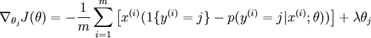

    通过最小化 ，我们就能实现一个可用的 softmax 回归模型。

-   **Softmax回归与Logistic 回归的关系**:

    如果将k设为2,也就是只有两个类别.将

    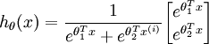

    转换到:

    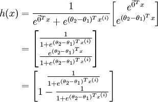

    的过程,其实就是一个,将其中的一个 $\theta$ 设为0的过程.

-   **从神经学的角度:**

    softmax其实相当与神经学中的竞争机制.总共的资源是固定的,你多他就少.这个机制叫做,侧抑制(lateral inhibition).在极端的情况下,会出现 winner take all 的情况(one of the outputs is nearly 1,and the others are nearly 0).

    其实softmax更应该叫做 softargmax函数,因为,他得出的不是最大的值,而是最大的值的index.然而,softargmax与argmax的区别在于,softargmax计算的是一个连续的可微的函数.

##### 6.2.2.4 Other Output Types

-   **神经网络的训练方式**:

    -   神经网络出来的结果一般都不是对 $f(x;\theta)$ 不是对 $y$ 直接的预测.而是对 $y$ 的概率分布的参数的一个计算.即 $f(x;θ) =\eta$
    -   真正的这个是概率分布 $P_{model} = p(y; \eta(x))$
    -   下面才进行loss函数计算 $loss=−log P_{model}(y; \eta(x)).$

-   **以求高斯分布的方差为例**:

    其实这是一个进阶问题,对于一维高斯而言确实没有必要用神经网络去求解,但是对于混合高斯模型的求解来说就是很有必要的了

    一般而言,求高斯分布的方差很简单就是求平方差公式就好了.

    这里用神经网络来求:

    -   **一维高斯:**

        $f(x;θ) =\eta$  :这里是指将输入经过线性单元和非线性函数之后得到的值,这里的输出的值包括方差和均值.

        $P_{model} ​$:这里是值,将上面的值当作方差计算,在此方差下x出现的概率.

    -   **多维单高斯:**

        -   在多维高斯下,不同的地方是,输入换成了多个变量.输出的也是多个变量,分别代表每个维度下的方差.设目标协方差矩阵为一个对角矩阵 $diag(β)$ .(假设了多维度相互独立好嘛??)

            ---

            >   假设了多维度相互独立好嘛?
            >
            >   使用对角矩阵作为协方差矩阵确实是权衡之计.
            >
            >   因为,若不是对角矩阵,在计算det(A)和矩阵的逆的时候消耗会很大

            ----

        -   然而要注意的事,这里的 $\beta$ 不能是方差,而应该是 $\frac{1}{\sigma^2}$.因为如果用 $\sigma^2$ 也就是方差做 $\beta$ .在训练的时候,由于多维高斯公式是:

            

            将其求偏导之后,预测值会出现在分母处,这样若预测值接近于0时,训练则会出现错误.

        -   那么在 $\beta = \frac{1}{\sigma^2}$ 的情况下:

            $\mathcal{N}(x;\mu,\sum)$ 的导数会是 $\beta_i$ 的乘积和 $log\beta_i$ 的形式,不会出现上面的那些错误.

        -   保持正定:

            我们知道协方差矩阵是正定矩阵,那么其倒数,也就是$\frac{1}{\sigma^2}$ 构成的协方差也应该是正定矩阵,因此我们要保证我们的输出为正值.

            按杂货那个上面的非线性激活函数输出(假设为 $\alpha$ )的话,这个是不能保证的.但是我们可以在这个原始的激活函数之上再加一个softplus函数,这样就可以保证时时大于0了:

            ​					$\beta = softplus(\alpha)$

    -   **混合多维高斯:**

        这里要用到一个很专业的模型叫做mixture density networks. A Gaussian mixture output with n components is defined by the conditional probability distribution.设由n个高斯模型组合而成.每个多维单高斯的维度为d.

        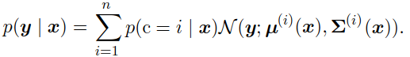

        正如式子所显示的,我们的神经网络需要输出三个部分,一个Mixture components $p(c=i | x)$ .第二个是在每个输入作为条件下的,每个高斯的 $\mu^{(i)}(x)$ 的值,第三个是在每个输入作为条件下的,每个高斯的 $\sum^{(i)}(x)$ 的值.

        对于每种输入都有其限制:

        -   Mixture components $p(c=i | x)$:

            可以认为, $p(c=i | x)$ 遵循的是一个多项分布.我们可以用softmax去模拟,可以保证n个可能结果都为小于1的正数且和为1.

        -   Means $\mu(i)^{(x)}$:

            对于所有的混合的高斯,一共需要输出 n*d 个参数作为 $\mu$ .由于对于每个输入,我们都需要去考虑其在没个组成高斯中所占的比例,以及其对各个组成高斯的影响.因此,优化很复杂.这里使用负对数似然作为loss.

        -   Covariances $\sum(i)^{(x)}$:

            这里还是设计的对角矩阵.其他的和means的求解方法类似.

        但是实际上,这个方法并不可靠.因为在计算方差时会用到出发,因此容易不稳定.

-   **高斯混合模型的用途:**

    常用于语音生成模型以及物体的移动相关任务.The mixture density strategy gives a way for the network to represent multiple output modes and to control the variance of its output, which is crucial for obtaining a high degree of quality in these real-valued domains.

### 6.3 Hidden Units

-   **什么是Hidden Units?**

    上面讨论的那些玩应并不是只针对神经网络,而是那些利用到梯度下降法(即需要, $f(y;x)$ $P_{model}(\eta|x)$ ,$-logP$)的机器学习算法.下面我们开始讨论只属于神经网络的部分,那就是:

    how to choose the type of hidden unit to use in the hidden layers of the model.

    这个领域并没有一个定论,还在发展.

    这里其实就是选择激活函数的问题.基本形式就是:

    ​							$g(w^Tx+b)$

    我们现在最常用的函数就是:Rectified linear.在选择激活函数的时候通常会根据问题考虑,但是Rectified linear经常都是一个合适的选择.选择一个合适的激活函数的方法是,先凭直觉选择一类激活函数,接下来在验证集上检验其性能.

-   **不可微问题**:

    关于Rectified linear函数,存在着一个在0处不可微的问题.但是实际上,激活函数中的不可微点通常是独立且分离且数量极少的.在面对这样的问题是,我们通常的选择是选择其左侧导数或者右侧导数之一.实际上,数据刚好碰在不可微点处的可能性很低.通常是极其接近的一个值.

    因此我们经常忽视激活函数中的不可微点,更重要一个原因是,在最优化问题本身就很难找到最小点,只能找局部最小值.因此,一个接近于无线小的点造成的影响可以忽略.

-   **神经网络的非凸性:**

    神经网络的损失函数是非凸函数.**神经网络的代价函数J(θ)是一个非凸函数，因此理论上是只能够停留在局部最小值的位置。**若要严格从定义来证明,只需要证明损失函数的hessian矩阵存在非正定的解就好了.详见[链接](https://www.zhihu.com/question/265516791)

#### 6.3.1 Rectified Linear Units and Their Generalizations

Rectified linear units use the activation function $g(z) = max\{0, z\}$ .ReLU的本质是分段函数.

使用ReLU族作为激活函数的一个原则是,其线性的函数可以简化优化过程.如了深度学习算法之外在其他的领域也可以用到线性函数来进行优化.例如循环神经网络LSTM,这个需要抽时间写篇论文.

-   **特点:**

    Rectified线性激活单元的一个特点是,其一阶倒数在激活的情况下一直较大(为1)且为常数.其二阶导数几乎处处为零(除了零点).*这意味着梯度方向比用于引入二阶效应的激活函数要有用得多。(??)*

-   **仿射函数**:

    Rectified线性激活单元是作用于仿射函数之上的,即:

    ​						$h=g(W^T+b)$

    这里要注明的是,一开始最好给b加一个小的正数(譬如0.1),因为这样可以让激活单元处于激活状态以便于其进行梯度下降.

-   **缺陷:**

    1.  Rectified线性激活单元的一个缺陷是,其在非激活的状态下无法进行学习,针对这个也几个不同的变种可以使得函数处处可导且导数不为0.这些变种是可以和Rectified函数媲美的,甚至在有些情况下,效果更好.
    2.  训练的时候很”脆弱”，很容易就”die”了. 举个例子：一个非常大的梯度流过一个 ReLU 神经元，更新过参数之后，这个神经元再也不会对任何数据有激活现象了。就是说降到0之后不会再降

-   **实质**

    用分段线性函数进行函数拟合.

    -   在同一个 $x$ 经过第一层的unit的时:

        通过 $W^{(1)}x+b^{(1)}$ 的处理.有些输出的是0,有些输出的是 $1*x$.

    -   经过第二层的unit的时:

        上面的输出为0的单元则被忽略,而留下的那些单元,通过 $W^{(2)}x+b^{(2)}$ 的处理,得到的值是,

        $(w_1x+b_1)...+(w_ix+b_i)+(w_jx+b_j)...+(w_kx+b_k)=\sum_pw_px+\sum_pb_p$ ,这里的 $W^{(2)}$ 是经过网络训练的,因此什么值都可能出现,但是结果归根到底都是线性的,因此可以得到下面的这样的图

    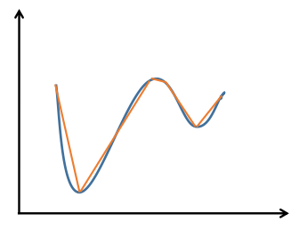

-   **变种:**

    变种都是基于一下规则,即设置一个 $\alpha_i$ 用于在 $z<0$ 的时候,即:

    ​	when $z_i<0$ ,$h_i=g(z, α)_i=max(0, z_i) +α_imin(0, z_i)$

    下面就是通过修改$\alpha_i$ 来生成新的变种.

    -   **Absolute value rectification: **

        $h=g(z)=|z|$

        这个时候 $\alpha_i=-1$ ,这个常用于图像识别中.

        

        这个也比较好理解,因为图像中的物体在极性翻转后,其还是可以进行识别的.比如说,将灰度图像进行灰度翻转后,什么物体是什么物体我们还是可以知道的.

    -   **leaky ReLU:**

        这个时候 $\alpha_i = $ 一个小的正数.

        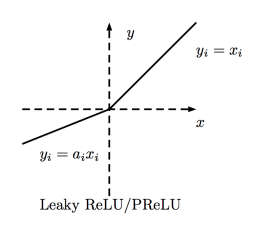

    -   **parametric ReLU:**

        treats $α_i$ as a learnable parameter:

        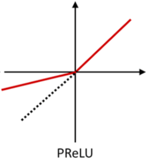

    -   maxout unit:

        这个是2013年的论文,里面提到,只用一个使用maxout的2层MLP,便可以拟合任意凸函数.

        下面从经典的ReLU和maxout的对比来看区别.

        -   **ReLU**:

            首先,我们知道对于一般的ReLU激活函数来说,其公式是:

            ​						$g(z) = max\{0, z\}$

            其中, $z=g(W^Tx+b)$ ,设 $x \in \mathbb{R}^m$, $W \in \mathbb{R}^{n*m}$,这里的m是输入向量维度,而n是中间单元的个数.输入的 $z \in \mathbb{R}^n$ .这里的非线性是由 $max()$ 来实现的.

            这是一个确定性的公式.用简单的一个神经网络隐含层来表示就是:

            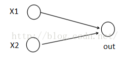

        -   **maxout:**

            其公式为:

            

            其中, 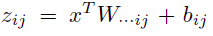

            需要注意的是,这里的 $W \in \mathbb{R}^{n*m*k}$ ,这个k代表的是从k个备选里面选出最大的.在一般的神经网络隐含层中,隐含单元就是排成一列的,是一维的 ,有n个.

            但是maxout,其隐含单元是二维的,有 n*k 个,而非线性的实现就在于从n\*k个中间选出n个.如下图:

            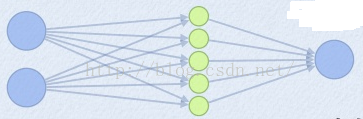

            相当于加了一个在 拥有n*k的隐含层上加了一个max pool.

            ---

            >   其他介绍:
            >
            >   -   **效果:**
            >
            >       因为对于不同的输入 x ,其可能采用的线性函数都是不同的,因此可以通过,由线性分段函数进行逼近近似拟合任意凸函数.示意图如下:
            >
            >       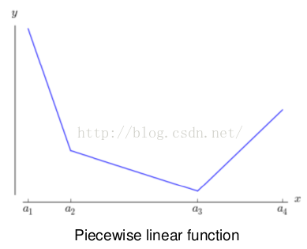
            >
            >       当然了,这个还可以拟合为上述的各种类型的ReLU.如下图:
            >
            >       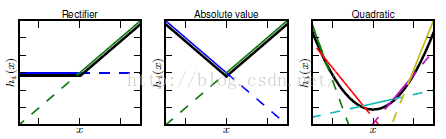
            >
            >   -   **使用时需要注意的**:
            >
            >       Each maxout unit is now parametrized by k weight vectors instead of just one, so maxout units typically need more regularization than rectified linear units. They can work well without regularization if the training set is large and the number of pieces per unit is kept low.
            >
            >       即,由于每个unit下都由k个单元构成,因此比一般的ReLU需要更大的正则项.但如果数据集很大其每个unit下有很多单元的话,可以忽略正则项.
            >
            >   -   **优点**
            >
            >       1.  抗catastrophic forgetting(灾难性遗忘):
            >
            >           灾难性遗忘是指,神经网络在训练一个新的问题是会把之前的任务的结果忘掉,也就是说,神经网络不能在不遗忘旧任务的执行方法的同时习得如何执行新任务。具体见[链接](https://zhuanlan.zhihu.com/p/25905940).会安排一个笔记专门写这个.

            -----

#### 6.3.2 Logistic Sigmoid and Hyperbolic Tangent

正如前面所说的,sigmod函数具有高度的饱和性,即在input值特别大的时候,饱和于一个较大的值(比如1),在input值特别小的时候,饱和于一个较小的值(比如0).这种易饱和性决定了若要使用sigmod这一族的函数作为输出单元时,要采用其对应的loss函数(比如负对数似然).

和sigmod相比,tanh函数更受欢迎,因为他更类似于恒等方程.

sigmod和tanh的关系是:

​						$tanh(z) = 2\sigma(2z)-1$

​						$tanh(0) = 0$ ,而 $\sigma(0)=1/2$

其中,我们一般认为tanh好于sigmod,原因是,看下图:

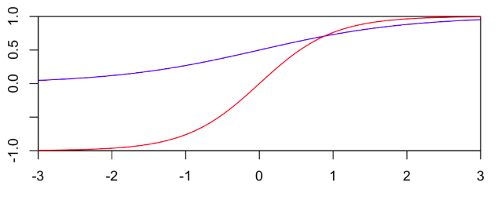

-   sigmod的值的变化区间是[0,1],梯度较小.
-   tanh的值变化区间[-1,1]之间,且趋近与-1和1的方式更接近人的大脑神经传播规律.当采用sigmod,最后的值接近于0时,容易出现梯度消失.下面是详细解释,还不是很清楚??
-   Bengio has a paper on using sigmoids vs tanh in the context of a DNN. The sigmoid activation function has the potential problem that it saturates at zero and one while tanh saturates at plus and minus one. So if the activity in the network during training is close to zero then the gradient for the sigmoid activation function may go to zero (this is called "the vanishing gradient problem").

sigmod族的函数,循环网络,概率模型,和一些不能用分段函数表达特殊需求的autoencoder的时候才会用才会用.

----

>   这一节是很复杂的,我有几个问题??
>
>   -   sigmod和ReLU完全是两个不同性质的函数,一个无上限有下限,一个有上限有下限.这两个为什么都可以作为隐含层单元呢?根本不是一个性质的东西好不好
>   -   为什么说LeRU优于sigmod?
>   -   激活函数的目标到底是什么?
>
>   ----吃个晚饭之后想通了上面的问题---
>
>   首先看第三个问题,
>
>   -   激活函数的目的到底是什么?
>
>       答案很明确,为了实现非线性,因为如果是线性单元,那么不论多少层的网络也只是一个线性变换而已.
>
>   -   为什么说LeRU优于sigmod?
>
>       解答这个问题的同时,也可以解决第一个问题.
>
>       因为三点.
>
>       -   sigmod容易陷入梯度消失.即使我们可以用负似然对数作loss函数,来减缓梯度下降.但是这个loss只能抵消掉output层的梯度消失.在多层的情况下,是无法抵消的.
>       -   ReLU屏蔽了一部分的结果.如上面讲过的,ReLU在输入小于0的情况下梯度为0,这就意味着,当在某一次训练中输入为0的时候,这个单元在这一次训练中便失去了意义.这就实现了连接的稀疏性,使得参数与参数之间的相关性降低??,缓解了过拟合问题的发生
>       -   sigmod函数求导的计算量大.
>
>       因此可以说,ReLU中的左半部分的意义有两个,一是实现了非线性,二是实现了稀疏性,降低了过拟合的风险.

----

#### 6.3.3 Other Hidden Units

其实,hidden unit并不是只有这些,所有非线性函数都可以作为hidden unit,要根据实际问题去判断,例如书中举例,在MNIST的一个模型中,实验证明, $h=cos(W^Tx+b)$ 的效果甚至要比传统的激活函数要好.下面举出一些例子,举出所有是不切实际的.

-   **liner:**

    这里的线性不是只整个网络都是线性的,而是让一部分layer是线性的.其实一个线性加一个非线性就相当于一个非线性,证明如下:

    一个只有一层非线性的: 		$h=g(W^Tx+b)$

    一个线性加一个非线性:		$h=g(V^TU^Tx+b)$

    那么为什么还要这样呢?答,为了节省参数.

    设第一个单层的输出有p个,输入为n维,那么参数总量就是 np.

    设第二个第一层的输出有q个,第二层非线性的输出和上面的一致,设为p个,那么参数总量是(n+p)q

    当q较小的时候,就节省了相当多的参数.

    It comes at the cost of constraining the linear transformation to be low rank, but these low-rank relationships are often sufficient.

-   **softmax:**

    Softmax

    Softmax units naturally represent a probability distribution over a discrete variable with k possible values, so they may be used as a kind of switch. These kinds of hidden units are usually only used in more advanced architectures that explicitly learn to manipulate memory.

    softmax进行的操作更像是一个switch,他和上面那些不同的是

    -   上面那些

        每个输入经过单元输出的值仅仅和,输入自身和输出单元参数有关.即:

        ​				$output_i = f(z_i,\theta)$

    -   softmax

        每个输入经过单元输出的值不仅和,输入自身和输出单元参数有关,还和同时输入到这个单元的其他输入有关.即:

        ​				$output_i = f(z_1,...z_i,...z_m,\theta)$

        上面的那段英文的意思是说,这个在更高级的构架中可以操控记忆,很吊的样子.详见10.12

-   **Radial basis function(RBF)径向基**

    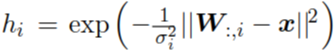

    This function becomes more active as x approaches a template W:,i. Because it saturates to 0 for most x, it can be difficult to optimize

-   **Softplus:**

    $g(a) =ζ(a) =log(1+e^a)$

    是ReLU的soft版.效果不好.我们的直觉是,通过softplus使得其相比于ReLU的处处可维,且不完全饱和的性质,提高效果,但是实际上不行

-   **Hard tanh:**

    ​						$g(a) =max(−1, min(1, a))$

    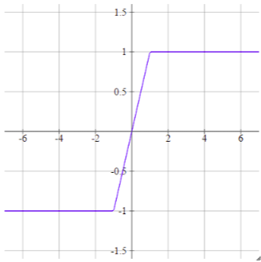

### 6.4 Architecture Design

The word architecture refers to the overall structure of the network: 

**how many units it should have and how these units should be connected to each other**

**有多少单元且单元直接如何链接.**

层和层之间是通过chain法则链接在一起的.

$h^{(1)} = g^{(1)}(W^{(1)T}x+b^{(1)})$ 		$h^{(2)} = g^{(2)}(W^{(2)T}h^{(1)}+b^{(2)})$

调整模型架构就是调整层数和每层的单元数.其实一层的神经网络就可以解决很多问题,而深层网络的每一层拥有更少的单元以及更少的参数.我们需要凭借经验在验证集上确定合适的构架.

#### 6.4.1 Universal Approximation Properties and Depth

全局逼近性质和深度

-   **全局逼近性**

    前向神经网络提供了一个全局逼近性的算法,他可以实现从一个有限维度到另一个有限维度的Borel measurable function的映射的逼近.

    >    Borel measurable function:
    >
    >    it suffices to say here that any continuous function on a closed and bounded subset of $\mathbb{R}^n$ is Borel measurable and therefore may be approximated by a neural network

    (全局逼近性的具体定义看下面的灰方框)

    当然,离散的映射function也可以通过BP神经网络逼近.

    我们之前使用的unit的形式是,在任意大或者任意小的时候,unit]饱和.后来使用了ReLU,不一样了

-   **单层网络的局限性**

    已经有人证明,只使用一层隐含层,但是当隐含层的unit足够多时,是可以实现逼近任意函数的.但是这个隐含层会特别大以至于无法训练.通过使用多层网络可以减少unit数量和泛化错误.

    拿分类距离,如果每个单元都是一个{0,1}分类器,那么分出给一个物体分清n个特征,比如说对于一个两个特征的分类问题 *人:{是否男,是否白人}*,就有 $2^2$ 种状态.也就是需要 4 个隐含层unit.

    即,在最差的情况下,对于{0,1}分类器而言,分辨出n个特征,优化算法的复杂度是 $O(2^n)$.

    但是使用深度网络的化,就像二叉树一样,只需要n层,也就是说算法的复杂度是 $O(2)$.

-   **多项式族单元函数:**

    上面举的例子是{0,1},这个函数基本不会是用,我们经常使用的是ReLU族函数,也就是多项式函数的一种.下面通过对比上面的**基于{0,1}的n特征分类问题** 和 **基于ReLU的函数逼近问题**来理解这个概念:

    |                  |     基于{0,1}的n特征分类问题     |              基于ReLU的函数逼近问题               |
    | :--------------: | :---------------------: | :--------------------------------------: |
    |    unit func     |        $f={0,1}$        |               $f=max(0,x)$               |
    |       解决问题       |          n特征分类          |                    函数                    |
    |        实质        |      每个f的输出代表一个类别       |              见上面6.3.1的详细解释               |
    | shallow network下 |     需要 $2^n$ 个隐含单元      |         需要 $2^{\alpha n}$ 个隐含单元          |
    |  depth network下  | 需要n层,每层一个隐含单元,可以用二叉树去理解 | 需要$\beta*n$层,每层需要$\eta*n$个隐含单元.可以理解为,下面那样. |

    >   depth network下的,基于ReLU的函数逼近问题的理解:
    >
    >   每层先将待模拟函数分解为$\eta_1*n$粗糙的线性函数组合成的函数,接下来在下一层中,再对每一个小部分再进行分割为$\eta_2*n$.
    >
    >   这里的$\eta_1 \eta_2$的值是由每层被激活的unit数决定的.
    >
    >   直观如下图:
    >
    >   

    **the number of linear regions carved out by a deep rectifier network**

    如何计算去拟合实际函数的线性分段函数的数量:

    -   对于d维输入,l层网络,每层n个unit的ReLU网络而言,其量级是:

        

    -   对于l层,每个unit k个filiter的maxout网络来说:

        

    这些都只是一个理论值,不能保证一定出现.

-   **结论**

    更深层网络往往能够取得较好的结果.	下面是证明这个结果的一个实验:

    

---

>   全局逼近性:
>
>   当网络的一个或多个可调参数（权值或阈值）对任何一个输出都有影响时，这样的网络称为全局逼近网络.由于对于每次输入，网络上的每一个权值都要调整，从而导致全局逼近网络的学习速度很慢。BP网络就是一个典型的例子。
>
>   局部逼近性:
>
>   如果对于输入空间的某个局部区域只有少数几个连接权值影响输出，则该网络称为局部逼近网络。常见的局部逼近网络有RBF网络、小脑模型（CMAC）网络、B样条网络等。

---

---

>   RBF网络(径向基神经网络):
>
>   -   **定义**
>
>       由两个部分组成,一个是自监督,一个是监督.具体解释链接如下,[链接1](https://www.cnblogs.com/zhangchaoyang/articles/2591663.html),[链接2](https://www.zhihu.com/question/44328472)
>       -   首先,将输入数据通过聚类算法得到k个中心点 $(\phi_1,...,\phi_k)$ .如下图中的蓝色点.
>       -   将隐含层设计为k个隐含单元,并且每个单元是以中心点和输入数据为自变量的径向基函数.这个过程是BP网络.就是网络的结果比较特殊
>
>       聚类算法图:
>
>       
>
>       RBF网络大致图如下,(这里的p是指样本数):
>
>       
>
>       其中径向基函数是:　$exp[-(b(x-\phi_i))^{2}]$ 
>
>       由此可见,这相当于,根据输入的类别的不同,而对不同的神经元进行不同程度的训练,距离样本中心点近的,那这次训练就集中训练这个样本中心点所在的神经元.这也就对应了上面提到的局部逼近性.
>
>
>   -   **优点**
>
>       一个神经元，只负责对某一块进行响应。速度当然快得多. 
>
>       **大脑里的神经元就是这么工作的。你闻到花香的时候，不会刺激到感受辣味的神经元。**

----

#### 6.4.2 Other Architectural Considerations

上面只讨论了最一般的问题,实际网络的结构非常多样.

-   例如处理视觉任务的卷积网络和除了序列问题的循环网络.
-   skip connection,第 i 层的unit直接连到 i+2 甚至更高层,使得第i层对梯度变化反应更强.
-   dropout,dropout可以节省参数和计算性能.在卷及网络处理视觉问题是(c9),就使用了稀疏网络.

### 6.5 Back-Propagation and Other Differentiation Algorithms

-   一些概念:

    -   forward propagation:...

    -   back-propagation:

        利用loss回溯网络.back-propagation

        这里有几个容易发生歧义的概念.后向传播其实指的只是计算梯度的算法.而其他的什么随机梯度下降之类的就只是用到了back-propagation而已.

        但是关于back-propagation的难点是,我们要定义一个可以求出任意函数 $f(x,\theta)$ 关于 $\theta$的导数的方法.这里的x是输入, $\theta$ 是参数. 这里的 $f(x,\theta)$ 是损失函数.不过有的时候,还会要求除了参数之外的一些导数.

        下面开始具体讨论方法,这里先规定好对象,即:

        We restrict our description here to the most commonly used case, where f has a single output. $f(x,\theta)$ 只有一个输出变量.

#### 6.5.1 Computational Graphs

这里采用计算图去描述问题.计算图的由来见[链接](https://www.leiphone.com/news/201701/DZeAwe2qgx8JhbU8.html)

----

>   计算图的由来:
>
>   随着技术的不断演进，加上脚本语言和低级语言各自不同的特点（概括地说，脚本语言建模方便但执行缓慢，低级语言则正好相反），因此业界逐渐形成了这样的一种开发框架：前端用Python等脚本语言建模，后端用C++等低级语言执行，以此综合了两者的优点。可以看到，这种开发框架大大降低了传统框架做跨设备计算时的代码耦合度，也避免了每次后端变动都需要修改前端的维护开销。而这里，在前端和后端之间起到关键耦合作用的就是计算图。
>
>   将计算图作为前后端之间的中间表示（Intermediate  Representations）可以带来良好的交互性，开发者可以将Tensor对象作为数据结构，函数/方法作为操作类型，将特定的操作类型应用于特定的数据结构，从而定义出类似MATLAB的强大建模语言。

---

这里其实用到了类似于tensorflow里面的结构.**变量**作为节点存在,**操作(operation)**作为连接node的存在,这里的operation都是比较简单的操作,一些复杂的操作可以通过简单操作的组合实现.

我们规定,为了便于理解output只能有一个输出变量(可以为多维).

下面就是图示:

#### 6.5.2 Chain Rule of Calculus

>   定义张量:
>
>   几何代数中定义的张量是基于向量和矩阵的推广.俗一点理解的话，我们可以将标量视为零阶张量，矢量视为一阶张量，那么矩阵就是二阶张量。也就是多维矩阵.

现在以一个例子来说明.

$y=g(x)$ and $z=f(y)$ 其中,$x \in \mathbb{R}^m$ and $y \in \mathbb{R}^n$

也就是:

这里的 $\frac{∂y}{∂x}$ 就是一个 n*m 的 Jacobian matrix of g.

同样可以将上面的基于一维向量的算法推广到张量. 设为 $X$.设 $i$ 为其中标量的索引.

那么对于$Y=g(X)$ and $z=f(Y)$ 而言:

####  6.5.3 Recursively Applying the Chain Rule to Obtain Backprop

循环利用链式法则去进行后向传播.这一节讨论计算机在实现backprop时的主要原理和一些小问题:

-   **重复计算:**

    **两个概念:**

    -   expression:是指从计算图中的某个node到输出变量的函数.
    -   sunpression:在expression里面的子公式.

    经常在一个公式里会有很多子公式,其中有些是重复(repeat)的.例如下图:

    

    **公式的推导如下:**

    

    这个里面,我们可以看到,可以把含有y,x的函数全部转换为有w的函数,那么如果可以省去这些x,y的计算,节省的时间便会指数上升,因为这里是一条线的计算图,但是实际上每个节点之后都会有很多节点.这个方法**避免了recomputing**.

    这是一个计算时间与计算内存的优化问题.初次之外还有两种观点:

    -   通过简化计算图来节约
    -   一部分的节点可以不采用 store 进内存的方式,而采用recomputing,实现时间和内存的平衡.

-   **前向传播的算法**

    

    **解释:**

    这个里面有n个节点(没按层次分,就是从上到下的计数.)

    ${u^{(1)},...,u^{(n_i)}}$ 是输入层的节点.然后 $u^{(n)}$ 是输出节点.

    $Pa(u^{(i)})$ 是 $u^{(i)}$ 的所有父母节点.也就是直接导致  $u^{(i)}$ 的节点.

    那么, $\mathbb{A}^{(i)}$ 就是与 $u^{(i)}$ 相连的所有父节点的结合.那么,这个节点的值就是靠:

    ​						$u^{(i)} = f(\mathbb{A}^{(i)})$ 

-   **后向传播的算法(标量)**

    算法如下.

    为了简单起见每个node都是标量,这个公式中没有明确构造计算梯度的公式,这些算法见6.5.6,并且会将其推广到tensor:

    

    **解释**

    其实后向传播算法本质上是将前向算法的计算图 $\mathcal{G}$ 倒转方向之后生成了一个新的计算图 $\mathcal{B}$ .

    $\mathcal{B}$ 将 $\mathcal{G}$ 的node全部复制,不过将node之间的连接的计算符换成了,导数计算符,比如说,

    **The edge from $u(j)$ to $u(i)$ is associated with the computation of $∂u(i)/∂u(j)$.**

    并且互相连接的node之间有 dot 乘法.除此之外还有加法.都在下面这个公式里面:

    

-   **后向传播的算法(张量)**

    首先我们要清楚为什么要使用张量,具体见下面这个[链接](https://www.leiphone.com/news/201701/DZeAwe2qgx8JhbU8.html),更加数学的见这个[链接](https://www.zhihu.com/question/20695804)

    简单来说就是为了提高计算能力,提升硬件的使用效率.下面来简要介绍:

    ----

    >   张量与深度学习
    >
    >   上面也简要介绍过了,张量就是多维标量.举个例子,三个通道的图像就是一个三阶张量.三个维度分别是图片的高度、宽度和色彩数据.
    >
    >   而随着GPU等等的技术,我们有了同时处理多维数据的能力,这也是我们使用张量,而不是标量向量作为处理基本单位的原因.可以提高硬件利用率
    >
    >   下面是一个针对张量的计算图示:
    >
    >   

    ---

    我们之前说过,我们希望避免recomputing(见本小节开始处)的方式去节省计算时间,但是会占用内存.

    具体的算法细节见之后的小节.

#### 6.5.4 Back-Propagation Computation in Fully Connected MLP

这里讲计算带入实际网络-全连接深层神经网络.

需要说明的是,这里的两个算法不具有通用性.下面会在6.5.6节描述更广义的backprop,使用来解决计算图模型的通用算法,而不是想下面这个一样,只能解决一种网络模型.

-   **前向传播算法**:

    这个很简单就不多说了,就是有一个符号需要标注一下, 

    $h^{(l)}$ : 第l层的输出的张量.

    注意到了,这里的全是张量计算,一层只需一要一次迭代便可以计算出全部的数值.

    

-   **后向传播算法:**

    

    符号注释:

    $\alpha^{(k)}:$ 第k层的激活单元的内部的 $ W^{(k)T}x+b^{(k)}$ ,是该层的 $ W^{(k)T}x+b^{(k)}$ 的值.

    $f():$  非线性函数.

    $h^{(k)}:$ 第k层的激活单元的值(不是函数,是一个值).

    这个算法比较麻烦稍微注释一下:

    从循环里面开始:

    1.  对非线性函数进行求导:$g$ 是上一层的梯度, $f'(\alpha^{(k)})$ 是该激活函数的导数值.得出了 $g$ ,这是整个非线性单元的梯度变化, 即 $g=f'(\alpha^{(k)})=\partial{f(W^Tx+b)}$,简单记为 $\partial{f}$.

    2.  对非线性函数内部的线性函数进行求导:即对 $W^Tx+b$ 中的 $W$ 和 $b$ 进行求导.

        需要注意的是,在对 $W$ 进行求导的时候用到了下一层的非线性函数的值,既是k层的 $x$ ,又是 $k-1$ 层的 $f(\alpha^{(k-1)}) \to f(W^Tx^{(k-1)}+b)$ 的值,也就是 $h^{(k-1)}$.

        公式为:

        $\partial{f} /\partial{b} =  \partial{f} /\partial{\alpha} \cdot  \partial{\alpha}/ \partial{b} + Regular=b^{(k)}+Regular$

        $\partial{f} /\partial{W} = \partial{f} /\partial{\alpha} \cdot  \partial{\alpha}/ \partial{W}  + Regluar =g \cdot h^{(k-1)T} +Regular$

    3.  在对本层的 $W^Tx+b$ 中的 $x$  进行求导的时候,得到了

        $\partial{f} /\partial{x} = \partial{f} /\partial{\alpha} \cdot  \partial{\alpha}/ \partial{x}  + Regular = W^{(k)T} \cdot g$

        ​

#### 6.5.5 Symbol-to-Symbol Derivatives

-   **symbol-to-number differentiation:**

    上面的那四个算法(两套算法)都是,先设置一个前向传播计算图,没有后向传播计算图.后向传播的实现,是通过一步一步带入实际的值(在前向传播过程中计算得到的)来计算.最后返回的是一组梯度数据.Torch和Caffe采用的这种算法.这个叫做**symbol-to-number differentiation:**

-   **symbol-to-symbol differentiation:**

    这种算法是,不需要带入实际数据,前向计算图和后向计算图都已经实现预备好了.

    如下图:

    

    We will use the latter approach and describe the back-propagation algorithm in terms of constructing a computational graph for the derivatives.

    这就是我们要下面仔细讲的.

    主要优点是:**导数的计算变成了和原始表达(前向的计算图)一样的方式**

-   **两者的区别?**

    两者其实没啥区别,区别更多的是软件结构意义上的,symbol-to-number differentiation可以理解为运行了symbol-to-symbol differentiation中生成的计算图的计算.

-   **计算方法预告:**

    害怕一会回家忘了,关于计算机是如何实现微分的,下面两个链接说的比较好:

    [链接1](https://www.zhihu.com/question/48356514/answer/123290631),[链接2](http://blog.csdn.net/aws3217150/article/details/70214422)

    简单而言我的理解是,会一开始想程序输入一些基础的求导法则,之后只需要链式推理?

#### 6.5.6 General Back-Propagation

首先要记住的是,虽然我们处理的是神经网络问题,也就是unit是神经元.

但是我们在进行后向传播的过程中处理的基本单位是计算图,计算图的一个特点是,具有确定性.因此unit是计算图中的node.这个是直观定义上的.下面通过几个函数来感受一下,计算图中的节点:

-   get_operation(V):

    获得生成节点V的操作,这个操作我们的理解,是只能有一个的,因为生成一个变量的计算公式在一个程序中只能有一个.这个操作有可能会会到其他变量,比如乘法 A*B=V.

-   get_consumers(V, G):

    获得在计算图中使用到V计算的单元.

-   get_inputs(V, G):

    获得在计算图中为了计算V而使用的单元.若操作需要多个变量的情况下,将会有多个变量可以通过这个函数得到.这些单元也是固定且相互有联系的,通过get_operation(V)联系在一起.

-    op.bprop(inputs, X, C):

    这里的op就是我们之前通过get_operation(V)得到的.

    inputs是,这个操作,也就是计算V所需要的所有节点,而X是这个偏导所需要求的变量.

    C是其子节点的已经计算好的偏导数.

    比如说,设 $V=X*Y$ 而 $Z=f(V)$,那么这里的input就是 $(X,Y)$, C就是 $\partial(Z)/\partial(V)$.

    那么 $\partial(Z)/\partial(X) = \partial(Z)/\partial(V) * \partial(V)/\partial(X) = Y*C$

-   需要注意的是,这里的处理都是张量处理.

后向传播算法采用的是直接通过定义operation的backprop算法来进行的计算.

也就是说对于每个,operation都有一个对应的backprop.

还会采用dynamic programming(动态规划)

---

>   把多阶段过程转化为一系列单阶段问题，利用各阶段之间的关系，逐个求解，创立了解决这类过程优化问题的新方法——动态规划

---

在最差的情况下,拥有n个node的节点,其运算复杂度在 $O(n^2)$ ,计算图是一个有向无环图.

从第n层节点到第n+k层节点,之间的复杂度是 $O(e^k)$ .因此,这里采用储存上一级和下一级之间的偏导数最为矩阵的方式就是计算.

也就是说,在计算 $\partial(n^i)/\partial((n+k)^j)$ 时,只需要按照偏导矩阵,这两个点之间的不同路径之间的偏导相乘,路径之间相加就可以了.

#### 6.5.7 Example: Back-Propagation for MLP Training

这一节,用一个三层的最简单的MLP,采用minibatch下降法的模型,来进行了演示,

其中第一层是:

​		 $y=max\{W^{(1)T}X\}$

第二层为:

​		$y=W^{(2)T}X$

计算图如下:

比较简单,就不多说啥了.

-   **算法复杂度**:

    无论是前向还是后向,都是 $O(w)$ 的复杂度,这里的 $w$ 是参数的个数.前向里面,矩阵乘法费时,后向里面,矩阵求逆费时.

    在内存上,由于对于每个数据都需要储存隐藏单元的值,这些值需要在前向传播中计算,储存到后向传播计算到那个单元为止,复杂度为 $O(mn_h)$ 其中, m 是minibatch里数据点的个数, $n_h$ 是隐藏单元的个数.

#### 6.5.8 Complications

介绍了一些在实际应用中会遇到的问题:

-   需要在一次计算中返回两个output
-   节省内存,比如利用buffer进行多次矩阵加法
-   数据类型问题

#### 6.5.9 Differentiation outside the Deep Learning Community

-   **automatic differentiation**

    我们上面提到的求导方法只是automatic differentiation的一种,叫做 **reverse mode accumulation.** (反向模式积累,那有没有正向呢?补充,有,见下面)

    还有其他方法.上面使用的这个方法的一个缺点是:

    无法简化一些组合运算,一些可能需要经过指数,加法,乘法的混合运算的单元,在求导时,需要很复杂.但是,组合起来之后,整体计算的导数只有一个简单的减法,(具体见书里面.P218).

-   **计算复杂度**

    后向计算的次数可以保证和前向是一样的(应该可以小于吧?补充:下面提到了,确实可以),因为每个偏导数在被记住后就不需要迭代地去计算了.只需要将上层和下层的相乘,路径之间相加即可.计算复杂度为 $O(edges)$

    通但是这个时间是可以被简化的,这是一个NP-完全问题,在tf以及theano里面都有类似实现,即通过对计算图的unit进行运算匹配找到可以简化的项.

-   **forward model accumulation**

    我们到目前位置一直讨论的是只有一个输出的问题,那么,在这种情况下,当然是从上到下,也就是反向积累的算法效率更高.这里的积累,可以看作是层与层之间的乘法.这个时候的网络可以看作是一个正三角形.当然是从上到下计算,并在计算过程中储存效率高.

    但是,当输出的维度比输入还要大时,也就是可以想象此时的网络是一个倒三角的时候,那么从上到下就会消耗很大,这个时候就要用 **forward model accumulation**

#### 6.5.10 Higher-Order Derivatives

高阶导数

-   在Theano and TensorFlow中,存在计算高阶导数的方法.他们采用的是符号微分机制.在深度学习中,我们多利用Hessian矩阵.Hessian矩阵的复杂度是 $O(n^2)$.这里的 n 是参数的数量,而在深度网络中,参数是上亿的,因此仅仅是Hessian矩阵的表示就是不可行的.

-   **Krylov methods:**

    Krylov methods可以解决上面这个问题.他可以通过迭代的使用矩阵向量乘法,实现矩阵求逆,以及求矩阵的特征值特征向量等等.

    还有一些细节,不多做阐述.详见P220

### 6.6 Historical Notes

....