## Chapter7 Regularization for Deep Learning

### 7.0. Introduction

-   **什么是 regularization?**

    定义是:

    any modification we make to a learning algorithm that is intended to reduce its generalization error but not its training error.

    也就是减少test error,但是与此但同时会增加 training error.

-   **regularization strategy**

    可以是向目标函数加一个项,也可以是向模型中加入一些限制.还有向模型中加入几个假设的(其实就是先验知识),还有ensemble methods方法.

    有的模型,我们是需要根据先验知识去制定正则化规则的,但是对于一些稍微简单的模型,我们通常采用更通用的方法.

-   **regularization estimators**

    正则化估计量是指,在5.4节提出的概念,即,正则化的'标准',即评测 "什么程度的正则化是合适的?"的时候的依据,就是样本的估计量.

    >   点估计（point estimation）是用样本统计量来估计总体参数，因为样本统计量为数轴上某一点值，估计的结果也以一个点的数值表示，所以称为点估计。

    参与评价的变量有两个,一个是bias ,一个是variance.两者与training error ,即泛化误差的关系如下:

    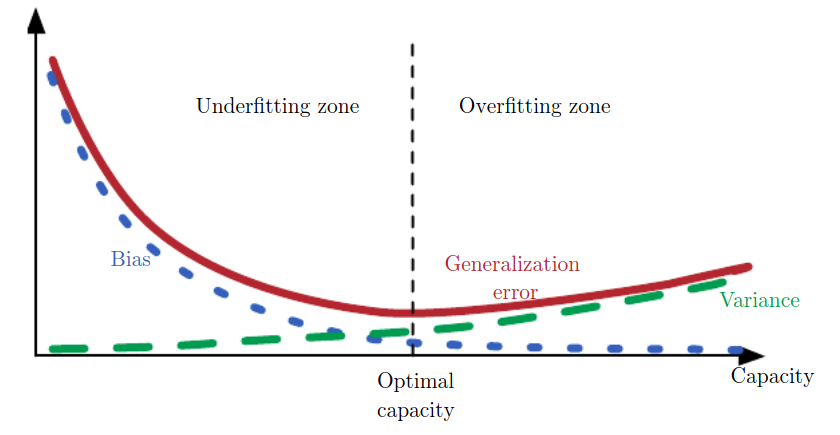

    书中提到,模型的训练共有三种模式:

    1.  excluded the true data-generating process—corresponding to underfitting and inducing bias. ---- 可以理解为欠拟合状态,无法模拟真实数据的生成过程

    2.  matched the true data-generating process ---- 最佳拟合,我们想要的状态

    3.  included the generating process but also many other possible generating processes—the overfitting regime where variance rather than bias dominates the estimation error

        ---- 对应着过拟合,数据生成过程中包含着真实过程,但是还包含着其他的(噪音).

    而正则化的目的就是实现从**模式三**到**模式一**的转变.

-   **深度学习并不是万能的?**

    In practice, an overly complex model family does not necessarily include the target function or the true data-generating process, or even a close approximation of either.

    实际上,一个过于复杂的模型不一定能够模拟出数据的真实分布情况,甚至不能接近真实的.??

    >   这个地方有点疑问，深度网络不是理论上能够模拟任何函数嘛？

    Most applications of deep learning algorithms, however, are to domains where the true data-generating process is almost certainly outside the model family.

    深度学习模型适用于复杂的系统,比如说图像,文字等等.在我们使用他去解决一些其他问题是,也许不是最好的.

    也就是说：

    **一味地通过增大模型和参数量是不可行的,我们要找到适合问题的模型结构,最好的fitting model应该是一个可以合适地进行正则化的大的模型**

下面来看,如何创造一个大的,深度正则化模型.

这一章有点难啊,东西太多了,有十四个小节.

### 7.1 Parameter Norm Penalties

-   公式如下:

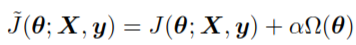

-   适用问题:

    可以适用于线性回归,逻辑回归,神经网络等等.

-   $\alpha$ 的问题:

    值越大,正则化程度越深.在不同层次的layer里面的 $\alpha$ 值往往是不同的.但是由于确定每层的 $\alpha$ 这个超参数过于复杂,也可以使用一致的.

-   $Ω(\theta)$ 的问题:

    这里不一定要使用到所有的参数,可以根据偏好,即根据设计目标,定义为全体参数的某个子集.

    并且,**很重要的一点是,**在$Ω(\theta)$ 里面,我们通常只采用仿射函数中的 $W$ 作为正则参数,而不是用 $b$.原因如下:

    -   从结果上看:

        regularizing the bias parameters can introduce a significant amount of underfitting.

    -   从理论上分析:

         The biases typically require less data than the weights to fit accurately. $W$ 中蕴含着很多重要的信息,包含两个变量之间的联系,以及变量在各种情况下的变化情况等等,而 $b$ 却只是一个偏差值而已.

下面来讨论不同 $Ω(\theta)$ 对模型的影响.

### 7.2 Norm Penalties as Constrained Optimization

-   **约束优化:**

    这一小节主要对于,加了正则项的损失函数是如何得来的?这个问题加以解释说明.

    是 约束优化加KKT加拉格朗日.关于拉格朗日的具体推导,见[note:Lagrangian]

    大致过程如下:

    原来的约束问题可以转化为:

    

    之后解决:

    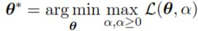

    就相当于解决了最优化问题,这个式子也就是我们提到的.:

    

    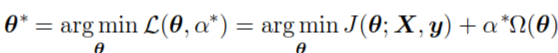

    ​

#### 7.1.1 L2 Regularization

##### 7.1.1.1 Shinrk of parameter 

**正则化参与梯度下降的过程:**

设目标函数为$f(x)$,设不加正则项的损失函数为 $J(w;X,y)$ , 设加正则项的损失函数为 $\tilde{J}(w;X,y)$. 其中 $w$ 为参数集合.且:

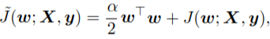

那么,损失函数关于 $w$ 的导数为:

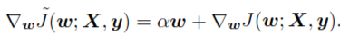

按照梯度下降法来看,其效果就是:

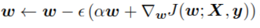

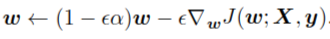

这意味着,在每次训练的迭代中, $w$ 都会'shrink'.那么这个意味着什么呢?

##### 7.1.1.2 Effect of L2

**理解正则项可以优化梯度下降的原因(理论推导):**

-   **先看不加正则项的情况:**

    -   几个假设条件:

        -   **假设训练集中的数据都是根据理想分布生成**
        -   假设真实分布的参数为 $w_1^*,w_2^*$ , 简单记为 $w^*$ .
        -   假设,目标函数的可以用二项曲线逼近.

    - 损失函数公式:

        $J(w;X,y) = J(w) = J(w^*+w-w^*)  \approx J(w^*) +1/2(w-w^*)^TH(w-w^*)$

        其中, $J(w^*)=0$

    -   Hessian特征分解:

        这里的H是 $f(x)$ 关于 $w$ 的二阶导数矩阵,即将 $w$ 与 $w^*$ 的曲面假设为二项曲面.由于 $w^*$ 是局部最小值,因此一阶导数为0,所以只有二阶导数.

        接下来将,H进行特征分解.

        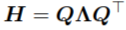

        由Hessian矩阵的性质可知, $Q$ 为单位正交矩阵.

        那么,上面的 $J(w;X,y)$ 则变成了,

        $J(w) \approx f(w^*) +1/2(w-w^*)^TQ^T\Lambda Q^{-1}(w-w^*)$

        ​		$=f(w^*) +1/2[Q(w-w^*)]^T\Lambda [Q(w-w^*)$

        其中, $Q(w-w^*)$ 代表的是将真实差距进行特征向量空间的线性转换.

    -   偏移量为特征向量的**极端情况:**

        设想在极端情况下, $w-w^* = d_i$ ,其中 $d_i$ 是 $Q$ 中的特征向量,对应的特征值为 $\lambda_i$.

        注意,其中的 $d_i$ 为单位向量,也就是说,

        $J(w)=[Q(w-w^*)]^T\Lambda [Q(w-w^*)] = \lambda_i||d_i||_2^2 = \lambda_i$  

    -   一般情况

        假设,$w-w^* = \alpha_1d_1+,...,+\alpha_nd_n$

        那么, $J(w)=\alpha_1\lambda_1+,...,\alpha_n\lambda_n$

        也就是说, $J(w) \propto \lambda$

        **也就是说,即使 $w$ 在 $\mathbb{R}^n$ 上降低的距离相同,不同方向上的梯度下降,error减小的值也是不一样的.函数在大特征值对应特征向量方向所在的梯度下降大,反之下降小**,这个和之前说到的最速和牛顿法有关系

    -   启示:

        我们要使得,特征值小的,也就是减轻,对error变化不敏感的方向的变化幅度.**我认为这样做的原因是,为了弥补,"训练集数据都是由理想分布生成的数据"这一假设,因为这个假设会在原始空间的每个维度造成微量误差.即使后来又对这个原始空间的梯度进行了乘以Q的操作,但是由于Q是单位正交矩阵,所以即使转换后,每个特征向量(单位向量)上的误差也是相等的**.也就是说我们需要一个方法使得:

        1.  在梯度较大的方向,可以忽略误差
        2.  在梯度较小的方向,认为误差是这个方向梯度变化的主要原因,要忽视这个梯度.

        **也就是!!!我们要通过某种方法,利用到这种特性,来防止过拟合.!!!**

-   **在加正则项的情况下:**

    -   公式推导:

        其中 $w^*$ 代表的是最优点.

        $\tilde{J}(\tilde{w}) = J(\tilde{w}) + 1/2||\tilde{w}||_2^2=J(w^*+(\tilde{w}-w^*)) + 1/2||\tilde{w}||_2^2$

        ​	$\approx J(w^*) +1/2(\tilde{w}-w^*)^TH(\tilde{w}-w^*)+1/2||\tilde{w}||_2^2$

        因为我们的目的是: $min_{\tilde{w}}J(\tilde{w})$

        所以,接下来对 $\tilde{w}$ 求导:

        $\tilde{J}'(\tilde{w}) = H(\tilde{w}-w^*)+\alpha\tilde{w}$

        我们希望, $J'(\tilde{w})=0$ ,也就是

        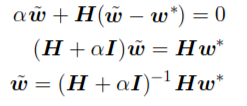

        再进行特征分解:

        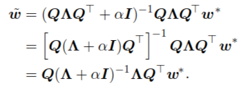

        会发现,这里相当于,把 $w^*$ 在每个 $H$ 的特征向量上,进行了一个这样的操作:

        1.  先把 $w^*$ 分解到特征向量的空间

        2.  然后改变每个特征向量对应的特征向量为 $\lambda/(\lambda+\alpha)$.

        3.  那么,对于主要的特征向量而言,这个维度的信息不会怎么变(这个方向认为是含有较少的训练集自带的误差);但对于 $\lambda$ 较小的特征向量,就会忽视这个方向的影响(这个方向认为是含有较多的训练集自带的误差)

            >   这里的误差是什么?就是数据本身偏离真实数据分布的误差,现在只考虑batch梯度下降下的情况,即使是使用全部的数据集信息,也不能保证训练集数据的拟合是符合真实的数据分布的.这就是误差.因为我们每次训练是假设喂给模型的数据是完全符合真实数据分布的,这是一个错误的假设.

        4.  该方法实现了我们在不加正则化情况下的希望,最后实现了,防止过拟合.

-   **理解正则项的影响(实际过程)**

    上面在推导的过程中就有一个疑问,在计算目标 $\tilde{w}$ 的时候,我们用到了理想参数.但是在实际中怎么解决呢?

    答,不用解决.因为我们只要最初的公式一致,即:

    

    后面的无论是 **理论推导:凭借假设和线代**  还是 **实际应用:凭借梯度下降**  都只是殊途同归而已.

    L2 regularization使得方差点估计的方差变小.

##### 7.1.1.3 Thought about L2 rate

现在考虑的随着训练的进行,惩罚项参数应该怎么变的问题.

回顾分析L2正则时候的数学公式:

即改变每个特征向量对应的特征向量为 $\lambda/(\lambda+\alpha)$.这个过程就是将小特征值对应的特征向量对梯度的影响缩小化的过程,目的是为了减小采样数据误差对训练的影响.在这里我们把误差对模型的影响用数学来描述就是,设 error effect 为 E:

​						$E \propto \sum_i\alpha/(\lambda_i+\alpha)$

随着训练的进行,越来越靠近中心,无论是采取最速下降法还是牛顿法.这个时候的梯度值是下降了的.

**但是,即使梯度值下降,Hessian各个特征向量的特征值是不会变小的.因为Hessian矩阵反映的是曲率信息,不是下降速度信息,在一个二次曲面中,Hessian矩阵的值甚至是处处相等的,因此惩罚项参数不需要变化**

#### 7.1.2 L1 Regularization

-   **用图形去理解L1和L2的区别**

    ​			$\tilde{J}(\tilde{w}) = J(\tilde{w}) + \Omega(w)$

    通过这个式子我们可以知道,加正则项的式子,归根到底是保持 $J(\tilde{w})$ 项和 $\Omega(w)$ 项的平衡.

    L2的正则,用图表示如下(二维参数的一个例子):

    >   需要注意的一点是,$e_2$ 所在的是个椭圆,这个不是一个特殊情况,因为Hessian矩阵特征分解后的特征向量矩阵为单位正交矩阵,因此为椭圆,不同轴的长度由其轴所在的特征向量对应的特征值决定.

    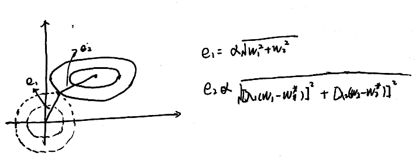

    可以看出,总的error就是 $e_1+e_2$.

    L2的一个特点是,正则项的值为圆的边界,边界上的点目标函数触碰的概率,在不考虑目标函数(error) 的情况下,是处处相等的.而,L1,是个这样的图形:

    

    因为正则项是正方向的边界,因此定点先触碰到目标函数的概率比较大.也就是说更倾向于一些参数值为0.也就是实现了参数的稀疏化.详见 [note:regularization]

-   **稀疏化的数学分析**

    -   **通用表示**

        正则化误差公式的表达式为:

        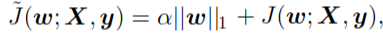

        其中正则项为:

        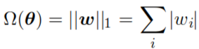

        对其进行关于参数的求导得:

        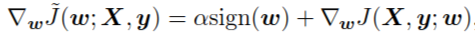

    ​

    -   **以二次曲面举例**

        首先假设一个输入各维度互相独立的情况,也就是Hessian矩阵为对角矩阵.那么得出的正则化误差为:

        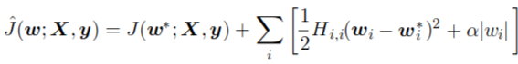

        对这个式子进行取最小值的操作得出的 参数为(这个地方的推导有些不懂):

        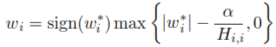

        由于当 $w_i^*<\frac{\alpha}{H_{ii}}$ 时, $w_i=0$. 所以在训练过程中很可能使得一些权重为0.这就制造出了**参数稀疏化**的效果.

-   **转为为贝叶斯的形式**

    -   $L2$ 的贝叶斯形式

        在5.6.1节中,通过假设 $p(w)$  是正态分布,向贝叶斯形式的最大似然公式中加入正则化项.

        如下(后面的等号是基于贝叶斯公式,省略了分母):

        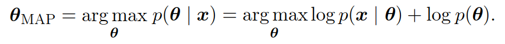

        可以看出,和正常的 $argmax_{\theta}logp(x)$ 相比,多的后面这个 $logp(\theta)$ 就是正则项.

        在L2中,假设的参数服从正太分布也就是(底下的$w$就是上面的$\theta$):

        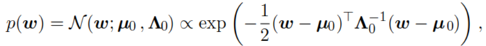

        其中,其中均值为$µ_0$,设为0,方差为$Λ_0=1/α*I$.那么,log出来之后就是一个二次方的形式.

    -   $L1$ 贝叶斯形式:

        这里的参数分布假设为laplace分布(关于0对称).即:

        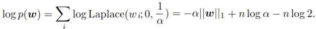

        其中,laplace分布为(就是对称指数分布.):

        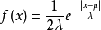

#### 7.1.3 Discussion of L1  L2 
下面是来自网上的有关L1,L2的其他讨论,[链接](https://zhuanlan.zhihu.com/p/32134351)   

### 7.2 Norm Penalties as Constrained Optimization

将惩罚项视为约束优化,重点是约束优化而不是惩罚项.

-   **问题形式**

    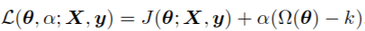

    联想4.5节中的梯度下降法进行求解.

    1.  通过KKT条件1,让拉格朗日函数关于 $\theta$ 的导数为0.得出 关于$\theta$ 关于 $\alpha$ 的表达式.这时候, $\alpha$ 作为分母存在.
    2.  由于我们要处理的 $min_{\theta}max_{\alpha}\mathcal{L}$ 因此,需要求拉格朗日函数关于 $\alpha$ 的导数,即, $\Omega(\theta)-k$.

    无论是用系统解析法还是梯度下降法,当 $\Omega(\theta)-k>0$ 时,$\alpha$ 一定是趋向于变大的.在下一次迭代中,便会使得 $\theta$ 变小.那么,接下来就会使$\alpha$ 变小.反之亦然.

-   **抽象化**

    通过4.5节,我们知道, $\theta$ 和 $\alpha$ 是通过迭代一起改变的,而且两者还是互相依存,互相改变.那么可以认为 $\alpha$ 的最后的值 $\alpha^*$ 和 $k$ 的关系,是根据 $J$ 的形式决定的,那么,现在固定 $\alpha$ 为 $\alpha^*$.则有:

    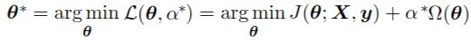

    对于正则项L2而言,我们可以认为,k决定的是圆形的半径.而对于L1而言,也是一个L1形式的限制区域.

    $\alpha^*$ 与 k 的具体关系虽然是由 $J$ 决定,但是我们可以知道大体的关系:

    ​		**当 $\alpha$ 变大时,区域变小;反之,区域变大.**

-   **显式约束**

    -   什么是显式约束,什么是隐式约束.

        隐式约束就是4.5提到的方法,需要在每次迭代中满足所有的条件,条件之间是非独立的.难以解决

        In practice solving problems involves an implicit constraint that the  equations of state must be satisfied at every iteration of the solution  process.

        显式约束使参数与状态之间独立,使得,各条件可以独立求解,如下方法.

        先找到 $J(\theta)$ 的最优解,然后,找到离他最的符合条件的点.

    -   显式约束的优点:

        -   速度快

        -   加惩罚项的函数会成为非凸优化问题.在神经网络中优化的时候,经常会造成网络中出现 "dead units".这些 unit 的特征是,权重值很小,以至于无法对预测造成影响.

            ----

            >    the norm of the weights:
            >
            >    在书里面经常出现这个词汇,这个就是说,参数的范数,也就是线性映射 $W^Tx+b$ 中W的范数,计算公式为:
            >
            >    Norm(W) = Trace (W.Transpose(W))
            >
            >    比如说,Frobenius norm(弗罗贝尼乌斯范数)
            >
            >    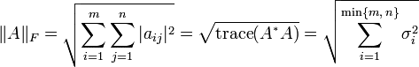

            ---

            出现 "dead unit" 的原因是:

            我们看到,在隐式方法的迭代过程中,参数 $\lambda$ 的值是逐渐缩小的,这就是一种shrink.使用惩罚项之后,容易函数会更加容易陷入局部最小值.由于使用参数的范数作为惩罚项,所以最小化误差函数就会偏向于小的参数.然后具体原因看知乎[问题](https://www.zhihu.com/question/266078319)

            ----

            >   总结一下其中的内容:
            >
            >   1.  首先对书中的观点进行了批评:
            >
            >       对于"非凸函数加惩罚项会更容易收敛到局部极小”这句话不能盲目迷信,因为加了惩罚项是有可能把本来的普通点变成局部最小，但也有可能把本来的局部最小变成普通点。这需要看惩罚项是怎么影响原始的函数的KKT的
            >
            >   2.  批评2:
            >
            >       "非凸函数加惩罚项会收敛到数值小一些的参数",这句话是否起作用还是要看惩罚项是什么，小参数是什么意义上来说的。加了惩罚项是去**降低模型复杂度**的，越复杂的模型越容易过拟合，所以加惩罚项去适当控制参数，问题回答者觉得并不一定会收敛到“小参数”。
            >
            >   3.  "由于使用参数的范数作为惩罚项,所以最小化误差函数就会偏向于小的参数",这句话有一定道理,不过还是要去平衡实际表现.这句话存在的实际意义是:惩罚项太大，模型就废了

            ----

            ​

        -   **稳定性**

            因为当学习率太大的时候,有可能会造成正反馈,就是机器人疯转现象!!先考虑普通神经网络中的正反馈,就是说,大的参数造成了一个值很大的梯度下降,而梯度上升又会造成更大的参数size的上升.最后参数size突破天际,成为numerical overflow.图示如下:

            

            这里的参数和梯度的相互依赖的情况造成了loss爆炸,这里也可以类比到迭代求解KKT的情况,参数 $\theta$ 和 $\lambda$ 的值是相互依赖的,因此可能造成这样的结果.这样,用互相没有依赖性的explicit方法就安全了.

-   **如何使用约束**

    使用约束是为了防止 $\theta$ 的值太大,出现不稳定的情况。但是除了**直接**对参数 $W$ 的范数进行限制之外,还可以通过单独限制每列的参数的.因为之前对整体范数的限制,可能会使得某些单元的参数范数大,某些小.因此这样可以保证,每个hidden unit的参数范数都不会超过某个值.这时候,就会写成对L2惩罚项的约束形式,通常用explicit方法解决.

### 7.3 Regularization and Under-Constrained Problems

-   **奇异矩阵的情况**

    我们在之前的学习时,多次用到矩阵 $X^TX$ 的求逆操作,在非满秩,也就是奇异矩阵中,这个是不可行的,通常出现在行数大于列数的情况,这个时候,我们通常采用对 $X^TX+\alpha I$ 的方式,来代替原来的 $X^TX$ .

-   **underdetermined problem**

    Problems with multiple solutions are called underdetermined.

    考虑逻辑回归的情况,我们知道在逻辑回归里面,函数 $W^Tx+b$ 实现的功能是,将原有输入空间进行线性变换,投射到新的(一维)空间的功能,在这个新的空间中,两个类别的数据点应该是分别位于轴的两侧.然后在通过逻辑函数进行求概率.

    在这个过程中,我们发现,在用合适的 $W$ 对x进行空间转换后,可以对 $W$ 加倍来扩大正确概率.这样的话,就造成了在训练过程中, $W$ 会无限增长,最后突破天际的情况.

    而通过正则项就可以避免这种情况.因为 $W$ magnitude 的增大会使得 $\hat{J}$ 变大.

    同样的原理不止局限于神经网络中,还存在线性代数的问题中.

### 7.4 Dataset Augmentation

数据集增强

-   增加fake数据

    在分类问题上,分类的目标是不变的,We can generate new (x, y) pairs easily just by transforming the x inputs in our training set

    但是在求概率分布上,就不能这样使用了.因为只有在知道真实分布的情况下才可以实现.

    数据集增强在物体识别上得到广泛应用.将训练图像在每个方向上转换几个像素可以大大提高泛化能力.还可以通过旋转等等等增加数据集.

    但是在文字图片识别上要注意不能颠倒,因为有 'b' 'd'这样的对称字

-   inject noise

    在speech recognition应用广泛

    研究表明,神经网络对待噪声没有体现出很强的鲁棒性,因此可以通过向训练数据中添加噪声的方式进行增加鲁棒性的工作.并且噪声不仅仅可以从输入层注射,还可以从隐含层注射进去,可以说是非常疼了.可以看做是在不同抽象level的数据增强.通过调节noise的大小,可以实现很好的功能.而Dropout(和向hidden layer增加noise1有关系), can be seen as a process of constructing new inputs by multiplying by noise.应该是等同于向神经网络中增加噪声,具体看7.12

-   数据增强通常是最为数据前处理的模型的一部分出现的.

### 7.5 Noise Robustness

增加noise的实质是正则化.而正则化的目的是增强模型的泛华能力.

-   **noise和正则化的关系**

    研究表明,在输入上增加noise对于某些模型而言就相当于增加了关于 $W$ 的范数的惩罚项.但是要记住,**增加noise的作用要比简单的 shrink $W$ 的范数要强大**.特别是当这个noise加到hidden层的时候.这个课题将会结合dropout在7.12节展开讲.

-   **在 $w$ 层上加 noise**

    这个完全不同于之前的在数据上加noise.而在weight上加noise,就相当于stochastic implementation of Bayesian inference(贝叶斯推断的随即实现).即,参数的不确定化.

    而这种情况在某种情况下依然可以视为是在原先的函数上加上了传统的惩罚项。

    现在看使用最小二乘法的误差函数，设置w的noise形式为：

    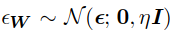

    那么，最小二乘的函数就为：

    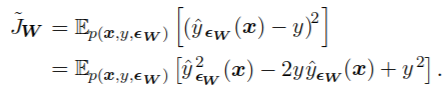

    当方差比较小的时候 这个加了noise的权重的函数可以看做是加了一个如下的正则项:

    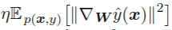

    这样使得一个关于 $W$ 一个小的扰动只会给系统带来一个小的影响.In other words, it pushes the model into regions where the model is relatively insensitive to small variations in the weights, finding points that are not merely minima, but minima surrounded by flat regions.

#### 7.5.1 Injecting Noise at the Output Targets

有些模型y的label可能会出现一些问题,这个时候就需要向输出中加入noise.

方法是,我们的模型最后要求的都是 $p_{model}$ ,这里面涉及到对数据集 $y$ 的操作,因此我们可以使用对理想状态加减 $\epsilon$ 的方法实现这个结果.

-   **label smoothing**

假设softmax多项k分类中,我们原先的的理想分布是:

$(0,...,1,...,0)$,但是我们现在可以将其改为: $(\epsilon/(k-1),...,1-\epsilon,...,\epsilon/(k-1))$ 再与实际分布进行计算.

但是这样有个结果就是,这样会使得结果一直无法达到准确的0或1,因此,会让w变得越来越大越来越大,最后突破天际,这样当然是不行的.因此,这里采用的补救方法是,再加一个权重下降的惩罚项.

具体的讲label smoothing的[链接如下](https://www.zhihu.com/question/65339831/answer/236892343)[链接2](http://blog.csdn.net/lqfarmer/article/details/74276680)

### 7.6 Semi-Supervised Learning

简单来说就是,对于半监督学习,我们不会将其中有label的数据和无label的数据分为两个部分进行分析.而是希望两种数据都能通用一个 $P(y|x)$ .计算 $P(y|x)$ 的问题是一个判别模型.但是对于没有label的数据这是个无法应用的.

----

>   判别模型和生成模型:
>
>   判别模型:求得是x和y的条件概率.他强调的是不同类别的数据的区别性.判别方法关心的是对给定的输入X，应该预测什么样的输出Y。
>
>   生成模型:求得是x和y的联合概率.他强调的描述一个类别中的数据的性质.这样的方法之所以成为生成方法，是因为**模型表示了给定输入X产生输出Y的生成关系**。
>
>   举例来说(对于一个物体跟踪算法而言):
>
>   生成模型：一般是学习一个代表目标的模型，然后通过它去搜索图像区域，然后最小化重构误差。类似于生成模型描述一个目标，然后就是模式匹配了，在图像中找到和这个模型最匹配的区域，就是目标了。
>
>   判别模型：将跟踪问题看成一个二分类问题，然后找到目标和背景的决策边界。它不管目标是怎么描述的，那只要知道目标和背景的差别在哪，然后你给一个图像，它看它处于边界的那一边，就归为哪一类。

----

**因此,需要合理利用好所有的数据就要实现对生成模型[P(x) or P(x, y)]和判别模型[P(y|x)]的 trade off.**并且这里,生成模型需要使用判别模型中的参数.

**生成式方法**表达了对于监督学习问题的解决方案的先验信息的特定形式,也就是说p(x)以共享参数的形式与p(y|x)发生关系.->这句话不太懂.

**判别式方法**就是通过最大化p(y|x)的方式,求解模型的参数.

一般的半监督学习的解决思路是:

未标记样本虽然没有带标签，但是与带标签的样本一样，都是从同样的数据源独立同分布采样而来。若想利用这一部分数据，则需要做出一些假设，诸如聚类假设（数据存在簇结构，同一个簇的样本属于同一个类别）、流形假设（数据分布在一个流形结构上，相近的样本有相似的输出值）。这些假设归根到底都是在假设相似的样本在同一个学习器中有相似的输出。

----

>   半监督学习没有抛弃无label数据的原因:
>
>   这个也是理解所有的关键:无label数据应该是通过真实分布采集而来的.也就是说,这些数据一定程度上反映了分布信息.我们可以利用最大似然的方法,求出真实分布的参数.这就是**生成式方法.**

----

### 7.7 Multitask Learning

多任务学习的基本形式是这样的:

对于同一个输入,有多个任务对其进行训练.大致形状如下:

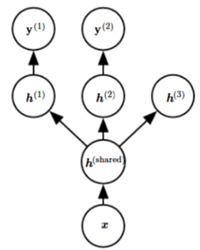

这里要注意的是,这样的多任务学习分为两部分,

-   一部分是**lower layer**,在这里指的是从 $x$ 到 $h^{(shared)}$ 这一层.这一层的参数是通用的.
-   还有一部分是**higher layer**,在这里指的是,从 ${h^{(shared)}}$ 到 $h^{(1)},h^{(2)},h^{(3)}$ 这一层.在这一层里面的参数是任务制定的.

而我们这里的假设是:

lower layer中的参数包含了很多,被称为 pool of factor ,也就是说这里包含了x的所有的特性因子.

但是在每个特定任务中,都只用到x的一部分factor,但是在不同的任务之中,应该是共享了一部分的factor.而通过多任务训练可以训练这一部分的factor达到增加训练数据的效果.

而这里的 $h^{(3)}$ ,是为了说明无监督学习使用的一部分factor和其他的任务无关.

### 7.8 Early Stopping

-   **什么是early stopping?**

    在一般的训练中,我们通常是直到error稳定或者参数稳定之后才会停止迭代.但是在我们发现,到后期,随着 trainning set error 的稳步下降,validation set error 却稳步上升.这就是出现了过拟合.图示如下:

    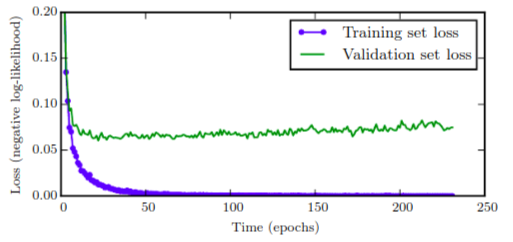

    这样的话我们可以采取这样的策略来防止这样的事情发生:

    在验证集的error rate上升的时候,记下其参数集合,在最后的训练停止的时候,不是采用最新的参数集合,而是采取储存的那些里面使得验证集error rate最低的那一套参数.而这样造成了计算力的浪费.而避免这种浪费的方法就是early stopping.,即:

    **early stopping**:在达到最佳的验证集error rate之后的指定迭代次数之内,若参数没有得到改进,则停止.按照算法7.1显示,最后会返回最佳的训练次数和最佳的参数集合.

    >   注意：这个也是正则化的一种.是深度学习中最经常用到的.
    >
    >   这里就要回归正则化的本质:正则化是为了减小模型容量,提高泛化能力.

-   **作为超参数**

    -   在计算消耗上的讨论

        这里的我们用到了,也就可以把执行次数作为一个超参数.但是训练这个超参数的一个头疼的事情是,需要很多的计算力.因为我们需要每过几次迭代就进行一次状态检测,在有多个GPU的情况下我们可以实现然训练集训练和(验证集的检测)同时进行,但是如果只有cpu的话可能就需要采用一个较小的验证集,或者用较少额达检验次数来节省时间.还有一个消耗是内存的消耗,这个消耗其实是可以忽略的.因为在有GPU的情况下,他的储存是在主机内存中的,不影响训练.

    -   确定超参数之后的使用方法.

        在确定超参数后,为了能够得到更好的性能,我们通常把之前用到的验证集再重新加入训练集中,再次进行训练,这个时候,第二次的训练(second training procedure),也就是确定超参数之后,关于合适early stoping 的决定策略可以分为两种:

        -   照搬超参数:

            就是将整合之后的训练集重头开始训练,然后在之前记录的次数时停止.不过这个时候要注意的是,之前记录的停止次数其实可以从两个不同的唯独去解释:

            第一:就是指训练的次数.

            第二:是指重复训练数据集的次数.(因为数据集扩大了,会有所不同)

            应该按照那个,谁也不知道,试吧,兄弟.

        -   在之前的基础上训练.

            按照之前最优时刻的参数作为网络的起始参数.这个时候的停止方法就和记录的最优次数无关了.

            这个方法是:以全部的数据作为训练集进行训练,但是同时还保存着对验证集的检验,

            当,某个时刻的训练集误差率小于>该时刻的验证集误差率的时候

    -   early stopping相比于惩罚项的优点:

        -   节省了迭代次数,节省了..
        -   不用计算正则项给运算带来的影响.

-   **early stopping为什么有正则化的效果**

    -   简要见下图:

        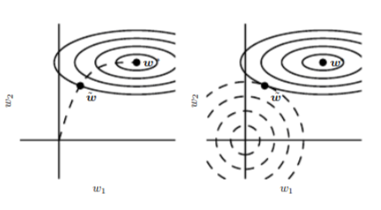

        正如这个图所示,在early stopping的示意图(左图)中,参数的size呈现一个从原始的点 $w^0$ 点,即图中的原点位置开始,以一个弹道状的曲线逼近中心,而中心也就是对于训练集的完美拟合, $error=0$.这个时候也就出现了过拟合.而early stopping的作用和右图所示的L2正则项的作用有异曲同工之处.都实现了控制模型复杂度的功能.

    -   下面从**公式推导**上看L2和early stopping的相同之处:

        具体公式推导在下面方框,最后结果为:

        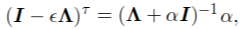

        这里左边的是通过梯度下降得到的式子中的一部分,右式是L2的结果中的一部分.而两个式子的其他部分都相同.这样只要当:

        ​		**左式(是关于迭代次数$\tau$和下降速率$\epsilon$的函数) = 右式(关于正则项系数$\alpha$的函数)**

        的时候,就可以说梯度下降和L2正则项是相同的.

        大概的等式就是:

        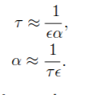

        在之前分析L2正则项的意义的时候我们说到:

        L2的目的是,将向曲率大的方向变化,而忽略曲率小的方向(被$\alpha$和谐掉了).

        而在在这里,我们可以理解为是,控制不同方向的学习速度,主要的特征方向学习速度快,而忽视一些次要的.

        ----

        >   例子是一个简单的线性模型, $y=W^Tx+b$
        >
        >   误差函数为:二次误差函数: $\hat{J}(\theta)=J(w^*)+1/2(w-w^*)^TH(w-w^*)$
        >
        >   ​	-> 即,假设 $w^*$是局部最小值,且其周围的曲面呈现二次曲面, $H$ 是这个二次曲面的二阶导数矩阵.
        >
        >   学习方法是:梯度下降法
        >
        >   首先先看从开始(也就是上图中的原点-初始随机值)到最优点 $w^*$ 的推导过程.这里我们假设,初始点 $w^{0}$ 为0.
        >
        >   那么,接下来,我们设第i次梯度下降之后的值为 $w^i$,则有:
        >
        >   $w^i=w^{i-1}-\epsilon \hat{J}'(w^{i-1})=w^{i-1}-\epsilon H(w-w^*)$ 
        >
        >   在这里将H特征值分解,得出 $H=Q\Lambda Q^T$
        >
        >   那么原来的式子就变为:
        >
        >   $w^i=w^{i-1}-\epsilon H(w^{i-1}-w^*)=w^{i-1}-\epsilon Q\Lambda Q^T(w^{i-1}-w^*)$
        >
        >   再接着转化为:
        >
        >   $w^i-w^{*}=w^{i-1}-w^*-\epsilon H(w^{i-1}-w^*)=(I-\epsilon  Q\Lambda Q^T)(w^{i-1}-w^*)$
        >
        >   再接着转化:
        >
        >   $Q^T(w^i-w^{*})=(I − Λ)Q^T(w^{i-1}− w∗)$
        >
        >   由于之前已经假设了 $w^{0}=0$,再假设 $\epsilon\to 0$,所以: $|1− \epsilonλ_i| <1$
        >
        >   **那么就有了最后的公式:**
        >
        >   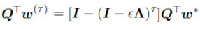
        >
        >   我们把这个式子和L2正则化的推导式进行比较(下面的式子是上面的变形):
        >
        >   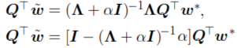
        >
        >   我们发现和通过梯度下降法获得的式子有异曲同工之处,当调整我们的参数,使得:
        >
        >   
        >
        >   的时候,我们便可以说这两个是相等的.

        ----

        ​

-   **相比于L2正则项的优点**

    early stopping可以在合适的地方自动停止,而L2项却需要大量的实验才可以获得合适的超参数.

### 7.9 Parameter Tying and Parameter Sharing

有的时候,先验知识可能是各种各样的.

有的时候,我们无法获得对参数的精确的限制,但是我们可以获得关于模型参数依赖性的一些constraint.

一个很通用的性质就是:certain parameters should be close to one another.

书中给出的例子,是,对于同一个问题用两个模型去解决,那么这个时候,可以将 $||w^{(A)}-w^{(B)}||_2^2$ 作为惩罚项.比如说,有个研究就是针对一个分类问题,设有监督学习模型(分类模型)和非监督学习模型(获取输入数据的分布)作为两个模型进行同时训练.在这样的联合模型中就会发现,	两个模型中的一些参数是配对的.

-   **parameter sharing,参数共享**

    参数共享就是让一部分参数是相同的,优点是,在CNN中,降低模型的内存占用.

#### 7.9.1 Convolutional Neural Networks

在CNN中经常用到参数共享,原因是:符合图像的特点.

CNN中,我们知道,使用了卷积核,卷积核的特点是,滑动着对图像中的所有数据进行同样的操作.这个就对应了图像的一个特点,准确来说是物体识别中的一个特点,位置无关性.一个猫在左上角它是一只猫,在右下角也是一只猫.这样就可以对不同位置的信息,进行相同的处理.

参数共享的策略,使得在不用增加数据集的基础上可以增大模型大小.降低参数数量.

>   注意:之前由于先看过图像处理那本书的前几章,其中提到了卷积算子,是将图像进行某种变换.之后再在CNN中遇到卷积算子的时候便没有多想,认为是理所当然的.
>
>   但是!!!!对于不同的位置采用同样的卷积算子的思想与变换无关,而是基于上上面提到的先验知识,这就是将先验知识加入模型的一个典型范例.

### 7.10 Sparse Representations

稀疏化的方式共有两种,一种是参数稀疏,一种是表征稀疏.简单图示如下:

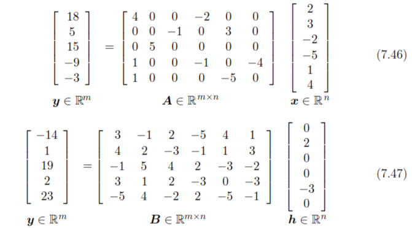

在这个图中,第一个式子就是一个参数稀疏,A中有很多,而在第二个式子中是表达系数,就是h中有很多0,其中h是x的一种表达方式,是经过函数转换的.

而表征的正则化也是由与参数正则化相似的机制实现的.公式如下:

这里正则项通常选择的策略是:

1.  L1正则项

2.  从表征的学生t分布上获得的惩罚项 , or , KL divergence penalties

3.  以h各个维度的值的平均值为正则项: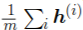

4.  orthogonal matching pursuit:

    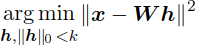

    where $||h||_0$ is the number of nonzero entries of h.当W为正交矩阵的时候,问题可以得到有效的解决.

    This method is often calledOMP-k, with the value of k specified to indicate the number of nonzero features allowed. Coates and Ng (2011) demonstrated that OMP-1 can be a very effectivefeature extractor for deep architectures.

### 7.11 Bagging and Other Ensemble Methods

-   **emsemble method**

    集成模型就是指,用不同的模型去处理同一个任务,由于不同模型会出错的地方不都是一样的,在应用的时候,可以通过多模型的选举来选择合适的模型.

    理论推导为:设有张k个模型,其中第i个模型在处理一次问题的时候出现错误的概率为 $\epsilon_i$.接着假设,这个错误率实际在每个example上发生的概率符合正态分布,其中方差 : $\mathbb{E}(\epsilon_i^2)=v$.协防差 $\mathbb{E}(\epsilon_i\epsilon_j)=c$.就是描述两个模型同时在一个点上面出现失误的可能性.

    我们知道,在某个example上判断失误,也就是出现错误的可能性是: $\frac{1}{k}\sum_i\epsilon_i$.

    那么在整个数据集上的错误率的期望为:

    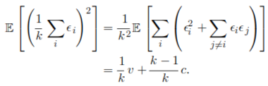

    这个式子存在两种极端:

    1.  $v=c$:这个时候,就是说,每个模型之间几乎没有差距,错误率为v,没变.
    2.  $c=0$:这个时候,各个模型之间完全独立,这个时候的结果为 $\frac{1}{k}v$

-   **bagging method**

    这种模型的形式与集成模型不同,这里采用的是相同的模型,不过采用不同的数据集进行训练.我们会从总数据量为N的数据库中提取出来一部分数据(一般是2/3?).然后对其中某些部分进行重复,将总样本增加到N,最后得到k个有N个训练集数据训练出的结果.这样每个模型的参数都是不同的.

    在这里注意,这种数据集sample的方式叫做Bootstrap.图大致如下:

    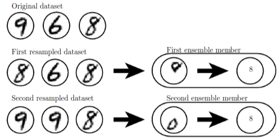

    在神经网络,即使不改变数据集也可以实现这样的功能,因为神经网络的初始位置,超参数的确定等等,就已经有了不同点.

-   **其他**

    Model averaging 是一个极为有效的算法.集成不仅仅可以用于正则化,也可以用于提高模型复杂度,像我提出的那个知乎的[问题](https://www.zhihu.com/question/266128483)就是一个例子.这样的技术叫做 **boosting**.

    Boosting has been applied to build ensemblesof neural networks by incrementally adding neuralnetworks to the ensemble.boosting 也可以将一个神经网络看作一个emsemble模型,其中每个unit都可以看作是一个单元.使用这个方法也许可以确定**可以解决问题的最小神经网络!!!!**.

    ---

    >   这里最后的这个是一个很重要的观点:
    >
    >   我一直想要一个可以量化一个unit在一个神经网络中的所占重要度的数据.因为,我想能通过n个unit达到最佳的问题,不需要n+1个单元,这个时候就可以利用这个将一整个神经网络看作一个集成模型,而每个unit作为一个模型的思想.

    ---

### 7.12 Dropout

#### 7.12.1 Concept of Dropout 

-   **Dropout的形式**

    dropout的形式有很多,比如说接下来会作为中心来讲的,权重置0的方法,还有简单的移除unit(那不就是简单的简化神经网络嘛?),而复杂一点的有利径向基神经网络的.

-   **Dropout的本质**

    dropout的本质,就是将一个大的全链接网络看作是很多个有效子网络的集成模型.这里的有效子网络的定义是,不能没有输入,或者从输入到输出的path,例如下图:

    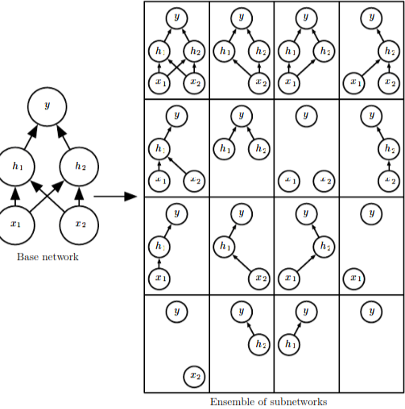

    这个里面,我们可以看到,其实有很多都是不符合我们上面最子网络的定义的,属于无效子网络.这是因为这个网络比较小.当我们向神经网络中增加unit时,其实会造成全部子网络的数量呈指数上涨,那么有限子网络占全部的比例就会大大提升.

    上面讲了将dropout看作是有效子网络的集成模型,也就是基于多个神经网络的集成模型.而在实际的过程中,如果真的将大的神经网络作为子网络进行集成的话,并不是越多越好.有一个研究在用到六个神经网络模型进行集成的时候还可以,但是再往上加就显得累赘了.

#### 7.12.2 Trainning of Dropout 

将整个大的网络看作是多个神经网络的集成模型.回顾集成模型,我们对于每一个子神经网络都需要其特定的数据集,这个数据集是总数据集的子集加一部分子集的重复,最后使得子网络的数据集数目等于大网络的数据集数目.那么,怎么把这样的结果用dropout在神经网络中实现呢?

1.  子网络的设计:

    这里采用的是,在每次epoch的时候,自动设置一部分unit的权重为0的方式进行.这样的话,就相当于每次执行一次epoch是对一个新的神经网络进行训练.

    这里,"自动设置一部分unit的权重为0的方式" 是指,在每次epoch之前,对每个unit以一定概率进行权重置零操作.一般对于输入单元,设置为20%.对于隐含层单元设置为50%.由于这里有随机性,所有最后产生的子网络可以用各种数目.

    这里要注意的是,一般框架中的dropout值是,设置一部分unit的权重为有效的概率,也就是80%和50%.

    有一个问题:当网络很大的时候,epoch的次数可以远远大于模型可以有的子网络数目嘛?

2.  训练方式

    一般采用minibatch去训练dropout结构的网络.上面也说到,bagging模型会对不同模型采取不同数据,而通过minibatch方式,正好可以实现这个,因为每次的epoch训练的子网络都是随机的,这样,只有非常非常小的概率可以使两个子网络的训练数据相同.

3.  前向网络设计

    对于初始结构的计算图:				加入dropout之后可以得出这样的计算图:

    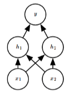 						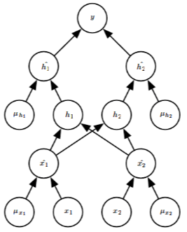	

    其中每个 $\mu_i$ 都是不一样的标量,值以一定概率为0或者1.

4.  后向网络设计

    dropout网络有一个特点,就是每个子网络经历过的训练次数是随机的,因此在进行梯度下降的时候,要注意,我们要最小化的是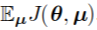,而不是 $J(\theta)$.个人认为这个只是数学定义上的不同,实际训练的时候还是按照正常的训练方法即可.

5.  与bagging模型不同的地方

    -   不同点1:参数共享

        dropout中的网络结构之间是共享unit单元的.

    -   不同点2:可训练次数

        上面提到了一个问题,由于子网络数目是随着unit数目的增长呈指数型增长的,因此到网络足够大时,设置训练完之后还不能使得每个子网络获得至少一次的训练.

    然后,将上面两个不同点结合之后,训练次数少的缺点被参数共享的优点抵消,最后还是可以得到一个好的结果.

#### 7.12.3 Dropout on test data

这一节的意思就是如何利用dropout网络进行预测.在dropout中,投票的过程叫做inference.

1.  **一般集成模型:arithmetic mean(算术平均)**

    以目标函数为概率分布为例,假设共有k个模型,则集成模型投票的最后的结果是:

    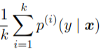

2.  **dropout:集成模型中的算术平均**

    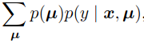

    这里的 $\mu$ 是unit掩码, $\sum_{\mu}$ 是指将所有的掩码下的,输入为x的情况下的输出为 $y$ 的概率分布期望.也是算术平均,和上面的并没有区别.

    但是在实际的网络架构中,子网络的数量成千上网,使用这样的结构会使得无法计算.根据经验表示,当只有10-20个子网络的时候,便可以进行不错的预测.也就是需要10-20次的前向传递.

3.  **dropout:集成模型中的几何平均**

    

    再进行归一化:

    

    其中 $d$ is the number of units that may be dropped. 就是被dropout掉的unit的数量.

4.  **dropout:weight scaling inference rule**

    这是一个只需要一次前向传播推导便可以得出的结果.其中用的是几何平均.

    方法是:我们可以在使用所有的units进行一次前向传播,但是必须要让每个unit的权重乘以dropout的比例值.其中的本质思想是,利用每个unit的输出的期望.

    使用方法:由于我们经常对hidden unit采用50%的dropout率,因此,按照这个方法,我们需要给每个权重乘以0.5.

    -   在使用非线性单元的深度网络中:

        这个算法在使用非线性的深度网络中,还并没有理论依据可以证明其有效性,但是从经验上来看是很有效的.

    -   在使用线性单元的深度网络中:

        可以得到精确证明.见附录1:

        ​

5.  **dropout的性能是problem dependent**

    有的研究表明,用两个子网络的集成就可以达到好的效果;有的研究却发现用1000个子网络集成的模型也比不过weight scaling inference rule

    ​

#### 7.12.4 Advantage 

-   效果好:

    Srivastava et al. (2014)的研究表明,dropout的效率要比其他的比如说weight decay, filter norm constraints, and sparse activity regularization等等的正则化策略的效率要高.他们一起使用能更提高有效性.

-   消耗小:

    时间复杂度为: O(n),n为网络大小

    内存复杂度为: O(n)

    和不加正则化的模型相比较,dropout的时间只多了将权重乘以dropout率,这一下而已.

    >   注意:dropout虽然使一些权重为0,但是并没有因此而节省梯度计算时间,因为,正因为有了dropout,所有要相对应的增大整个网络的size.

-   通用性好:

    dropout可以使用与一切使用分布式表达以及梯度下降训练的模型.包括前向神经网络,循环神经网络,例如[受限玻尔兹曼机](http://blog.csdn.net/roger__wong/article/details/43374343)等等的模型.

#### 7.12.5 Others

-   受限问题范围:

    对于只有很少的有标签的数据来说,dropout没那么有效.

    当有label数据<5000时,贝叶斯神经网络具有更好的效果.而在有额外的没有label的数据的时候,非监督性特征学习要比dropout效率高.

-   与L2惩罚项的比较:

    在线性问题中,L2可以等同于dropout的效果.而对于深度神经网络,是不等同的.

-   **dropout的改进:fast dropout**

    我们对于每个unit是否dropout的选择是根据一定概率随机进行的,而这个随机消耗了一定的计算量,因此在此基础上进行改善得到了fast dropout算法.

    不仅是在训练的时候,对应的在test的上面有其对应的算法,而这个算法能够比weight scaling inference rule提供更有原则的逼近真正的集成模型.但是相应的计算量要大.

    这个方法在大的数据集上看不到明显的效果.

#### 7.12.6 Spirit of dropout

-   **spirit之正则化本质**

    **dropout正则化能力的体现 : 通过与dropout boosting的对比**

    dropout boosting是一种使用了boosting思想的dropout方法,但是其并没有正则化的效果.他通过最大化整个dropout的集成模型来训练.在这个意义上,之前的dropout相当于是bagging,而dropout boosting相当于是boosting模型.和单一模型训练整个网络相比,Dropout Boosting几乎没有正则化效果。这表明,使用Bagging解释Dropout比使用稳健性噪声解释Dropout更好.只有当随机抽样的集成成员相互独立地训练好后,才能达到Bagging集成的正则化效果。

    >   这个正好对应了note:bagging,boosting中提到的,bagging模型能够降低varicande(解决过拟合问题),而boosting的能力是降低bias.

-   **spirit之随机化特性**

    dropout的一个很关键的想法是他向神经网络中加入了随机因子,可以认为是向每个unit乘了一个 $\mu$.

    将这种思想扩展开来,这个 $\mu$ 可以取任意值.比如说是 $\mu \sim \mathcal{N}(1,I)$.在这种情况下, $\mu$ 的值甚至是无限的.

    Srivastava et al. (2014)的研究表明,这种策略要优于原始的dropout.这个啥时候,整个网络的size也没必要随着dropout率而相应的变大了.并且最后在test data应用的时候,也没必要对权重进行缩放.

-   **spirit之进化特性-bagging之外的力量**

    在前面看得时候就有一个疑问,为什么一定要随机,并且还要共享参数,要实现bagging的话,我直接用几个不同的模型就行emseble不就好了.

    这里,有一个很重要的观点,是hinton的论文研究的.参数共享有一个特点,他要求每一个unit能够具有可切换性,也就是说在一个子网络中是可行的,在另外一个子网络中也是可行的,这个像是有性繁殖中的一种进化压力,促使生物体要适应环境的变化,以对一些不寻常的情况也能作出好的反映.用书中原话就是:

    Drop outthus regularizes each hidden unit to be not merely a good feature **but a feature that is good in many contexts.**

    Warde-Farley et al. (2014)的研究表明,dropout的效果>模型集成的效果,证明了hinton的假设和猜想.

-   **spirit之多特征学习**

    上面提到了,spirit有增强模型在各种各样的环境下应变的能力.这种能力的本质其实也可以从多特征学习的层面来理解.

    比如说现在要进行人脸识别,在原始的模型中,如果某一部分可以识别出一个人鼻子,我们基本就可以确定这是一个人脸.因此在接下来的训练中就会有一种"偷懒效应".模型便不会去卖力学习其他必要的特征.但是通过dropout我们可以对偷懒进行惩罚.

    在我们某次的训练中的子模型(子网络)中,检测鼻子的unit被撤去,这是网络就不得不:

    1.  学习一个新的鼻子的特征.或者
    2.  学习其他的脸部特征,比如嘴.

    这样就增强了模型的鲁棒性,这也可以理解是一种解决过拟合的方法.

-   **spirit之乘以噪音的思想**

    这里是指,

    *"模型中,噪音对数据的影响方式是以乘法进行的"*

    为什么这么说呢?

    其实噪声的本质其实是加上到数据上的,但是在神经网络中的时候,比如说是用rectified linear作为unit的网络,由于训练网络只是对训练集数据的模拟.会出现一种病态的解决方案,因为如果以加的方式的话,我们就需要向数据加上一定scale的error,这样的话unit的输出值就会倾向于变非常大,使得误差不那么明显.

    Batch normalization是即使用到了乘法有使用到了加法,这个具体在8.7.1节中讲.能够加速收敛.

### 7.13 Adversarial Training

-   **数据敏感**

    神经网络中出现的数据敏感问题,即:

    即使对于拥有100%正确率有着人类认知水平的模型,在向一个x加入一个小的变化是,预测出来的y值也会剧烈变化,比如下面的图像:

    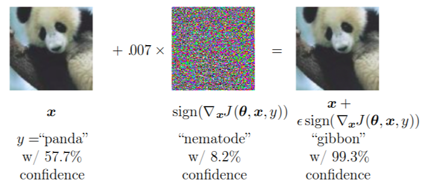

    在这个例子里面,我们可以看到,只是向图像中加了很少噪音,对于熊猫的预测便变成长臂猿了.而,重点是,我们看的处理之后的图像还是很明显的熊猫的图像,说明:模型学到的知识,是有其自己的一套认知体系,其对于正常的自然的图片会有正确的反映,但对于人工处理过得,但是在视觉上只有微小差异的情况会有剧烈反映.

    这个就叫做数据敏感.其中,经过人工处理过的数据叫做 adversarial example.这种数据敏感也可以看作是一种过拟合.

-   **adversarial trainning**

    那么为什么会有这种问题呢?

    是因为神经网络的过度线性.对于以为数据来说,一个小的位移 $\epsilon$ 只会造成一点误差,但是对于高位数据而言,这种误差会累加,再加上非线性单元的放大,这种误差最终会造成无法挽回的结果.

    然后,对于这种问题的改进,即通过人工加入噪音作为输入的训练方法,可以更有效的提供模型以人类的认知标准,这种方法叫做 adversarial trainning.对抗训练力争使得模型拥有局部稳定性.

    对于一个纯线性模型而言,对抗训练是不能使用的.但是即使对于一个几乎线性的非线性神经网络,也可以通过训练使得其变为局部稳定函数.以至于使其即能够抓住数据中的线性特征,有不会在局部出现波动.

    这也是一个很重要的加入先验知识的模型范例.

-   **在半监督学习中的应用**

    半监督学习基于的假设就是,相邻近的输入点拥有相似或者相同的label.比如说流形假设.对于一个分类问题而言,通常认为,不同的class的输入通常位于不同的流形上.输入的一个微小的变动不会对预测造成影响.具体在半监督学习中的应用方法如下:

    对于一个无label数据 $x$ ,在模型已经有了一定的训练基础,也就是拥有一定的预测准确的基础上,预测其输出 $\hat{y}$. 创造新的实例 $x'$. 然后根据模型对 $x'$ 作出预测 $y'$.使得, $y'=\hat{y}$.这里的对抗实例,叫做,virtual adversarial examples.

    ​

### 7.14 Tangent Distance, Tangent Prop and Manifold Tangent Classifier

-   **tangent distance**

    这是一个早期的利用流形假设的算法,叫做切面距离.

    是一个无参数的最近邻算法,其基本思想是,在处理分类问题是,不同类别的数据处于不同的流形上.这里对距离的选择不应该是欧式距离,而应该是基于流形的学习,具体而言,由于两个在同一个流形上的种类相同,所以应该$ 选择所在流形,与 $x_2$ 所在流形最近的点对之间的距离,作为两点之间的距离.

    但是想想都知道,这是一个很复杂的优化问题,为了简化这个问题,我们采用的方法是切线距离.即:

    使用 $x_i$ 处的切平面作为其所在流形的近似,并测量两条切平面或一个切平面和点之间的距离。这个就可以作为模型的损失函数.

-   **tangent prop algorithm**

    正切传播算法.

    这个算法的核心思想是,训练了一个带着惩罚项的神经网络,使得f(x)的每个输出可以在局部独立于变化因素.即,在已知一个f(x) 的情况之下,其附近的x的值是不根据其他因素变化的,即,是固定的,处于一个流形的上的x的label是一致的.

    那么,想象一个高位空间中的流形,什么情况下的input的变化,才不会造成输出y的变化.

    我们在这里的输入input所在的空间有一个特征,那就是,统一类别的数据在同一个流形上,那么对于某个流形 $M_i$ 上的某个点 $x_i$. 要怎么移动才会使得其结果依然在流形 $M_i$ 上呢?答案就是切线方向,因此,对这个模型进行训练或者学习的时候,应该将x的移动方向考虑在内,在切线方向,y可以无变化,但是在垂直方向,目标结果应该剧烈变化,图示如下:

    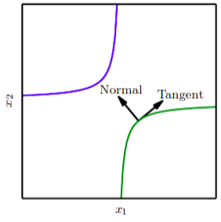

    (这里代表的是一个嵌在二维空间中的一维流形)

    设 $f'(x)$ 就是input数据x的变化方向,而 $v$ 为input空间中点 $x$ 在流形的切线平面.我们要让参数变化方向争取和切线方向垂直.因为切线方向是值变化最快的方向,对应的就是法线的方向(切平面的垂线).

    因此,应该对损失函数加如下惩罚项如下 $\Omega$.

    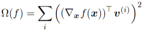

-   **tangent prop algorithm与数据增强方法的对比**

    -   这两个方法的共同点是,可以训练模型对于临近x的局部不变性.但是方式不同:

        数据增强法:通过改变样本数据,比如说旋转图像.并且,变化可以是所有方向的.

        tangent prop algorithm:通过改变损失函数,基于流形学习.变化只能是固定方向的(切线方向)

    -   tangent prop algorithm的缺点:

        1.  他只能处理极小的扰定.当 $\epsilon$ 变大时,利用切面近似的假设就会失效.
        2.  对于ReLU单元,很难应用这种无限小的方法.因为ReLU单元无法在值较大的情况下达到收缩.这个花了比较长时间理解,其实就是说,现在考虑一个unit,当在流形切面方向增加一个小数的时候,理论上说,该unit的变化应该几近于0,但是对于ReLU来说,如果原先是激活的值,那么加一个小数之后的变化还是一个小数.

-   **切向量的确定**

    流形正切分类器无需知道切线向量的先验。在14章,将学到,自编码器可以自动估算流行的切向量而无需人为计算.这些估计的切向量不仅对图像经典几何变换(如 转化、旋转和缩放)保持不变,还必须掌握对特定对象(如正在移动的身体某些部分)保持不变的因素。因此根据流形正切分类器提出的算法相当简单:(1)使用自编码器通过无监督学习来学习流形的结构,以及如正切传播式一样使用这些切面正则化神经网络分类器。

-   **双反向传播,对抗训练的关系**

    这里说着正切传播(tangent prop algorithm)呢,怎么说起来这两个玩意了?

    首先我们先看看正切传播和数据增强的关系.这两个原理其实是及其相近的.在上一黑点处也说到了,正切传播有一个缺点是,他只能处理极小的扰定.因此,正切传播可以看作是无限小版本的数据增强.

    对抗训练和双反向传播其实也是一样的关系:

    对抗训练是双反向传播的变化无限小的版本.

    ​

### 7.15 Appendix

####7.15.1 weight scaling inference rule

在线性单元深度网络中的证明:

我们想要证明的是,可以通过一般的集成模型的公式:

推理出weight scaling inference rule的结果.

现以输出单元为softmax,hidden unit为线性单元的网络来进行证明,证明如下:

原模型公式表达:

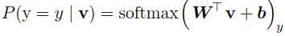

使用dropout:

这里的d为掩码,这个d可以实现对input的dropout,d和v之间是element-wise multiplication:

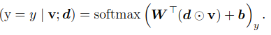

一般的集成模型的公式为:

由于 $P_{ensemble}$ 经过了一个归一化,底下的那个不重要,我们现在只关心分子,也就是 $\tilde{P}_{ensemble}$

由于$\tilde{P}_{ensemble}$最后会被归一化,因此,这里的分母也可以忽略,得到如下公式:

这里,我们看到,这就是weight scaling inference rule方法的结果.