## Chapter 8 Optimization for Training DeepModels

### 8.0. Overview

虽然优化问题有很多,本章聚焦于神经网络中损失函数最小化的优化问题.

本章大致内容为:

1.  和纯优化相比,机器学习中的优化的不同之处.(应该会讲优化的基础相关)
2.  神经网络中优化问题的难点
3.  介绍几个实用的算法,即包括优化算法(基础版)本身,也包括初始参数的方法
4.  利用训练过程或者损失函数的二阶导数去调整学习速率.
5.  介绍几个高级的优化算法.

### 8.1 How Learning Differs from Pure Optimization

#### 8.1.0 Abstact

-   深度模型的优化不是对数据的直接优化,因为我们的目标是在test data上获得最好的性能,但是却不能直接在上面进行优化,这是一大不同 
-   本章主要关注优化,也就是仅仅关注 $f(x;θ)$ 和 y 之间的Loss,不会在将各种正则化项纳入考虑范围,但是实际上没有影响,有没有正则项都是一样的优化原理.因此,本章中,直接操作的元素就只有  $f(x;θ)$ 和 y 

#### 8.1.1 Empirical Risk Minimization

-   基于经验的特征

    根据之前做过得,凸优化的相关笔记,直到,纯优化问题的解决是相当准确的,没有那么多的依赖概率,但是机器学习不同,正因为没有正确的 $p_{data}(x,y)$ 才会去利用训练集数据.也就是利用训练集根据经验去获取最小风险的数据分布 $\hat{p}_{data}(x,y)$

    也就是:

    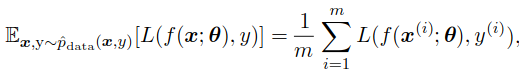

    区别于优化问题中的:

    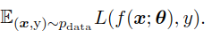

-   **两个难题**

    -   过拟合
    -   因为现在的主流学习方法是梯度下降,但是有很多useful loss函数无法求导,比如0-1loss.

    因此我们在机器学习中很少使用经验风险最小化,需要设计新的方法,去优化一些其他的而不是我们直接需要的优化的值(loss).

#### 8.1.2 Surrogate Loss Functions and Early Stopping

-   利用代理函数,解决上面提到的有些loss函数无法求导的问题,比如说用负对数似然损失函数去替代0-1loss.
-   代理函数有的时候可以学习到很多.例如,在逻辑回归的分类问题里面,即使模型在训练集上的错误率为0,模型也还是有可能会继续训练下去,为的是获得更大概率,学得更多的信息.
-   但是,一切都有个度,上面的这种情况就会导致过拟合的现象,这个时候就需要去利用正则化手段,比如early  stopping ,这也是ML中的优化和纯优化问题的不同,纯优化问题不会在导数还有很大的时候停止,但是ML需要.

#### 8.1.3 Batch and Minibatch Algorithms

-   **遍历训练集数据的低效率性**

    在上面的最小化经验误差的公式中,我们可以看到,我们是希望模拟全部训练集上的数据的数据分布特性.

    首先看梯度下降的根据:

    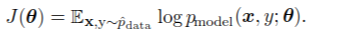

    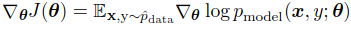

    从理论上讲,我们希望每次作出梯度下降的根据都是最有"自信"的,也就是利用全部的数据去作出判断.当数据量比较小的时候,我们可以每次利用所有训练集数据的误差期望作为梯度下降的标准,由所有样本共同决定最优的方向。

    但是,一个训练集中的数据成万上亿.这样是不现实的.因此我们的每次通常采用一定数量的样本做误差期望计算.

-   **每次采样的数目决定了准确度**

    回顾5.3节中的,评价泛化误差的地方.有一个标准差的指标,其中m是每次的采样数:

    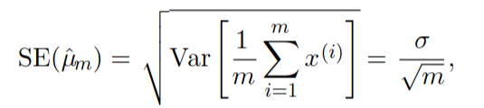

    这个地方也和他一样,有一个标准差的指标,这个指标反映的是:

    首先假设每次sample的数据都是"真实分布产生的数据",并且假设训练集中的数据是真的真实分布下产生的数据(不考虑过拟合问题).那么,每次sample中的"真实分布",应该是偏离真实分布的.

    而我们每次minibatch的训练都是基于sample,即基于假的"真实分布"进行的梯度下降.这样:

    1.  随着m的上升,准确率越来越高.需要minibatch训练的次数就越来少。增加m,速度变慢,但是每次精确度提高;降低m,速度变快,但是每次精确度下降.
    2.  而，由于分母的增长是根号下的,也就是说当m提升到一定值时,平均差(偏离真实分布的程度)便不再能够显著下降.

    这里就有一个tradeoff的问题:

    显然,与根号的平方差的上升速率相比,线性的时间花费显得不那么值得.也就是说,相对于线性的时间成本增长,回报是低于线性的.

    因此,相比于慢慢地计算精确的计算每次的误差,快速的计算计算大概的误差能更快地收敛.(这是个经验,具体情况还要看具体的下降**算法**以及预测**模型**)

-   **batch,stochastic(online),minibatch**

    batch:每次取全部样本

    stochastic:每次取单个样本

    minibatch:每次去一部分样本

    这三个统称为:梯度下降法:stochastic method

-   **影响batch size的因素**

    1.  效率的考虑,不考虑硬件情况的话,要注意每次sample训练,时间与准确率的tradeoff.

    2.  计算性能的考虑,在多核的情况下,size很小时,无法充分利用硬件性能.因此size的最小值也至少要保证不会有浪费计算能力.

    3.  内存的考虑,对于很多情况,这个是最主要的考虑因素.在并行的程序下内存占用很大

    4.  有的硬件可以在特殊的数目下运行的更好,因为牵扯到位的操作,因此size取2的n次方的形式是最好的,一般取32-256,但是对于大模型也有取16的.

    5.  小的size会带来正则化效果,相当于向模型中加入噪音.泛化误差可以在size=1时达到最高.在这种情况下,每次取样的数据的误差就很大了,因此必须要设置小的学习速率,否则容易出现难以收敛的情况.

        ​

-   **模型以及算法的选择对batch size的影响**

    梯度下降包括两三部分:

    1.  一部分是每次数据的运用方式,就是现在讲的这些;
    2.  还有一部分是,**下降算法**,这个之前讲过,包括,最速下降法,牛顿下降法等等.
    3.  还有就是下降的公式,这个就是**预测模型**的部分,包括正则化方式,误差函数的构建

    而

    -   **对于误差敏感的算法**

        有些算法,对于误差很敏感,原因是:

        1.  使用小数据样本很难获得正确的信息.暂时没有例子
        2.  计算的方式会放大误差.利用到hessian矩阵的例子.下面讲.

        我们直到,我们在牛顿法中会用到Hessian矩阵,或者在寻找真正最快下降方向时都会用到Hessian矩阵的逆,对于poor condition 的矩阵,一点的错误就会对$H^{−1}g$ 影响很大.

-   **随机选取数据**

    注意两点.

    -   随机性很重要,因为dataset中的数据通常相邻的data之间有一定的相关性.不保证随机的话就无法保证低的平均差.
    -   我们通常采用洗牌抽取的顺序的方式来实现抽取随机化
    -   在一次洗牌之后,数据要固定,不能每次遍历数据集都是不一样的minibatch.因为没有必要,根据研究表明,每次都采用不一样的minibatch并无法提升效果,反而会浪费计算力.

-   **异步并行?**

    这里说,可以时minibathch和其他minibatch之间并行处理.这个不太理解,因为每一个minibatch都会对模型造成影响,并且只有在原先的上一个minibatch训练完后的模型上进行下一个minibatch进行训练才会是正确的.这个详细在12.1.3中讲.

-   **第一次全数据集遍历与后续遍历的差异**

    第一遍的遍历属于无偏估计,相当于在test data中(即真实的数据分布)中训练,每一次的误差都是泛化误差.

    但是在之后的遍历,就开始加入了主观信息(就是"训练集"的信息,而不**只**是真实数据分布的信息)

-   **新时代的问题**

    现在数据集的增长速度超过了计算力的增长速度,因此对于如此大的数据,我们有时仅能遍历全部数据集一遍,或者只能是一部分,这时候便不存在过拟合的问题,欠拟合和计算效率的问题就变成了主要问题.

### 8.2 Challenges in Neural Network Optimization

神经网络的非凸性质给我们带来了很多难题.

#### 8.2.1 Ill-Conditioning

Ill-condition 是指Hessian矩阵的最大特征值与最小特征值相差很大.

通过4.3节我们知道,经过$-\epsilon g$ 梯度下降之后,会将下面这个值加到cost上:

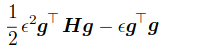

而当二阶分量大于一次一阶分量的时候,就会导致cost增加,这种情况的几何示意为:

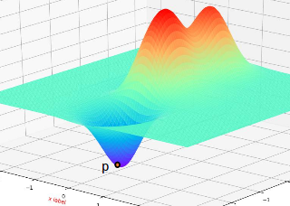

在这个图的p点出,虽然向最低点的方向是最快的,但是由于曲率过大,很可能会反而增大cost.

当这个时候,我们称梯度的ill condition对下降有危害作用.

-   **梯度范数的增长**

    按照一般的想象,到最后越接近最低点,应该是有越小的梯度,但是拥有ill condition的梯度并不是这样,如下图所示:

    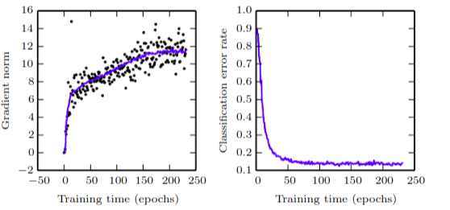

    左图中就显示了范数随着训练而增长.

    但是即使如此,为什么在右图中,模型在验证集的错误率还是在不断减小的呢?这是因为,虽然 $g^Tg$ 在不断增大.但是 $g^THg$ 的增长的量级更大.因此使得 $g^Tg/g^THg$ 还是在不断减小,达到了稳定.因此,shiyong牛顿法就是解决ill condition 的一个好方法.

    **但是**,牛顿法在应用之前需要进行一定的修改,具体见下面.

#### 8.2.2 Local Minima

**对于神经网络来说,其模拟的函数是一个非凸函数,但是这个并不重要,为什么呢?原因是,神经网络具有model identifiability性质**

-   **model identifiability**

    首先,什么叫做model identifiability(模型可识别性)?下面给出三种解释:

    1.  我们称一个模型是可识别的,当且仅当该模型的参数是由不同的潜在变量操控的情况.
    2.  也可以理解为,可识别模型的参数的解只有一个,即:

      ​			$f(\theta_1)=f(\theta_2)$ 当且仅当 $\theta_1=\theta_2$

    3.  在概率模型中,可以理解为,in an identifiable model it is impossible for two distinct parameters (which could be vectors) to give rise to the same likelihood function.

-   **weight space symmetry**

    那么,神经网络就是典型的一个不可识别模型,因为,神经网络有**权重空间对称性(weight space symmetry)**:

    1.  **层间参数的对称性**

        权重空间的对称性是指,在调换同一层两个unit的参数后,效果是不变的,也就是unit输出的相加性造成了无序性,无序性导致了可替换即对称性.对于一个m层,每次n个units的网络而言.若是有一个最小值的话,就有至少 $n!^m$ 个局部最小值点.

    2.  **层与层参数的对称性**

        如果用的是ReLU作为隐含单元,那么 $\alpha ReLU(W^T+b) =  ReLU\bigg(\alpha(W^T+b)\bigg)$

        这样可以给模型再提供 $n*m$ 倍的局部最小值个数.

-   基于以上两点性质,我们就知道了,神经网络的函数虽然是个非凸函数,并且局部最小值是近乎无限的,但是由于局部最小值之间相互相等,那么这种非凸性不具有问题性,也就没必要考虑.

    但是在**局部最小值的损失相比于全局最小值的损失很大时**,这就成为了一个问题.但是根据实际经验来看,局部最小值的cost通常都很小因此不必担心这个问题.

    我们可以通过检测梯度的norm来检测是否到达最小值.

#### 8.2.3 Plateaus, Saddle Points and Other Flat Regions

-   **马鞍面**

    相比于最小值点,神经网络中的马鞍点更多(证明在下面),性质就不多说了,都知道,直接上图:

    

-   **为什么马鞍点更多?**

    **马鞍点和最小值点数量的比**也是一个有意思的课题.

    我们知道某个点处的Hessian矩阵决定了该点的曲率性质.

    局部最小点处的Hessian矩阵的特征值全为正值.而马鞍点的特征值,有正有负.

    -   **随机选取参数**

        由于我们一开始的参数是按照均匀分布随机取得的(类比与投硬币),因此,可以将每个特征值取正取负的概率视为相等的.那么,一个点出的Hessian矩阵为正定矩阵的概率就是 $(1/2)^n$ ,其中n为参数的个数.而为马鞍点的概率就是, $1-(1/2)^{n-1}$.那么两者的比就是 $2^n-2$ ,是随着参数的数量指数上涨的.

    -   **用熵的观点去理解训练过程**

        上面假设的是参数是均匀分布,但是随着训练的进行,这个比例慢慢的下降.可以理解为,经过训练的参数集进入了一个有规范的区域.在这个区域内,特征值为正值的概率变高.下面对这句话进行分析.

        -   特征值为正值意味着什么?

            意味着,cost函数在这个方向(对应特征向量)的曲率是正值,也就是一个n-1维凸平面.比如在上面的三维空间中,选取一个特征值大于0的方向做截面后,得到的就是一个2维凸平面.

        -   规范意味着什么?

            规范意味着有约束,熵低.

        假设把原始假设为一个混沌状态,那么无疑其熵是最高的.这个时候,信息也就是最平均的,一个方向的特征值为正为负的概率是相等的.其中,cost就可以当作是熵.

        接下来,随着训练的过程,我们对这个系统的行为加以约束,使得其熵逐渐减低,而这个约束就是体现在增加正定Hessian矩阵的出现概率上.大致图示如下:

        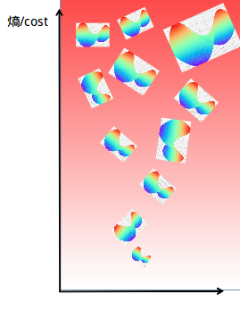

    -   **牛顿法的不足**

        牛顿法的目标是选取凸函数的最优点.但是对于这里的马鞍点,却是无能为力的,因此发明了 **saddle-free Newton Newton method**

    -   实验证明,即使不做什么操作,模型也还是会逃离鞍点,因为,梯度不可能真正达到0.他会尝试去其他地方

#### 8.2.4 Cliffs and Exploding Gradients

悬崖梯度

这样的问题常出现在循环网络中,因为有大量的权重乘在一起,会出现如下情况:

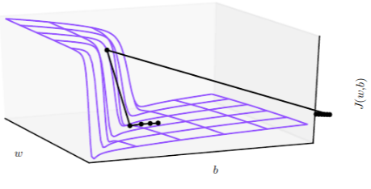

悬崖式梯度指的不仅仅是斜率极大的那一段,更重要的是极大斜率后面又机器平缓的一段.在图中,若是按照传统的算法,参数值将直接跑到最右边的黑点处,而不是左边的那些看起来最合适的地方.这种大范围的参数值变化会使得模型丢失之前训练的一些信息,造成难以弥补的心理创伤.

改进方法是利用 : gradie

nt clipping方法,简单来说就是每次只去梯度的方向值,而不取其size.虽然这样看起来会很慢,对于很少有悬崖的模型来说确实如此,但是对于像循环网络这种长时间序列的网络来说是很有必要的.

#### 8.2.5 Long-Term Dependencies

对于长序列依存的模型,例如循环网络模型会出现梯度消失和上面提到的梯度下降的问题.

证明如下:

对于长序列依存模型,通常需要对一个参数多次相乘:

当特征值大于1时,经过t次方,会变得很大(梯度爆炸).反之,梯度消失.

>   **注意:这种情况重点不仅在于乘了t次上,还在于是对于同一W乘了t次,这个只针对于循环网络.而即使对于非常深的深层前向网络不会出现该问题**
>
>   但是深度网络也是会出现梯度爆炸和梯度消失的问题的, 原因是一样的吗?

梯度消失使得梯度的计算变得无法进行,无法知道该如何调整参数.关于具体的解决方案到10.7节再讲.

-   **power method**

    $xW^T$ 的过程,其实相当于一个求 $W$ 的最大特征值对应的特征向量的问题.因为,随着不停的乘 W .x在各个特征向量上的增长是指数型的.对于,小于1的特征值,就不用说了,趋于0.即使对大于1,但不是最大的特征向量上,其相对于最大特征向量上的分量的增长速度来说,也是可以忽略的.

#### 8.2.6 Inexact Gradients

我们之前的所有处理都是基于我们用于训练的数据是真实分布下生成的这一假设.但是真实的训练集中是有很多误差的.这就造成了不精确的梯度.

这一小节虽然短,但是里面的问题是很严重,并且很难的,具体在第三章讲,我估计近一年应该不会看了,跳过.

-----

下面是自己的推理:

首先我们假设的真实的数据分布为 $P$,在某个参数 $\theta$ 上的最佳梯度值为 $g$.

而假设某次采样的真实分布为含有噪音的 $P'$,在某个参数 $\theta$ 上的最佳梯度值为 $g'$.

那么整个模型的函数都会获得或少的偏离真实的函数,误差应该是服从正态分布的.大致图如下:

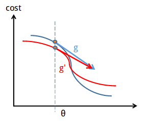

现在假设,按照一定的下降策略我们选取的 $g$ 本应该是最好的下降方向.经过这个偏移造成的结果可能如下:

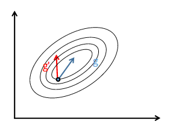

这个效果和poor condiotion的Hessian矩阵很像.都会造成多余的迭代和时间浪费的问题.

#### 8.2.7 Poor Correspondence between Local and Global Structure

-   **无最小值**

    事实上,神经网络模型很多是没有最小值的,比如离散模型下的交叉熵做损失函数里面,由于其模型输出为softmax,而softmax的值永远不可能是真正意义上的1或0,因此,梯度下降会一直持续下去.连续模型也是一样的,通过最小化误差发生概率(基于正态分布),也不会有完全的停止.

-   **初始点的影响**

    即使在无局部最小值或者鞍点的情况下也有可能出现无法到达全局最小值的情况,如下图所示:

    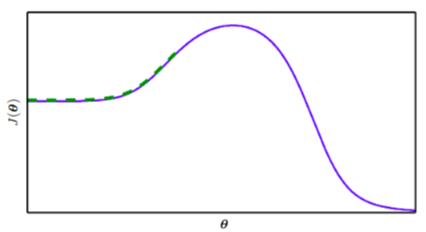

    (这个函数中 $\theta$ 的定义域是确定的.)

    解决这种问题的方法的研究主要集中于如何确定初始点上,而不是去做非局部的跨越式的跳跃.

-   **局部移动的难点和缺点**

    1.  首先我们要直到就算是只依据梯度进行局部移动就不是一件容易的事.
    2.  并且由于我们的训练数据中是由error的,因此,我们即使作出了局部移动遵循的也不是真正的正确方向,而是有误差的.
    3.  再接着,即使我们作出了一个不准确的判断,我们也是很难按照他往下走的,因为有poor conditioning or discontinuous gradients的这种问题.在这种情况下我们每步只能走很小.
    4.  即使如此,我们还是有可能到一些奇怪的地方,比如说falt 区域.这种情况下,梯度下降就没有用了.
    5.  即便即便即便如此,我们也还有可能遇上上面这样的初始位置错误的问题.或者用舍近求远的方法来求解问题

-   因此如何找到一个合适的初始点非常重要.

#### 8.2.8 Theoretical Limits of Optimization

一些理论结果表明,存在某类问题是不可解的,但很难判断一个特定问题是否属于该类。

其他结果表明,寻找给定规模的网络的一个可行解是很困难的,但在实际情况中,我们通过设置更多参数,使用更大的网络,能轻松找到可接受的解。

此外,在神经网络训练中,我们通常不关注某个函数的精确极小点,而只关注将其值下降到足够小以获得一个良好的泛化误差。对优化算法是否能完成此目标进行理论分析是非常困难的。

### 8.3 Basic Algorithms

接下来介绍利用随机梯度下降的方法去进行优化的问题.

#### 8.3.1 Stochastic Gradient Descent

##### 8.3.1.1 Learning rate

首先要确认的一点是,学习速率应该是随着训练而**变小**的.

-   **为什么需要变化**

    本小节全为个人推理

    先假设训练集数据就是反映的真实数据分布.

    随机梯度算法由于每次需要sample数据,所以是有误差的.可以认为每次梯度下降是由两部分组成,真实下降方向和误差导致的下降方向.

    ​					$\vec{g} = \vec{g}_{real}+\vec{g}_{error}$

    在前期由于还离最小值很远所以梯度较大, $\vec{g}_{real}>>\vec{g}_{error}$ 因此,可以认为主要方向还是真实方向.但是当训练进行,越来越靠近真实点的时候,就有 $\vec{g}_{real}\approx \vec{g}_{error}$ 这个时候,虽然 $||\vec{g}||$ 本身已经变小了,但是可以通过进一步下降学习速率,防止错误太大(见下图),而这一次的错误通常是可以在下次的训练中弥补回来的.

    几何示意如下,左图为在 $\vec{g}_{real}\approx \vec{g}_{error}$ 时,步长小的情况;右图为在 $\vec{g}_{real}\approx \vec{g}_{error}$ 时,步长大的情况,蓝色梯度下降方向为正确方向,而红色的为添加了 $\vec{g}_{error}$ 的 $\vec{g}$:

    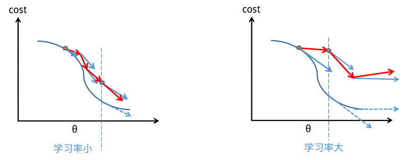

    也就是说,由于数据有error,所以在此数据下的训练不能将其领至一个正确的点处.但是将其领到其一个范围内还是没有问题的.因此,我们的目的就是希望在到达目的附近的时候不会再因为学习速率太大而再跳出去.

    因此,使用全部训练集数据的bath GD就不需要减小学习速率,因为**已经假设训练集数据就是反映的真实数据分布.**.

    ​

-   **如何变化?**

    根据某些研究表明,学习速率应该满足如下条件:

    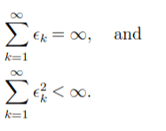

    在实际训练中,通常采用线性下降的方式,直到第 $\tau$ 次迭代.下降学习速率方式如下:

    

    其中 $\epsilon_k$ 是第 k 次迭代的下降速率.每次迭代指的是一次iteration,而不是一次epoch.

     $\epsilon_k$ 是初始学习速率. $\alpha=k/\tau$ .由上面定义可知,$\epsilon_{\tau}$ 是一个常数,最开始就定下来了.也就是说,每次下降的大小为 $(\epsilon_0-\epsilon_0)*k/\tau $. 因此我们知道了在这个式子里面的初始学习速率为 $\epsilon_0$

-   **如何定义这些超参数?**

    $\tau$ 通常设置为小几百次epoch之后的迭代次数.因此和训练集大小和minibatch的大小有关系.

    $\epsilon_k$ 通常设置为 $\epsilon_0$ 的百分之一左右.

    $\epsilon_0$ 是最难设置的,设置的高了会出现震荡,设置的低了会出现进展缓慢或者阻塞在某个high cost的位置.这个值通常是需要实验的,先根据经验选上一个比,在进行100次iteration左右之后得到一个最佳性能的学习率,再稍高一点的值.

##### 8.3.1.2 Convergence rate
**收敛速度**

-   **excess error**

    这个是当前(经过n次迭代后的)cost和最小cost之间的差值: $J(\theta)-min_{\theta}J(\theta)$

    研究表明,当问题是一个凸问题时,在k次迭代后的误差量级是 $O(1/\sqrt{k})$.而在强凸问题的情况下,在k次迭代后的误差量级是 $O(1/k)$.

    但是又有研究表明,k次迭代中的误差下降速率不可能快于  $O(1/k)$.不过也有研究表明,没有必要设计下降速率高于  $O(1/k)$ 的方法,因为会出现过拟合.

-   **batch 与 minibatch**

    上面也说到了,由于minibatch的数据采样有误差,到后来我们需要降低学习速率.但是另一方面,我们也可以考虑减小误差,即每次iteration采样更多的样本.但是我们知道每次采样多了之后,速度就会变慢.因此这里**存在一个batch size和error的trade off 问题**.也就可以认为是batch GD和SGD的一些比较.

    首先,如果一开始就用大的采样集的话会遮蔽minibatch的优点,即可以很快的作出有效的收敛的优点.但是损失了常数倍 $O(1/k)$ 的渐近分析(这句话不太懂??).因此可以在训练过程中逐渐增加batch size.

    ​

#### 8.3.2 Momentum

-   **与SGD相比的优点**

    SGD最大的缺点就是慢.Momentum算法改善了SGD在高曲率点,小梯度处以及**梯度噪声**的问题.

    动量算法主要解决:Hessian矩阵的poor condiotion问题,以及随机梯度的方差问题(就是sample数据的error问题,同上面的那个梯度噪声.)

-   **几何示意:**

    

    其中的黑色下降路径是原先有问题的情况下的(Hessian的ill condition以及梯度噪声).红色是动量算法作出的修改.

-   **intuition**

    这里用了"动量"这个次,但是更习惯用惯性去理解.假设我们现在对一个含有n个参数的目标函数进行优化,其中,那么就可以认为我们的参数集是处于一个n维空间中移动,现在将参数集类比其为三维空间的粒子.那么,在粒子到达某个点之后是有一个向着方向 $d_1$ 的动量 $m_1$ 的,在这个时候,我们给他一个不同于这个方向 $d_2$ 的动量 $m_2$. 那么,下一步例子的移动方向既不是 $d_2$ 也不是 $d_1$.而是两者的一个矢量和.如下图所示:

    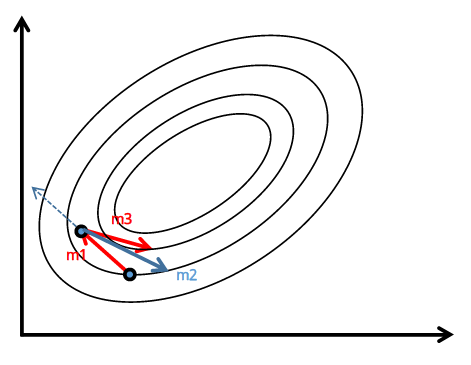

    其中, $\vec{m_3} = \alpha \vec{m_1} + \vec{m_2}$

    其中, $\vec{m_1}$ 为上一次移动的动量.  $\vec{m_2}$ 为这一次移动的动量. 

    转化为优化公式就是,v为动量系数为首先:

    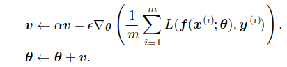

-   **超参数 $\alpha$ 的意义**

    与最原始的梯度下降不同,我们这里的每一步的下降速度都既要兼顾在t处产生的新动力,也要兼顾上次的残留速度对粒子造成的影响.在传统的动力系统中,一个新的动量,是由两个分动量合成而成的.放在这个例子中就是:

    $v(t) =v(t-1) - \epsilon \Delta_{\theta}J$

    但是我们上面的式子中多出了一个 $\alpha$.这个是为什么呢?

    -> 为了防止出现迭代无法结束的情况.考虑下面这个情况:

    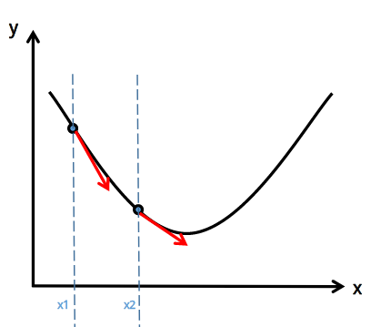

    在这个二维的例子里面,参数只有x一个,在 x1,x2处,虽然梯度值不同,但是梯度方向是相同的-都是x正轴方向.用 $v(t) =v(t-1) - \epsilon \Delta_{\theta}J$ 去理解的话,就是速度会不断加大.

    想象一个光滑的峡谷,一个冰球在一定高处落下,那么小球最后的状态会是不断的上上下下.

    因此,我们只有让上一次的速度没有全部矢量加到这次的速度的情况下才可以让小球稳定下来.

    一般我们通常取 $\alpha$ 为 0.5,0.9或者0.99.事实上,$\alpha$ 也应该是一直在变化的.在一开始处可以让他小一些,即阻力大一些.到会来就要降低阻力.即让,$\alpha$ 有小变大.

    并且:Adapting $α$ over time is less important than shrinking over time.

-   **continuous-time Newtonian dynamics**

    上面我们用两个动量合成一个新的动量的方法解释了动量算法.接下来,我们将其类比到连续时间的牛顿动力系统中.

    设 $\epsilon$ 固定且接近无限小.那么可以分为这是一个连续时间的系统.设粒子在 t 时刻的位置为 $\theta(t)$,在 t 时刻的速度为 $v(t)$, 设粒子在 t 时刻受到的力为 $f(t)$则:

    ​						$\theta(t) =  \theta$

    就是指参数集在参数空间中的位置.

    ​						$v(t) = \alpha v(t-1) - \epsilon \Delta{J}/\Delta{\theta}= \frac{\delta}{\delta t}\theta(t)$

    而,f(t) 是力,设例子质量m为1.

    ​						$f(t)=m*\Delta v/\Delta t =\frac{\delta}{\delta t}v(t)$

    现在我们来分析, 在这个牛顿动力学系统中,一个存在几种力.

    -   梯度下降带来的直接推动力,这个是这个动力系统中的主动力.是动力来源.
    -   由 $(1-\alpha) v_{(t-1)}$  带来的是阻力.

-   **阻力为什么是一阶的**:

    这里的阻力可以理解为是一种粘滞阻力.是一次的.

    为什么不用像turbulent drag这样的二阶阻力,或者是dry friction(干摩擦)这样的零阶阻力呢?

    二阶的:下降太慢,当速度小到一定地步的时候,阻力便可忽略,可以类比到 $1/n^2$ 的数列会收敛到一个值.

    零阶的:下降太快.会使得粒子在达到最低点之前迭代停止.

#### 8.3.3 Nesterov Momentum

一个基于动量算法的新算法:

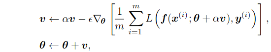

相当于向原有模型中加入了一个校正因子.

这个方法对于动量模型的改进在于,他不会傻傻的遵循惯性定律去改变方向,而是时时刻刻领先一步,考虑到这一次移动之后的结果,避免没有必要的震荡.体现在公式的后半部分 $\theta+\alpha v$ 上.

在convex batch gradient情况下,excess error由 $O(1/k)$ 下降到 $O(1/k^2)$.但是在随机梯度下降时,没有明显效果.

### 8.4 Parameter Initialization Strategies

**本小节学得非常没自信,有很多不确定而臆测的内容.**

#### 8.4.1 Initialization concept  

-   初始化参数很重要

    初始参数不仅影响优化的速度,还影响泛化的效果.

-   **利用分布随机选取参数**

    在训练神经网络时,初始参数的规则只有一个,就是不要让不同unit的参数相同.

    否则,在进行前向传播的时候,会造成输入信息的损失;在进行后向传播的时候会造成梯度信息的丢失.

    为此,最理想的方式是,假设输入输出维度相同的情况下, 我们希望初始参数矩阵可以为一个正交矩阵.这样,使得各unit之间没有依赖性.但是这样的计算消耗太高.因此我们通常采取的方式是从一个高熵的分布去随机采样参数.

    注意,我们通常只对W进行随机采样,bias采用常数.像是conditional variance of a prediction这种参数也设置为常数.

    这个高熵的分布通常采用的是均匀分布或者正态分布.

-   **对分布的要求**

    下面要讨论的是,分布的特性-scale.

    当参数都比较大时有以下优点:

    -   symmetry-breaking effect,使得unit 对称的几率降低.
    -   不会丢失符号,不会出现梯度消失.

    当过于大时,有以下缺点:

    -   造成混沌,混沌是指,输入里面极小的误差,就会使得结果出现很大的偏差,通过这个系统之后,输入里的误差被放大之后,使得系统过于脆弱,输出充满随机性.
    -   梯度爆炸.这个可以用gradient clipping去解决.
    -   容易饱和,在使用sigmod或者tanh作激活函数的时候,容易发生饱和的线性,使得梯度消失.

    所以说,我们最后的要求是希望,分布的scale能够足够大但不会大的过头.

-   **初始化参数真实意义**

    -   **先验知识-初始值决定了其训练结果**

        首先,我们直到,神经网络的unit具有对称性,因此在没有确定任何具体值的情况下,每个unit都有可能是其他unit,称此为**参数的不确定性**.

        但是,一开始的随机参数就将这种不确定性一定性的消除了,因为初始化给每个unit一个大致的范围,此后的训练,像梯度下降这样的,由于都是缓慢下降,每个unit的值会变化,但是最后会尽可能的**离初始值近.** 

        这里其实不只是一个 **下降速度慢->离初始值近** 的这样一个因果关系,还有一个理解是,我们 **为了向模型中加入离初始值近** 这个先验知识,而选择了小的下降速度.

        >   early stooping 其实也体现了这种先验.

    -   **先验知识-unit之间互不干扰**

        我们在设计网络的时候,之所以用不同的unit去处理数据,是因为希望他们能够提取input不同的特征,因此,我们希望unit之间参数具有独立性.

        体现在参数初始化上的表现就是:设 $\theta_0$ 是分布的均值,那么 $\theta_0=0$

        反向证明:如果设置的 $\theta_0$ 不是零的话,就相当与向模型中加入正比与input或者反比与input的先验知识,而又由于所有的unit都是基于相同分布的,因此,相当于向模型中加入了,unit之间又相关关系的信息.

        >   不过，反而言之，如果是希望unit有一定相关性的话,是可以通过设置 $\theta_0 \ne 0$ 来实现.

#### 8.4.2 Initialization strategiess 

下面三个方法不是相互独立的,而是相辅相成的.

-   **基于网络结构的均匀分布**

    设某一层为为m个输入,n个输出的网络.

    -   ​						$W_{i,j} \sim U(−1/√m,1/√m)$

-   **normalized initialization**

    这一种方法是为了,即使得每层的**激活方差**(不同unit的输出作为随机变量)相同,又使每层的**梯度方差**相同?两者的折中方案.真的不太懂??.具体看[论文](Understanding the difficulty of training deep feedforwardneural networks).[链接](https://www.cnblogs.com/yinheyi/p/6411713.html)

    这假设网络是不含非线性的链式矩阵乘法,据此推导得出。现实的神经网络显然会违反这个假设,但很多设计于线性模型的策略在其非线性对应中的效果也不错。

    -   normalized initialization

        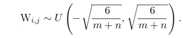

- **random orthogonal matrices(随机正交初始化)**

    -   **随机正交初始化**

        在根据上面的分布得出随机权重之后,使参数矩阵层内的所有参数为随机正交矩阵.

        设计这个矩阵的时候,需要适当的设置缩放或增益因子g. 因为,随机正交矩阵是指能针对线性单元的,但是由于每层都有非线性函数.因此,每层需要用因子g来补偿.每种激活函数都对应着不同的因子.

        该模型的[论文](Exact solutions to the nonlinear dynamics of learning in deep linear neural networks.)

    -   **作用**

        在这个模型下,可以保证收敛为止的迭代次数与模型的深度无关.

        增大这个缩放因子,会使得模型在前向传播中的激活值变大,是在后向传播中的梯度值变大.因此可以用这个因子去调节模型参数的scale.某研究表明,适当的设置缩放因子可以在不使用正交化初始参数的情况下,使得深度模型达到1000层.原因是,我们如果可以通过缩放因子让每一层的激活值或者梯度的范数都保持稳定,那么将可以避免梯度爆炸或者梯度消失的情况.

    -   **缺陷**

        1.  很难保证我们设置的缩放因子可以达到我们期望的效果.
        2.  随着训练的进行,因子不再适应后续的模型,无法持续发光发热
        3.  可能会造成过拟合.​​

#### 8.4.3 Drawback

-   **缺陷**

    上面的方法都可以称为数值范围准则,这里的数值范围是指分布的取值范围.即,都对权重的取值进行了约束.

    例如,利用网络结构取均匀分布的:

    ​						$W_{i,j} \sim U(−1/\sqrt m,1/\sqrt m)$

    这个分布的标准差是: 		$1/\sqrt{m}$

    当m很大的时候,这一层的权重就会变得很小.

-   **弥补方法**

    -   **稀疏初始化**

        为了解决这种问题.提出了**稀疏初始化**的方法.这个方法要求设置每个unit的权重的k个值为非0的,这样就可以使得权重的大小独立于m.不过这样的话,就会使得方差变大,因此获得较大取值的权重也同时被加了很强的先验.因为梯度下降需要很长时间缩小 ‘‘不正确’’ 的大值,这个初始化方案可能会导致某些单元出问题,例如 maxout 单元有几个过滤器,互相之间必须仔细调整。

    -   **hyperparameter**

        将每层的数值范围作为一个超参数去调整也是一个方法.可以使用在11.4.2 节中介绍的随机搜索的方法去:

        1.  搜索确定权重的取值范围
        2.  是否采用稀疏初始化的方法.

        大致原理是:

        通过观察一个minibatch下激活值和梯度的范围和标准差来观察.如果权重设置的太小的话,那么激活值的范围将会在通过这层之后变小.那么便提高这一层的权重大小.通过重复这个构成我们可以获得一个合适的初始值.这个是前向传播的检测方法,如果发现在后向传播时速度很慢,那么可以观察梯度的范围和标准差.

        **作为替代,我们可以手动搜索最优初始范围。**

        这个方法要比在验证集上验证超参数的速度要快,因为他只用了一个minibatch进行测试.

#### 8.4.4 Bias Initialization

刚才一直在讨论权重的初始化方法,下面来讨论Bias的1,一般这个全采用0就可以了.但是也存在如下几个情况.

-   **输出的分布高度不平衡**:

    在一开始权重还很小的时候,决策基本上可以说是靠bias决定的.假设一个在输出上的分布为高度偏斜分布的分类模型.我们可以在一开始设置 $softmax(b) =c$ 使得其在一开始能够最大程度匹配成功.

-   **避免饱和**

    比如ReLU激活的话,需要设置大于0的初始值,以防饱和.这种方法不适用于不希望偏置具有很强输入的权重初始化准则。比如说,不适用于随机游走初始化.论文为:Random Walk Initialization for Training Very Deep Feedforward Networks

-   ......跳过,看不懂

#### 8.4.5 Others

除此之外还有 **variance or precision parameter**. 

比如在线性回归模型中:

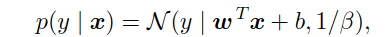

这个是用于计算损失函数的公式.这里面, $1/\beta$ 就是精确度参数, $\beta$ 就是方差.

通常初始化为1.

这个也可以和bias联系起来,还是假设初始权重都很低,那么output的概率是由bias决定的,这个时候,可以通过使得只考虑bias的输出概率最大程度的符合 $p(y|x)$ 就好,根此计算方差.

在第三部分还有一些策略,有机会再看吧.

**终于完了这一小节,真的太痛苦了.**

由于电脑丢了，从下面开始两节半近7000字笔记得重写，心痛！

### 8.5 	Algorithms with Adaptive Learning Rates  

我们认为学习率的调整是最难调整的一个参数,因为他很显著地影响着模型的性能.

我们知道,通过动量算法,我们一定程度上解决了cost在参数空间各个方向变化不平衡的问题.但是动量算法引入了另外一个超参数,使得模型变得复杂.在动量算法中我们使用的是同一学习速率,然后通过不断地改变原有的方向来加速下降.在这里提出一个新的想法,就是认为参数空间的下降速率是轴分布的,也就是对不同的下降方向采取不同的下降速率.

下面我们介绍几种, delta-bar-delta算法.算法的基本原理是:

- 当某个参数关于loss的偏导数的方向(符号)不变时,则增大学习率;反之,减小学习率.

**这种方法只适用于full batch optimization**

#### 8.5.1 AdaGrad

详细见[博客](http://book.51cto.com/art/201710/555102.htm)

- 要解决的问题

  在下降过程中,

  - 由于**各个方向的梯度下降速率不同**
  - 且又因为**在任何一个点的任何一个方向的下降速率与局部最小值点处位置无关**

  所以以某一个学习速率在各个方向同时进行梯度下降有可能造成下图的问题.

  **下降方向偏向一个方向,下降失衡**

  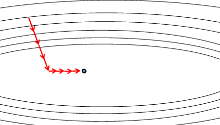

- 解决方法:

  采取方法是,每个方向设立一个学习速率,算法为;

  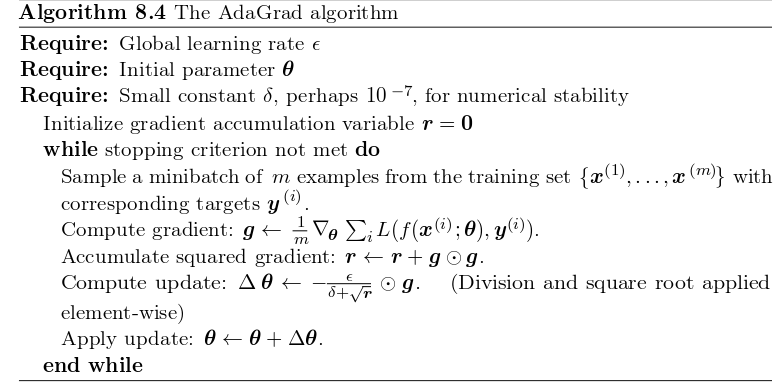

  通过这个算法我们发现,

  - **学习速率总体来说时越来越慢的**,因为分母在不断地增大.
  - **下降方向能够在下降过程中达到一个平衡**,因为一开始下降速率大的方向在后期学习速率变小.而,一开始下降速率小的方向后期的学习速率会相对的变大.

  结果如下图所示:

  

- **缺点:**

  1. 训练到中后期，递推路径上累加的梯度平方和越打越多，迅速使得Gradinet被惩罚逼近0，提前结束训练.
  2. 由公式可以看出，仍依赖于人工设置一个全局学习率 
  3. $\epsilon$ 设置过大的话，会使regularizer过于敏感，对梯度的调节太大

- **特点**:

  1. 前期 $g_t$ 较小的时候， regularizer较大，能够放大梯度 
  2. 后期 $g_t$ 较大的时候，regularizer较小，能够约束梯度 
  3. 适合处理稀疏梯度 

#### 8.5.2 AdaDelta

这个算法是AdaGrad的改进.

由于这一部分不是取自书中,而是取自博客,下面采用不同的表记进行描述,会在描述时与书中的符合进行对应.

先看AdaGrad中的表记:

$\triangle \theta_t= -\epsilon\cdot g_t/(\delta+\sqrt{r_t})$

其中, $r_t=r_{t-1}+g_t\cdot g_t$

而AdaDelta对这两部分都进行了修改.

- 对 $\epsilon$ 进行了修改,在原先的设计中, $\epsilon$ 是一个全局学习率,是需要自己设定的.而在AdaDelta中.

  $\epsilon=RMS[Δθ]_{t−1}=\sqrt{E[Δθ^2]_t+\delta}$     其中 , $E[Δθ^2]_t=γE[Δθ^2]_{t−1}+(1−γ)Δθ^2_t$

- 对 $r_t$ 进行了修改,改变了之前不断叠加的形式,那样会使得下降变慢.

  $r_t = \phi r_{t-1}+(1-\phi)g_t\cdot g_t$

**特点:**

1. 训练初中期，加速效果不错，很快 
2. 训练后期，反复在局部最小值附近抖动 

#### 8.5.3 RMSProp

- AdaGrad的缺点

  在后期,下降速率会变得特别小.

- 解决方案:RMSProp算法

  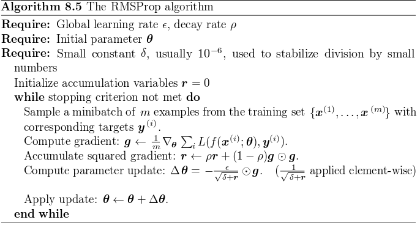

  RMSProp算法是AdaDelta的一个特例,这个里面,还原了全局学习率

  这个算法是通过指数下降平均舍弃久远历史对本次下降的影响.体现在算法里面是 $\rho$ .

  这个算法在应用得到了青睐,是现在的常用下降算法之一.

- **特点**

  1. RMSprop依然依赖于全局学习率 

  2. RMSprop算是Adagrad的一种发展，和Adadelta的变体，效果趋于二者之间

  3. 适合处理非平稳目标,对于RNN效果很好 

     ​

#### 8.5.4 Adam

算法如下

该算法是RMSProp和动量算法的结合.

首先我们先回顾这两个算法的核心:

动量算法:

由于函数在各个方向上的下降方向不同且值相差较大,因此向梯度下降中加入惯性因子,使得下降不会来回震荡的过分.

RMSProp算法:

由于函数形状的任意性和各下降方向的下降速率不同的特点,容易造成下降偏向某一个方向的问题.为了解决这个问题有了,RMSProp算法.

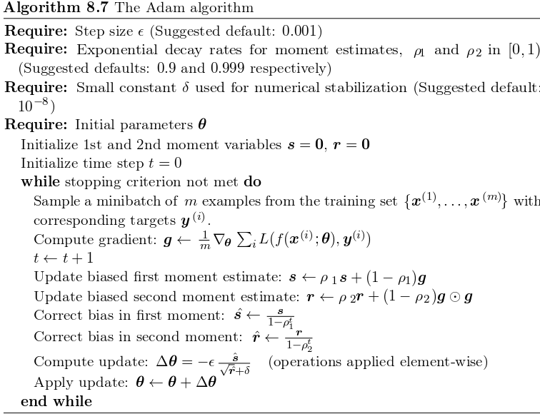

如上图所示,

1. Update biased first moment estimate:  $s ← ρ_1s + (1 − ρ_1)g$ : 这个地方说的就是动量算法.
2. Update biased second moment estimate: $r ← ρ2r + (1 − ρ2)g \cdot g$ : 这个地方是RMSProp算法.

- **特点**

  1. 结合了Adagrad善于处理稀疏梯度和RMSprop善于处理非平稳目标的优点 
  2. 对内存需求较小 
  3. 为不同的参数计算不同的自适应学习率 
  4. 也适用于大多非凸优化,适用于大数据集和高维空间

  ​

#### 8.5.5 Choosing the Right Optimization Algorithm

并没有一个共识说哪一个算法是最好的.经过测试,效果较好的是 AdaDelta 算法和 RMSProp算法.

在实际应用时,应用最广泛的是SGD, SGD with momentum, RMSProp, RMSProp with momentum, AdaDelta, and Adam. 

这几个算法到时候需要实现.

------

上面讲述的各种算法的直观表示,取自[博客](http://ruder.io/optimizing-gradient-descent/):

1. 一个有四个局部最小的函数:

   

2. 在一个鞍点上:

   

   ​

   ​

### 

### 8.6 Approximate Second-Order Methods

二阶方法

#### 8.6.1 Newton’s Method

牛顿法从两个方面来看:

- 解决凸问题:

  在二项式问题时,可以一步到位.

  在更高项的曲面中,可以通过迭代使用牛顿法来找到局部最小值点,算法如下图所示:

  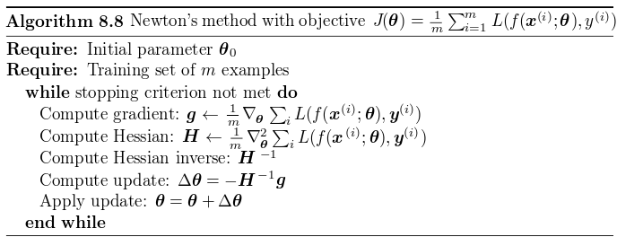

- 解决非凸问题:

  在Hessian矩阵不是正定矩阵的时候,可以通过向  $H$ 加入一个 $\alpha$ 的方法来解决.这个方法也叫作正则化Hessian矩阵.

  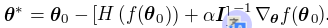

  这个方法叫做:Levenberg-Marquardt algorithm

  这个方法是牛顿法的一个简单近似,不过也只能在负特征值较小的情况下得到较好的结果,如果有很大的负特征值的话就需要加非常大的 $\alpha I$ , 这样的话,就会使得下降方向被 $\alpha I$ 主导.

  此时,由于梯度下降的幅度很小,使得牛顿法的效果还没有梯度下降的好.

**牛顿法的效率问题**

牛顿法的效率问题使得其无法适用于神经网络的训练,因为求Hessian矩阵的逆会消耗特别大的计算量.

对于k个参数的神经网络而言,需要 $O(k^3)$ 的运算复杂度.并且这么高的复杂度的运算需要在每次的迭代中都应用一次.

在之后的章节中会介绍一些用到牛顿法的优点并且没有这类障碍的方法.

#### 8.6.2 Conjugate Gradients

共轭梯度法

#####8.6.2.1 intitutive

首先说明共轭梯度法的intitutive.

**向一阶方法中加入二阶信息,以在解决一阶方法问题的同时,避免了二阶方法计算量大的问题**

- 一阶方法示例:

  这里举的例子是一个特殊的例子,不是正常的梯度下降.

  **假设在一个二项曲面中**,在初始点的下降方向上一直下降到这个方向的下降速率为0停止.即:

  $d_{t-1}:∇_{\theta}J(\theta)\cdot d_{-1}=0$

  那么接下来的下降方向肯定是与 $d_{t-1}$ 垂直的方向.也就是:

  $d_{t-1}\cdot d_t=0$ , 图示如下:

  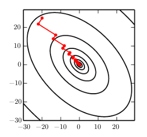

  我们会发现这个图中下降路径走的还是一个之字形.浪费了迭代步骤,这就相当于在某一个迭代之后,在这个方向上达到了暂时的最小值,但是在下次下降的方向(与上次的方向垂直)下降的过程中国,又会抵消掉之前的努力.因为这里的垂直是**一阶意义上的垂直**.

- 加入二阶信息:

  首先要知道什么是共轭梯度:

  给定一个**positive definite**矩阵Q， 我们说**非零**向量x,y 关于是Q-conjugate，如果他们满足:

  $x^TQy=0$, 那么就可以说x和y是共轭梯度.

  而这里我们加入了Hessian,也就是说加入了二阶信息.

  我们在一阶(特殊)方法的基础上,进行修改:

  $d_{t-1}$ 的步骤不该,不过在选择 $d_t$ 上进行改变.$d_t$ 不应该是 $d_{t-1}$ 的一阶意义上的垂直向量,而应该是共轭向量,也就是:

  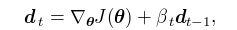

  其中, $\beta$ 就是调整 $d_t$ 为  $d_{t-1}$ 方向的一个参数,计算方法有两个:

  1. Fletcher-Reeves:

     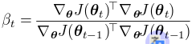

  2. Polak-Ribière:

     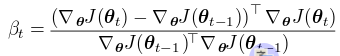

##### 8.6.2.1 intitutive

- 共轭梯度法的效果:

  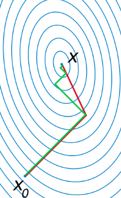

- 共轭梯度的算法:

  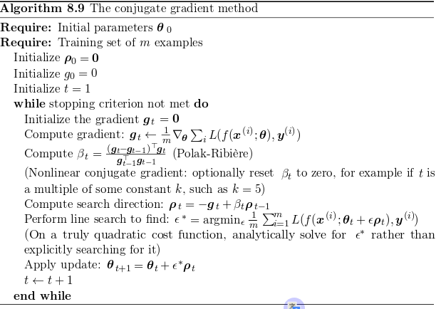

##### 8.6.2.3 Nonlinear Conjugate Gradients

关于非线性共轭梯度法的[详细介绍](http://reference.wolfram.com/language/tutorial/UnconstrainedOptimizationConjugateGradientMethods.html)

非线性共轭梯度法是为了解决实际的函数并非二次曲面的问题.

大致的方法是随机重新启动线性的共轭梯度算法.也就是重复应用.不过一般在进行非线性共轭梯度法之前,通常先经过线搜索的方法来下降一定步骤.

上述的方法虽说全都是基于batch method ,但是在minibatch的版本经过测试同样可以去训练神经网络.还有专门为神经网络设计的共轭算法:scaled conjugate gradients algorithm

#### 8.6.3 BFGS

- BFGS

  BFGS是牛顿法的一个近似.用一个简单的迭代方法求 Hessian矩阵逆的近似.

  BFGS又叫做拟牛顿法.具体的实现方法有很多很复杂,用到的时候可以再[详细了解](http://blog.csdn.net/acdreamers/article/details/44664941).

  其实BFGS是牛顿法的一种,实际存在很多的拟牛顿法.而BFGS是其中效果最好的一个.

  BFGS算法,在对Hessian的拟进行近似之后,也就确定了接下来要下降的方向,此时要**以线搜索的方式**进行下降。

  > 注意:这里虽然已经将牛顿法模拟了出来,不过还是要结合线搜索.

  也就是说,和共轭梯度一样,BFGS算法也实现的是向一阶方法(线搜索)中加入二阶信息的方法.

  但是,BFGS的缺点是,需要储存Hessian逆的数据 $O(n^2)$ ,这对于有很大数据量的问题而言是难以接受的.

  ​

- Limited Memory BFGS (or L-BFGS)

  这里虽然没有写,不过BFGS算法中Hessian逆的近似是需要之前的一些Hessian矩阵的信息的.

  BFGS拟牛顿近似算法虽然免去了计算海森矩阵的烦恼，但是我们仍然需要保存每次迭代的历史值。这依然没有减轻内存负担，要知道我们选用拟牛顿法的初衷就是减小内存占用。

  L-BFGS是limited BFGS的缩写，简单地只使用最近的m个记录值,而不是使用全部的.

  ​

### 8.7 Optimization Strategies and Meta-Algorithms

下面介绍的不是算法,而是一些设计算法的思路和模板.

#### 8.7.1 Batch Normalization

**Batch Normalization的本质是一个 adaptive reparametrization(自适应调参理论)**

##### 8.7.1.1 Difficulty in Deep Model

在上面我们花了很多功夫去处理二阶方法(牛顿法)的近似问题,那么为什么要使用牛顿方法呢?

- 从几何上理解:

  我们的函数不是平面,我们应该用曲面去模拟其局部曲面信息,以便于做出到达最小值的最佳路径预测.但是问题在于,二项曲面也只是一种假设,实际的问题可能是更高阶的曲面.

- 从函数理解:

  我们如果利用泰勒公式去分解原函数,精确到二阶的近似肯定精确度要大于一阶导数.因此需要用到二阶方法.

举一个简单的例子:

现在假设一个隐含单元为线性单元,且每层只有一个单元的深层模型:

$y=xw_1w_2...w_n$

现在假设其在某个点的梯度为 $\vec{g} = g_1,...,g_n$

那么,按照正确的逻辑推导,新的 y 值为:

$\hat{y} = x(w_1-\epsilon g_1)...(w_n-\epsilon g_n)=xw_1...w_n-\epsilon x\sum_i g_i\prod_{j\ne i}^n w_j+ \epsilon^2 x\sum_{i,j}g_i,g_j\prod_{k\ne i,j}^nw_k+....$

从这个式子中我们可以看出,在一阶方法中,我们兼顾到了第一,二项,但是没有兼顾到第二项.在牛顿法中我们兼顾到了第三项,但是后面又兼顾不到.

通过分析这个式子我们发现,在第三项中,如果 $w_j$ 都大于1的话,第三项对整个式子的影响是很大的.为了防止这种情况我们才引入了二阶方法-牛顿法.

**但是,在非常深的模型中,即使考虑到第四项,第五项也会遗失很多信息,而要在下降时考虑这么高项的基础上进行预测是几乎不可能的**

##### 8.7.1.2 Batch Normalization

- **算法描述**

  而BN可以解决这个问题.**intituive:使在梯度下降的过程中不会放大某一层激活值的平均值和方差.**方法如下:

  1. 对于一个n层的网络,设网络的所有激活值为 $H$

  2. 使得: $H' = (H-\mu)/\sigma$ , 其中 $\mu$ 为均值 , $\sigma$ 为平均差.计算的是某一层层网络中的所有激活单元的均值和平均差.

  3. 通过这样的处理,我们发现所有层的激活值都变成了均值为0,方差为1的分布.但是,这还没有完,还要加最后一步: 对得到的激活值信息再进行一步仿射变换.见下面算法步骤中的第四步.这样做的目的是,前面的操作会使得激活值都偏处于sigmod函数的中间线性区域(见下图),降低了模型的表征能力,因此加入两个新的参数(用于仿射变换).引入仿射变换的权值和偏置是可以学习的.

     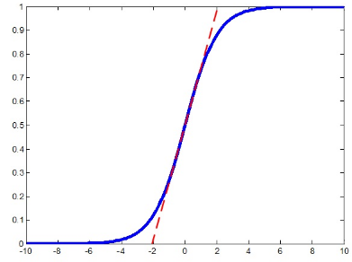

     这幅图中的线性部分就是经过前三步不经过最后一步仿射变换的情况是,数据会集中的区域.如果是这样的话,我们会发现,非线性函数形同虚设.

- **完整的算法:**

  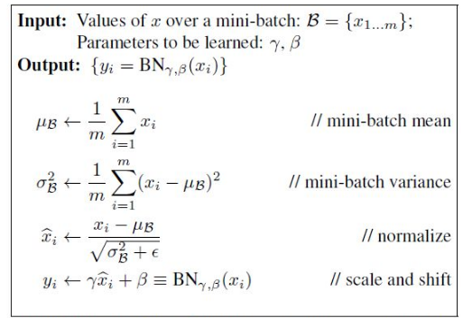

  其中学习第四步的参数的方法如下:

  也就是依据链式法则:

  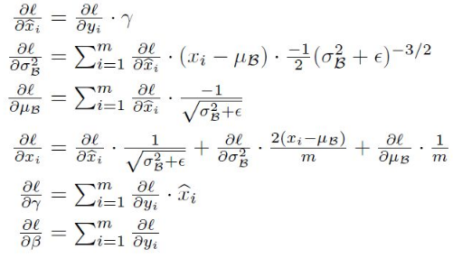

##### 8.7.1.3  Solve 8.7.1.1

在上面提到的线性模型中,如果我们应用BN算法,我们会得知,低层次的layer全都是没有用的,因为每层经过归一化后,便将上一层的仿射效果抵消了.那么,模型就变成了简单的:

$y=w_lh_{l-1}$

先不考虑模型的容量下降的问题,我们会发现模型易于训练了.这是因为在归一化的过程中,单层的一阶效果一阶两层传递的二阶效果全都被归一化抵消了.但是由于容量的降低,这个线性模型也失去了应有的能力.

这个是在线性模型下的讨论,**但是,类比到非线性的情况下,我们会发现情况有所改变**.

1. 虽然在非线性模型下进行BN算法也会使容量降低,但是由于激活函数是非线性函数,所以模型的底层的效果不会消失,因此模型还是具有较高的容量.
2. 虽然,有非线性模型下,还是没有办法模拟高阶的导数信息,但是在归一化的过程中,使得高阶的影响变小.这一个点可以从两个方面理解:
   - 从线性模型的类比:线性模型的高阶信息完全消失,非线性模型的高阶信息不会完全消失但会适当减小.
   - 从结果上想:由于归一化,使得 $w_i$ 大部分都小于1.不会出现,8.7.1.1中担心的情况,即省略的高阶中含有很多信息的情况.

##### 8.7.1.4 Geometric understanding 

**几何直观理解**

详见[博客](https://zhuanlan.zhihu.com/p/24810318)

现在假设激活函数为tanh函数:

- 对每一个单元的处理效果:

  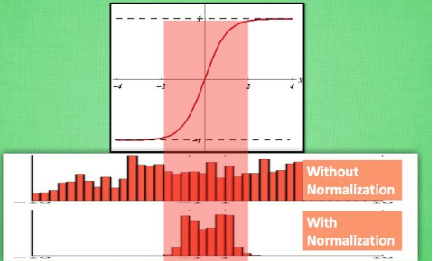

- 对于层与层之间的影响:

  两层之间:

  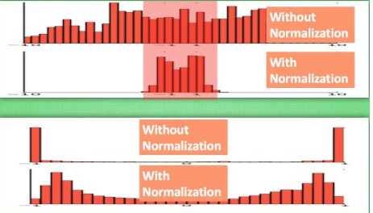

  多层之间:

  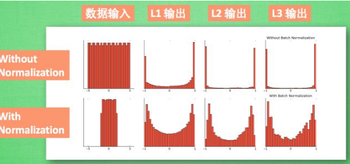

##### 8.7.1.5 Gadient Complete

[**解决了梯度间的竞争问题**](https://www.zhihu.com/question/38102762)

这个说法是BN算法可以解决,之前在动量算法和Adam算法处遇到的问题(梯度下降之间的竞争).

**首先我们考虑为什么会发生这种竞争.**

- 在之前的说法是,在不同点的下降方向不同,且函数具有非常复杂的形状,如果只考虑一阶方法的话,会造成之字型路径.
- 但是,博客这里提到的一点是,每个batch之间的数据不一样,也就是有不一样的偏向,不能完完整整地模拟原始分布,而在深层模型中,由于非线性函数的存在,这种偏差被放大.(见上上图).因此,每个batch都会或多或少的偏离真实的分布,因此不同次的batch之间会发生竞争,这个竞争说白了是每次batch数据具有的独特性导致的.

那么这两个说法哪个是正确的呢?

- 第一个说法,其实是在优化上存在的问题.
- 第二个说法,其实是取样上存在的问题.

这两个问题同时存在且具有叠加性,使得经竞争更加激烈.

**解决这种竞争**

根据博客的说法,在深层模型中,越到训练的后期,梯度间的竞争就会越激烈.(因为而BN算法和动量算法和Adam算法不同,这俩都是在产生不好的后果后去想办法弥补.

而BN算法是争取在一开始既避免产生这个问题,是一种全局式的解决方法.通过归一化每层的激活值,使得模型不会在每个batch上的独特性上越跑越瞎越远.因为到后期的话,batch与batch之间的共性已经定性,训练调整的更多是独特性.因此到后期会竞争激烈.

##### 8.7.1.6 Internal Covariate Shift 

[**Internal Covariate Shift**](http://blog.csdn.net/mao_xiao_feng/article/details/54317852)

- **什么是 ICS?**

  ICS是指测试集上一个点的概率密度和训练集上一个点的概率密度引发的问题.详细见下图:

  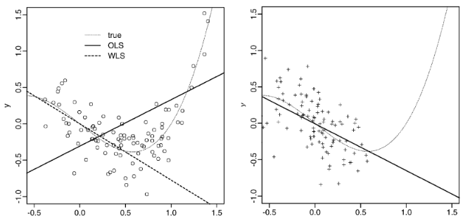

  图的解释见博客.

- **ICS与BN算法的关系**

  在原来的论文上,直接提到,使用BN算法可以直接解决ICS问题.

  我的理解是,通过归一化激活值,使得每层中的数据都拥有了相近的分布,也就是说,在训练的时候,使得测试集上的点的概率密度成为一个均值为0,方差为1的分布.在前向计算的时候,如果也可以使得数据分布能够实现分布标准化的话,便可以一定程度上解决上面的ICS问题.

  但是,这一点似乎有一个牵强附会.对于测试集数据和训练集数据的分布略有不同,但大致相同的情况.BN算法确实可以实现这一点.但是,比如,上图中,就无法通过BN得到好的归一化,这种情况下的归一化的情况是会使得两个集的样本分布完全不同.

##### 8.7.1.7 Whitening

- **什么是白化?**

  白化也是归一化的一个手段,根本目的是消除各特征之间的相关性,并使得各特征具有相同的标度.

  并且是最为准确的一个方法.就是将样本点PCA化之后(利用特征向量旋转),再利用特征值归一化(除以特征值).图如下,分别为原图,PCA之后的图和白化之后的图:

  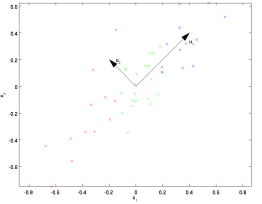 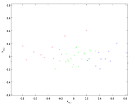 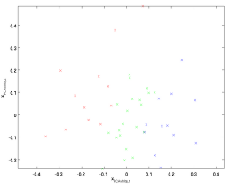

  更详细的解释见[博客](http://ufldl.stanford.edu/wiki/index.php/%E7%99%BD%E5%8C%96).

- **BN算法与白化的关系:**

  而BN算法就是白化的一种近似,因为PCA计算特征非常消耗资源,因此必须要简化.就是BN.

  向神经网络加入这种白化有什么效果呢?以下分析来源于[博客](http://blog.csdn.net/happynear/article/details/44238541)

  在不经过归一化的空间中,数据有可能只是集中在一小块空间,以二维空间为例:

  

  这个图中的红点我们认为是不同样本的特征值,但是由于其只在一小部分空间.现在我们假设用一个线段来模拟其分布.

  在这种情况下在一开始的随机选择权重的时候,很难能够找到一条线段对点进行有效的分割,或者模拟其分布.这个在二维的情况下也需要尝试几次才可以,要是在n个参数下,难度会成 $2^n$ 上升.并且即使线段到达了相近的区域,也可能因为学习率过大而造成再次偏离样本点区域.使得训练严重依赖初始化参数以及学习率等超参数.

  而通过归一化操作可以大大节省训练时间,以及降低对初始化参数以及学习率的依赖.

##### 8.7.1.8 **Effect** 

综上所述,BN算法的优点有:

1. 放宽了对网络初始化的要求.
2. 放宽了对learning rate的要求.
3. .轻微正则化：归一化z值（算法第三步）以及重新映射z值（算法第四步）过程中会引入轻微噪声，起到正则化目的，原理与dropout类似。
4. covariate shit：大致意思是归一化可以使输入的均值和标准差稳定

##### 8.7.1.9 Others

- **反归一化的作用**

  在反归一化(也就是算法第四步)的时候,我们通过 $γH'+\beta$ 的方式,将我们好不容易归一化的数据又赋予了一个不为0的均值,岂不是浪费功夫.

  答,这个转折是非常重要的,首先我们要明白,我们为什么要反归一化?

  关于 $γ$ 的作用,再上面讲过了,就是要使得激活函数发挥功效.

  关于 $\beta$ 的作用,恢复数据的一部分信息.比如我网络中间某一层学习到特征数据本身就分布在S型激活函数的两侧,但是通过归一化将其强行归为0,岂不是很尴尬,因此,这里采用了 $\beta$.

  $\beta$ 所携带的信息在原来的模型中,是通过层与层之间复杂的交互表达的,而在这个时候,单单一个量 $\beta$ 便可以表达,多棒!!!

- **归一化的位置**

  上面的例子是最简单的线性模型,且其中的线性单元没有偏置,而在实际的计算过程中我们面临的是这样的激活单元: $φ(XW+b)$

  那么,我们应该是对 $X$ 进行BN还是对 $XW+b$ 进行BN呢?

  通过[研究](Ioffe and Szegedy (2015))表明,应该将 $XW+b$ 进行BN算法处理,并且应该把 b 去掉,因为他的功效会被后来的 $\beta$ 代替.

#### 8.7.2 Coordinate Descent

##### 8.7.2.1 Coordinate Descent

- **什么是坐标下降法**

  对于一个可微的凸函数.对每一个轴分别在固定其他轴的情况下查找这个轴上上的最小值位置.再将全部的轴遍历过一遍后,可以得到一个较小的值,但是接下来还要重复这个过程,才可以保证找到最小值.算法如下:

  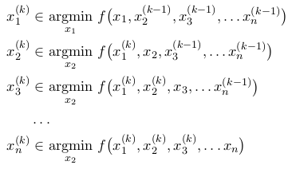

  在而为函数下的下降路径大致如下:

  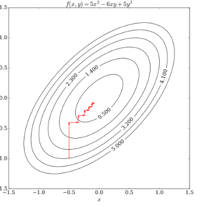

- **Block coordinate Descent**

   就是每次不是将一个轴(参数)作为考虑的中心,而是将一部分轴(参数)作为考虑的中心.

  这样, coordinate Decent 也就不再是一个算法,而是一种优化的思想,可以讲参数分为几部分,然后再根据每部分参数的特性,应用不同的优化算法进行求解,如8.7.2.2中的稀疏编码问题的求解.关于相关解释在下面黑点

- **Coordinate Descent in Sparse coding**

  之所以在这里将是因为,坐标下降法非常擅长处理这类问题.

  这类问题有什么特点呢?

  **一部分轴对结果的影响非常大,而其他轴的影响特别小.** 

  虽然在这个问题中的代价函数不是一个凸函数,但是在将参数分为两部分 参数$a$ 和 基向量$\phi$  之后,问题就变成了凸问题,这个时候就可以采用 **Block coordinate Descent**.

  将所有参数分成两部分后,就可以采用不同的方法进行下降.

- **Coordinate descent 不适用的情况**

  在两个参数互相影响的十分深的时候就不建议适用坐标下降法.例如下面这个公式:

  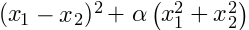

- **坐标下降法的理论基础是:**

  对于一个可微的凸函数,如果某个点的每个轴的值,都处于这个轴的最小值的位置,那么这个点就是函数的(局部)最小值

  注意

  1. 对于某些点不可微的凸函数,这个理论是不成立的,如下图:

     不可微的原因是,在不可微点处,落入某个迭代的中的最小值的解后,无法通过再次取其他轴的倒数来实现跳出.

     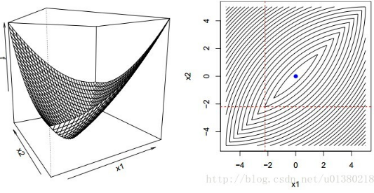

  2. 对于由可微的凸函数和局部不可微的凸函数组成的组合函数,理论是成立的.如下图

      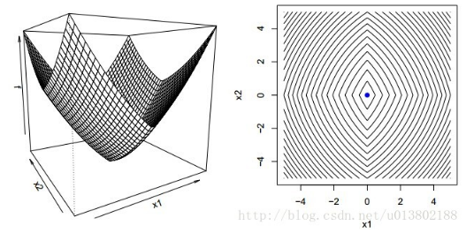

##### 8.7.2.2 Sparse coding
以下内容来源于[博客](http://ufldl.stanford.edu/wiki/index.php/%E7%A8%80%E7%96%8F%E7%BC%96%E7%A0%81),更多有关稀疏编码的内容详见此博客.

- **目标**

  **稀疏编码的核心是构建一组基向量能够重构训练集中的输入数据.**

  但是,这里的基向量不是通过简单的正交变换可以实现的,这里要求**新构建的基向量的维度要大于源数据的维度.**

  即, 对于训练集中的 $x \in \mathbb{R}^n$ , 找到  $\phi \in \mathbb{R}^n$  , 使得 $x = \sum_i^k a_i\phi_i$ , 其中 $k > n$.

  这里的 $\phi_1,...,\phi_k$ 被称为超完备向量.因为他的个数大于需要的基向量数目.

- **Intituive**

  主要是基于自然数据,因为在自然数据,比如图像(文字不能算), 都可以被理解为少量基本元素的叠加,在图像中这些元素可以是面或者是线.在图像中,我们输入的是我们提取的特征值或者是像素块,那么我们就可以就这些内容进行推测,是由什么面或线组成的.

- **公式**

  为了实现这个目标,构建一个公式:

  

  这个公式中,设训练集有m个输入向量.因此,我们需要训练出 **k个基向量**, **m\*k个权重参数**

  式子中的第一项就是为了训练出 $x = \sum_i^k a_i\phi_i$ 的效果,.

  而第二项就很有意思了,这也是稀疏的核心. S() 函数是一个稀疏代价函数.目的是使得, **对于一组输入向量，我们只想有尽可能少的几个系数远大于零。**

  稀疏函数可以选择L1范式代价函数或者对数代价函数 $S(a_i)=log(1+a_i)$

  >  **注意项:**
  >
  > 在训练过程中,可能会出现, 使 $\phi$ 很大, $a$ 很小的下降路径来逃避第二项稀疏项的惩罚.因此,需要要使 $||\phi|| \le C$

- **缺点:**

  根据前面的的描述，稀疏编码是有一个明显的局限性的，这就是即使已经学习得到一组基向量，如果为了对新的数据样本进行“编码”，我们必须再次执行优化过程来得到所需的系数。这个显著的“实时”消耗意味着，即使是在测试中,实现稀疏编码也需要高昂的计算成本，尤其是与典型的前馈结构算法相比。

#### 8.7.3 Polyak Averaging

非常直白的一个方法:

1. 对于凸问题

   记录n个下降轨迹中经过的参数点 $\theta_1,...,\theta_n$ 

   取其平均值作为下一个下降的起点,即 $\hat{\theta_n}=\sum_i^n \frac{1}{t}\theta_i$

   原因是,由于学习率等等的问题,有时函数会在下降过程中不断地经过谷底上去又下来,但始终无法靠近地步,这个时候,就可以将过去的点进行平均得到谷底的大概位置.

2. 对于非凸问题

   由于可能在下降过程中经过很复杂的地形.因此,前面的步骤走过的点不再重要,因此可以采取指数遗忘的方式.

   $\hat{\theta_n}=\alpha \hat{\theta_{n-1}}+(1-\alpha) \theta_n$

#### 8.7.4 Supervised Pretraining

监督预训练.

##### 8.7.4.1 Pretraining

预训练就是指,当目标任务过于复杂,或者难以优化的时候,先对一个简单任务处理之后,再去面对那个复杂的问题,就像在翻译模型中,先通过预训练训练出词向量,再引用到机器翻译的模型中去的过程.

##### 8.7.4.2 Greedy algorithm

预训练的这种,将问题分解成几个小问题的方式类似于贪心算法.

贪心算法是指:

将一个full question分解成一些小问题后,对这些小问题分别求出最优解.但是问题在于,在将这些小问题的最优解进行组合之后得到的不一定是full question的最优解.

但是即使有这种缺点,贪心算法的效率还是要高于联合参数(全部参数)的full question.有时候,即使不是最优解,但是是可以接受的.

并且一般这个算法可以可以作为整个求解的一部分,**贪心算法可以最快的让解到达最优解的附近,之后可以通过解决full question的方法,对参数进行微调**

而,通过这里我们就发现, **预处理其实就是贪心算法**

In this section, we describe specifically those pretraining algorithms that break supervised learning problems into other simpler supervised learning problems. This approach is known as **greedy supervised pretraining**

#####8.7.4.3  greedy supervised pretaining

- 介绍两个使用了greedy supervised pretaining算法训练神经网络的方法.

  1. 2007年较为原始的方法.

  - 对于一个深层网络,先用raw input和一层神经元,来训练一个浅层网络.
  - 下一步,将上一步的参数固定,那一层神经元的输出作为新增的一层神经元的输入.进行训练
  - 如此反复
  - 最后,joint training,进行微调.

  2. 2015引用到卷积神经网络

  - 先预训练了一个11层的神经网络
  - 取预训练网络的底部四层和顶部三层去做一个新的更深的网络(17层)的底部和顶部.中间的新增层随机化.进行训练.

- greedy supervised pretaining为什么管用

  通过预训练,将解的范围缩小了,**预训练可以帮助提升泛化和优化的效果**

##### 8.7.4.4 Apply in Transfer learning

2014 Yosinski 将预训练和迁移学习联系到了一起.方法是:

- 先通过一个1000类别的图像数据库结合一个8层的CNN进行了训练
- 取这个网络的前n层,再补充新的8-n层,训练一个新的1000类别的图像数据库.
- 新的网络在更少量的数据的情况下就可以实现好的结果.

##### 8.7.4.4 Fitnets

Model Compression,这属于一种模型压缩的方法,详见[博客](https://luofanghao.github.io/blog/2016/07/24/%E8%AE%BA%E6%96%87%E7%AC%94%E8%AE%B0-%E3%80%8AFitNets-Hints-for-Thin-Deep-Nets%E3%80%8B/)

简单来说,这个算法就是**利用一个矮胖子当老师去帮助一个高瘦子训练**.图示如下:

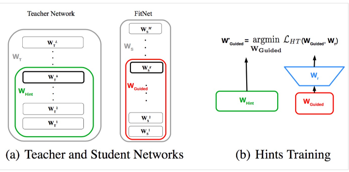

矮胖子就是teacher 网络, 高瘦子就是student网络.其中,我们先正常地训练teacher网络.再去训练高瘦子网络.

**注意了:训练高瘦子网络的方法有诀窍,就是除了利用本身的数据这个网络之外,还要利用teacher网络中的已有参数**

利用方法是:

利用**Teacher网络的前h层layer得到的激活值 $\mu_h$,**作为**Student网络中前g层网络的目标值** , **Student网络中前g层网络的实际预测值设为 $v_g$**, 进行训练.

这里由于一个胖,一个瘦,因此,使用 胖子网络第h层的激活值 之前,要先将其转换为 瘦子的维度,这个操作通过蓝色倒梯形的 $W_r$ 来实现.右边的式子 $W'_{Guided}$ 扩展开如下.其中 

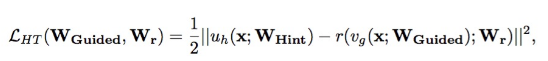

全部算法如下:

通过胖老师的指导,瘦学生变得十分出色,青出于蓝而胜于蓝.

#### 8.7.5 Designing Models to Aid Optimization

前面我们都是从提升优化算法的角度去提升优化效率.但是其实也可以通过改变模型,使其易优化的角度去分析.

- 激活函数的设计

  实际上,模型的改变才是促进优化提升的主要动力,像LSTM,RuLU激活函数和maxout激活函数,都是倾向于使用更多的线性部分.并且之前也讨论过,线性的激活函数还可以在较大的预测偏差下也能很好地实现下降.

- 其他的方面

  linear paths or skip connections(连接跳跃)

  可以缩短底层unit到output的最短路径.因此减轻梯度消失以及梯度爆炸.

  skip connections : GoogLeNet:直接将output复制到中间层,用来跳跃.

#### 8.7.6 Continuation Methods and Curriculum Learning

回顾8.2.7 节,我们提到了,初始化参数的重要性.下面就来解决这个问题.就是去想办法初始化一个最接近正解的参数集.

##### 8.7.6.1 Continuation methods

- **什么是?**

  这个方法是利用到了目标函数(损失函数)的复杂度.下面是 intuition:

  **一般认为,越简单的损失函数相比于复杂的损失函数而言,在拥有相同参数的情况下,会有更好的表现.也就是说,更容易落在拥有更好的局部最小值的区域.**

  现在设计一组损失函数 : ${J_0,J_1,...,J_n}$

  损失函数的复杂度由低到高,那么我们就从简单到复杂,依次进行优化.并且将前一个损失函数下的解作为下一组优化的初始值.

  其实,Continuation methods算法和退火算法有点像,都是通过某种方法扩大了一开始参数可选的范围.使得参数初始化在一个较大的范围内的任一一点都可以下降到最小值.

  ------

  >  关于退火算法这里简单介绍:
  >
  > 不同于梯度下降算法,退货算法可以向着cost变大的方向移动,但是与此同时,会消耗温度,而随着温度的降低,算法就会失去向cost变大方向移动的力量,最后落入最小值区域.详细内容见[博客](http://blog.csdn.net/google19890102/article/details/45395257)

  ------

  Continuation methods更多有关AI方面的研究见[论文]([On the Link between Gaussian Homotopy Continuation and Convex Envelopes])

- **这么多的损失函数该如何设计呢?**
  - 通过平滑化目标函数

  - 模糊化原目标函数.

    这个模糊操作的公式为:

    

    经过这个处理之后,我们发现,几组不同的 $\theta$ 也有可能有一样的结果,因此非凸函数都可能变成凸函数.通过求解逐渐清晰的目标函数就会找到最小值.

- **三种不适用的情形**

  - 可以模糊为凸函数,且该凸函数的最小值经过一步步清晰化可以到达全局最小值处.

    但是优化为NP难问题,因为这个方法要重复运行,因此需要大量的计算量.

  - 可以模糊为凸函数,但是该凸函数的最小值经过一步步清晰化不会到达全局最小值处.

  - 无论怎么模糊都无法变为凸函数.

- **局部最小值不再是问题?**

  说这个不是因为这个方法特点厉害,而是,在神经网络中,本身局部最小值就不是一个大的问题,因为通过研究发现,神经网络中的难点主要在于鞍点,而不是局部最小值,具体参见[知乎](https://www.zhihu.com/question/52782960)和[论文](https://www.zhihu.com/question/52782960)

  那么这个算法是不是就没有用了呢?不是.

  - 可以消除平坦区域
  - 减少梯度估计的方差(提升泛化能力)
  - 提升Hessian矩阵的稳定性(使得运算时的误差变小)
  - 等等(可以使得局部下降变得容易,以及提升局部下降和全局解的对应关系??)

##### 8.7.6.2 Curriculum learning

**课程学习**

- **Intuition**

  我们人类在学习的时候,通常是先学简单的东西,其次学习复杂的东西,那么这个方法是否适用于机器学习呢?答案是:是的.

  这个其实是另一种的持续学习法(Continuation Method).

- **使用方法**

  通过提升简单例子的影响力,包括提升简单例子对cost的贡献度,以及提升简单例子的使用频次.

- **应用**

  Curriculum learning has been successful on a wide range of natural language.

  ​

