## Probability

### 2.0 共轭先验分布

#### 2.0.1 设计理念

**目标** : 根据数据集求似然函数中的参数 $\theta$

**设计为共轭先验分布的原因** : 

- 每一种分布其实都有很强的表现能力,因为其形状可以随着参数的变化而变化. 如下图:

  

  也就是说, 先验和后验分布真实是什么样的已经不重要了, 或者说我们根本无法求得完美的真实分布, 那么我们就不如为了计算方便, 而舍弃一些正确率上的考虑, 使得先验和后验的形式一致.

- 为了使得在一部分数据上获得的后验成为在新一部分数据上的先验.**这个非常重要!!** . 在第三节详解.

**先验** : 加入的先验是我们的对参数的一个估计. 这个估计可以是来自于我们的本身的认知, 也可以是来自于基于一部分数据的测试结果. 关于这个部分在第三节讲.

#### 2.0.2 先验后验的对应

简单版:

复杂的:

看[链接](https://en.wikipedia.org/wiki/Conjugate_prior)

#### 2.0.3  Sequence model

在实际的机器学习中, 我们通常将数据分为一部分一部分进行测试, 这个时候就凸显出了共轭先验的优点 : 在一部分数据上进行测试出的后验, 可以作为下一阶段测试的先验.也就是:

$p(\theta|\mathcal{D}_1) \propto p(\mathcal{D}_1|\theta)p(\theta)$

$p(\theta|\mathcal{D}_1,\mathcal{D}_2) \propto p(\mathcal{D}_2|\theta)p(\theta|\mathcal{D}_1)$

这样的将数据分为多个 batches , 按照时序进行学习的的方法就叫做 Sequence model. 

这个方法的最大的好处是, 在使用完一部分数据后就可以将这部分数据丢弃. 实现了内存的节省.

#### 2.0.4 中心极限

当数据集的数量达到无限的时候, 其所求的值就会趋于一个固定的值, 这个值就是真实数据分布中的参数值. 而数据量较少的时候, 后验分布的形状严重依赖于先验.

**先验的重要性随着数据的增多而减少**, 具体见下面的例子:

时刻不要忘了, 使用共轭先验的目的是 : 根据数据求参数. 下面是一个似然分布是伯努利分布的例子, 其共轭先验是beta分布.

- **每一行都使用了不同的先验**, 可以看到一开始只有先验的情况下, 三个分布是完全不同的, 但是随着数据的增加, 结果趋于一致. 因此, 只要是数据的量是足够的, 不管先验是什么都没问题.

- **随着数据的增加, 分布变尖** : 这个说明, 对于数据的猜测的自信随着数据的增多越来越大.证明如下:

  求证的思想是找到, 先验分布中$\theta$的方差 与 后验分布中$\theta$的方差 的等式:

  1. 先看期望:

     先验分布关于 $\theta$ 的期望 : 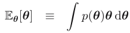

     将这个式子扩展, 考虑出现所有的  $\mathcal{D}$ 的情况, 由于是所有的 $\mathcal{D}$ , 因此关于 $\theta$ 的分布不变 :

     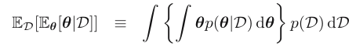

     那么就有 : 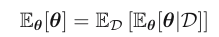

  2. 其次看方差:

     利用同样的方法展开有:

     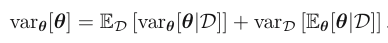

     左式为先验分布中 $\theta$ 的方差, 右式的第一项代表的是, 在所有数据情况下的方差的均值, 第二项是在所有数据情况下的均值的方差, 由于第二项必然是大于0的. 因此, 所有的数据情况下的后验的方差的均值 小于 先验中的方差.  说明了, 方差值在通过学习后, 后验方差整体缩小.

### 2.1 Binary Variables

#### 2.1.1 伯努利分布

- 分布形式

  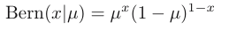

- 期望和方差

  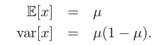

- 似然函数及其log形式

  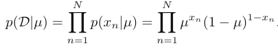

  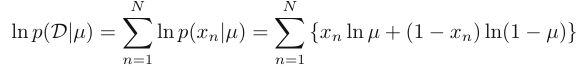

- 统计量

  统计量是, 一个应用于数据集的函数, 反映了该数据集的某种性质: $f(dataset)$

- 充分统计量

  sufficient statistic

  这个概念是针对「未知参数$\theta$的估计问题」而提出来的概念.

  是指 : 对于未知参数的估计问题,保留了原始样本中关于未知参数θ的全部信息的统计量

  $\sum_nx_n$ : 伯努利分布的充分统计量.

- 求未知参数 $\theta$

  使用的方法是最大似然, 即:

  $\mu_{ML} = \underset{\mu}{\operatorname{argmax}}\ p(\mathcal{D}|\mu) = \underset{\mu}{\operatorname{argmin}} \frac{\part \operatorname{In}p(\mathcal{D}|\mu)}{\part \mu} = \frac{1}{N}\sum_{n=1}^Nx_n$

  这个也就做, sample mean.

#### 2.1.2 二项分布

- 分布形式

  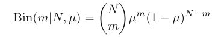

- 期望及方差

  这里不能直接推导, 应该使用独立随机事件期望和方差的组合性 : 

  $\mathbb{E}(X,Y) = \mathbb{E}(X)+ \mathbb{E}(Y)$

  $\mathbb{D}(X,Y) = \mathbb{D}(X)+ \mathbb{D}(Y)$

  期望 : $\mathbb{E}(m)=N\mu$

  推导 : $\mathbb{E}(m)=\sum_i^N\mathbb{E}(Bern(x_i|\mu)) = N*\mu$

  方差 : $\mathbb{E}(m)=N\mu(1-\mu)$

  推导 : $\mathbb{D}(m)=\sum_i^N\mathbb{D}(Bern(x_i|\mu)) = N\mu(1-\mu)$

  方差的直接计算的形式 : $\mathbb{D}(m)=\mathbb{E}[(m-\mathbb{E}(m))^2]=\sum_m^N(m-N\mu)Bern(m|\mu)$

#### 2.1.3 Beta distribution

##### 1. 过拟合问题

在上面的方法中, 如果碰巧投筛子实验中, 数据中所有的点都是1的话, 我们岂不是要将 $\mu$ 标为1. 这个是不切实际的, 这里用的是概率派的做法:

$w=\underset{w}{\operatorname{argmin}} p(\mathcal{D}|w)$

因此这里采用了加入先验的方法, 来对二项分布进行参数 $\theta$ 的预测.

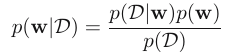

##### 2. 共轭先验分布

二项分布的共轭分布是beta分布, 共轭分布法是需要参数的, 即有参贝叶斯.

##### 3. Beta 分布

- 分布形式

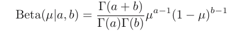

- 期望与方差

  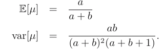

- **后验分布**

  假设先验为 : $Beta(\mu|a,b)$ 的话, 

  后验的结果为:

  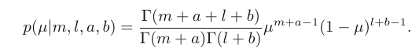

  其中, m和l 分别是正的数据数和负的数据数.

  相比于先验, 在m和l上加上了 a和b, 这个就是先验中的有效参数信息.

  ​

- **预测分布**

  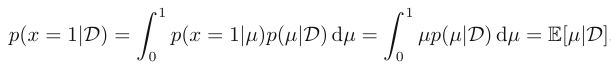

  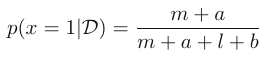

### 2.2 Multinomial Variables

#### 2.2.1 类别分布

- 分布形式

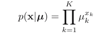

​	这里的 $\mu$ 是一个向量 : 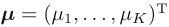

- 期望和方差

  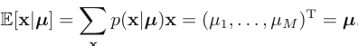

- 似然函数

  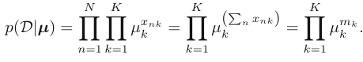

  注意这里用了两个累乘.

- 充分统计量

  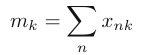

- 线性规划的方法

  用了拉格朗日函数去转化最大似然函数. 其中左项是Iog最大似然函数.

  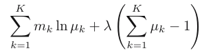

- 概率派的最大似然结果:

  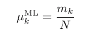

#### 2.2.2 多项分布

- 分布形式

  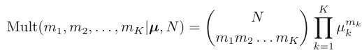

  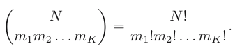

#### 2.2.3 Dirichlet distribution 

- 分布形式

  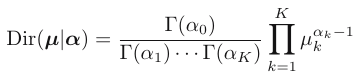

  是类别分布的共轭分布. 其在几何上的形式为一个复平面. 下面是有三个类别时的情况.

  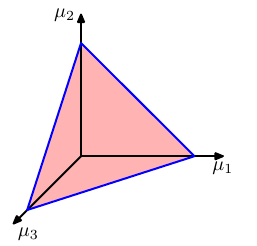

- 后验分布

  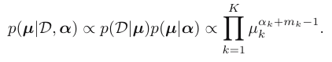

  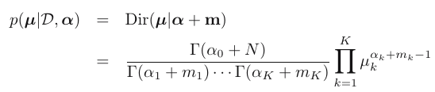

- 随着数据量变化,后验的变化

  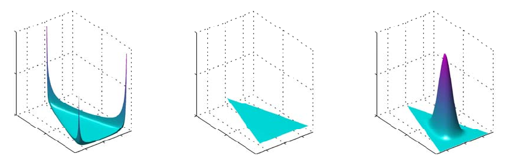

  可以看到, 还是符合共轭先验分布的性质的(2.0.4).

### 2.3 高斯分布基础

#### 2.3.0 为什么是高斯分布?

从2.1节到2.2节到2.3节, 我们发现, 这是一个随机变量可取的值逐渐变宽广的过程. 从2到多到无限, 这也体现了数学中对数量的感觉.

那么为什么, 在无限的分布中要选择高斯分布, 因为

- 他是满足中心极限定理最完美的分布. 

  > 1. 子随机变量的相加的结果:
  >
  >    中心极限定理指出 : 在适当的条件下,大量满足**均匀分布**的**相互独立随机变量**的均值经适当标准化后依分布收敛于正态分布.这些随机变量需满足 (**独立, 随机, 相加**). 下面就是一个图示:
  >
  >    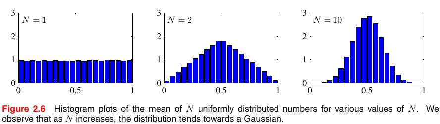
  >
  >    这个图中的N代表均匀分布的子随机变量的个数. 那么问题又来了, 为什么这里假设单个随机变量遵循的是均匀分布?
  >
  >    是因为, 均匀分布的熵是最小的. 
  >
  > 2. 指数分布与正态分布
  >
  >    其实自然界中最多的是指数分布, 指数分布族中的函数基于的是 「大量相互独立随机变量的相乘」, 而不是正态分布中的相加.

- 并且, 高斯分布就有最大熵, 即是最混乱系统, 也就是最一般的形式, 也就具有最强的表现力.

#### 2.3.1 高斯分布

**对于高斯分布的讨论都将分为一元和多元来考虑**

- 分布形式(一元, 多元)

  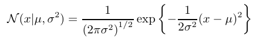

  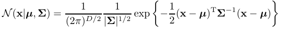

  > 这里的多元的维度是 D

- **高斯分布的重要性**

  高斯分布在感性上的重要性, 我们在2.3.0节已经说过了. 

  其次文中指出:

  *we strongly encourage the reader to become proficient in manipulating Gaussian distributions using the techniques presented here as this will prove invaluable in understanding the more complex models presented in later chapters.*

  说明本节中对于高斯分布的计算是非常非常非常非常非常非常非常非常非常非常非常非常非常非常非常非常非常非常非常非常非常非常非常非常非常非常非常非常非常非常非常非常非常非常非常非常非常非常非常非常非常非常非常非常非常非常非常非常非常非常非常非常重要的!!! 一定要自己动手推算.

#### 2.3.2 几何分析 - 高斯椭圆

##### 1. 一元高斯分布的情况

下图是一元高斯分布的情况:

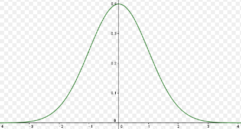

这个图中y值一样的点永远只有两个, 即关于 $\mu$ 对称的两个点.

##### 2. 多元高斯

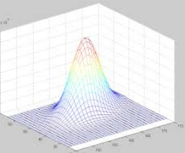

而在多元高斯中, 我们可以想象这个截面是一个椭圆, 那么如何证明呢?

##### 3. 高斯椭圆 

证明多元高斯的截面是椭圆:

###### 线代基础知识点

$\color{red}{1.}$ 线性代数的线性法则适用于所有线性代数中的符号, 这里的符号值标量符号, 向量符号, 矩阵符号, 以及张量符号(前提是要满足维度的要求)

> 例如, 一个矩阵 U 和一个向量 V 的乘法:
>
> $U (v_1,v_2,...,v_n) = (Uv_1,Uv_2,...,Uv_n)$
>
> 矩阵 U 和矩阵 V 的乘法:
>
> $UV=U (v_1,v_2,...,v_n) = (Uv_1,Uv_2,...,Uv_n)$

$\color{red}{2.}$ $(ABC)^{-1} = (C^T)^{-1}(B^T)^{-1}(A^T)^{-1}$

###### 证明过程

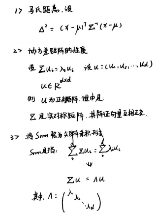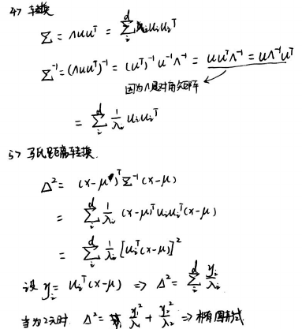

###### 几何表示

由于 y 的表示方法是关于x的线性方程, 因此, y和x的关系是线性的. 并且, $y_i, y_j$ 之间是正教的.因此在 距离固定的情况下 就有了下图:

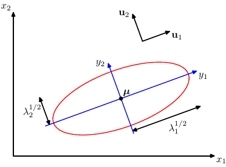

#### 2.3.3 期望

##### 1. 坐标轴转换

- 先定义雅克比矩阵:

  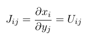

- 这里先将在x上的概率函数转化为在y上的概率分布 :

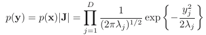

##### 2. 替代法

利用 $z=x-\mu$ 进行转换

##### 3. 拆开括号

下一步将括号拆开之后可以将这个式子分为两部分:

$=\frac{1}{(2\pi)^{D/2}}\frac{1}{(\Sigma)^{1/2}}\int exp\big\{-\frac{1}{2}z^T\Sigma^{-1}z\big\}z\ dz + \frac{1}{(2\pi)^{D/2}}\frac{1}{(\Sigma)^{1/2}}\int exp\big\{-\frac{1}{2}z^T\Sigma^{-1}z\big\}\mu\ dz$

第一个部分是0, 因为这个是积分部分的函数是偶函数.

第二部分是 $1*\mu$ , 因为除去 $\mu$ 的部分就是对高斯函数的积分, 肯定是1.

#### 2.3.4 方差

##### 1. 先求 $\mathbb{E}[x^2]$

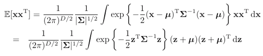

##### 2. 拆开括号

$(z+\mu)(z+\mu)^T=z^Tz+2z\mu+\mu\mu^T$ : 

$z\mu$ 项 : 由于偶函数对称特性, 在积分中消失, 此项可以忽略.

$\mu\mu^T$ 项 : 是个常数, 积分出来的结果就是$\mu\mu^T$

$z^Tz$ 项 : 分析如下:

##### 3. 具体分析$z^Tz$ 项 

回到上一节的证明过程, 在其中有一个 $y_i=u_i^T(x-\mu)$

就有: $z=x-\mu=uy=\sum_{j=1}^Dy_ju_j$, 即:

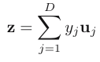

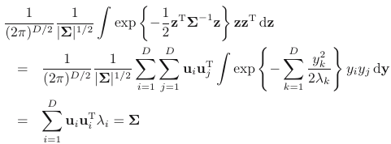

这个式子的最后一步转换有些迷, 其实记住 当 $i\neq j$ 时, $y_iy_j=0$ , 当 $i= j$ 时, $y_iy_j=1$ , 就好了.

##### 4. 得出方差

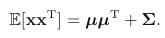

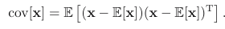

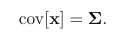

#### 2.3.5 参数自由度(限制)

上面讲的这个形式的高斯分布是最一般的情况, 加上 $\mu$ 和 $\Sigma$ 的参数, 共有 $D(D+3)/2$  个参数.

对于较高次元的高斯分布来说是相当大的, 因此有下面两个变种:

1. 设 $\Sigma$ 为对角矩阵

   这样就将参数限制到了 $2D$.

2. 设 $\Sigma$ 为单位矩阵 

   这样就将参数限制到了 D

随着限制的加强, 分布的变现力其实也在一步一步减低. 下面是三个情况的情形.

#### 2.3.6 单峰性-unimodal(限制)

单峰性限制了模型的能力. 改变方法是使用 **Latent variables**

#### 2.3.7 高斯分布的改进版

下面这个结论特别重要:

**In particular, a rich family of multimodal distributions is obtained by introducing discrete latent variables leading to mixtures of Gaussians**

##### 1. 加入离散潜变量 

也就是说, **多峰分布族** 的概率函数多数都是可以通过向**混合高斯**中加入**离散的潜变量**实现的.

这个将在2.4.9中讲解(书中的2.3.9)

##### 2. 加入连续潜变量

在12章讲解, 这种模型中的潜在变量数是不依存于D的.

##### 3. 离散与连续结合

可以导出一系列的 Hierarchical models. 其中包含了一个很强大的处理框架 - 概率图模型.

### 2.4 高斯分布进阶

#### 2.4.0 本节目的及运算技巧

##### 1.本节目的

熟练多变量下的高斯分布运算

##### 2. 运算技巧

- $\color{red}{\text{将指数部化为二次项形式是处理多维高斯分布的重点}}$

  之所以这样说因为,若指数部是关于某变量的二次型形式, 可以很容易得到它的积分.式子如下:

  $\int exp\{-\frac{1}{2}(x-\mu)^T\Lambda(x-\mu)\}\ dx = (2\pi)^{2/D}|\Sigma|^{1/2}$

#### 2.4.1 条件分布 

本届推导太多冗长, 只记述结果. 有时间一定来仔细过一遍.

##### 1. 相关定义

首先看相关定义. 

设 x 为一个完整的变量, 设 $x_a,x_b$ 分别是 x 的一部分, 且有:

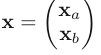

设对应的均值和方差分别为:

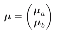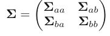

由于一般处理的是 $\Sigma^{-1}$, 因此设置 精度矩阵 $\Lambda=\Sigma^{-1}$,对应的有:

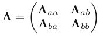

其性质为 : $\Lambda_{aa},\Lambda_{bb}$ 对称, $\Lambda_{ab},\Lambda_{ba}^T$

目标是求 $p(x_a|x_b), \mu_{a|b}, \Sigma_{a|b}$.

##### 2. 完成平方项操作是什么?

完成平方项就是指将**一个最高次项是二次项的式子** 转化为 ($\to$)

**函数的平方+常数部分**.

例如, $y=x^2+2x+2$ 就可以转化为 $y=(x+1)^2+1$, 这里平方化的中心就是 x.

由于目标是 $p(x_a|x_b)$ , 所以应该以 $x_a$ 为平方话的中心.

在这里的思想就是, 将含有 $x_a,x_b$ 的普通二次项函数变为 以 $x_a$ 为平方化中心. 将 $x_b$ 视为常数.

##### 3. 原始式子

原始式子为:

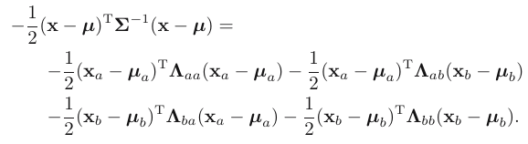

如果是 $x_a$ 为中心的话, 我们最后会有一个什么形式的式子:

$$
-\frac{1}{2}(x_a-\mu_{a|b})^T\Sigma_{a|b}^{-1}(x_b-\mu_{a|b}) + const \\= -\frac{1}{2}(x_a^T\Sigma_{a|b}x_a -2x_a\Sigma_{a|b}^{-1}\mu_{a|b} +const')
$$

##### 4. 开始完成平方

首先看二次项部分, 这个式子中的二次项部分只有如下:

对照上面我们立马就可以得出 : 

现在, $\Sigma_{a|b}$ 已知, 式子中 $x_a$ 的一次项也是可以求解出来的, 为:

因此就可以求出 $\mu_{a|b}$ 的部分.

这样就完成了二次平方的基本形式, 但是注意到这里还都是方差矩阵的逆$\Lambda$ 的形式, 因此需要最后一步转变

##### 5. 子矩阵求逆定理

就是一个很复杂的公式:

因此, 将上面的进行转化后:

#### 2.4.2 边缘分布

##### 1. 目的

根据下面的式子

求出, $\Sigma_a, \mu_a$

##### 2. 平方化 $x_b$ - 消除

首先回顾, $p(x_a,x_b)$ 的式子:

在2.4.0 节中也提到了, 消除指数部变量的方法, 我们现在想要的是关于 $x_a$ 的形式, 需要做的是:

在**不影响 $x_a$** 的情况下, **消除含有 $x_b$** 的部分.

并且我们这里本身就要对 $x_b$ 做积分, 因此, 可以通过关于 $x_b$ 的完成平方化来实现这个目的.

- 首先, 找到 $-\frac{1}{2}(x-\mu)^T\Lambda(x-\mu)$ 中, 包含 $x_b$ 的部分:

  , 其中 

  也就是说 : $-\frac{1}{2}(x-\mu)^T\Lambda(x-\mu)=$ + const

  这里的const的含义是不含有 $x_b$ 的项, 但是含有 $x_a$

- 平方完成化:

  这样子, 所有的 $x_b$ 全部集中在前面的平方项中

  

  $\Lambda_{bb}^{-1}m$ 的部分, 作为高斯分布中作为 $\mu$ 的一部分, 积分出来之后是会被消除的, 因此不需要考虑这里面的 $x_a$.

  第二部分中虽然有 $x_a$ 但是没有 $x_b$, 也就是一个 **常数**

##### 3. 平方化 $x_a$ - 转化高斯 

这里的平方化的目的和上面不同, 上面是为了配合积分消除 $x_b$ , 这里是为了配成下面的高斯形式的式子:

指数部分 : $-\frac{1}{2}(x_a-\mu_a)^T\Lambda_a(x_a-\mu_a)$

将 $x_b$ 平方完成项的部分: 看做常数之后, 有了如下形式:

其中, const含有上面的 $x_b$ 平方完成项, 也含有其他的常数项.

进而将其平方完成后得到:

有了这个就有了关于 $x_a$ 的高斯的基本形式了.

##### 4. 由平方完成得方差均值

方差:

均值:

##### 5. 边缘分布和联合分布的关系

在高斯分布中, 边缘分布和联合分布有一种很直观的关系, 即:

联合分布的协方差矩阵 : 

其中进行展开计算后 : 

那么, 也就是说 :

这个非常重要记住, 是分布与其子分布之间的关系.

##### 6. 边缘分布和条件分布的关系

下图是一个二元高斯分布的截面切割图和边缘概率以及条件概率的关系图:

有意思的是第二个图, 可以看到, 条件概率比边缘概率的方差要小, 说明, 随着一部分的确定, 分布的信心增加.

#### 2.4.3 高斯变量的贝叶斯定理

##### 1. 回顾之前的结论 - 起

有了条件分布和边缘分布之后, 很自然就想到了贝叶斯定理. 

条件分布作为似然分布, 边缘分布作为先验分布.

##### 2. 线性高斯模型

- **想做什么?**

  2.4.1和2.4.2是将一个 x 分为了 $x_a, x_b$. 

  而这里是将 $x_a, x_b$ 合为 x

  联合分布, 是指 $P(x_a,x_b)$ 的分布.

- **高斯模型中的线性关系**

  $condition1:$ 上面证明了 $p(x_a)$ 是高斯分布,同理知道 $p(x_b)$ 也是高斯模型.

  $condition2:$ $p(x_a|x_b)$ 也是高斯分布的情况下

   $\downarrow$ 

  $conclusion:$  $p(x_a|x_b)$ 的平均值是一个关于 $x_b$ 的线性函数, 这种线性被称为线性高斯模型.

  线性是指,  条件分布中的均值是关于条件变量的线性函数, 也就是说, 两个变量之间的关系是线性的. 

- **线性高斯模型**

  一般化这个问题:

  这里说的是将一个高斯分布拆成了两部分, 但是其实也可以认为这两个变量一开始就是分开的, 也就是一个**多变量问题**.  设:

  

  其联合变量为为  : 

  联合分布为 : $p(z)=p(x,y)$

   

##### 4. 本节目的

贝叶斯公式 : $p(x|y)=\frac{p(y|x)p(x)}{p(y)}$

现在已知 $p(y|x),p(x)$, 先验以及似然.

要求出另外一对边缘概率以及条件概率, $p(x|y), p(y)$

也就是后验以及证据因子.

##### 5. 分析似然与先验

这一节用来处理已知信息. 主要就是计算似然和先验的积.即, 联合分布 $p(x,y)$

- **分布具体形式:**

  其联合变量以及联合分布为  : 

  

- **回顾取均值方差的方法**

  

  只要是高斯分布, 其指数部都可以化为二次项形式.

  只要能化成二次项形式, 其都会有二次项和线性项. 

  其中二次项中有协方差矩阵的信息. 线性项中有协方差矩阵和均值的信息.

- **方差**

  求方差的方法是: 取二次项部分. 

  将具体分布拆开后的的二次项为:

  

  转化后中间的矩阵就是 **精度矩阵**, 其逆就是 **协方差矩阵**.

  

- **均值**

  具体分布的线性部分是 :

  

  后面的矩阵其实是精度矩阵和均值的积, 因为general的线性项是 $x^T\Sigma^{-1}\mu$. 

  因此 : $\mu=\mathbb{E}[z]$

  

  

##### 6. 边缘分布 - 求后验及证据因子

- **求后验**

  这一步用来处理位置信息

  根据 2.4.2.5 中的结论 : 边缘分布的均值和方差, 可以简单的从联合分布中去直接拿过来.

  可以知道:

  

  当 A = I 时, 可以知道 :

  $\mathbb{E}[y]=\mu+b, cov[y]=L^{-1}+\Lambda^{-1}$

  其结果是两个分布(先验分布和似然分布)的卷积的结果.

  > 卷积:
  >
  > $(f\cdot g)(n)=\int_{-\infin}^{+\infin}f(\alpha)g(n-\alpha)d\alpha$
  >
  > 关于卷积的意义, 见[知乎](https://www.zhihu.com/question/22298352/answer/228543288)
  >
  > 高斯函数的卷积:
  >
  > 高斯函数的卷积仍然是高斯卷积

- **求证据因子**

  证据因子就是一个条件概率, $p(x|y)$

  这个其实也可以直接从联合分布求得, 具体操作见2.4.1

  其结果为:

  

##### 7. 总结

若给定似然函数和先验函数:

可以由此计算出其后验函数和证据因子:

#### 2.4.4 高斯的最大似然

##### 1. 最大似然的问题设定

设给定数据集 $X=(x_1, x_2, ... ,x_N)^T$ 符合高斯分布.

求, 高斯分布的均值和方差

##### 2. 求解

- 列出概率公式:

  

- 充分统计量

  

- 最大化概率, 求最小值:

  关于均值: 

   

  关于方差(推导很麻烦):

  

  ​

##### 3. 无偏估计

  若根据真实分布进行采样的话, 计算出的 $\mu$ 和 $\Sigma$ 的无偏估计的形式应该是:

  

  根据这个进行修改的结果是:

  

#### 2.4.5 顺序估计

##### 1. 什么是顺序估计?

上面的最大似然是可以直接利用所有数据的情况, 但是实际情况可能无法做到这一点, 收到一个数据后就要删掉, 因此必须要有一个在线学习的算法.

##### 2. 高斯最大似然的顺序估计

##### 3. Robbins-Monro

上面的方法只能处理高斯分布的最大似然, 这里描述一个更一般的框架.

Robbins-Monro算法为一般方法提供了一个框架.

###### 1) 条件

- 首先, 这个方法假设一个拥有单调递增性质的函数 f. 

- 其次, 为这个函数赋予一个特殊的含义, 即 $f(\theta) = \mathbb{E}[z|\theta]$. 

  即, 自变量是一个随机变量 $\theta$, 因变量是在$\theta$的值被固定的情况下, 另外一个随机变量z的期望.公式如下:

- 在线学习的形式是, 每次只能根据一个 $\theta$ 获取一个值.

- 然后, 我们要求得是可以使得这个函数的因变量为0的 $\theta$ , 即使得随机变量z的期望为0的 $\theta$. 

- 最后, 这个函数的图如下:

  

###### 2) 结论

其中,  $a_{N-1}$ 是一个正数数列. $z(\theta^{(N-1)})$ 是当$\theta= \theta^{(N-1)}$ 时, 得到的一个新的观测值. 

其性质有:

##### 4. Robbins-Monro在高斯最大似然中

首先, 上面的框架规定了一个很特殊的函数. 其函数在高斯最大似然中, 指的是:

首先, 这个函数我们是希望它等于0的.

其次, 我们要求的部分, 应该是处于一个下凸函数中, 下凸函数的导数是一只大于等于0的.

对应公式就是:

> 其实在后面我们会看到, 利用贝叶斯定理本身就是一个很好地进行顺序学习的工具, 即将学习到的后验作为下一次学习的先验.

#### 2.4.6 高斯分布的贝叶斯推断

这一节已经很熟悉了, 这里简单过.

##### 1. 贝叶斯的目的

贝叶斯的目的是, 在给定一个先验以及数据集的情况下, 去求数据的分布.

而数据的基本分布形式是提前设计的, 因此求分布就变成了求分布的参数.

在这里的高斯问题下, 有以下六种问题.

|          | $\mu$ 未知, $\sigma$ 已知 |   $\mu$ 已知, $\sigma$ 未知   | $\mu$ 未知, $\sigma$ 未知 |
| -------- | ------------------------- | ---- | ------------------------- |
| 一元高斯 |               |      |                           |
| 多元高斯 |               |      |                           |

##### 2. 贝叶斯的基本形式

$p(\theta|X)=p(X|\theta)*p(\theta)/p(X)$

在参数估计中, 一般我们不考虑证据因子, 因为数据集是一个固定的数据.因此, 就是:

$$p(\theta|X)\propto p(X|\theta)*p(\theta)$$

注意, 贝叶斯公式是基于一个先验 $p(\theta)$ 的, 这个是需要人工设定. 这个时候就会遇到两个需要解释的问题.

- $p(\theta)$ 采取什么样的分布形式呢?
- 确定了先验的分布后, 其参数$\theta$ 应该如何设定呢? 

针对这两个问题, 进行讲解.

- 共轭先验-采取什么分布 : 关于采取什么分布形式的的问题, 这个在2.0.1中详细见过了.
- 中心极限-参数如何设定 : 这一节在2.0.4中进行了详细解释, 

##### 3. $\mu$ 未知 $\sigma$ 已知的情况

- 这个时候,  $p(\theta|X)\propto p(X|\theta)*p(\theta)$

  根据共轭先验, 我们知道了后验和先验的形式应该是高斯分布, 我们设先验分布为:

  

  那么根据完成平方对指数项的简单操作, 可以得知后验分布:

  

  中的均值和方差值为:

  

- 这里对结果进行分析.

  - 顺序估计

    可以很清晰的看到进行顺序估计的方法, 这个在2.0.3和2.4.5也提到了, 就是用之前的后验做下一次的先验.

  - 均值和方差的变化

    随着数据量N的增大, 可以看到, 均值中, 先验占得比例越来越小.

    方差去逐渐趋近与0, 即分布成为一个尖峰.如下图所示:

    

##### 4. $\mu$ 已知 $\sigma$ 未知的情况

这个情况下的共轭分布是伽马分布.

伽马分布的均值方差分别是:

得到的后验分布的结果是:

其参数的表示为:

##### 5. $\mu$ 未知 $\sigma$ 未知的情况 

这个情况下的共轭分布是高斯伽马分布.

得到的后验分布的结果的参数的表示是:

$μ0 = c/β, a = 1 + β/2, b = d−c^2 /2β$

##### 6. 高维高斯下的 $\mu$ 未知 $\sigma$ 已知的情况

这里用的是先验分布是 Wishart分布:

其中 $v$ 是自由度, W是一个D*D的标量矩阵. B是一个归一化系数:

其他的各种情况, 详见日语的那本书.

#### 2.4.7 学生t分布

##### 1. 预测分布

现在求出了后验分布, 但是我们的最终的目的并不在此, 我们是需要根据数据集推算出数据服从的真实分布. 现在虽然有了分布中参数的分布, 那接下来又如何利用这个得到数据的分布呢?

利用积分得到预测分布.即:

​			$p(x|\theta) = \int_{-\infin}^{\infin}p(x|\theta)p(\theta|X)$

##### 2. $\mu$ 未知 $\sigma$ 未知的情况下的预测分布 

以上面的 $\mu$ 未知 $\sigma$ 未知的情况为例子. 有如下结果:

> 由于这里的位置参数是方差, 因此是从 0 到 无穷大

经过一些的换算得到的的预测分布为:

也就是学生分布,关于学生分布的性质如下:

##### 3. 学生分布的性质

###### 1) 自由度

 其中$v$ 代表的是分布的自由度. 学生分布的图如下, 图符合均值提前被设定的初衷:

###### 2) 无线混合高斯 - 鲁棒性

如果将由伽马分布采出来的不同的值的概率作为权重, 上面的158的那个式子其实可以看做是无限个高斯分布的加权混合. 也就是 **无线混合高斯**.

这个分布相比于普通高斯有一个特点就是, 其有较长的尾巴. 这个对于一些离群点outlier拥有较好的适应性. 解释见下:

- 首先是没有离群点的情况, **图a**, 红色线代表高斯, 绿色线代表学生分布, 绿色线被红色线遮挡, 说明这种情况下 高斯分布是作为t分布的一种特例存在的:

  

- 有oulier情况, **图b**, 这就可见一斑了, 很明显, 学生分布更加强大. 但是由于其均值还是固定的, 因此并无法表示多峰分布. 而在下一节, 将会介绍多峰分布.

##### 4. 最大似然学生分布

在上面, 我们通过贝叶斯定理求得了最后的**参数已知的预测分布** - 学生分布.

但是, 如果, 我们直接从**参数未知的学生分布**入手, 该如何利用数据呢?

这个时候可以使用期望最大算法 - **EM算法**

##### 5. 学生分布在回归模型中的应用

学生分布相比于高斯分布的不同点就是上面提到的鲁棒性. 

而这个正是利用了高斯分布的最小二乘的回归问题所被诟病的一点. 

利用最小二乘法的intuition是, 真实世界中的数据相比于标准回归, 加入了一个噪音, 而这个噪音符合正态分布, 均值为这一点在理想分布上对应的值. 

如果将误差符合的分布换为学生分布, 就可以解决鲁棒性低的问题, 总结一下:

高斯分布 + 最小二乘 = 鲁棒性差的回归

学生分布 + 最小二乘 = 鲁棒性强的回归

##### 6. 高维的学生分布

其中, D是数据维度, 三角是平方马氏距离, 

其形式为:

#### 2.4.8 周期变量

这一节主要讲了面对周期性数据的解决方法. 

##### 1. 周期性数据的特别性

对于周期性数据像弧度, 我们没有办法确定一个弧度的均值, 因为起始点不同, 均值就不同.

书中给出的例子问题是 给定一组 $\large{\theta}$$={\theta_1, \theta_2, ... , \theta_n}$ , 求这个$\theta$符合的分布.

##### 2. 简单的解决方法

针对于该问题, 解决方法是, 将该 $\theta$ 作为笛卡尔坐标系中的极坐标表示法的角度. 

由于 $\theta= 1\cdot \theta$. 因此, 数据点可以表示为笛卡尔坐标系下, 长度为1的, 不同角度的任何点, 即单位圆上的点. 得到其分布的方法是, 将其视为二元高斯分布.

如下图所示:

那么, 其均值 $\bar{x}$ 应该是圆内一点, $\bar{x}=\frac{1}{N}\sum_{n=1}^{N}x_n=(\mu_1,\mu_2)$, 其分布应该为:

可以看到, 这个分布的横截面是一个圆形. 如下图所示, 蓝色是分布的等高线.

转换为极坐标就有, $\bar{x}=(\bar{r}cos\bar{\theta}, \bar{r}sin\bar{\theta})$, 其中:

接下来, 就可以求 $\theta$

##### 3. von Mises(环形正态)分布

这里设计了一个新的分布, 可直接在此基础上利用数据集进行最大似然. 而不用经过上面的转换.

首先先基于上面的公式, 将 $x_1, x_2$ , 转换为与 $\theta$ 有关的分布. 这里只关注指数部:

其中的 r 是实际数据的极长, 其值为1, $r_0, \theta_0$ 是平均值.

这样就得到了只和 $\theta$ 有关的分布.

其中, concentration参数, 归一化系数是, 

concentration 参数值无穷大是, 说明周期是无限长的, 也就和没周期没什么两样, 也就是正态.

图示如下:

##### 4. 环形正态分布的最大似然 

最大似然的方法就是:

$\theta_{best}=\operatorname{argmax}_{\theta} p(X|\theta)\\=\operatorname{argmax}_{\theta} \prod_i^Np(x_i|\theta)\\=\operatorname{argmax}_{\theta} \operatorname{In} \prod_i^Np(x_i|\theta) \\\to$

$\partial\operatorname{In} \prod_i^Np(x_i|\theta)/\theta_{best}=0$

- 取log

  

- 关于m求导

  

  利用三角公式:

  

  得到了最后的最优解:

  

- 关于 $\theta$ 求导

  这里不管了

#### 2.4.9 混合高斯模型

终于到这里了

##### 1. 多峰 - multimodal

上面的高斯不管如何变换, 都只能是单峰的形式, 下面考虑多峰的情况.如下图所示

##### 2. 混合高斯

解决这个问题的方法就是混合高斯. 如下图所示:

在多维下的示意:

在2.3.7节中说到了高斯的增强, 这里就是在$\color{red}{使用离散潜变量的高斯分布增强}$.

这里的$\color{red}{离散潜变量}$是指什么呢? 见下节.

##### 3. 离散潜变量

这里还是用了贝叶斯的思想.

上面关于混合高斯的式子中, 不同子高斯分布的权重其实都可以看做是一个概率.也可以理解为: 

这样就成了一个潜变量的问题, 而在这里, $p(x|k)$ 是一个**离散分布**. 

因此叫这个为在**潜变量下的高斯分布增强**.

##### 4. 贝叶斯下的后验

上面的 $p(x|k)$ 仔细一看其实是似然函数, 因此我们也可以将这个问题用贝叶斯的思想去思考.

离散潜变量的分布 $\to$ 后验分布:

其中, $p(k|x)$ 被称为 **responsibilities**.

更多的内容, 在第九章.

##### 5. 混合高斯的最大似然

根据数据集的log如下:

这个式子括号里面有一个累积, 是因为, 

也就是说, 这成了一个离散组合优化问题, 这个时候需要一个强大的框架, EM算法去解决. 详细见第九章.

### 2.5 指数族分布

#### 2.5.0 介绍

##### 1. 什么是指数族分布

是指拥有以下分布形式的函数:

$p(x|\eta)=g(\eta)h(x)exp\{\eta^Tu(x)\}$

其拥有的性质为:

其中, $g(\eta)$ 是作为归一化参数存在的.下面来看三个例子

##### 2. 伯努利分布

最初的分布为 : 

进行转换 : 

调换参数的形式 : 

sigmod函数出现了 : 

最后的形式 : 

对应着抽象式子的每个单元 : 

##### 3. 多项分布

这里说的是多项分布, 可是我怎么感觉是分类分布.

这个的转换就很简单了:

可以说是最基本的形式了 : 

多项分布的自由度其实是 M-1, 只有M-1变量确定了, 剩下的一个也就确定了.因此可以将分布转化为以下的形式, 第二步转换, 自己左右式子倒一倒就出来了:

其中, 对照抽象式子, 可以看到 $\eta$ 与 $\mu$ 的关系如下, 这样就出来了 **softmax**:

下面这个才是最基本的最标准的指数分布对应式:

##### 4. 高斯分布

#### 2.5.1 最大似然和充分统计量

##### 1. 最大似然

按照之前说到的最大似然的方法, 对原始指数族公式进行最大似然:

$p(x|\eta)=h(x)g(\eta)exp\{\eta^Tu(x)\}\to$

$\eta_{best}=\operatorname{argmax}_{\eta}p(X|\eta)\\=\operatorname{argmax}_{\eta}\prod_i^Np(x_i|\eta)\\=\operatorname{argmax}_{\eta}\sum_i^N \ln p(x_i|\eta)\\\to\\\partial \sum_i^N \ln p(x_i|\eta_{best})/\partial \eta_{best}=0$

最后的解释就是要调整 $\eta​$ 使得最大似然函数关于它的导数为0. 

其中, $\sum_i^N \ln p(x_i|\eta)=g(\eta)\int h(x)\exp\{\eta^Tu(x)\}dx$

$\sum_i^N \ln p(x_i|\eta)/\partial \eta=0\\\to$ 

利用求导法得:

回想指数族函数的性质:

根据这个公式:

- 其左式第一项可以化为: $\nabla g(\eta)/g(\eta)$ = $\nabla\ln g(\eta)$
- 其左式第二项可以化为: $g(\eta)\int h(x)\exp\{\eta^Tu(x)\}\cdot u(x)dx=\mathbb{E}[u(x)]$

最后就有了:

$-\frac{\nabla g(\eta)}{g(\eta)}=\mathbb{E}[u(x)] \to -\nabla\ln g(\eta)=\mathbb{E}[u(x)]$

##### 2. $u(x)$的高阶矩与$g(\eta)$的关系

上面最后的结果, 显示了 $u(x)$ 的一阶矩与 $g(\eta)$ 的关系. 

其实,  $u(x)$ 的高阶矩与 $g(\eta)$ 都有一定的关系. 比如, $u(x)$ 的协方差可以用 $g(\eta)$ 的二阶导表示.

##### 3. 充分统计量

其实, 通过上面我们已经能够看到, 对 $\eta$ 做出估计, 我们需要的充分统计量是什么了 

**就是 $u(x)$ 的期望**

有了这个结论之后就很容易求结果了.

更深刻的概念在第八章讲解.

#### 2.5.2 共轭先验

这里是针对抽象化的指数族函数给出了一个抽象化的先验分布.如下所示:

得到的后验为:

#### 2.5.3 无信息先验

##### 1. 为甚是无信息先验

无信息先验处理的是没有任何先验的情况下对先验分布的设定问题.

按照之前的看法, 在没有先验的情况下, 我们可以随着数量的增多,而使得先验的影响逐渐降低, 详细的见2.0.4. 但是这是一个, **错误->修正** 的过程.

这里的想法是, 从一开始就不要偏向某个分布, 而是给定一个**公平的无信息先验**. 

最直观的一个分布就是**均匀分布**

##### 2. 均匀分布做先验的缺点

 其有两个缺点:

- $p(x|\lambda)p(\lambda)$ 是似然乘先验, 当 $\lambda$ 是连续变量的时候, 无法用均匀分布去正确表达先验分布.

- 对于非线性变量 $\lambda$, 是无法保证其结果是均匀的. 即:

  若 $\lambda=\eta^2$, 那么 $p(\lambda)=p(\eta^2)=均匀分布$ , 那么 $p(\eta)$ 就绝对不是均匀分布. 而若使得 $p(\eta)$ 是均匀分布, 那么$p(\lambda)$ 就绝不是均匀分布.

**而对不同的似然函数, 应具体分析制定具体的无信息先验.**

##### 3. 无信息先验的两个例子

###### 1) 平移不变性

 $\sigma$ 已知 $\mu$ 未知的高斯就是这种情况.

我们要使得, 

那么方法就是使得, 先验分布的高斯的方差变得无限大即可.

###### 2) 放缩不变性

 $\sigma$ 未知 $\mu$ 已知的高斯就是这种情况.

我们要使得, 

那么方法就是使得, 先验分布的Gamma分布的 $a=b=0$ 即可.

### 2.6 非参数方法

#### 2.6.0 什么是非参方法

提前制定先验的方法对数据进行了很强的限制. 从而可能导致相当差的预测表现. 主要体现在两点:

- 初始参数的随意设定 : 使得需要大量数据修正
- 单峰分布的局限性 : 在真实数据是多峰的情况下难以拟合.

#### 2.6.1 直方图法

##### 1. 直方图法的做法

- 做法 : 

  简单的用直方图去拟合概率曲线. 

- 问题:

  但维度为D的时候, 直方图中的柱子就要有 $M^D$ 个. 会有维度灾难.

##### 2. Insight

直方图方法 为一些列的非参模型提供了一个框架, 这个框架的insight是

- 在考虑不同点的时候应该考虑其邻近的点的信息, 这里的**邻近**可以是基于**各种空间**的. 一般是欧式空间.
- 平滑参数的值不能太大也不能太小, 在直方图中指的就是每个柱子不能太粗也不能太细.

##### 3. 框架模型

- **问题设定**

  首先, 我们一共有 N 个数据. 现在制定一块区域 R. 

  设落在这片区域的概率为 P, 落在R中的样本数为 K.

- **推理步骤1**

  首先这一块 R 的体积我们是未知, 它可以很大也可以很小. 设整个空间中有一个基本体积单元. 每块基本单元设为 $\operatorname{x}$ 那么:

  

  假设 $p(x)$ 是 $R$ 这片区域的平均密度, 那么:

  

- **推理步骤2**

  通过上面的问题设定已经可以知道 :

  ​								$P=\large{\frac{K}{N}}$

  即:

  

- **推理结论**

  这一片的平均密度就有:

  

- **结论展开**

  我们的最终目的其实就是求某个区域内的概率密度, 看这个式子, 我们发现这个式子可以从两个方向解读.

  - 固定K, 计算V - K近邻法
  - 固定V, 计算K - 核密度法

#### 2.6.2 核密度估计

##### 1. Intuition

核密度估计听起来很高大上, 其实很简单, 就是, 统计在一个范围内的点的个数. 

比如, 在数据所在空间为一维的情况下, 统计每个方格内的点的数目即可.

下面上面的方法在高维空间中的解决方案进行数学化的描述:

设在D维空间内, 假设某个单位cube的中心点为0, 判断一个点 $\operatorname{\mathbb{u}}$ 是否属于这个空间单元的函数是:

其中, $u_i$ 是第 i 次元的值. 这个函数就叫做**核函数**. 是不是很简单.

接下来,  对情况进行一般化, 设cube的中心点为 $x_n$, cube的长度为 $h$.

对所有数据的核函数结果进行相加即可得到这个cube内点的数量:

接下来处于这个cube的体积, 即可得密度:

##### 2. 高斯核函数

 上面使用的核函数是一个离散的函数, 这里介绍一个连续函数. 高斯核.

这个核函数的insight认为, 不同点也是根据正态分布分布在这个空间中的, 因此, 应该计算以该中心点 $x_n$ 为多维高斯均值的情况下, 所有点的概率才对. 其公式为:

高斯核函数中的方差h是用来控制模型复杂度的, 图是如下:

##### 3. 一般化核函数

核函数可以任意定义, 只要满足下面两个条件:

#### 2.6.3 近邻方法

##### 1. 核方法的缺点

对于点密集还是点稀疏的地方都使用一样的核函数. 

使得点密集地方过于平滑, 即失去很多信息.

##### 2. 近邻方法的Intuition

佩恩发动的神罗天征范围以佩恩为中心不断扩大, 佩恩说了, 这次我只要干掉鸣人的 $k$ 个影分身就可以了. 于是在范围扩大到包含 $k$ 个鸣人影分身的时候就停下了术.

然后, 佩恩通过估算这次的神罗天征范围, 大概知道了这一带的鸣人影分身的密度.

##### 3. 近邻法-分类问题

将近邻法用于分类问题.

首先以要判断的点 $x$ 为中心, 收集其身边的 $K$ 个最近邻. 

设总数为 $N$ 的全部数据中 $C_k$ 类的点的数量为 $N_k$. 在这个 $N$ 个最近邻中,  $C_k$ 类的点的数量为 $K_k$.

利用贝叶斯去分析:

- 似然:

  $p(x|C_k) = K_k/N_kV$

- 先验:

  $p(C_k)=N_k/N$

- 证据因子

  $p(x)=K/NV$

得出后验:

