## Graphical model

### 8.0 注意

本章要简单写, 要加速了!!!!

### 8.1 贝叶斯网络

#### 8.1.0 概率图介绍

##### 1. 全连接概率图

###### 1) 一个简单的例子

这一节主要介绍了如何去表示概率图:

对于下面这个条件概率的分解 :

其概率图可以表示为:

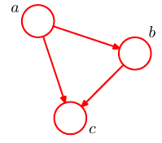

###### 2) 一般化

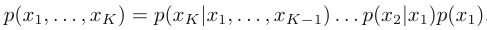

这样的概率分布中的所有点是连接在一起的. 

且这样的图结果一定是**有向无环图**.

##### 2. 非全连接图

###### 1) 一个例子

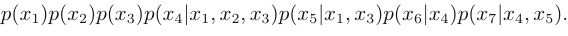

这个公式中, $x_1,x_2$ 就没有概率连接关系.

其图如下:

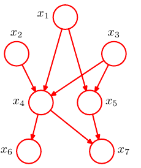

###### 2) 一般化

将其一般化有:

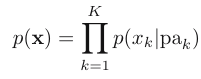

为了表示简单这里将每个变量所依据的点抽象为一个 $pa_k$. 其图如下:

并且我们假设, 每个变量所依据的点的下表都小于这个变量.

#### 8.1.1 例子:多项式回归

这一节, 意在展示一个真实问题的概率图结果.

##### 1. 简单的公式:联合概率

多项式回归中要求的是系数 $w$, 已经有的观测值集为 $t$, 这些观测值对应的输入数据是 $x$

通过最大似然的思想, 我们可以最大化 $w,t$, 这里暂时忽略了 $x$ 的表达, 即:

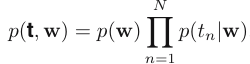

其图为:

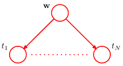

##### 2. 完全公式:条件联合概率

上面没有显式的指出 $w$ 是如何来的, 以及 $t$ 对应的自变量, 下面这个概率公式将其包含了进来. 

并且, 不要忘了, 回归里面都是有高斯误差假设的. 因此就有了这个公式:

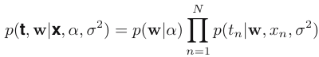

下面来一步一步的进化这个图

###### 1) 初始概率图 : 区别变量和常亮

这个里面有确定数据 $x$, 这个不同于随机变量, 应该采用另外的表示, 这里采用的是实心点.

按照这个和上面的理解, 可以得到下面这个图.

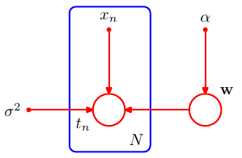

###### 2) 进阶概率图 : 区分两种随机变量 

随机变量也有两种存在, 训练数据中的随机变量和真正未知的随机变量, 那就是 $t_n$.

按照本质来说, 其确实是一个变量, 但是由于其是观测数据, 所以应该与需要训练的变量进行区分, 采取的方法是 **加黑**, 如下:

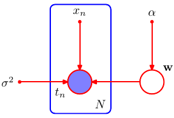

##### 3. 贝叶斯下的图

###### 1) 贝叶斯的理解

首先上面的并不是贝叶斯, 因为其并没有表示后验概率 $p(w|t)$.下面的这个才是:

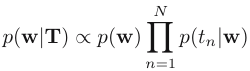

根据贝叶斯公式, 可以求得其所有随机变量(包括训练和观测)的联合分布:

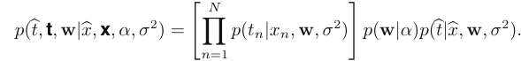

接下来得到了预测分布, 具体在第三章讲了:

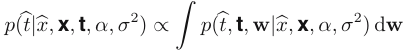

###### 2) 其概率图:

这个图就是要加入要预测的 $(\hat{x},\hat{t})$

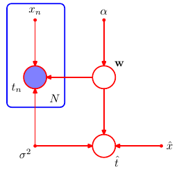

#### 8.1.2 生成式模型

##### 1. 祖先采样

在一个概率图分布中, 我们应该怎么样采样, 答案是按照下标从小到大的顺序采样.

最后是留下我们需要的目标节点的采样值就好了. 例如我们要对联合概率 $p(x_2,x_3)$ 进行采样, 就需要将其他所有采到的值丢弃即可.

##### 2. 生成模型

我们之前也提到了这个问题. 就是指, 输入因变量 $x$ 本身也是由分布中采样出来的模型. 即, 对输入数据保持怀疑态度的模型. 例如对于图像识别, 我们可以假设, 图像的识别结果是由对 物体, 位置, 方向三个角度的观察来决定的, 而每次观察又都符合分布, 不是确定性的对应关系.  如下图所示:

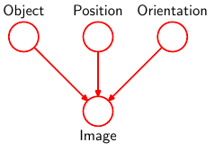

而图模型正好可以描述这一个生成观测数据的因果关系. 

这里还需要确认的一点是:

不是所有的含有这种贝叶斯想法的模型都是分布模型. 而只是针对 输入因变量 $x$ 的不确定态度. 

例如上面的回归模型, 虽然预测分布中的参数也是由分布中采样出来的, 但是由于输入变量 $x$ 不是分布中采样出来的, 因此不能作为生成模型看待.

#### 8.1.3 离散变量

##### 0. 要处理的问题

对概率图的描述基本告一段落, 接下来我们考虑具体的组合分布.

其实, 概率图中每两个节点之间的连接, 都相当于贝叶斯公式中的先验和似然, 即: $p(x|w)p(w)$

那么, 我们自然希望两个节点的分布存在共轭关系, 因此, 这里考虑两个方面的共轭分布:

- 离散分布中的共轭
- 高斯分布中的共轭

关于这两种共轭分布的具体分析,见第二章

这一节看离散分布中的共轭 - 多项与狄利克雷

##### 1. 多项分布是

首先是普通的多项分布

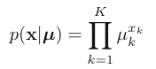

其自由度为 K-1

##### 2. 全连接概率图及参数量计算

下面是两个连接在一起的符合离散分布的分布,其概率图在右边:

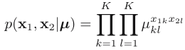 		

这种情况的参数量为 $K^2-1$

如果是 M 个全连接的话, 就有 $K^M-1$, 就会出现 $\color{red}{参数爆炸}$

##### 3. 普通概率图 - 解决参数爆炸

- 参数独立

  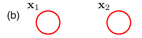

  这种情况的参数复杂度随着随机变量的数目呈线性增长, 但是这个还是不靠谱的, 因为概率分布收到了限制, 失去了强大的表现能力.

- 结点链

  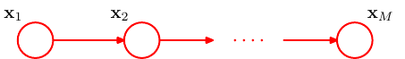

  这个情况下, 参数的增长是 平方级的, 属于多项式范围之内的, $K-1+(M-1)K(K-1)$

- 参数共享

  这个假设, 上面的各个随机变量的链接使用的是同一组参数. 即 $p(x_i|x_{i-1})$ 是固定的, 共有 $K(K-1)$ 个参数 . 这样加上控制最开始的随机变量 $x_1$ 的$K-1$ 个参数. 其结果共有 $K^2-1$ 个参数.

- 使用参数连续化模型

  上面说到了, 一般情况下, 每个 $p(x_i|x_{i-1})$ 都会有 $K(K-1)$ 个参数. 这个是一个表格数据. 每个点和点之间都是离散关系, 这里可以通过将参数进行连续化实现参数消减. 如下:

  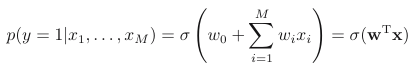

  由于我们最后的目的是求 $x_M$(这里替换为了$y$). 所以这里跳过了重重阻隔, 直接让每个变量直接对 $y$ 产生影响, 并将他们的影响叠加.

  > 这里类似于选择多元高斯分布的协方差矩阵的限制形式.

##### 4. 贝叶斯网络

对上面的每个随机变量增加一个潜在变量即可组成一个贝叶斯网络, 如下:

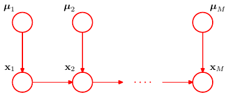

其中, $\mu$ 都符合狄利克雷分布. $x$ 都符合正态分布.

可以利用参数共享, 使得潜变量 $\mu$ 的分布共享, 有如下结果:

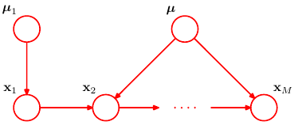

#### 8.1.4 线性高斯模型

上一节说的是构建离散变量之间的图结构. 这一节注重于高斯分布之间的结构. 

##### 1. 多元高斯分布 $\to$ 概率图

我们可以将一个高斯分布, 拆分为几个一元高斯分布的概率图模型.

###### 1) 每个节点的分布形式

首先先关注这个概率图中每一个节点的分布形式 : 

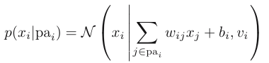

###### 2) 各个节点信息的交互方式

可以看到上面的这个分布中的均值相比于一般的是很奇怪的, 这个奇怪就在于他在这里加入了 $pa_i$ 的信息. 

也就是说, **每个节点的高斯分布的均值是有其父节点和其本身的数值决定的**.

但是, 注意, 节点和节点之间只有均值是互相影响的, 方差并没有进行交互.

##### 2. 概率图 $\to$ 多元高斯分布

###### 1) 先证明其是高斯分布

设所有节点为 $\mathbb{x}$ , 共有 $D$ 个. 那么, 这个概率所表示的就是变量为 $\mathbb{x}$ 的 D 元高斯分布.

先看下, $\mathbb{x}$ 的概率公式, 还是只关注指数项:

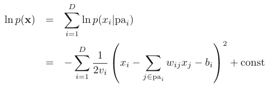

可以看到是关于 $\mathbb{x}$ 的二次函数, 所示知道了其是一个高斯函数.

###### 2) 计算均值

在上面式子高斯分布的均值已经得到了, 只不过写成了打开乘积后的形式.. 

###### 3) 计算协方差矩阵

要计算 $x_i,x_j$ 的协方差 $$cov(x_i,x_j)$$ 要先计算期望.

计算期望的方法需要从头递归这个图, 递归方法如下:

- 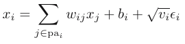
- 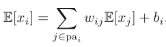
- 从1开始计算上面的步骤, 直至到达 $x_i$

计算协方差因为要计算期望, 因此也要递归, 这里只展示第一步:

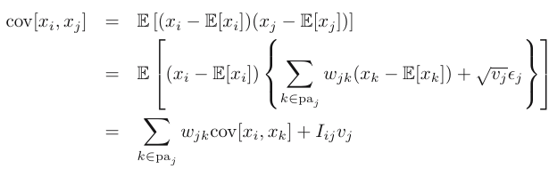

###### 4) 一个例子

下面是一个简单的例子, 概率图如下:

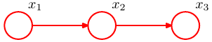

这三个点都符合正态分布.

其结果如下:

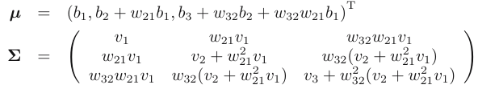

##### 3. 贝叶斯观点

在第二章学过, 一元高斯分布中, 方差已知, 均值位置的高斯的共轭先验是高斯分布, 其后验和预测分布也是高斯分布.

因此, 若在上面的图上再加一层, 如下图所示:

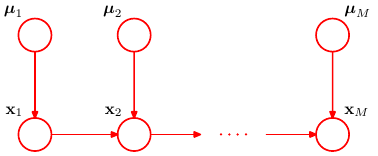

这个就成了贝叶斯网络. 并且叫做 **层次贝叶斯**.

### 8.2 条件独立

#### 8.2.0 条件独立

条件独立的概念是指, 给定 $b,c$ 的条件下的 $a$ 的概率不依赖于 $b$ 的值. 如下左所示, 这个式子还可以化为右边的式子, **条件独立是三个变量之间的关系**:

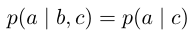 $p(a,b|c) = p(a|c)p(b|c)$

其图形如下:

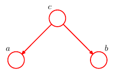

标记为 : 

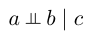

重要性 : 这个其实有上面的参数共享的作用, 并且简化了模型的结构, 同时也赋予了模型一种特殊的结构, 使得其能处理对应的问题, 因此是十分重要的.

下面我们要做的就是学会**直接从图中判断变量之间的条件独立性**.实现这个判断的框架是 **d-划分**.即:

**d-划分 $\to$ 从图中判断变量之间的条件独立性**

在学习其之前, 先通过简单的例子来感知一下条件独立性在图中的表现, 这里使用简单的三点图来解释.

#### 8.2.1 三个例子

##### 1. 分析的步骤

- 首先给出 $a,b,c$ 对应的公式及其对应概率图

- 通过对 $c$ 积分, 判断其公式中的 $a,b$ 是否**独立**(**注意非条件独立**).

  即, 判断 : $p(a,b)=\sum_cp(a,b,c) = p(a)p(b)$ 是否成立

- 通过确定一个 $c$ 的值, 判断其公式中的 $a,b$ 是否**条件独立**.

  即, 判断 : $p(a,b|c=c_i)=p(a|c_i)p(b|c_i)$ 是否成立

  > 这里, 由于 $c_i$ 是一个定值, 因此 $p(a|c_i)$ 是一个只包含 $a$ 的分布.
  >
  > 所以, 在这里, $p(a|c_i)p(b|c_i)=p(a)p(b)$.
  >
  > 也就是说, 判断条件独立是一定要在, 条件变量的值给定的情况下.

##### 2. Tail-to-Tail 

###### 0) 命名原因

这里是针对C而言的, 也就是说, c处于两个有向连接箭头的尾部的交汇位置.

###### 1) 公式及概率图

$p(a,b,c)=p(a|c)p(b|c)p(c)$

###### 2) $c$ 为被观察到的情况

这里应该分析的是 积分 : $\sum_c p(a,b,c)$

$p(a,b)=\sum_c p(a,b,c)=\sum_c p(a|c)p(b|c)p(c)\neq p(a)p(b)$

对于 c 没有被观测的情况下, Tail-to-Tail 条件独立无法被保证. 即:

> 这里的不能保证的意义是指, 条件独立的性质不总是能保证, 但是有可能可以实现.
>
> 这里的 $\O$ 表示空集, 表示对任何对象, 即 c 是未被观察的.

###### 3) $c$ 被观察到的情况

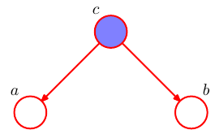

这里应该计算的是条件概率 $p(a,b|c)$

$p(a,b|c)=p(a,b,c)/p(c)=p(a|c)p(b|c)p(c)/p(c)=p(a|c)p(b|c)$

对于 c 没有被观测的情况下, Tail-to-Tail 条件独立成立. 即:

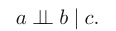

> 这里的是指对指定的 c 可以实现条件独立.

##### 3. Head-to-Tail

###### 0) 命名原因

这里是针对C而言的, 也就是说, c处于一个有向连接箭头头部和一个箭头的尾部.

###### 1) 公式及概率图

$p(a,b,c)=p(a)p(c|a)p(b|c)$

###### 2) $c$ 为被观察到的情况

这里应该分析的是 积分 : $\sum_c p(a,b,c)$

$p(a,b)=\sum_c p(a,b,c)=\sum_c p(a)p(c|a)p(b|c)\\=p(a)\sum_c p(c|a)p(b|c)=p(a)p(b|c)\neq p(a)p(b)$

对于 c 没有被观测的情况下, Head-to-Tail 条件独立无法被保证. 即:

> 这里的不能保证的意义是指, 条件独立的性质不总是能保证, 但是有可能可以实现.
>
> 这里的 $\O$ 表示空集, 表示对任何对象, 即 c 是未被观察的.

###### 3) $c$ 被观察到的情况

这里应该计算的是条件概率 $p(a,b|c)$, 根据贝叶斯定理可做如下转换:

$p(a,b|c)=p(a,b,c)/p(c)=p(a)p(c|a)p(b|c)/p(c)=p(a|c)p(b|c)$ 

对于 c 没有被观测的情况下, Head-to-Tail 条件独立成立. 即:

##### 4. Head-to-Head

###### 0) 命名原因

这里是针对C而言的, 也就是说, c处于两个有向连接箭头的头部的交汇位置.

###### 1) 公式及概率图

$p(a,b,c)=p(a)p(b)p(c|a)p(c|a)$

###### 2) $c$ 为被观察到的情况

这里应该分析的是 积分 : $\sum_c p(a,b,c)$

$p(a,b)=\sum_c p(a,b,c)=\sum_c p(a)p(b)p(c|a)p(c|a)= p(a)p(b)$

对于 c 没有被观测的情况下, Head-to-Head 条件独立可以被保证. 即:

> 这里的不能保证的意义是指, 条件独立的性质不总是能保证, 但是有可能可以实现.
>
> 这里的 $\O$ 表示空集, 表示对任何对象, 即 c 是未被观察的.

###### 3) $c$ 被观察到的情况

这里应该计算的是条件概率 $p(a,b|c)$, 根据贝叶斯定理可做如下转换:

$p(a,b|c)=p(a)p(b)p(c|a)p(c|a)/p(c)\neq p(a|c)p(b|c)$ 

对于 c 没有被观测的情况下, Head-to-H ead条件独立不成立. 即:

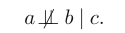

> 这里相对于上面两个有一个特殊的地方在于, 若c未被观察到, 但是c的后继被观察的话, 结果也是 a,b无法条件独立于c.

###### 4) 一个例子

设, a为某一次抓球转到n个黑球的分布, b为某一次抓球转到n个黑球的分布, a,b是在不同的带子中抓的. 设 c 为两次抓的黑球的总数量. 那么, 可以看到在c随意的情况下, a,b是独立的. 但是 c 确定后, a,b就不独立了.

#### 8.2.2 d-划分

##### 1. Block

Block这个概念说的是两个点之间是否存在相关关系:

- 若相互条件独立, 则两个点之间是Block的.
- 若相互条件依赖, 则两个点之间是Unblock的.

##### 2. 目的

d-划分的目的是, 判断在概率图模型中的三个不相交的点集, $A,B,C$ 是否具有条件独立性, 即:

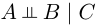

即, 从点上升到点集了..

##### 3. d-划分

A中任意节点到B中任意节点之间的任意路径都经过一个节点

- 该节点被观测, 且节点为Head-tail或者tail-tail型, 且这个点在C中

或者

- 结点类型为 Head-to-Head, 且这个结点和它的所有后继都不在集合C 中

##### 4. d-划分的解释

###### 0) 类比于电路

用电路去对条件独立的关系进行分析是很有效的.

我们要判断 $A,B$ 是否关于 $C$ 独立. 

那么, 可以假设, A,B 是两个电阻群,  C是另外一个一个电阻群. 

如果 C 中的某个点关于 $A,B$ 条件独立, 即Block, 就可以假设, 这个点的电阻是坏掉的, 通过这个点的线路无法通电.

如果 C 中的某个点关于 $A,B$ 非条件独立, 即Unblock, 就可以假设, 这个点的电阻是好的, 通过这个点的线路可以通电.

###### 1) 一条好的线路 : 全为unblock

考虑下面的一个情况

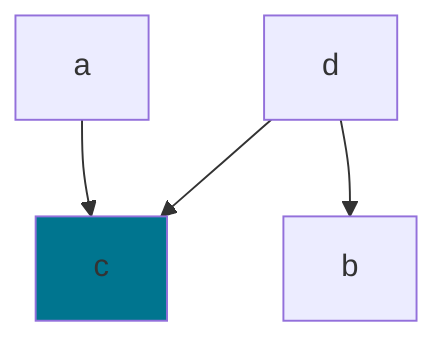

这个图中, $c$ 为未被观测点, 则 $c$ 为unblock点, $d$ 为 unblock 点. 结果是
$$
p(a,b|c)=\frac{p(a,b,c)}{p(c)}=\frac{\sum_d p(a,b,c,d)}{p(c)}\\=\frac{\sum_d p(a)p(d)p(c|a,d)p(b|d)}{p(c)}\\=\frac{p(a)p(c|a)p(b)}{p(c)}\neq p(a)p(b)
$$
则这种情况下 $a,b$ 无法独立.

###### 2) 串联分析 - Block点与Unblock点的优先级 

当一条路径上既有Block点又有Unblock点的时候, 应该是被Block的, 证明如下: 
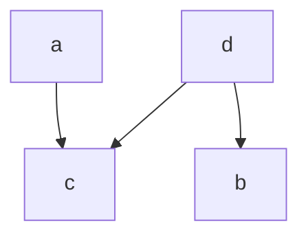
这个图中, $c,d$ 都为未被观测点, 则 $c$ 为Block点, $d$ 为 unblock 点. 结果是
$$
p(a,b)=\sum_d\sum_c p(a,b,c,d)\\=\sum_d\sum_c p(a)p(d)p(c|a,d)p(b|d)\\= p(a)p(b)
$$
Block > Unblock, 也就是说, 

- 只有到一条路径上的所有点关于起始点 $a,b$ 都是unblock的时候, $a,b$ 之间才会有条件独立的关系.
- 若有一个点是 Block,  $a,b$ 之间就不能称为条件独立. 

也就是说, 线路中只要有一个坏掉, 这条串联线路就废掉. AB就独立.

###### 3) 并联分析 - 排他性

但是从A到B经过C的路径可能有很多条, 如果有Unblock的路径, 那么就无法保证, A和B关于C独立. 因此, 就有了第二条, 要想 $A,B$ 之间独立(无法通电) Unblock的路径是不能存在于C中的. 

##### 5. 示例

###### 1) 例子1

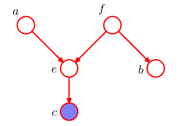

这个例子中, a到b的路径中有 e和f 两个点, 因此要判断a,b 是否条件独立就要判断这两个点, 由于两个点都是 Unblock点, 所以此路通电, $a,b$ 无法条件独立.

###### 2) 例子2

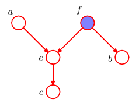

两个点都是Block点, 因此, a,b条件独立.

###### 3) 例子3

独立同分布的来源:

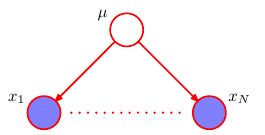

可以看到, 任意的 $x_i,x_j$ 之间都是互相block的, 因此, 其相互条件独立.

#### 8.2.3 朴素贝叶斯

##### 1. 高位数据的多分类问题

###### 1) 问题描述

朴素贝叶斯对应的是一个分类问题, 给定类别数据 $z\in \mathbb{R}^K$, 每个位置上是0或1. 给定输入数据, $x\in \mathbb{R}^D$. 也就是说, 这是一个将 D 维数据分类到 K 个类别中的问题.

###### 2) 一般方法

如果按照一般的方法, 在我们有大量数据的情况下：

- **推断:**

  模型获取的方法是贝叶斯方法:$p(z|x)=p(x|z)p(z)/p(x)$

  我们需要推断的是 $p(x|z)$ 的部分. 而 $p(z)$ 是很好计算的. 

  我们可以利用之前讲到的直方图法或者其他的方法, 对每一个类别都直接去模拟出 D 维空间上的分布. 最后会得到 K 个分布, 分别为 $p_1,p_2,...,p_k$ . 

- **决策:**

  设一个新的数据, $x_n$, 我们找其类别的方法可以是 : 
  $$
  \operatorname{argmax}_i(p_1(x_n),p_2(x_n),...,p_i(x_n),...,p_k(x_n))
  $$

###### 3) 建模方案

对于输入数据为连续值问题, 我们可以假设 $p(x|z)$ 是高斯分布.

对于输入数据为离散值问题, 我们可以用核方法对 $p(x|z)$ 建模.

###### 4) 问题点

需要大量的数据, $O(2^{K*D})$

##### 2. 简化模型

###### 1) 为何简化

上面对于数据量的要求使得, 在输入数据的维度及其大的时候, 我们根本无法实现上面的算法. 例如垃圾文本分类问题, 输入数据的维度是整个词汇库的大小, 这样的指数级数据是天文数字. 因此需要一种简化模型的方法.

###### 2) 如何简化

简化的方法就是采用条件独立假设.

我们假设输入数据中的 $D$ 维数据之间是不相关的. 这里的独立性就是 **朴素贝叶斯** 中朴素二字的来源.

例如, 在上面提到的用高斯建模的例子中, 各个输入数据维度之间相互独立也就是说, 协方差矩阵是对角矩阵. 其概率图:

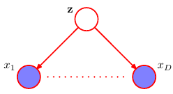

###### 3) 建模方案

对于输入数据为连续值问题, 我们可以假设 $p(x|z)$ 是协方差为对角高斯分布.

对于输入数据为离散值问题, 我们可以假设 $p(x|z)$ 是伯努利分布, $p(x|z_j)=\prod_i^D(x_i|z_j)$.

这就是朴素贝叶斯模型.

#### 8.2.4 有向分解

这里介绍了一个过滤器的概念, 其实就是给所有的分布进行二分类的东西. 

**输入** : 世界上所有可能的分布,

**过滤器** : 一种概率图模型.

**输出** : 满足这种概率图模型中描述的条件独立性质的分布.

可以将一个图模型视为一个滤波器, 向滤波器中输入概率分布. 称可以分解为这个图模型表示的结构的分布的集合为 $\mathcal{DF}$, 表示有向分解. 图示如下:

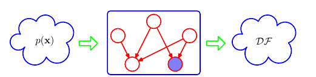

#### 8.2.5 马尔科夫毯

也叫作马尔科夫边界.其性质为:

以图中所有变量为条件, $x_i$ 的条件概率分布只依赖于马尔科夫毯中的变量.

用于求一个图模型中, 与某一个变量 $x_i$ 有非条件独立性质的节点.

还记得最开始将条件独立是判断两点是否为条件独立的式子是:

将这个扩展到任意个节点的情况就是:
$$
p(x_i|x_{j\neq i})=p(x_i|x_{non})
$$
$x_{non}$ 表示与 $x_i$ 非条件独立的点.

其推导如下:

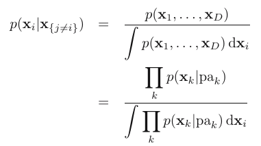

这个式子里面的累乘中, 与 $x_i$ 无关的概率都可以被分母分子互相消除掉. 剩下的只有两种节点:

- $p(x_i|pa_i)$ 中的 $pa_i$
- $p(x_k|pa_k)\  \ \ \ \ x_i\in pa_k$ 中的 $x_k$ 和 $pa_k$. 

总结一下, 具体可分为三种.

- $x_i$ 的父节点
- $x_i$ 的子节点
- $x_i$ 的同父节点 : 和 $x_i$ 同为某一个节点的父节点的节点. 

如下图所示:

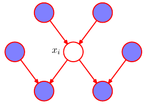

### 8.3 马尔科夫随机场

用无向图表示概率关系的模型

#### 8.3.1 条件独立性质

无向图的情况比较简单

##### 1. 子集与子集的条件独立

从A到B之间的路径若都经过C, 那么称:

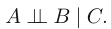

根据8.2.1.1中的描述, 判断条件独立时, 条件变量的值是给定的, 也就是说, 条件变量是已经被观察到的.

如下图所示:

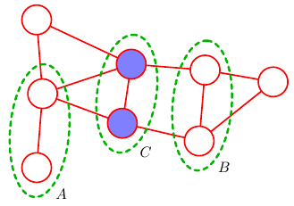

##### 2. 马尔科夫毯

很简单, 与 $x_i$ 直接相连是有条件依赖关系(第三者为任意节点), 对其他的条件独立(第三者为任意节点).如下图:

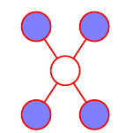

#### 8.3.2 分解性质

##### 0. 目的-**分解联合概率分布**

我们的最终目的是简化概率分布, 以对齐进行分析和模拟. 因此要做的是:

**分解联合概率分布**

##### 1. 找到最小不可分的结构

对于两个之间没有之间连接的节点 $x_i, x_j$, 按照上一届我们讨论的性质, 知道在给定其他节点的情况下, 有如下条件独立性质:

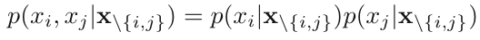

这样的结构带来的问题是, 
$$

$$

$$
p(x_1,..,x_n)=p(x_i,x_j|\operatorname{x}_{\neq\{i,j\}})*p(\operatorname{x}_{\neq\{i,j\}})\\=p(x_i|\operatorname{x}_{\neq\{i,j\}})*p(x_j|\operatorname{x}_{\neq\{i,j\}})*p(\operatorname{x}_{\neq\{i,j\}})
$$

因此, 一个不可分的单元必须是一个全连接子图.

##### 2. 团与最大团

这里定义全连接子图为团, 如下图所示:

这个图中, 含有两个节点的团有四个, 含有三个节点的团有两个. 

最大团是指, 该概率图中拥有的团中节点数最多的那个.

##### 3. 势函数

在考虑联合概率分布的分解时, 我们希望能够在最大团定义一个函数, 可以用来将其作为分解联合概率分布的最基本组成因子. 我们称定义在这个最大团上的函数为势函数.

除了可以合成联合概率分布之外, 还有可以考虑最大团块内部的可分解性, 即使得最大团块包含其内部的子点集的信息, 使得其有三个性质:

- 势函数 $p(x)>=0$

- 最大团块子集(小团块)上的函数, 是可以被包含近最大团块的函数的.

  > 也就是为了满足我们对函数的最简化要求, 我们要设计对应的函数形式

- 联合概率分布可以分解为最大团块的势函数, 如下:

  

  > 其中, Z被成为划分函数, 是用来归一化的.
  >
  > 

##### 4. 势函数的分析

###### 1) 缺点

势函数的存在使得, 不得不归一化常数的计算. 然后计算归一化常数需要很高的计复杂度. 

因为, 如果每个分布产生的是K个离散的值, 共有M个这样的离散变量, 那么计算就要相当复杂, 会是 $O(K^M)$. 

但是, 在进行条件概率计算的时候, 不要计算归一化常数, 因为两个分母抵消掉了.

###### 2) Hammersley-Clifford theorem

这个定理表明, 对于最大团的分解的结果, 和之前讲过的过滤器的结果是一致的. 

###### 3) 势函数的基本形式

一般都是采用指数形式:

其中, $\mathbb{E}(x_c)$ 被称为**能量函数**. 指数表示被称为**玻尔兹曼分布**.

这里之所以**称其为能量函数的原因是**:

对于联合分布概率是以乘积形式结合的, 放在这里的指数形势下, 就是指数部的相加. 

**就有能量的感觉...**

##### 5. 势函数的灵活性

势函数没有一个具体的概率意义。虽然这使得选择势函数具有更大的灵活性,因为没有归一化的限制. 那么如何选择势函数:

将势函数看成一种度量, 它表示了局部变量的哪种配置优于其他的配置。

势函数的灵活性, 使其可以做很多很多事情, 避免了像有向图一样的只能从固定分布中生成联合概率分布, 而是可以从变量和变量本身的关系之中自由的设计分布的形式. 对比如下:

**有向图** : 给定一些分布集, 从分布集中挑选或者重新合适的分布, 去设计符合先验知识的分布.

**无向图** : 给定先验知识, 直接依据先验知识去设计分布.

通过下面8.3.3 和 8.3.4 的讲解会理解这一点的.

#### 8.3.3 例子-图像去噪

对于图像去噪的例子利用无向图模型进行了介绍.

首先, 介绍了两个图, 原图和加噪声的图, 两个图都是二值图像:

然后以每个像素点作为一个随机变量, 将两个图平行放置, 设置为下面的一个无向图网络.

- **条件峰值算法**

上面$y$的有噪声的图像, 噪声图中的像素点之间无连接. $x$ 是**需要生成的清晰图像**. 因此我们要最大化的就是:

这里对势函数的定义为:

- 第二项代表着左右团 - 先验是:邻近点的概率大
- 第三项代表着上下团 - 先验是:同一位置的点值相同的概率大
- 第一项代表的先验是 : $x_i$ 倾向于一种值(如黄色值, 因为它多)

最大化概率 $\to$ 最小化势函数

- **最大加和算法**

之后讲

#### 8.3.4 有向$\to$无向

##### 1. 有向图转无向图 - 线性图的例子

Insight : 利用从有向图中获取的先验知识去设计无向图. 

下面是一个简单的例子:

有向图 : 

无向图 : 

按照无向图的分割的思想对有向图进行分割的话, 势函数就有如下特点:

##### 2.有向图转无向图 - 推广 

因为, 在有向图中同一节点的父节点都会同时出现在同一个函数中, 即使他们之间是相互独立的(tail-to-tail). 如下图:

 

为了表示 $p(x_4|x_1x_2x_3)$ 需要在无向图中将其连接起来(**父节点联姻**), 如下图: 

这个称为**道德图**(即只有结婚才可以生娃, 针对的就是有向图中, Head-to-Head 节点之间互相独立的特殊情况)

因此 : 一个非常重要的定理

**从一个有向图表示转化为无向图表示的过程中,我们必须从图中丢弃掉一些条件独立性质。**

这里就涉及到了, 在 有向 $\to$ 过程中的一个 **概率分布的独立性** 和 **图所表达的独立性** 的一个 **trade-off**

##### 3. 独立性的Trade-off

设 $D_f=\{(x_i,x_j,x_k)\}_{x_i\bot x_j|x_k}$ 表示概率分布中所表达的条件独立性

设 $D_g=\{(x_i,x_j,x_k)\}_{(x_i\bot x_j|x_k)}$ 表示概率图中所表达的条件独立性

**D 图 (dependecy map)** 	: $D_f\in D_g$ , 极端例子是, 概率图是完全非连接图

**I 图 (independence map)**  	: $D_g\in D_f$ , 极端例子是, 概率图是完全连接图 

**完美图 (perfect map)** 		: $D_f=D_g$ 

这里的完美图的概念非常重要, 我擅自展开一节对这个进行描述

#### 8.3.5 完美图

上一小节, 讲解三个图的概念, 都是有概率分布的与图对于条件独立变量的表达能力的描述.

##### 1. 条件设定

首先, 这里来一般化讨论. 首先, 进行以下设定:

- **设定一组数目固定的随机变量 $\mathcal{X}$**
- **设定在 $\mathcal{X}$ 上的所有可能的分布的集合为 $\mathcal{F}=(\mathcal{f}_1,...,\mathcal{f}_n)$**
- **设定 $\mathcal{F}_d\in \mathcal{F}$ , $\mathcal{F}_d$ 的性质为, 其下的任意概率都对应着一个完美的有向图.**
- **设定 $\mathcal{F}_u\in \mathcal{F}$ , $\mathcal{F}_u$ 的性质为, 其下的任意概率都对应着一个完美的无向图.**

##### 2. 三者之间的韦恩图

其中, $P \to \mathcal{F}$, $D \to \mathcal{F}_d$, $U \to \mathcal{F}_u$

##### 3. 举例子

这里只给出, 不满足 $U$ 部分的例子.

即只要是有 Head-to-Head 结构的概率分布都无法用一个无向图完美表示.

##### 4. 如何设计 $D\cup U$ 之外的部分

这里出来一个一个新的概念 - 链图.

是有向和无向的混合. 

但是, 问题在于, 这种图也无法完美表达所有的概率分布. 再说就超出本书范围了.

### 8.4 图模型中的推断

#### 8.4.0 什么是推断

详情背景看1.5节的决策论部分.

推断就是利用已知数据决定 $p(x,t)$, 下面是一个简单的例子.

在这里就是, 已经知道, $x,y$ 之间有关系, 但是不知道是什么关系, 接下来要用推断去决定这一步.

1. 我们知道 $x,y$ 之间有如下图a中的关系

2. 然后, 我们有一些如下图b中的观测数据 $y$ , 也就知道了 $p(y|x)$

   > 这里其实指的是,训练集中输入 $x$, 输出 $y$, 这样就可以计算 $p(y|x)$

3. 利用观测数据, 可以计算边缘概率分布 $p(x)$, 这个就作为关于 $p(x)$ 的先验概率分布.

4. 目标是通过贝叶斯定理, 推断出关于 $x$ 的后验概率分布, 如下图c. 贝叶斯定理如下:

    

#### 8.4.1 链推断

##### 1. 问题描述

对于下面这个结构

其有向图可以完美转换为无向图(即不会改变条件独立性质).

这里设定一共有N个变量, 每个变量都是离散分布, 拥有K个结果. 那么, 共有参数:

$(N-1)K^2$

**问题** : 找到边缘分布 $p(x_n)$.

##### 2. 解决方案

- **一般方法**

  显式求和:

  

  复杂度 $O(K^N)$

  用到的思想是:
  $$
  (a_1,a_2)^T(b_1,b_2)= a_1b_1+a_2b_1+a_1b_2+a_2b_2
  $$

- **利用条件独立性质**

  即利用无向图模型

  

  计算 $p(x_N) =\sum_i^{K_{N-1}}\phi_{N-1,N}(x_{N-1},x_N)$ 需要 $K_{N-1}$ 次, 即变量 $x_{N-1}$ 可以取得离散值得数目.

  其求和式子为:

  

  这个式子的简化思想是:
  $$
  ab_1+ab_2=a(b_1+b_2)
  $$
  将左式的三次运算, 简化为右式的二次运算. 

  这种情况下的计算复杂度是:

  每一步 $\sum_i^{K_{N-1}}\phi_{N-1,N}(x_{N-1},x_N)$ 需要 $K^2$ 次运算, 一共有 $N-1$ 次, 因此共有: $O(NK^2)$

  这个简化来源于条件独立, 因此对于完全连接的分布是不存在这种关系的.

##### 3. 马尔科夫过程 - 边缘分布

在下面求和式子

对 某一个节点 $x_n$ 的边缘概率的计算被分为了两部分, 一部分是前面的信息, 一部分是后面的信息. 

这里用到了**信息**两字, 体现了马尔科夫过程的直观概念. 

每一个 $\sum$ 其实都是对前面的信息的总结. 也就是说 :

信息一步一步的传递到了目标节点上.

##### 4. 马尔科夫过程 - 势函数

如果要计算每一个节点的边缘概率, 那么计算复杂度就成为了:
$$
O(N^2K^2)
$$
但是这个其实还是有些浪费的. 下面是一个 $2NK^2$ 便可解决的方法, insight是储存每一步信息.

- 以最后一个点 $x_N$ 为起点,  从 $x_N$ 向前走, 就能得到从N开始所有 $\mu_{\beta}$
- 以第一个点 $x_1$ 为起点,  从 $x_1$ 向后走, 就能得到从1开始所有 $\mu_{\alpha}$

这样不仅可以求一个变量的边缘概率, 也可以求最大团的联合概率,也就是势函数:

#### 8.4.2 树

树结构相比于马尔科夫链的变化是 : 每个节点的父节点和子节点可以有多个, 但是其不能有环.

其可以将 马尔科夫过程中的 信息传递公式进行推广, 得到 加和-乘积公式(sum-product algorithm), 详见8.4.4节.

树有两种情况:

##### 1. 无向图 - 树

没有环的无向图

##### 2. 有向图 - 树

只能有一个根节点, 每个节点只能有一个父节点, 这样的有向图转化为无向图不需要增加条件独立的设定. 如下:

##### 3. 有向图 - 多树

节点可以有多个父节点, 并且可以有多个根节点, 但是**注意**, 一个点到另外一个节点之间的线路只有一条. 如下:

其不能存在的情形是:

#### 8.4.3 因子图

##### 1. 为何引入因子图

在8.4.1.4中, 介绍了链推断的情况, 在这种情况下, 计算整个图的信息推断只需要线性时间. 

在8.4.2节中, 我们简单说道了可以利用 加和-乘积公式 对**树**或者**多树**结构进行 信息传递计算, 这个也是线性的(下节). 

不过上面讲的三种树

1. 无向树

2. 有向树
3. 有向多树

的结构还是有一定差异的, 我们该如何把其同一呢?

答 : **将上面的结构转换为最简单的无向图无环树状结构, 方法就是使用因子图**

##### 2. 什么是因子图?

###### 1) 因子函数节点

增加**函数节点**, 例如下图:

按照无向图的算法, 这个图中的, $x_1, x_2,x_3$ 的节点, 他们三个之间有有一个公共的势函数. 反映在因子图中, 就是增加了一个连接三个点的函数. $f(x_1,x_2,x_3)=\psi(x_1,x_2,x_3)$ .

也就是说, **函数节点表示的其连接的点之间的联合分布的一部分(或是全部)**

###### 2) 多个因子函数节点的联合分布 

下面是一个简单的多个节点的情况

其函数的情况如下:

总结下来如下:

这个地方需要注意的是, 这个图中, $x_1, x_2$ 之间其实有一个最大团, 或者有向图中的有向连接, 一般都是用一个函数去表示, $\psi(x_1,x_2)$ 或者 $p(x_2|x_1)p(x1)$ , 但是这里分解为了两个因子函数. 暂且不论这样有什么用, 这里只需要知道可以这样做就好了.

##### 3. 因子图性质

1. 因子图没有环,且任意两个结点之间有且只有一条路径

2. 因子图是一个二分图, 因子函数节点和随机变量节点之间互相连接, 但是每种节点之间没有连接.

3. 因子图的自由性

   以上面提到的无向图为例, 其还可以有如下的概率分布.	

   	那么应该如何分解联合概率函数呢? 看下节.

##### 4. 将三种树化为一种树

###### 1) 简单的例子

这个才是最后的目的. 例如有向多树的情况

最后化成了一个树状结构.

其公式为: 

#### 8.4.4 加和-乘积算法

##### 1. 目的

###### 1) **环境设定**

- **变量** : 都是离散变量. 边缘概率使用**加和**函数. (连续则为积分, 本质也是加和)

- **图结构** : 可以化为树结构因子图的树结构图.

  > 而对于有环的图, 必须要采用另外的算法, 叫做联合树算法, 具体见8.4.6

###### 2) **目的**

- **输入** : 因子图, 
- **目的 :** 
  - 设计一个**精确推断**算法, 计算结点或者结点子集的局部边缘概率分布.
  - 做到高效性.

关于如和求最大概率见下一节的最大加和算法.

##### 2.  具体算法 

这个暂时忽略

#### 8.4.5 最大加和算法

求联合概率最大时的变量值.

#### 8.4.6 一般图的精确推断

这里扩展到了任意的图拓扑结构.  可以处理**有环的图**结构. 叫做**联合树算法**

大概步骤是, 

- 先将有向图转化为无向图. 如果是无向图就不需要
- 接下来进行三角化, 主要是用来消除无弦环. 
- 接下来用无弦环来构建新的树结构无向图. 被称为 联合树.
- 在利用上面的算法.

**限制因素:**

联合树算法对于任意的图都是精确的、高效的。对于一个给定的图,通常不存在计算代价更低的.

不幸的是,算法必须对每个结点的联合概率分布进行操作. 一个重要的概念是图的树宽度(treewidth). ,它根据最大团块中变量的数量进行定义。

由于通常情况下,从一个给定的起始图开始,可以构建出多种不同的联合树,因此树宽度由最大团块具有最少变量的联合树来定义。如果原始图的树宽度比较大,那么联合树算法就变得不可行了。

这样就无法采取**精确推断**, 而要采用**近似推断**. 详见下一节.

#### 8.4.7 循环置信传播

方法是对于有环, 但是无法采用联合树算法的图, 利用多次执行加和-乘积算法的方式来进行近似推断. 

由于存在环, 因此信息会绕着图无限流动, 我们可以设置次数去限制流动次数. 对于某些模型, 算法会收敛, 但是对于有些不会.

具体内容忽略

#### 8.4.8 学习图结构

上面说的都是对于已知图的推断.

那么处理只有数据没有图的情况呢?

我们需要从数据去推测图结构. 

- 第一, 定义一个可能结构的空间. 由于复杂度高, 这里可能需要用到启发式方法

- 第二, 对每个结构利用数据进行评分 $p(\mathcal{D}|m)$

- 第三, 利用贝叶斯对每个模型进行预测. 需要提供关于模型的先验.

  

