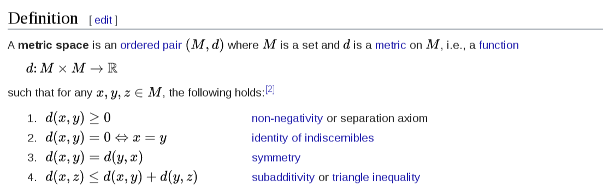

## Basic concepts in topological

### 1. 集合论基本概念

#### 1.1 Total order & Partial order

##### 1) Total order

在集合上满足以下三个条件的 binrary relationship, 就叫做 total order. 

Formally, a binary relation $≤ $ is a total order on a set X if the following statements hold for all a , b and c in X :      

- If a ≤ b and b ≤ a then a = b  (**antisymmetry**);     
- If a ≤ b and b ≤ c then a ≤ c (**transitivity**);     
- a ≤ b or b ≤ a (**connex property**).

##### 2) Partial order

Partial order 与 total 相似, 但是, 其少了 第三个限制. 多了一个 自反性 的限制. 

The axioms for a **non-strict partial order** state that the relation ≤ is reflexive, antisymmetric, and transitive. That is, for all a, b, and c in P, it must satisfy: 

- a ≤ a (**reflexivity**: every element is related to itself)
- if a ≤ b and b ≤ a, then a = b (**antisymmetry**).
- f a ≤ b and b ≤ c, then a ≤ c (**transitivity**).

#### 1.2 Product topology(积拓扑)

积拓扑就是定义在拓扑空间上的 笛卡尔积. 

严格的定义比较难懂, 但是举例子就很简单 :

从实直线 $\mathbb{R}$ 上的标准拓扑开始，定义n份  $\mathbb{R}$  的乘积，就得到普通的 $\mathbb{R}^n$ 上的欧几里得拓扑

#### 1.3. Cartesian product & Projection

##### 1) Cartesian product

定义在集合上的乘积 :

- 英文定义 :

  A Cartesian product is a mathematical operation that returns a set (or product set or simply product) from multiple sets. That is, for sets A and B, the Cartesian product A × B is the set of all ordered pairs (a, b) where a ∈ A and b ∈ B. 

- 图的解释 :

  

##### 2) Projection

Projection 在集合论中有两个定义, 其中的一个是 :

- 投影是于笛卡尔积相反的概念. 

  In set theory, a projection is one of two closely related types of functions or operations, namely:

  A set-theoretic operation typified by the jth projection map, written ${\displaystyle \mathrm {proj}_{j}}$, that takes an element $x → = ( x 1 ,   … ,   x j ,   … ,   x k )$  of the Cartesian product $( X 1 × ⋯ × X j × ⋯ × X k ) $ to the value ${\displaystyle \mathrm {proj} _{j}({\vec {x}})=x_{j}} \mathrm{proj}_{j}(\vec{x}) = x_j$. 

- 另外一个是与 equivalence class 有关:

  这个是定义在集合的 equivalence relationship 上的. 在一个集合中, 祥见 Wikipedia. 

  上面是将一个 Cartesian product 投影向一个 value. 而这里是将 一个 value 投影上一个 set. 这个set 就是 这个 value 在集合上的 equivalence class.

#### 1.4. Open set & Close set

##### 1) 解释

开集和闭集 对应的是对于集合的范围的描述. 

最简单的例子就是 $2\leq x \leq 5$ 和 $2< x \leq 5$

其中, 第一个集合就是开集, 第二个集合就是闭集. 

##### 2) 定义

维基给出了基于三种空间的定义. 从具体化到一般化的顺序分别是:

- Euclidean space:

  一个在欧几里得空间上的开集是指, 对于集合中的任意点, 都有:

  there exists a real number ε > 0 such that, given any point y in Rn whose Euclidean distance from x is smaller than ε, y also belongs to U.

- Metric spaces

  将欧几里得 metric 换成 metric space 的 metric 即可. 

- Topological spaces

  

  这个看不懂

#### 1.5 Neighbourhood(邻域)

在集合论中，邻域指以点 a 为中心的任何开区间，记作：U(a)。 

如果 X 是一个拓扑空间, p 是 X 中的一个点. 那么 p 的领域就是 X 的一个子集 V, 并且 V 包含着包含 p 的开集 U. 即:
$$
p\in U\subseteq V
$$
一个点与其 neighbourhoods 存在满射关系. 

#### 

#### 

### 2. Topology Space 定义

#### 2.1 Metric space

##### 1) 解释

Metric space 是指, 对于 集合 X 上的每一对点之间的距离, 都是可以被定义的. 

这些定义距离的方法被叫做 a metric on the set. 

三维欧几里得空间就是一个度量空间, 其中的 metric 就是 Euclidean metric . 

##### 2) 严格定义

注意, 一个 metric space 中的 metric function 只能有一个.

#### 2.2 **Topological space**

##### 1) 基于 open sets 的定义

一个拓扑空间是一个 ordered pair $(X, \tau)$. 

- X 是 一个集合. 其中可以为数字, 也可以为其他对象. 
- $\tau$ 是 X 的子集的集合. 

两者满足以下三个 axioms:

- The empty set and X itself belong to τ.
- $\tau$ 中任意 members 的并属于 $\tau$
- $\tau$ 中任意 members 的交属于 $\tau$

我们称 $\tau$ 为 X 上的拓扑结构. The elements of *τ* are called **open sets**

> 例子见 https://en.wikipedia.org/wiki/Topological_space#Definition_via_open_sets

> 注意: 定义在开集上的 拓扑空间没有从 X 到 $\tau$ 的映射. 但是下面的基于 neighbourhoods 的定义就有. 

##### 2) 基于 neighbourhoods 的定义

上面是最一般的定义(定义在 开集上). 还有定义在闭集上的定义. 

这个是最常用的定义.  

In topology and related branches of mathematics, a topological space may be **defined as a set of points**, along with **a set of neighbourhoods for each point**, satisfying **a set of axioms relating points and neighbourhoods**.  来自维基

简单来说, 其具有三个基本信息. 

- 一个关于 points 的集合. 
- 一个关于 每个 point 的 neighbourhoods 的集合. 
- 一个关于 points 和 其neighbourhoods 的  axioms(定理) 的集合. 

这里的 neighbourhoods 并不是单指距离上的相近的点. 而是一种定义的点和点之间的关系. 下面是更一般的定义.

首先要知道, 一个拓扑空间包括两个基本元素: $(X, \tau)$

- 其中,  $X$ 是整个集合. 包含着空间中所有的点. 
- $\tau$  是 neighbourhoods 的集合. 这些 neighbourhoods 必须要满足上面提到的对
- 而, 映射函数 $N$ 将每个 $x\in X$ , 映射到 $\tau$ 的 members 上. 

##### 3) 重要性

拓扑空间是定义一切数学空间的基础, 因为它是一个只依赖于集合论的定义, **是最一般形式的定义.** 

在其上加上一些其他限制, 就可以构成其他的空间. 例如, 流形空间(manifold), 或者 度量空间(metric space)

##### 4) Metric 和 Topological space 的区别

> https://math.stackexchange.com/questions/21313/what-is-the-difference-between-topological-and-metric-spaces

#### 2.3 Hausdorff space

豪斯多夫空间 (**Hausdorff space**, **separated space** or **T2 space**)

##### 1) 定义

- **英文定义 :** 

  Points x and y in a topological space X can be separated by neighbourhoods if there exists a neighbourhood U of x and a neighbourhood V of y such that U and V are disjoint (U ∩ V = ∅). X is a Hausdorff space if all distinct points in X are pairwise neighborhood-separable. 

- **中文定义 :** 

  假设X是拓扑空间。设x和y是X中的点。我们称x和y可以“由邻域分离”，如果**存在**x的邻域U和y的邻域V使得U和V是不相交的（U ∩ V = ∅），且X中的任意两个不同的点都可以由这样的邻域分离，那么称X是豪斯多夫空间。这也是豪斯多夫空间叫做T2空间或分离空间的原因。

  > 上面需要注意的是 **存在** 这个词. 一个点 x 的领域 是可以根据 metric 或者 neighbourhoods 映射的定义去定义的. 因此, 存在在 metric space 中就意味着, 领域的大小 $\epsilon$ 可以无限小, 甚至为0 . 

- **图的解释 :**

  

##### 2) 性质

- 所有的 metric space 都为 Hausdorff space. 

  > 证明 : https://proofwiki.org/wiki/Metric_Space_is_Hausdorff

- Subspaces and products of Hausdorff spaces are Hausdorff

#### 2.4 Separation axiom

### 3. Spaces 关系定义 

#### 3.1 Isomorphism

#### 3.2 Homeomorphism

同胚是一个比较高大上的概念, 不过在维基上的定义倒是很简单:

两个 拓扑空间 ${X,T_X}$和 ${Y,T_Y}$之间的[函数](https://zh.wikipedia.org/wiki/%E5%87%BD%E6%95%B0)*f* : *X* → *Y*称为**同胚**，如果它具有下列性质：

- *f*是双射（[单射](https://zh.wikipedia.org/wiki/%E5%8D%95%E5%B0%84)和[满射](https://zh.wikipedia.org/wiki/%E6%BB%A1%E5%B0%84)）；
- *f*是[连续](https://zh.wikipedia.org/wiki/%E8%BF%9E%E7%BB%AD%E5%87%BD%E6%95%B0_(%E6%8B%93%E6%89%91%E5%AD%A6))的；
- [反函数](https://zh.wikipedia.org/wiki/%E5%8F%8D%E5%87%BD%E6%95%B8)*f*−1也是连续的（f是[开映射](https://zh.wikipedia.org/wiki/%E9%96%8B%E6%98%A0%E5%B0%84)）。

满足以上三个性质的函数有时称为**双连续**。**自同胚**就是从一个拓扑空间到它本身的同胚。同胚形成了所有拓扑空间的[类](https://zh.wikipedia.org/wiki/%E7%B1%BB_(%E6%95%B0%E5%AD%A6))上的[等价关系](https://zh.wikipedia.org/wiki/%E7%AD%89%E4%BB%B7%E5%85%B3%E7%B3%BB)。所得到的[等价类](https://zh.wikipedia.org/wiki/%E7%AD%89%E4%BB%B7%E7%B1%BB)称为**同胚类**。

### 