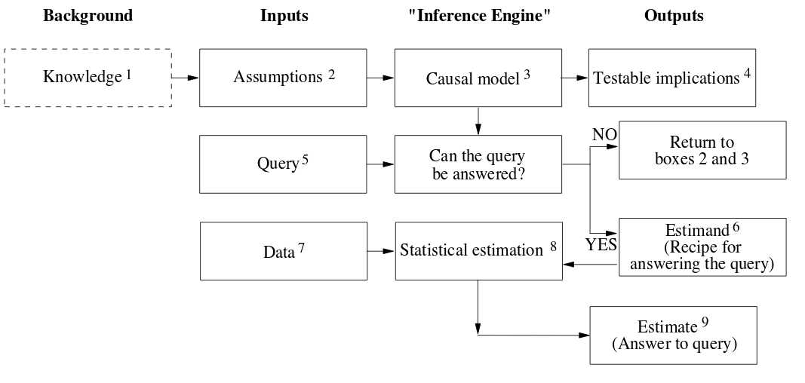

## Introduction

### 基本概念和简介

1. 告诉了我们这个新的科学提供了一个框架, 可以融合不很多不可规约的问题. 并且这门学科的历史只有20年.

   > 通約不可能性または共約不可能性とは、英語 incommensurability の訳語で、科学哲学の分野、および価値論の分野で使われる言葉。より有名なのは科学哲学の文脈での使用で、体系、概念、方法論などに違いを持つ異なる体系（パラダイム）同士の間で、概念間の対応付けがうまく出来ない状態のことを指すのに使われる。 

2. 因果推论是一门对我们自身的思维进行模拟的学问, 不是一门高新科技. 

   因果是什么 : 人类正因为可以分析因果, 才有了我们现在的社会. 这个东西就是我们自己在日常中提出的问题 : why

3. 这门学问的目的就是, 形式化,具体化这个 "why" 的本质内涵, 分析人脑的因果推理机制. 进而成为实现强人工智能的钥匙.

4. 关于分析人脑中的因果推断的学问一直被忽视. 现在的目的就是, 找到一个合理的数学形式对其进行过表达并和其他处理数据的数学结合. 

5. 因果分析带我们走进强人工智能的世界, 也许可以结束大数据以及深度学习的统治地位. 

6. 为什么之前没有出现因果推论的:

   在很久之前就出现了分析因果关系的学问, 但是从一开始人们分析数据的方法就决定了他们只能处理相关关系.

   Example: 气压计和气压的关系. 

   $B=kP\\ P=B/k \\  k=B/P$

   人们一开始过于注重于他们之间的数值关系, 而无法处理拥有方向性的因果关系. 也就是无法知道是气压计数值升高导致了气压升高, 还是反过来

   > 为什么直到现在才会有, 这个问题应该有很多人意识到才对? 你知道什么表示方向性的数学工具.

7. 作者给出的原因是, 我们希望用数学去处理一些人脑难以处理的问题, 而对这种对于人类而言很简单的因果推理能力没有必要去处理这样的问题

8. 随着科学好奇心的增长以及对机器的依赖, 我们开始对这么学问产生兴趣. 

9. 这种现象在科学史上并不少见. 

   在400年前, 人们还满足于利用本身认知能力去处理周围世界的认知性. 但是随着社会的进步, 对于准确处理不确定性的需求的出现才导致了概率和统计的出现.

10. 概率和因果历史的分叉点.

    现代统计学的最开始是来源一个因果问题, 即, 遗传问题以及跨代遗传问题等等生物上的问题. 但是, 他们失败了, 因此他们发明了一种和因果无关的学科-统计学

11. 统计学也一直注意这个问题, 在统计界, "相关性不等于因果"是很基础的一个观点.

    而现在的一个很流行的错误的观点就是:所有科学问题的答案都隐藏在数据中.

12. data are profoundly dumb, 可以告诉你事实是什么样, 但是无法告诉你为什么会是这个样子. 这里有必要区分一些, 什么和为什么的区别, 吃一种药可以减轻病状是一中事实, 但是无法证明是因为吃这种药才减轻病状的. 也可能是因为这个人有钱 

13. 因果革命是指近几十年开始踏寻因果关系的这样的一个学术活动.

14. 因果革命得以发展也是有一些数学基础的. 这个就是 calculus of causation.

15. calculus of causation 由两部分组成. 

    一部分是causal diagrams

    对我们的知识进行建模, 是一种符号语言, resembling algebro(相似代数). 包括

    - 点 : 表示注目的东西 - variable.
    - 边 : 表示的是点之间的因果关系.

    理解很简单.

16. 在近三十年中有很多种因果模型. 但是本质是相等的, 

    给出了causal diagrams的最实质的定义 : 都是描绘了一个生成数据的过程.  + ?

17. 除此之外是 Language of queries.

    去表达我们想要回答的问题.  P(L|do(D)).

    重要的就在于这个do, 他是一种intervention. intervention意味着我们在做实验, 而不是观察. 

    下面的两段主要是讲如何进行实验, 以及$P(L|do(D))$ 和 $P(L|D)$ 之间的区别. 

18. 讲了进行 do 的重要性, 即有很多外在的因素影响着现实中的数据. 

19. 因果革命的一个很重要的成果就是解决了在不真正的进行 do 的情况下, 获得 $P(L|do(D))$ 的实验结果. 也就是从可观测数据中就可以得到实验数据的结果. 这一切来源于对 do 的假设.

    这个在第一章也有将, 因果革命一共包括三个阶段, 这个属于第二个阶段, 而第二个阶段的分析其实是可以在不进行实验的情况下完成的. 

    > 问题, 不进行实验只利用观测数据, 和之前的方法有什么区别? 还不是用的原先的数据, 只是处理数据的方法变了点而已. 

20. 另外一个因果中的重要的概念是**反事实假设(对应着上面的intervention)**. 比如说Joe吃了药死了, 我们要探究是否是这个药导致的他的死亡, 就要假设如果他没有吃这个药的话是否会死. 

21. 关于Counterfactual 推理的定义. 处理的是what-if的问题. 反事实假设和干预假设都可以解决一些因果推理问题, 比如上面提到的气压计的例子, 用反事实假设的思想去想的话就是, 气压不变的话, 气压计的值也是不变的. 

22. 反事实假设在道德行为中极为重要. 这个也是使得人类变得独一无二的最重要的能力, 因此也是强人工智能的最终目标.

23. 讲了作者为什么会对这个感兴趣, 第一. 讲了作者关于人工智能的一些哲学观点, 作者对于语言是极为重视的, 他认为语言塑造了人的思想. 因此, 他就像赋予一种计算机的语言去理解世界. 因此这个也许可以帮助我们更深的理解自然语言. 从自然语言中挖掘信息.

24. 第二讲了, 实现强人工智能, 因果关系是必不可少的一种看法. 

    作者相信因果推理可以带来强人工智能. 并且这并不是一个遥不可及的目标. 

### Blueprint of reality

Causal inference engine:

- 先利用 assumption 和 Causal model 去判断问题是否可以被回答. 
- 如果可以的话, 就生成Estimand, 这包含了为了从数据中回答该问题所需要的数学公式的菜单, 这里的菜单里面的食材就是数据, 菜单里的做法就是公式.
- 最后利用数据和方法去利用统计学工具获得对答案的解. 

下面是对每个部分的详解:

1. Knowledge : 所有和问题相关的数据, 比如说要分析吃药能否解决病症的问题的时候, 不仅要病人的服药记录和健康记录, 还要当地的消费观数据等等等等.

2. Assumption : 我的想法是, 这是一些高度抽象的规律. 知识本身是很复杂的, 想要把所有的知识进行总结是不现实的, 但是总可以用一些假设去规范数据. 

3. causal model : 这里前面讲过, 就是causal diagrams. D导致了L, 就说 L listen to D.

4. Testable statement : 这里的statement用来描述causal model中的监听关系, 比如说D和L时间存在的依赖模式以及依赖路径. 而 之所以成为 testable 是因为, 我们的causal Model有可能并不是完美的, 这里的部分是可以根据数据来对有causal model生成的statement进行判断, 如果有问题的话则对causal model进行修改. 这个要用到其他的部分, 没有在这个图中画出. 

5. Query : 这个必须要用因果词汇进行定义.例如 $P(L|do(D))$. 因果革命的一大贡献就在于对这里的QUery的形式进行了严格的数学定义.

6. Estimand : 这里指的是利用数据的方法. 类比于统计中的例子, .... 

   不同于统计的是, 这里不是说有数据有问题就可以进行处理了, 还要对照causal model是否支持这样的运算, 如果不支持的话, 我们的这个问题就是不可答的.

7. Data : 就是我们的数据, 这里值得注意的是数据有很多都是无用的. 因此, 我们需要Estimand去指导我们去使用这些数据.

8. Estimation 就是我们现在使用的统计工具.

9. Estimate : 我们想要的估计结果. 这里很重要的两点是:

   - 得到正确的结果后, 将得出的知识加入知识库的
   - 得到不合理的结果后, 去修改自己的模型.

   相当于在模仿小孩子的学习能力.

### 对上面的解释

1. **因果模型中的数据和统计中的数据是不同的**, 因果中的数据需要经过causal model, query, 以及Estimand都结束之后, 去收集所需要的数据, 而不是像统计一样, 给出全部数据就要去分析全部数据(因为这些数据中很大一部分是没有的. ) 

2. 这里否定了如今的科学界的偷懒行为, 偷懒是指把所有的希望寄托于数据. 

   > 我的一个想法是, 如今强烈依赖于数据的分析科学其实有一部分是源于之前基于规则的方法的失败. 而这里的一个观点就是, 数据当然重要, 但是, 那些规则也很重要, 并且之前的失败是没有找到一个很好的表示规则也就是因果的方法.
   >
   > 而在这里作者尝试利用因果模型将两者结合起来.

3. 强调了反事实假设在因果模型中的重要性.  反事实假设的原型是why的问题

4. Adaptability : 适应性很强. 因为分析的步骤(Estimand)是在收集数据之前定义的. 因此可以分析很多相似的问题. 

5. 一个例子, 换医院进行病症预测的例子. 这也体现了深度学习的数据依赖性, 他根本没有反应出问题的根本. 同一问题, 甚至换一个数据源就会产生不同的结果.

#### 各个章节的介绍

##### 6.1 Chapter1

- Ladder of causation : observation $\to$ intervention $\to$ counterfactual
- Basic reasoning with causal diagram

##### 6.2 Chapter2

- Statistic inflicts casual blindless on itself.
- The story of hero.

##### 6.3 Chapter3

- Why traditional AI is wrong and Why author convert to causality?
- A causality-minded Introduction to bayes's rule and Bayesian method of reasoning.
- Some examples of bayes network.

##### 6.4 Chapter4

- Major contribution of statistic to causal inference : Randomized controlled trial, do with $P(L|do(D))$
- A simple solution to the general confounding problem.

##### 6.5 Chapter5

- History

##### 6.6 Chapter6

- Introduce some paradox : show that human intuition is grounded in causal not statistic.

##### 6.7 Chapter7

The seriously introduction about **Ladder of causation** from chapter7 to chapter9.

- intervention , do-type question
- Causal inference engine : produce yes/no in Figure1.1 

##### 6.8 Chapter8

- Counterfactual 

##### 6.9 Chapter9

- Mediation : to judge if interaction between D and L directly or indirectly

##### 6.10 Chapter10

- strong AI

