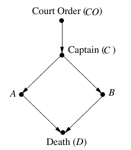
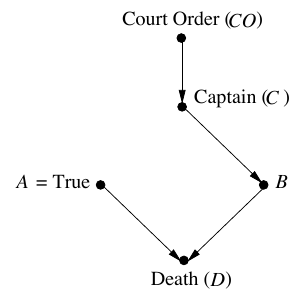
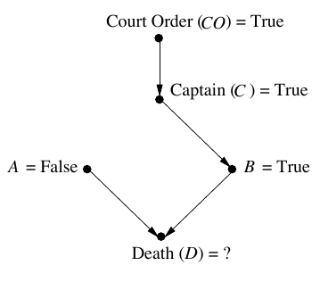
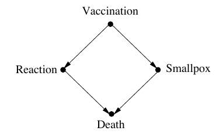

### 第一章後半


### P17

---

1. 前半の部分：Turing はTuring test (imitation game)を提案した。予測が外れた。


2. 後半の部分　：　

		imitation game に合格できるマシンを構築する策略を提案した。直接人間みたいなマシンを作るではなく、まずは学習能力を持つマシンを構築する。あとは世界知識を子供に教えるようにマシンに教える。

3. でも、子供の脳は十分複雑なメカニズムを持っている。！！

4. A key component in this intelligence is the **mastery of causation.**


### P18

----

1. 因果知識を獲得するために、どんな入力が必要なのか？

   - inputs from active experimentation
   - passive observation
   - input from the programmer

2. 本書で扱う問題は:

   How can machines (and people) represent causal knowledge ,  as a three-year-old child can?

3. mini-Turing test

   - やりかた : 
     1. take a simple story
     2. encode it on a machine
     3. test to see if the machine can correctly answer causal questions
   - miniと言う理由は：
     - ただ簡単な内容
     - encoding の形はどうでもいい

4. 実行するステップ

   - **Representation first, acquisition second.**

   - **A good representation led to insights on how the knowledge ought to be acquired**

     > ICIM : Representation learning


### P19

----

1. Cheating can pass mini-turing test?

2. できない、理由は、変数の組み合わせは無限に近い、なので、答えを列挙することはできない。

   > 深層学習における最適解は一つだけですか？
   >
   > 探索空間を制限することで、学習効率、効果をあげられますか？

3. Cheating がだめだったら、何が必要？

   **Compact representation:**  すなわち, an effective procedure で

   - 質問を理解すること
   - 知識から問題を探すこと

   >  [A survey of sparse representation: algorithms and applications](https://arxiv.org/pdf/1602.07017)


### P20

---

1. Answer of Compact representation : **causal diagram**

   理由: 

   - People can communicate their knowledge with dot-and-arrow diagrams
   - テストをpassできる：例はした

2. 死刑犯人の例

   各ノードはTrue/False

   


### P21-22

-----

この図から

梯子からの分析

- 第一層：Answer questions of **association**

  事実を述べる：各事件の依存関係

- 第二層：Invervention

  If we want our computer to understand causation, we have to teach it how to **break the rules.**

  Break の意味はobservingだけではなく、making it.

  ここの例では：

  > What if soldier A decides on his **own initiative** to fire? (自分の意志で)
  >
  > CO を除いてAがDに与える影響を分析することは、まずAとCOの依頼を取り消す必要がある。下のように：
  >
  > 
  >
  > 実験を行うことで、AとDの因果関係を得られる。
  >
  > 前回の図に照合している。COは潜在パラメータ、Bは他の影響

  この違いを識別できるはrobotは mini-Turing test　を通過できる


### P23

-----

- 第三層：**counterfactual**

  Aはshotしない場合はどうなる? 

  因果図のAをFalseに設定する、下のように：

  

  Aのやさしさは犯人を救えない、"He would have died anyway".

  > 問題：どう実験する？


### P24

---

1. It's **difficult** for computer to **break rules**
2. 人間は簡単な場面に早く分析できますが、複雑な問題を処理できない。


### P25-26

----

他の例：天然痘と予防接種の問題

矛盾は：予防接種で死ぬ人　＞　天然痘で死ぬ人

因果図は下のように：



Reaction で死ぬ人は９９、Smallpoxで死ぬ人は40。

反事実で分析する：

What if we had set the vaccination rate to 0？

$\to$ 4000 would died

The cost of not vaccinating was the death of 3,861 children .


### P26-27

---

さらに：

1. 私たちの目標は：arrowを描くではなく、因果モデルを作ること。二つの違いは：

   there is some probability rule or function specifying how Y would change if X were to change.

2. そして、因果革命のある仕事は、数学のdetailと因果モデルを分離すること。

   つまり、structure of the diagram itself はいろんな因果と反事実関係を評価することができる？ここはよくわからない。

3. 計算の面からのメリット：

   - 同一のroutineで、いろんな例を処理できる。

     - Translate the story into a diagram　:　ここで問題ごとの情報を入れる。
     - listen to the query
     - Perform a surgery that corresponds to the given query
     - Use the modified causal model to compute the answer

   - 高い汎用性を持っている。第一歩だけが違う。後(2-4)は人間の頭みたいに通用できる。

     > なので、重要な部分はみつある：
     >
     > 1. 脳の部分をこうちくすること
     > 2. データを利用してstoryをdiagramに書くこと(ここは難しいそう)

4. 作者の直感またきた！

   The idea of causes and effects is much more fundamental than the idea of probability.

   Why?下で説明(証明ではない)


### P28

---

1. causeはすごいの理由

   - 数学と言語より、人間一番最初身につけたのは**因果**。

     > 因果を身につけてから、また言語を学ぶ？確かに直感に似合う。

   - 汎用性：因果モデル>確率モデル

     - 例：先の天然どうの例で、時間の経つに連れて、確率は変わるかもしれないが、因果関係は変わらない。

2. 因果関係が確率に還元不可能であるという認識は非常に難しいだった。

   学界で何十年の時間がここで無駄にした。理由はP29で書く

   Probability raising should become the bridge between rung one and rung two of the Ladder of Causation


### P29

---

1. ["X raise Y"] != [p(Y|X)>P(Y)]

   [p(Y|X)>P(Y)] == [“If we see X, then the probability of Y increases.”]

   三つの可能性がある：

   - X $\to$ Y
   - Y $\to$ X
   - Z $\to$ X             Z $\to$ Y

2. 問題は：　**confounder**の問題

   ice cream とcrimeの関係はなに？すなわち、warmerがcrime_upの原因かあるいはiceは原因か？

   ```mermaid
   graph TD;
       warmer-->Ice_cream_sales_up;
       warmer-->crime_up;
   ```

3. 間違う解決方法：

   $P(Y|X, K = k)$を計算する.

   確かに、簡単な条件確率と違うが、まだ問題、Kを導入すべきかどうかの問題を解決できない。

   間違っている原因は、confounderは因果の術語,確率公式で表示できない。

   １９８３年始めて、enriched the description of the background context with a causal component. 


### P31

----

1. confounder or background setをどう定義するかの答えは第四章にある。

   これは非常に重要！！！

2. このRaiseを正確に表示するためには、do-operatorが必要：

   つまり： X causes(raises) Y ＝ P(Y| do(X)) > P(Y)　

   答えは上のアルゴリズムで計算できる

   そして、do-operatorは因果図で表示可能です。

3. Why we need learn Philosophy?

   現実に汚れていない

   standing apart from the hurly-burly of scientific debate and the practical realities of
   dealing with data


### P32

---

なにもない


### P33

---

- Bayesian networks inhabit a world where all questions are reducible to probabilities, 
- Required only two slight twists to climb to the top.
  - the graph surgery idea empowered them to handle both observations and interventions.
  - Brought them to the third level and made them capable of handling counterfactuals.