## A Theory of Inferred Causation

### 0. Preface 

#### 0.1 问题

本章聚焦的问题是 :

Learning causal relationships from raw data ( 从原始数据中学得因果关系)

难点在于如何从 non-temporal 数据中学得因果关系. 

#### 0.2 方法

如今是有解决方法的, 有几种, 但都是对于模型进行了一个弱假设, 就是因果模型构成的结构是 DAG 结构. 大概有两种方法:

1. 从数据中一部分一部分的找出条件独立关系, 最后将所有的部分结合起来.
2. 利用贝叶斯方法, 通过更新, 求关于因果结构为目标变量的后验概率. 

#### 0.3 三个问题

带着三个问题开始学习本章:

**问题一** : 什么样的线索可以让我们学 uncontrolled data 中学得因果关系 ? 即, 模型的输入应该是什么?

**问题二 :** 我们是否可以从中学到因果模型? 即, 验证输入是否含有足够的信息. 

**问题三 :** 什么样的模型可以让我们学得 observation 下的潜在的机制? 如何设计一个这样的从observation 中 发觉因果模型的模型. 

### 1. Introduction

#### 1.1 目标 

再次重复, 我们的目标是搭建一个自动学习因果的模型, 即不用通过人工对因果进行编码的模型. 

我们认为这个能实现以及需要实现的原因是 : 

1. 概率无法表示因果
2. 人可以通过 observation 得到 因果. 

#### 1.2 Temporal precedence

在第一章的最后我们也写到了, 因果模型与统计模型最大的不同在于两点:

1. 有时间信息
2. 有对未观测变量的假设

毫无疑问, temporal information 是极为重要的, 但是只有时间信息也是不够的, 比如在气压计数值上升之后, 会下雨, 这并不能说明气压计数值上升导致了下雨, 这里没有对气压这个未观测变量做出正确假设. 

#### 1.3 三个问题 

##### 1) 什么线索? 

- **问题 :** 

  什么样的线索可以让我们学 uncontrolled data 中学得因果关系 ? 即, 模型的输入应该是什么?

- **答案 :** 

  答案是, 我们可以从 certain patterns of statistical as­sociations (适当的统计相关性模式) 中学到  causal organizations. 

- **解释 :** 

  certain patterns of statistical as­sociations : 

  这里, 适当的意思是指, 可以通过这些 as­sociations(注意有s), 确定因果模型独有的方向性. 例如:

  若, A,B相关, B,C相关, A,C独立, 那他们三个只能是 A->B<-C的形式, 不可能是 B->A, B->C, 或者 B->A->C等等. 

- **分析 :**

  - 研究表明, 因果独有的这种方向性是自然的特性，反映了与热力学第二定律相关的时间不对称。
  - 在2.8节中, 对这种 方向性 进行更详细的解释 : 把方向性归因于语言选择和某些在科学归纳中普遍存在的假设. 

##### 2) 是否可以学得？

这样, 问题一就有了一个答案, 接下来, 就是问题2

- 下面的章节首先从  model-theoretic semantics (模型论语义) 的角度去充分解释了 可以从 observation 中学得 causal information. 
- 简单来说 :
  - 在给定一些合理假设后, 我们可以从一些虚假的相关关系假设中, 得到真正的 genuine causal ihfluences. 
  - 并且, 我们可以在没有时序信息的情况下确定 direction of causal influence(也就是上面说的因果模型独有的方向性.)

##### 3) 如何学得?

这个在更之后的章节讲. 

### 2. Causal model framework

接着上面的, 这一节开始从模型论语义学角度去讲为什么 causal model 可以从 observation 中学得. 

这个要分为两步:

- 从模型论语义学角度去定义 causal model. 
- 从这个定义去解释 为什么 可以从 observation 中学得 causal information

#### 2.1 Causal Structure

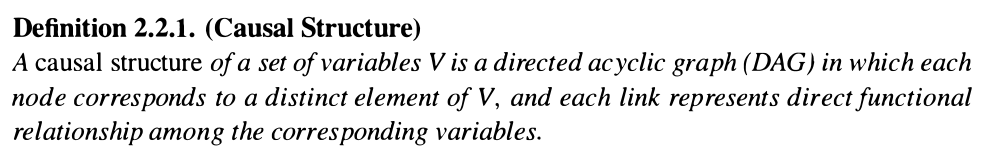

这里都是在1.4节讲过的东西, 需要注意的有四点:

- DAG 结构去表示因果关系
- 变量之间含有 deterministic functional relationship. 
- 含有对未知变量的定义. 
- Structure 是骨架, 不是具体的模型. 即, 参数是未知的. 也就是说, 这里的 Structure 只是有一个骨架而已, 没有具体的参数限制. 这里的参数包含变量之间的 Functional relationship 形式, 以及这个形式的参数. 是一个抽象建模. 这里是相比较于 下面的 causal model 而言的. 

#### 2.2 Causal Model

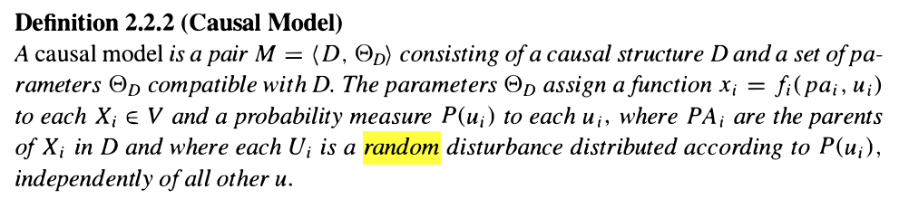

相比于上面的 causal structure. 这里的 causal model 就是有血有肉的, 它具有一个模型的全部内容. 可以对实际的问题进行计算, 而不是一个简单的抽象建模. 

**这里一定要记住对与 参数 的定义, 是指 $x_i=f_i(pa_i, u_i)$ 的定义, 是拥有很多能力, 拥有改变参数的能力, 其实就相当于拥有了 intervention 的能力**

按照, 第一节的说法, 我们要从一系列**虚假的相关关系中** 找到 **正确的因果关系**. 那么, 首先要做的就是设定一个虚假模型的范围. Causal model 这里就对这个范围进行了限定. 这个范围就是:

- 结构因果模型 (1.4)
- 符合马尔科夫假设

至于为什么, 得去问老祖先了, 反正就是正确就对了. 

马尔科夫假设指的是, 变量在给定所有 parents 的情况下, 和其所有的非子孙节点条件独立. 

根据这一个假设, 我们就可以从假设的模型范围中进行挑选.

- 如果已知变量中存在着有相关关系的两个变量, 就可以根据这个去除备选模型中取法体现这个点的模型. 这些模型就叫做 不完全模型. 
- 还有一些模型可能有多余的表现能力, 比如说给变量填加了一些多余的, 没有对其他变量产生影响的 未观测 parents 变量, 这个模型确实正确的, 但是没有必要. 

#### 2.3 Causal Model 与 Joint distribution 的关系

一个确定的 causal model 中 含有的 变量集合 为 $V$, 其中包含的 可观测变量为 $O\subset V$ . 

我们可以从 一个确定的 causal model 中 得到一个 确定的 $P_{|O|}$

但是我们可不可以从 $P_{|O|}$ 去复原一个 causal model 的 causal structure $D$ 呢?

这就是我们下面要讨论的问题. 

### 3. Model preference 

#### 3.1 模型选择标准

接着上面, 对于一个联合分布 $P_{|O|}$ 是有无数的 D 可以与其对应的,  这里给两个极端例子:

- observation variables 全不相连, 仅仅有一个共同的 潜在变量. 
- $V=O$, 并且, 所有的 $O$ 互相连接形成完全图, 但是由于没有考虑时间顺序信息, 这个条件下的模型可以模拟任意情况的 $P_{|O|}$

因此, 我们需要设置一个选择标准, 以为选择模型做出指导. 这个 **选择标准 是 minimal (最小化) **. 

下面是几个对标准的定义描述. 

#### 3.2 最小化标准的相关定义

##### 1) Inferred Causation (Preliminary)

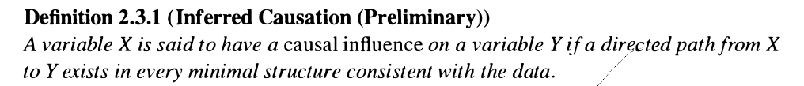

> 注意 有 causal influence 和 有相关关系是不一样的, 祖父对孙子是有相关关系的, 但是不存在 causal influence, casual influence 是靠 Functional relationship 决定的. 

这个定义说明了, 若不存在因果关系, 则不应该有连线. 

这个定义是最初步的对备选模型的限制, 这里只考虑可观测变量的情况. 下面的定义将最小化的定义扩展到有 unobserved variables 的情况. 

##### 2) Latent Structure

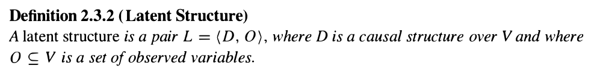

对因果结构和可观测变量组成的pair进行了定义. 表明, $D$ 是包含着 $O$, 并且可以满足 $O$ 之间的相关关系的因果结构. 

##### 3) Structure Preference

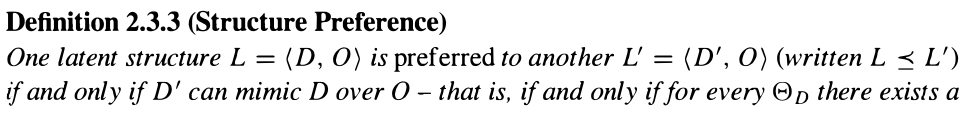

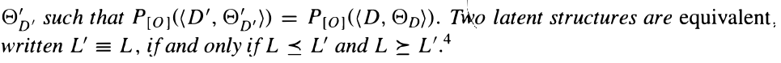

这里对结构之间的表现能力大小进行了定义 : 

如果两个 因果结构, $L=(D, O), L'=(D', O)$. 存在对于任意的 $\Theta_D$ 都存在一个 $\Theta_D'$ 可以使得, $P_{|O|}(D',\Theta_D')=P_{|O|}(D,\Theta_D)$ , 那么就称 $L'$ 的能力大于 $L$, 记为 $L\preceq L'$ 我们就更倾向于简单的模型 $L$. 

并且, 如果 $L\preceq L'$  and $L'\preceq L$, 则 $L' \equiv L$. 即等价 latent structure. 

> 这里需要对表现能力进行一个反常识的理解 :
>
> - 并不是说模型参数越多, 结果D就可以表达更强的能力. 

##### 4) 潜在变量与模型能力之间的关系

这一部分在原文中是作为 定义2.3.3 的补充出现的, 但是我认为还是很有必要讲一讲. 

其实, 一些读者可能已经注意到了, 如果仅仅是为了满足可观测变量之间的独立性的话, 不添加潜在变量是完全可行的. 只是用可观测变量就可以表达各种各样的独立关系. 

但是为什么还要去设计出这个呢? 这个在Verma and Pearl (1990) 中有证明说 :

*some latent structures impose numerical rather than independence constraints on the observed distribution*

> 也就是说, 潜在变量的存在是对于可观测变量的数值进行限制的方法. 具体在8.4节又讲. 这个也从侧面说明, 并不是参数越多表达能力越强. 

##### 5) Minimality(最小模型)

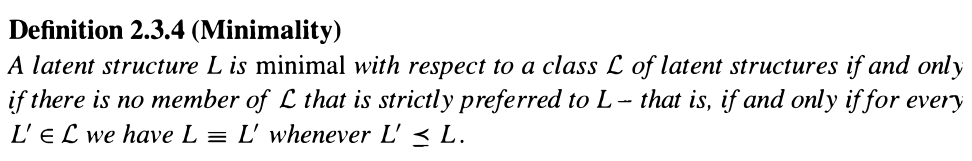

定义了最小模型

##### 6) Consistency(一致性)

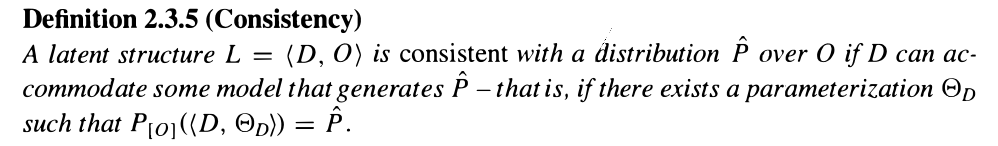

这个性质是存在于 Latent structure 和 可观测变量的分布 $P_{|O|}$ 之间的关系的, 即 L 可以表达 P. 

##### 7) Inferred Causation

**这里我们就可以最后定义因果关系了.** 

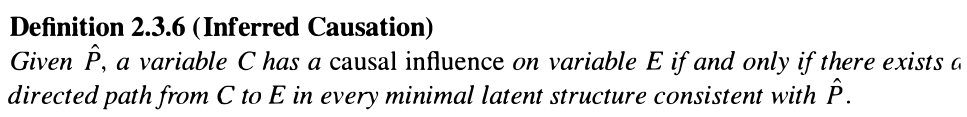

注意他说的是, 对于所有的 minimal latent structure 上**都存在从 C -> E 的路径的话**, 会认为 C 是 E 的 causal. 

这个地方非常非常重要, 他在定义上解决气压计和下雨时间的因果悖论. 

对于 气压计和下雨的例子而言:

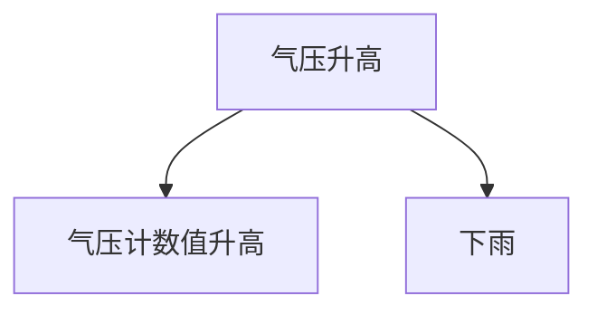

和 

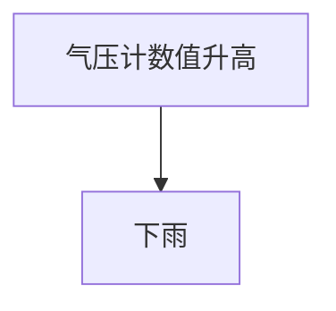

的表现能力应该是一样的. (至于为什么一样, 不知道, 但是作者的意思是这个)

这样的话, 由于在下面的例子中, 存在不是直接由 $C\to E$ 的情况, 因此, 不认为 气压计数值升高和下雨之间有关系. 

##### 8) 一个例子:

我们先对 observation 的独立性进行限定 :

- a, b 独立
- b 在 c 已知的情况下 关于 {a, b } 独立. 

现在给出下面几个 D:

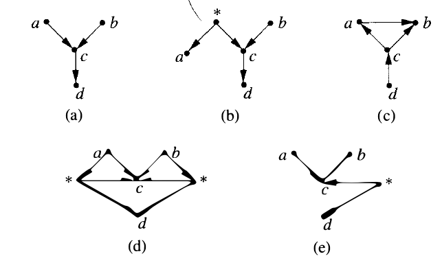

有以下结论 :

- 只有 a,b 是最小模型. 

分析如下:

- 为何 (a) (b) 等价?

  - 当我们把 a 和 * 之间的关系看做 a=* 的时候, 就可以知道 $a\preceq b$
  - 又由于 (a) 可以 生成具有（b）所包含的独立性的每个分布。所以 $b\preceq a$
  - 因此 $a=b$

- 为何 (c) 不行?

  不符合 a,b 独立的性质

- 下面也是相同 ... 

### 4. Stable Distribution

#### 4.1 问题描述

对于描述最小模型, 上面的定义就已经足够了. 但是上面的模型没有考虑实际参数的问题. 

在实际的模拟计算过程中, 可能会因为一些参数设置巧合使得独立性及相关性发生改变. 这一节对这个缺陷进行弥补. 

#### 4.2 两个例子

##### 1) 扔硬币的例子

扔硬币1的结果为A, 扔硬币2的结果为B, 其两者相同则 C=0, 两者不同则 C=1. 则正确的因果模型应该为 :
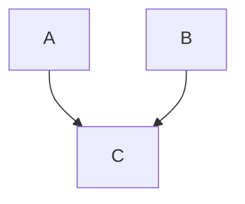

但是仅从独立性来看的话, 下面三个结构都是符合的:

A-->B<--C , B-->A<--C , A-->C<--B. 那么怎么知道第三个是正确的呢?  

比如说, 对于第一个模型而言,  我们将 A 的正反概率调整一下, 那么, C的结果和调整之前的结果应该是没有区别的. 因为, A, C 是独立的. 但是结果是分布是变化的. 这个是对 A 的 $p(u_A)​$ 的改变. 

结果是, 只有正确的 A-->C<--B 是不会变得. 

##### 2) 吃肉的例子

按照第三节的结论,  对于一个正常的因果事件比如 : (吃肉 -> 长胖) . 他的 minimal 模型就只是:

吃肉-->长胖 			

而不会是: 

latent_variable --> 吃肉 		latent_variable --> 长胖

因为, 如果两者都是最小模型的话, 就无法满足定义2.3.6的条件. 

但是只看独立性条件的话, 这两个又确实都是最小模型, 那到底怎么判断呢? 

这个时候就需要 intervention. 比如说, 我们强制一群人天天必须要进食 <一碗红烧肉> <一盘口水鸡> <一份麻辣海鲜锅> (幸福). 然后检测这群人的体重, 其实强制进食相当改变模型的参数.  

那么对于第二个情况, 我们的参数改变就是: 

从 $\text{吃肉}= f(\text{latent_variable}, u) \to \text{吃肉}= f(\text{吃吃吃})$  

这样的设定下, 吃肉和长胖是独立的. 但是结果是相关的, 所以第二个模型的假设是错误的. 

#### 4.3 Stability

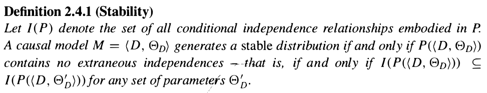

这里就对上面的现象进行了描述. 即, 面对 intervention 的独立性假设不变性. 

#### 4.4 Stability 和 Minimality 

可以总结出来两个及其及其重要的结论:

Minimality  : 是从待选模型中, 对独立性进行限制的性质

Stability : 是从待选模型中, 对时序性进行限制的性质. 

两者的交集才是真正的数据所拥有的因果模型. 

