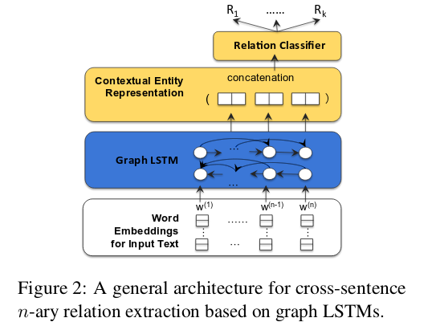
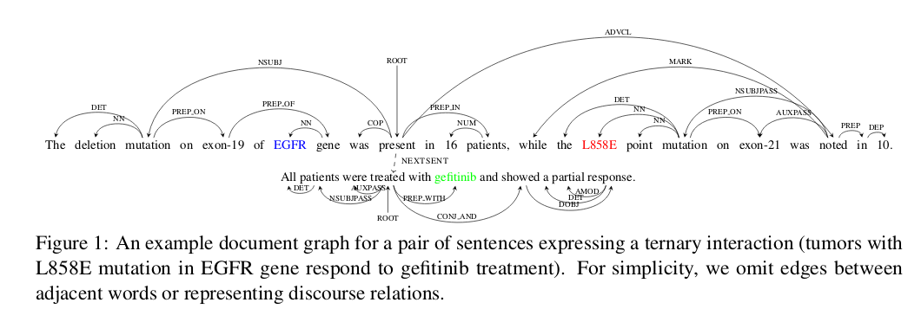

### 任务内的迁移学习

我想做的迁移学习的课题.

具体来说是 wordnet based self-transfer learning.

#### 1. Motivation

先说动机, 这个启发于现在正在读的graph network的论文. 

我认为知识是有层次性的, 我们现在的做的工作相当于将所有的知识都视为平等的, 比如说,动物这个词和狗这个词, 虽然两个词存在上下级关系, 但是在处理中都是作为字符串或者说一个ID被处理的. 

现在我看过的向网络中加入结构性信息的方法有三种:

- 结构化输入但是没有结构化网络模型, 例如, 给每个词汇增加一个wordnet标签. 其本质上还是给每个输入的ID增加了一个标注而已. 虽说加入了结构信息, 但是网络还是以处理非结构化数据的方式去处理数据. 

- 结构化网络模型但是没有结构化数据, 例如LSTM, 或者RNN. 相比与一般的full-connect layer而言, 他们对网络模型作出了较强的归纳偏置(但是还不够强). 但是输入数据, 还是未结构化的. 也就是说, 对于不同的输入数据, graph network只存在一维上的线性的变化. 

- 结构化网络并且结构化数据, tree LSTMs 或者 graph LSTMs, 大致图如下. 这种方法相比与第一种只结构化输入但是没有结构化网络模型的方法而言, 使用模型本身的结构化去表达数据的结构.  这个方法的不同之处在于, 随着输入数据的变化, 其可以衍生出复杂的graph network结构. 

  

  ​

  我想做的是第三种工作.

  上面提到的 tree LSTMs 或者是 graph LSTMs 其实只利用到了句法上的一些结构性知识.  

  我想做的是将语义上的结构性知识融入到模型中去.

#### 2. Method

现在想要利用的是wordnet中的语义知识.

原因是, wordnet中的知识是结构化层次化的. 我现在想到的作法是利用self-transfer learning.

具体做法如下:

- 先将语料库中的所有词汇在wordnet中向上回溯, 也就是取其上位语代替. 通过上溯不同层次得到不同层次的语料库. 我认为在不同层次的数据是有不一样的信息的. 回溯的层次越高我们称这个语料库的层次越高.
- 接下来利用LSTM语言模型去训练最高层的语料库. 那么, 我的估计是这个层次的预料库的训练结果应该是拥有较高的正确率的, 因此在这个时候, 我希望能够通过分析这个时候的模型参数去得出一个新的网络模型结构. 这个新的模型我具体还没有想清楚应该是怎么去设计, 但是参考上面提到的graph LSTMs 结构, 他应该有个特点是,模型的结构是依存于数据的. 然后在这个根据新的模型上在去训练下一个层次的语料库.

这种作法的思想是:

对于一个非结构性(线性)模型而言, 假设有n个units. 理想状态的图示如下:

那么对于一个数据在确定其中一个unit的情况下, 这个问题的熵会减少:

对于一个结构化模型而言, 理想状态图如下(为了方便观察这里采用二分树), 设共有m层, 共n个单元:

从上向下一步步确认unit, 在确定第i层的一个unit后, 这个问题的熵会减少:

- **这里说的使用wordnet其实只是想从中获取结构性的知识, 说是结构性的知识其实也只不过是一些上下级关系, 对于解决这个问题, 可以选择其他的方法, 例如采用order的向量表示.**
- **其实, 我想做的可以想象为磁铁和铁屑的关系, 磁铁的位置是固定的, 但是铁屑是不固定的,  我希望在磁铁的层次进行处理,但是实例全部是铁屑, 因此需要通过磁铁的磁力将铁屑吸到其所在的位置.其中复杂的地方包括三个**
  - 磁铁的位置如何固定
  - 铁屑被吸引到磁铁的方法, 也就是如何表示这种磁力.
    - 利用分布
    - 利用[pooling](Baseline Needs More Love: On Simple Word-Embedding-Based Models
      and Associated Pooling Mechanisms)
  - 该设置几级磁铁? 也就是说, 磁铁和铁屑也只是磁力大小有差距, 当有更大的磁铁能够克服小磁铁的摩擦力将其吸引到自身的时候, 就是另外一个层次的磁铁!!!

- **更具体的方法**

  首先这个是针对(知识图谱)关系推理和逻辑推理任务的提升.

  * 结构是动态的, 根据两个词汇之间的的高级抽象类型决定这两个词汇之间的关系

    * 这里高级抽象类型可以是一个记录在`抽象类型表`中的离散结构.并且可以有多层, 分别代表不同的wordnet中的层次, 记录每个词汇的类型的变量是`类型变量`.
    * 两个词汇之间的关系可以是各种各样的, 基于wordnet, 设置是可以通过谓词逻辑函数去做.重要的是, 两个词汇之间的离散组合关系决定这两个词汇之间的关系, 可以是根据词汇的`类型向量`, 假如两个词汇的类型变量分别是 `010101000111` 和 `111010101011`, 可以设置一个函数, 这个函数的输入是这两个类型变量, 输出的是一个索引值, 索引值索引的是一个函数列表, 函数列表中的每个函数都是一个实体. 每个函数都不一样, 这里的不一样既可以是形式不一样也可以是参数不一样. 根据类型变量选出索引后, 调出其索引的函数作为处理这两个单词的函数. 后向传递也是基于这函数. 

  * 关于函数的学习方法, 其实这里的函数形式也是可以自动学习的, 看研究

     Neural relational inference for interacting systems

    这个研究是利用变分自动编码器去模拟物理动力学系统的研究, 也就是说研究的是物体和物体的之间的联合计算函数. 这个就是很典型的, edge-focused GN 的应用.

  * 上面说的是基于wordnet这个既有结构性知识的方法, 也可以从非结构性数据中学得稀疏结构. 

- **将未知词汇拓展到wordnet的方法**

  结合三个模型

  - order embedding 预测 wordnet
  - 语言模型
  - 基于字符的Bi-LSTM.