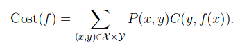
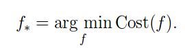
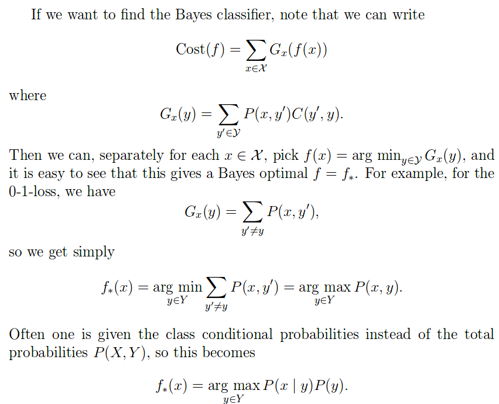

##  Bayes classifier and Bayes error

The notions of Bayes optimality and Bayes error generalize directly also to regression, but for simplicity we consider only classification here.

贝叶斯最优化和贝叶斯错误一般用于回归问题,为了简化,我们只用只考虑分类的情况.

To keep things even more simple, assume the objects to be classified come from a finite set $\mathcal{X}$.  If the set of classes is $\mathcal{Y}$, a classifier is then a function $\mathcal{f}$: $\mathcal{X}$ →$\mathcal{Y}$.

为了简单理解,这里假设现在在样本集 $\mathcal{X}$ 上进行分类,类别集合为 $\mathcal{Y}$,分类器就是 $\mathcal{f}$: $\mathcal{X}$ →$\mathcal{Y}$.

We now fix some cost function $\mathcal{C}: \mathcal{Y} \times \mathcal{Y} \to \mathbb{R}$.The most common case is the 0-1-loss where $C(y,y)=0$ for all y,and $C(y,y')=0$ if  $y=y'$. giving the number of misclassifications. 

现在定义一个损失函数,采用最常用的0-1 loss.具体的见上方.

Suppose  further  we  are  given  a  probability  distribution $P(X, Y)$  over $X ×Y$.  We can then define the expected cost $Cost(f)$ of a classifier $f$ as:

那么我们就可以定义这个分类器 $f$ 的误差为上面这个公式,其中$P(,x y)$是,x被分类器识别为y的概率.

A  classifier $f_∗$ is  called Bayes optimal,  or Bayes classifier,  if  it  minimises $Cost(·)$ , that is,

再定义一个函数$f_∗$,被称为贝叶斯最优,其为可以获得最小损失的函数,称为 Bayes optimal classifier .一般而言,贝叶斯最优的分类器不一定只有一个,可以有几个.

具体公式推导直接上图:

概率分布P(X|Y)我们并不知道其真实分布,或许他是通过某种机器学习算法计算后的结果,接着通过确定贝叶斯最优预测，我们将概率预测转换为强迫选择，以尽量减少由此产生的错误数量。当然这都是建立在我们的初始概率分布是正确的基础上.

 

