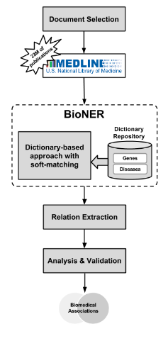
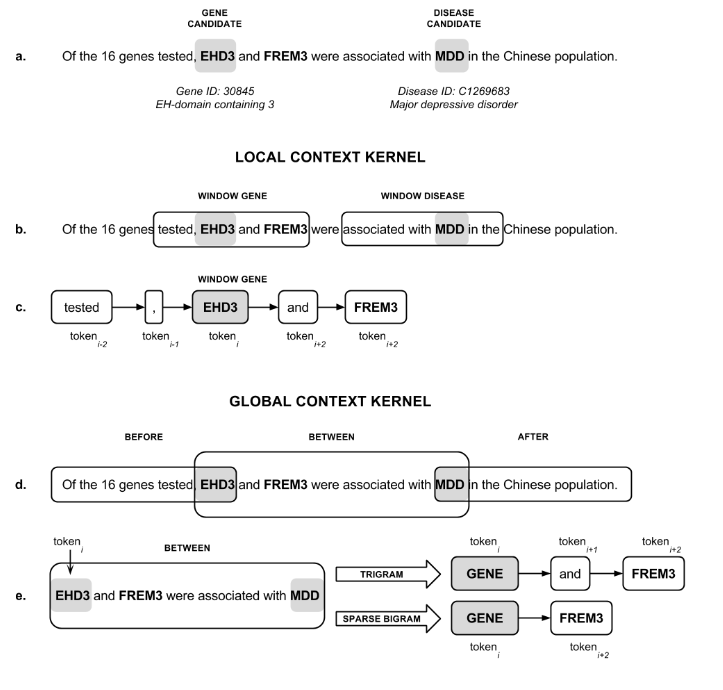
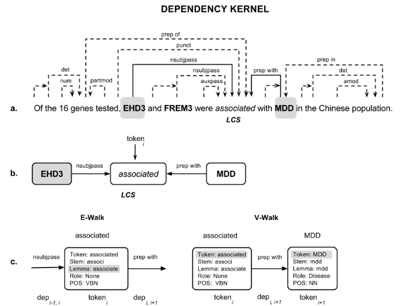
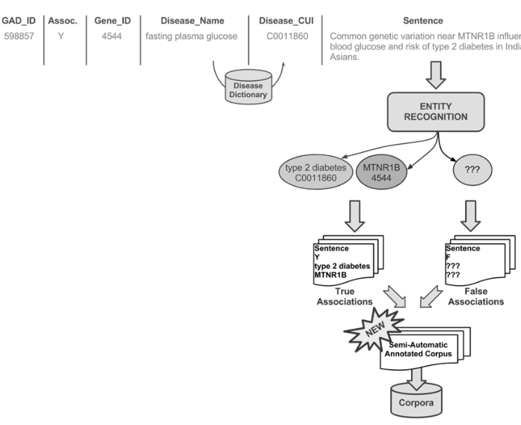

### Befree

http://ibi.imim.es/befree/#publications

#### 1. Frame

Befree是一个生物学相关论文实体关系抽出的工具. 

整体框架:

- 抽出实体 : **BioNER**  module
- 抽出关系 : **RE** module

整个方法是一个非监督法, 方法如下:

#### 2. Details

##### 1. BioNER

基于字典和模糊匹配方法. 结果是可以从freetext中提取基因和疾病两种实体. 

- 字典
  - 基因的字典
    - **Gene Dictionary** : In order to collect the terms referring to human genes and proteins, we have integrated data from three biological databases.
    - **Disease Dictionary** : The [**Unified Medical Language System® (UMLS)**](http://www.nlm.nih.gov/research/umls) database was used to create the disease dictionary. 并且这个词典下的疾病还被分为几个大类

##### 2. **Relation Extraction**

由 *Shallow Linguistic Kernel (KSL)* 和 our *Dependency Kernel (KDEP)*. 两部分组成.

- **Shallow Linguistic Kernel (KSL)**: is composed of a linear combination of two kernels, *Global Context Kernel (KGC)* and *Local Context Kernel (KLC)*, that provide different representations of the association between two candidate entities. 

  下面一张图是他们的感觉.

  

- **Dependency Kernel (KDEP)**

  - **用斯坦福parser去爬去树状结构.**
  - **Least Common Subsumer (LCS)** 法来增加特征.

  感觉如下:

  

#### 3. Database

训练使用的语料库如下, [**Genetic Association Database (GAD)**](http://geneticassociationdb.nih.gov/) :

