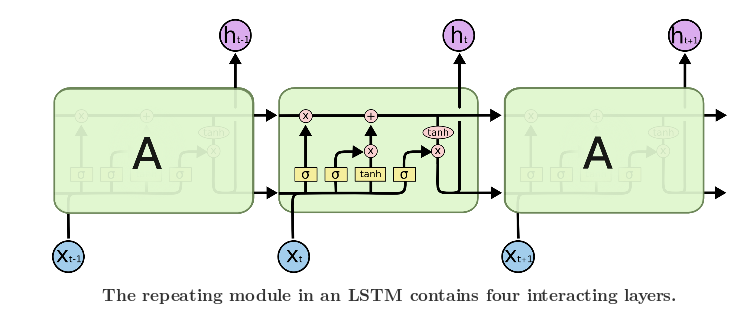
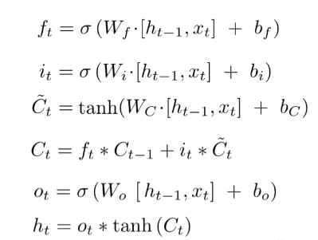
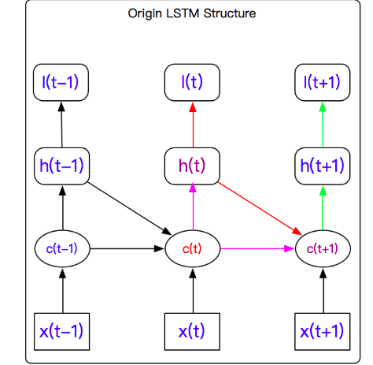
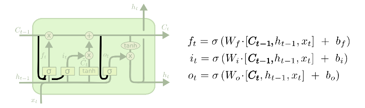
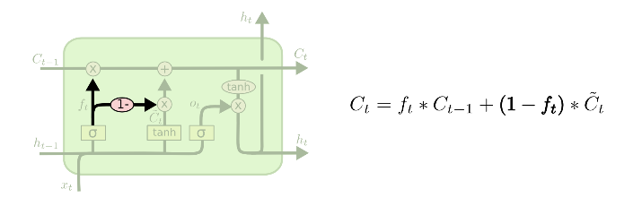
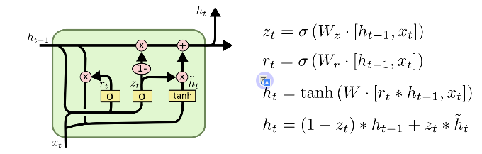

## LSTMs

### 1. 结构介绍

- LSTMs

  Long Short Term Memory networks : 长短记忆网络

  结构如下:

  

  公式如下:

  

- **解释图和公式**

  - **三个状态**

    - cell初始状态 $\hat{C}_t$	: 由本次cell的输入和输出经过非线性函数得到的cell内部状态. 
    	 cell最终状态 $C_t$	: 本次cell初始内部状态和上次cell内部状态的加权和.
    	单元输入状态 $x_t$	: cell的输入
    	单元输出状态 $h_t$ 	: cell的输出, 对本cell最终状态关于各维度取权重. 

  - **三个门限**

    **门限使用的原材料全是上一个cell的输出和这一个cell的输入, 并且连公式都是一模一样, 就只是其中的参数不同而已. 且输出的都是一组single-value属于(-1,1)之间的数值**

    - 遗忘门限 $f_t$ : 遗忘门限顾名思义是用于遗忘之前的词汇中不需要的信息. 
    - 输入门限 $i_t$ : 针对初始的cell内部状态的各维度的权重的计算.
    - 输出门限 $o_t$: 针对最终的cell内部状态的各维度的权重的计算.

### 2. 后向传播

LSTMs的后向传播算法叫做 BPTT, 又叫做back-propagation through time. 

我们首先来看下, 有哪些参数需要更新. 

$W_f, W_i, W_C, W_o, b_f, b_i, b_C, b_o$

综上所述, 一共有八组变量需要更新, 也就是四个地方. 

而由上一个cell进入下一个cell的变量共有两个, $C_t$ 和 $h_t$. 但是最后的误差计算是出自 $h_{final}$.

大致的图如下:

### 3. 一些变形

#### 3.1 peephole LSTMs

#### 3.2 coupled forget and input gates

Instead of separately deciding what to forget and what we should add new information to, we make those decisions together. We only input new values to the state when we forget something older.

#### 3.3 GRU

It combines the forget and input gates into a single “update gate.” It also merges the cell state and hidden state, and makes some other changes. The resulting model is simpler than standard LSTM models.

参考博客:

https://blog.csdn.net/xuanyuansen/article/details/61913886

http://colah.github.io/posts/2015-08-Understanding-LSTMs/

