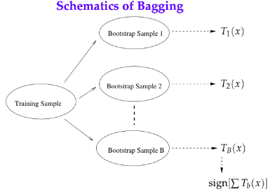
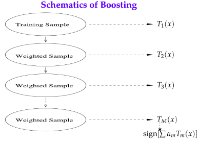
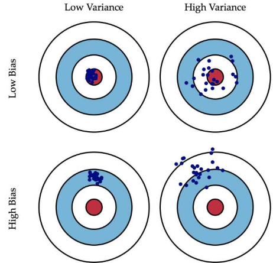
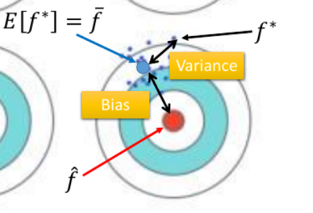
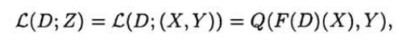
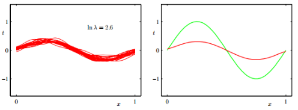
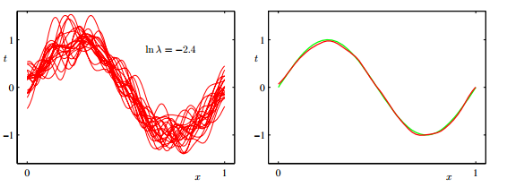

## 组合模型

### 1. Defination

#### 1.1 Bagging

##### 1.1.1 基本原理

bagging是使用同一个模型,但是按照k个不同的训练数据集,训练出k个模型.最后预测的时候,根据k个模型的结果进行投票决定.

其中每个模型的训练集是全部训练集的子集.大致图如下:

只应用了一种很简单的思想.

##### 1.1.2 随机森林

决策树的bagging版本.

- 数据的随机选取, 这个和bagging中说的一样
- 特征的随机选取, 这个是随机森林独特的地方.随机森林中的子树的每一个分裂过程并未用到所有的待选特征，而是从所有的待选特征中随机选取一定的特征，之后再在随机选取的特征中选取最优的特征。

#### 1.2 Boosting, AdaBoost

##### 1.2.1 Boosting 

boosting 是一种将弱分类器转化为强分类器的方法统称, 是一种思想.

boosting相比于bagging而言, 子训练器之间增加了关联性(通过改变数据的形式). 其需要解决两个问题:

1. 在每一轮如何改变训练数据的权值或概率分布？
2. 通过什么方式来组合弱分类器？

##### 1.2.2 AdaBoost 

AdaBoost 是 Boosting 思想下的一个具体算法.

这个模型是也是一个模型和k个训练集. 但是k个训练集不同于 bagging 中的随机放回, 这里采用的方法是改变训练集中某些数据的权重.

通过迭代k次,训练出k个模型.最后预测的时候,根据k个模型的结果进行投票决定. 

其中,每个模型的数据集不同的地方在于,每次迭代完之后,会有一个算法将本次迭代完的模型预测依然出错的数据的权重加大.即对每一轮的训练数据样本赋予一个权重，并且每一轮样本的权值分布依赖上一轮的分类结果.

最后也是投票,Adaboost采取的是加权平均的方式来确定预测值.图如下:

#### 1.3 Bagging和boosting区别

- **样本选择上**
  - bagging : 每个子训练集数据是随机放回
  - boosting : 无随机放回, 但是数据的权重不同.
- **预测函数上**
  - bagging：所有预测函数的权重相等.
  - Boosting：每个弱分类器都有相应的权重，对于分类误差小的分类器会有更大的权重.

### 2. Effect

#### 2.1 Bootstrap

Bootstrap是非参数统计中一种重要的估计统计量方差进而进行区间估计的统计方法，也称为自助法。

-   采用重抽样技术从原始样本中抽取一定数量（自己给定）的样本，此过程允许重复抽样。
-   根据抽出的样本计算给定的统计量T。
-   重复上述N次（一般大于1000），得到N个统计量T。
-   计算上述N个统计量T的样本方差，得到统计量的方差

上面的两个方法都可以说是bootstrap思想的一种应用.即不同模型采用的数据并不是全部的数据

#### 2.2 Bias ,Variance

- **定义模型期望效果值的bias和variance**

  设在数据集 $\mathcal{D_i}$ 上进行训练的模型 $f(x)$ 的结果为 $f(x;\mathcal{D_i})$, 这个模型对于任务有一个期望效果值: $f(x;\mathcal{D_i})$. 该值表示对于一个特定样本集 $x$，模型的预测值。

  > 也就是说 $f(x;\mathcal{D_i}) = \sum_kf(x_k;\mathcal{D_i})$

  接下来, 以在不同数据集上训练的不同模型的期望效果值为样本, 可以计算方差和均值. 这里的对任务是指对test数据集, 但是其本质意义是对任意的数据.

  其中,
  - 均值 : $\bar{f}(x;\mathcal{D}) = E_{\mathcal{D}}[f(x;\mathcal{D})]$ 该值表示对于一个特定的样本x，不同单模型的平均预测值, 也就是集成模型的预测值。
  - 偏差 : $bias =\bar{f}(x;\mathcal{D})-y$,  集成模型的预测值与真实值的差距.
  - 方差 : $\sigma = E_{\mathcal{D}}[(f(x;\mathcal{D})-\bar{f}(x;\mathcal{D}))^2]$ , 衡量模型对**不同数据集**D的敏感程度

- **偏差和方差的实际意义**

  **偏差** :集成模型的预测值距离真实预测值的距离．

  **方差** : 各个子模型之间的距离.

  在5.4节也有讲,Bias和Variance,是不同训练集在同一结构训练出来的不同模型,在test data上的结果分布的性质.图如下:

  

  现在以右下角图为例来看看什么是偏差和方差:

  

#### 2.3 泛化误差

泛化误差就是我们说的误差, 其计算公式为:

其中, D为训练集, 而Z是测试集, F(D)是算法在D上训练后得到的模型. Q()是损失函数.

在bagging里面,  我们的集合模型的D本身就是由很多个 $\mathcal{D_i}$ 组成的, 其中每个 $\mathcal{D_i}$ 应用与一个子模型.而我们最后的结果是所有子模型预测值的均值.

这里假设损失函数是MSE.那么整个model的泛化误差为:

$\begin{equation} \begin{aligned} \mathbb{E}_\mathcal{D}[E_{out}(f;\mathcal{D})] & = \mathbb{E}_\mathcal{D}[(f(\textbf{x};\mathcal{D})-y)^2] \\ & =\mathbb{E}_\mathcal{D}[(f(\textbf{x};\mathcal{D}) - \bar{f}(\textbf{x}) + \bar{f}(\textbf{x}) - y)^2] \\& = \mathbb{E}_\mathcal{D}[(f(\textbf{x};\mathcal{D}) - \bar{f}(\textbf{x}))^2] + \mathbb{E}_\mathcal{D}[(\bar{f}(\textbf{x}) - y)^2] + \mathbb{E}_\mathcal{D}[2(f(\textbf{x};\mathcal{D}) - \bar{f}(\textbf{x}))(\bar{f}(\textbf{x}) - y)] \\&\\& 由于\mathbb{E}_\mathcal{D}[f(\textbf{x};\mathcal{D})] = \bar{f}(\textbf{x})，最后一项消去 \\& \\& = \underbrace{\mathbb{E}_\mathcal{D}[(\bar{f}(\textbf{x}) - y)^2]}_{(bias)^2} + \underbrace{\mathbb{E}_\mathcal{D}[(f(\textbf{x};\mathcal{D} - \bar{f}(\textbf{x}))^2]}_{variance} \end{aligned} \end{equation}$

上面我们说到了, bagging法下方差不变, 偏差减小, 因此 $\mathbb{E}_\mathcal{D}[E_{out}(f;\mathcal{D})] $ ,即正确率上升.

#### 2.3 简单模型与复杂模型

一般来说，简单模型偏差高，方差低；复杂模型方差高，偏差低。

也就是说, 复杂模型容易过拟合, 因此对于数据集比较敏感. 

下面是针对一个曲线拟合任务任务, 

**左图**是在100个数据集上训练的结果. 其中 $\lambda$ 是正则项的系数

**右图**中红线代表左图中各个单模型的平均，绿线表示真实函数.

1. **$\lambda$ 比较大, 因此这个模型比较简单.**

2. **$\lambda$ 比较小, 因此这个模型比较复杂.**

从这里我们可以得出上面的结论:

一般来说，简单模型偏差高，方差低；复杂模型方差高，偏差低。

#### 2.4 Bagging和Boosting对Bias和Variance的影响

##### 2.4.1 Bagging

Bagging方法的特点是, 各子模型之间是独立同分布的.

那么

- **方差** : $var(\frac{1}{n}\sum_if(x;D_i)) = \frac{1}{n^2}var(\sum_if(x;D_i)) =\sigma^2/n$
- **偏差** : $E(\frac{1}{n}\sum_if(x;D_i)) = \frac{1}{n}E(\sum_if(x;D_i))\approx\mu$

可以看到均值不变, 方差减小.

再根据2.3节可知, 误差降低, 即正确率提高.

##### 2.4.2 Boosting

boosting由于模型之间有强烈依赖,这就增加了模型的复杂度,也就是提升模型面对欠拟合的能力,也就实现了降低bias的功能.