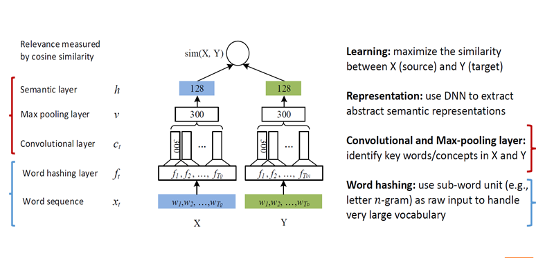

## **文本相似度总结**

下面以,**基本计算方法**,**离散表征方法**和**连续表征方法**两个角度来进行描述.这里需要注意的是,这里的分类并不是说离散表征方法里面没有用到连续表征,或者连续表征方法中没有用到离散表征,而是根据其侧重点来进行的分类.下面来简要介绍**离散表征**和**连续表征**.

-   离散表征

    基于词袋模型,认为文档是有独立存在的单词组成的.

-   连续表征

    基于词向量模型,基于词汇的语义分析.关注于词汇之间的语义关系,词汇之间存在量的关系.将词汇用高维的词向量表示.认为词汇之间存在着可以计算的语义关系.

### 1. 符号说明

设语料库有m个文档 $d_1,d_2,...,d_m$.

关注词汇是 $w$.该词汇的出现次数为 $n_w$,设语料库中含有 $w$ 的文档数是 $m_w$.

语料库中的词汇总数为 $N$.

文本相似度的计算算法多是通过某种方法对文档中的词汇进行组织得出最后的文本语义表征,最后利用某种方法对不同文本语义表征进行相似度计算.

设文本1为 $d_1$ ,其文本语义表征为 $D_1$ ,文本2为 $d_2$ ,其**文本语义表征**为 $D_2$. 其中, $D_i =f(d_i)$ . $f()$ 为模型函数.

|   语料库中的第i个文档    |     $d_i$ 的语义表征     |     词汇      |        $w$的词向量        |
| :-------------: | :-----------------: | :---------: | :-------------------: |
|      $d_i$      |        $D_i$        |     $w$     |          $W$          |
| **$w$ 在语料库中频次** | **$w$ 在 $d_i$ 中频次** | **语料库中文档数** | **语料库中含有词汇 $w$ 的文档数** |
|       $n$       |        $n_w$        |     $m$     |         $m_w$         |

### 2. 基本计算方法

>   注意:不同的算法的表征方式不同.

-   **余弦相似度**

    将 $D_1,D_2$ 视作高维空间中个两个向量,计算两个向量的余弦相似度.

    $sim(d_1,d_2) = cos(D_1,D_2) = \frac{D_1 \cdot D_2}{|D_1||D_2|}$ 

-   **闵氏距离**

    将 $D_1,D_2$ 视作高维空间中的两个点,计算两点间的距离.是欧式距离和曼哈顿距离的广义形式.

    $sim(d_1,d_2) = \sqrt[q]{\sum_1^n{(D_1-D_2)^p}}$

    当 $p=2$ 时,则为**欧拉距离**,当 $p=1$ 时,则为**曼哈顿距离**.

-   **Jaccard 距离**

    将$D_1,D_2$ 视为两个词汇集合.基于词汇的离散表征(词袋模型),认为文档是词汇的集合.

    $sim(d_1,d_2)=J(D_1,D_2)=\frac{|D_1\cap D_2|}{|D_1\cup D_2|}$

-   **K-L散度**

    计算两种分布的距离.这里的 $D_1,D_2$ 分别是两个文档的词汇概率分布.具有不对称性.

    $sim(d_1,d_2) = KL(D_1||D_2)=\sum_i^nD_1(i)log\frac{D_1}{D_2}$

-   **互信息**

    主要用于计算两个词汇之间的相关性.设 $w_1,w_2$为两个词汇.则两个词汇的互信息为:

    $PMI(w_1,w_2) = log\frac{p(w_1,w_2)}{p(w_1)p(w_2)}$

    这里的 $D_1,D_2$ 是两个词汇的集合.设 $w_1^i \in D_1,w_2^i \in D_2$,$D_1$ 中有$m$个词汇 ,$D_2$中有$n$个词汇.

    $sim(d_1,d_2)=PMI(D_1,D_2) = log\frac{p(D_1,D_2)}{p(D_1)p(D_2)}=\sum_i^M\sum_j^nlog\frac{p(w_1^i,w_2^j)}{p(w_1^i)p(w_2^j)}$

    具有对称性,是GloVe词向量的计算基础.其中 $p(w_1^i,w_2^j)$需要利用语料库计算.

-   **海明距离**

    一个字符串相似算法,个人认为可以用到错词联想上,可在输入法提示算法中应用.在实际应用中多用于搜索引擎分析页面内容相似度,不涉及语义层次.

    其中,$D_1,D_2$ 为两个文档经过某种转换过的01码串. ⊕ 为异或操作. $C(x)$ 为计算 $x$ 中的1的位数.

    $sim(d_1,d_2)=C(D_1⊕D_1)$ 

-   **Jaro距离**

    其中,$D_1,D_2$ 为两个文档的字符串. $m$ 是匹配的字符数.t是换位的数目.

    $sim(d_1,d_2)=\frac{1}{3}(\frac{m}{|D_1}+\frac{m}{|D_2|}+\frac{m-t}{m})$

### 3. 离散方法

-   **TF-IDF**

    TF-IDF是计算词汇在语料库中的重要度的值.具体是:

    TF: $w$ 在所有文档中的出现频率,设为 $tf(w)$	

    ​		$tf(w)= n_w/N$

    IDF: $w$ 在语料库中的反文档频率 $idf(w)$

    ​		$idf(w)=log(m/m_w)$

    TF-IDF: 

    ​		$TI(w)=tf(w)*idf(w)$

    接下来用余弦相似度:

    ​		$sim(d_1,d_2)=cos(D_1,D_2)$

    其中:	$D_1 = \sum_i^mTI(w_1^i)*W_1^i,$

    ---

    >   增强的TF-IDF:
    >
    >   TF-IDF由于就是没有词汇在单个文本中的出现次数,因此存在着各种各样的问题,因此,存在利用:
    >
    >   考虑文本和词汇关系的:交叉熵,信息增益,互信息
    >
    >   考虑文本类别与词汇关系:类内分布熵,类间分布熵
    >
    >   等等不同工具改进的形式.

    ---

    ​

-   **PLSA**

    主题模型,设文档为 $d$ ,主题为 $z$ , 词汇为 $d$.该模型认为,某个词汇属于某个主题的概率是遵循某个分布 $p(w|z)$ 的.而主题和文档之间也存在某种分布 $p(z|d)$.则:

    ​		$p(d,w)  = p(d)p(w|d)$

    ​		$p(w|d)=\sum_z p(w|z)p(z|d)$

    通过最大似然下面这个公式,即$d$ 和 $w$ 共同出现的概率,即:

    ​		$\mathcal{L}=\prod_i\prod_jp(w_i,d_j)^{n(w_i,d_j)}$

    即可获得:

    ​		$p(w|z)$和$p(z|d)$

    下一步获得某个文档属于主题的概率,即:

    ​		$p(z|d)=\sum_wp(z|w)p(w|d)$

    其中:

    ​		$p(z_i|w)=p(w|z_i)/\sum_zp(w|z)$

    那么,文档的语义表征就可以设置为一个概率质量函数.:

    ​		$D_1=(p(z_1|d_1),p(z_2|d_2),...,p(z_n|d_n))$

    那么,这个时候就可以用KL散度去计算.

    ​		$sim(d_1,d_2) = KL(D_1||D_2)=\sum_i^nD_1(i)log\frac{D_1}{D_2}$

    ---

    >   pLSA的增强版本:
    >
    >   pLSA属于频率派的做法,还有属于贝叶斯派的LDA主题模型,以及更先进的HDP等等模型.(不过我不太熟悉).

    ---

-   **复杂网络**

    该方法利用词汇之间的共现,建立语义网络的方式,可以分析单个词汇对于在不同主题,词汇,文档之中的重要程度.

    包括,加权聚集系数,加权度,介数等等,可以对词汇的特征值进行计算.

    设计算出w的特征值为: $\alpha(w)$

    之后再利用余弦相似度进行计算.即:

    ​		$D_1 = \sum_i^m\alpha(w_1^i)*W_1^i,$

    也可以结合TF-IDF使用:

    ​		$D_1 = \sum_i^mI(w_1^i)*TI(w_1^i)*W_1^i$

-   **simhash**

    首先通过上述的各种求词汇特征值,记词汇 $w$ 的 特征值为 $\alpha(w)$

    对于文档 $d_1$ 中的词汇 $w_1^i$ 构建词汇-特征值对: $(w_1^i,\alpha(w))$

    通过hash算法,将词汇 $w_1^i$ 映射到 $(Hw_1^i)$ ,设共有n位bit.构建,hash值-特征值对: $(H(w_1^i),\alpha(w))$

    设:

    ​		$D_1 = \sum_ig(H(w_1^i),\alpha(w_1^i))$

    设 $H(w)_k$ 为取出其中hash值的第 k 位.

    $g(H(w_1^i),\alpha(w))$实现的具体操作是:

    ​	建立长度为n的列表,设为L,则:

    ​	$$L[k]=\left\{\begin{array}{cc}\alpha(w_1^*), & H(w_1^i)_k=1\\-\alpha(w_1^i), & H(w_1^*)_k=0\end{array}\right.$$

    之后可以用海明距离或者Jaro距离来计算相似度

### 4. 连续方法

-   **LSA(潜在语义分析)**

    作为一个早期的将词汇用词向量表示的算法.

    通过将词-文档矩阵进行奇异分解,去特征值较大的特征向量组成一个新的词-文档矩阵矩阵,这个矩阵中的词的词向量含有语义信息,可以描述词汇之间的相似性.

    还是使用余弦相似度:

    ​		$sim(d_1,d_2)=cos(D_1,D_2)$

    其中,	$D_1 = \sum_i^mW_1^i$

    需要注意的是,这里参与计算的词汇是文档中出现频次较高的词汇.

    这是最简单的利用词向量进行计算的方法-即直接设文本语义表征为词汇的词向量的和.

    ----

    >   LSA增强:
    >
    >   存在很多词向量的增强版本.
    >
    >   比如,Bengio的用神经概率模型去计算的词向量.
    >
    >   还有在此之后,Mikolov利用循环神经网络计算的词向量,以及huang在考虑到一次多义现象后提出的词向量.最近提出的有,word2vec,skip-gram模型,GloVe模型的词向量.
    >
    >   如今的词向量可以充分考虑到词汇之间的语义关系,胜于LSA

    ----

    ​

**------下面是用到神经网络的方法-----**

上述方法均为非监督模型,下述模型为监督模型,需要语料库

-   **神经网络模型**

    $sim(X,Y)$ 使用余弦相似度计算.网络中的unit采用 $tanh()$ 函数.

    将两个句子分别以其词向量为输入,输入模型.

    首先,

    1.  设计目标函数:

        $P_{model} = p(y|d_1,d_2)=\mathcal{N}(cos(D_1,D_2);\hat{y},\sigma^2)$

        其中 $\hat{y}$ 是训练集中的人工标注的 $d_1,d_2$ 之间的相似度.我们假设,模型训练出的相似度与训练集数据中真实相似度之间的误差,符合正太分布.

    2.  设计似然函数:

        采用负对数似然:

        $\theta= argmax_{\theta} \sum log P_{model}(y|x)$

    3.  得出loss function:

        $loss= (y-\hat{y})^2$

    4.  设计hidden units

        这里采用tanh作为隐含层单元.采用相邻词汇的级联作为输入.即:

        $D_1=f(d_1)=\sum_i^{|d_1|}tanh(W_1^{i-1};W_1^i))$

        其中 $W$ 为词向量.

    然后对该模型进行梯度下降即可.

-   **基于卷积深度模型**

    模型图示如下,将两个句子分别以其词向量为输入,输入模型.最后采用余弦相似度进行计算.

    

    $sim(X,Y)$ 依然使用余弦相似度计算.网络中的unit依然采用 $tanh()$ 函数.只是模型架构进行了改变

-   **基于依存树的非线性深度网络.**

    针对最基本的深度模型,对两个地方进行了改进.

    1.  重新设计目标函数:

        原模型为:$P_{model} = p(y|d_1,d_2)=\mathcal{N}(cos(D_1,D_2);\hat{y},\sigma^2)$

        改进模型为:$P_{model} = p(y|d_1,d_2)=\mathcal{N}(cos[φ(D_1),φ(D_2)];\hat{y},\sigma^2)$

        也就是将 $cos(D_1,D_2)$ 函数换成了 $cos[φ(D_1),φ(D_2)]$ 函数,其中:

        $cos[φ(D_1),φ(D_2)] = \frac{K(D_1,D_2)}{\sqrt{K(D_1,D_1)}\sqrt{K(D_1,D_1)}}$

        其中 $K(D_1,D_1)$ 为核函数,即:

        $K_{poly} (x, x ′ ) = (c + cos(x, x ′ ))^p$

    2.  重新设计hidden units:

        上面是基于相邻词汇的共现设计的,即

        $D_1=f(d_1)=\sum_i^{|d_1|}tanh(W_1^{i-1};W_1^i))$

        这里将基于共现的词汇对改变为,基于依存树的词汇对.即:

        $D_1=f(d_1)=\sum_{i,j\in D}^{d(D)}tanh(W_1^{i};W_1^j))$

        其中, $W_1^{i};W_1^j$ 为依存树中的依赖与被依赖词汇.

        ​

