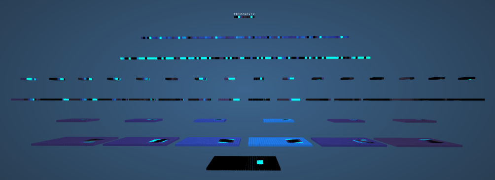
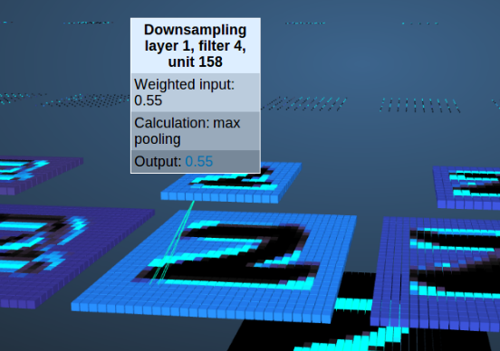
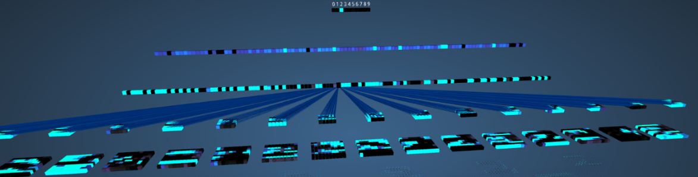

## 卷积神经网络

### 基本结构

以http://scs.ryerson.ca/~aharley/vis/conv/提供的手写数字鉴别为例:

可以看出来,这是个一个八层的网络(加输入输出)

其中,每层的属性如下:

第一层:Input layer

第二层:Convolution layer 1

第三层:Downsampling layer 1

第四层:Convolution layer 2

第五层:Downsampling layer 2

第六层:Fully-connected layer 1

第七层:Fully-connected layer 2

第八层:Output layer

其中,可以看出共有五个类别:

Input,convolution,downsampling,fully-connected,output

现在来看分别是做什么的:

-   convolution1:这个是卷积层,卷积层的作用是提取特征,以及训练用于提取特征的卷积核.这个很容易想象,在当年看图像处理的这本书时,第一章讲的就是这个卷积核,也就是过滤器.就是一个m*m的矩阵,用于过滤图像,可以提取不同层次的特征.

    在这里的第二层,卷积层1处,用的是一个4*4的卷积核,图示如下:

    

    最小层是一个32*32的输入,由于是4\*4的过滤器,输出的就是一个28\*28的过滤图像,这里在第二层一共用了6个filter,其中每个filter都有一个自己的过滤器,分别i提取图像的不同底层特征,这一层提取的特征可能是一些边、角、曲线等。在相当程度上，构建卷积神经网络的任务就在于构建这些滤波器。

-   Downsampling layer 1:

    这个叫做亚采样层,目的是降低维度,一般有max pooling和sum pooling两种方法,直观如下:

    

    这是个一对一的操作,一个卷积核过滤后的图像经过一次亚采样减小尺寸,降低维度,max pooling就是取小格中的最小值,sum pooling就是取小格的和.

-   Fully-connected layer:

    全连接层,这里就是综合已抽象好的各层特征来进行判断.

    