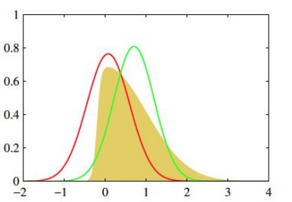
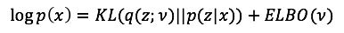

## 变分推断

本文来自对[知乎问题](https://www.zhihu.com/question/41765860)下的答案的理解. 

### 1. 原理

#### 1.1 **任务描述**

首先我们的目的是根据输入(并非具体值, 而是分布的一个参数)求一个分布, 例如在MNIST任务中输入是图像, 分布是这个图像为各个数字的概率分布.

也就是分布 $P(x)$, 输入 x 是分布的一个参数.

#### 1.2 **解决思路**

这个分布通常是复杂的, 比如MNIST任务的分布, 我们就要上百个参数. 

寻找分布其实就是找到一个和真实目标分布KL距离最近的一个分布, 假设我们知道一个类似与高斯分布的分布, 如下图黄色区域. 但是我们不知道其真实分布是什么, 因此我们可以选择用 **单高斯分布** 去作为 **近似分布** 去模拟 **真实分布** . 如下面的红绿分布线. 

这里的思想就是:

​						***用已知的分布去模拟未知的分布***

如果参数简单的话, 就可以用EM算法去解决. 比如说, 我们有大量数据, 知道数据符合 n-高斯混合模型. 那么其中的参数也不过就是 $2n$ 个, 且高斯函数的形状是确定的.

但是对于超级复杂的情况我们该怎么办呢? 神经网络就是一个解决方法. 神经网络就是用很多简单的非线性函数的组合去模拟真实分布.

#### 1.3 **变量及其解释**

- **基本变量 **:  

  - 输入数据 $x$

    > 解释 : 在 GMM就是所有点的集合.  在k-means中就是**所有**的点.
    >
    > 注意这里的输入数据和神经网络中的输入数据有所不同, 这里是指已知的, 被模型使用的数据, 包括普通意义的输入和输出. 是更一般的输入.
    >
    > 例如, 在监督模型中就是数据(普通意义的输入)和标签(普通意义的输出)两者, 在非监督学习中就是数据(普通意义的输入)和模型的输出, 例如在k-means中就是点属于的类别, 在高斯模型中就是计算这个点发生的概率(普通意义的输出).

  - 模型的基本形式(待测定参数未知) $p(z,x)$, $z$ 属于隐含变量.

    > 解释 : 在GMM中, 隐含变量就是分布的均值和方差.

- **后验概率** : 

  $P(z|x)$ : 后验概率, 根据模型的结果推测模型本身.

  > 这样说就很容易理解后验概率这个名词了, 后验其实和后向误差传播有点像, 都是依靠输入去推测隐含变量.  这里的 $z$ 就是MNIST任务中的权重和偏置. 而模型本身的表达不属于可调整的范围, 也就是这里的可用泛函都符合神经网络的形式, 就是其中的参数不同.
  >
  > 而相对的先验概率就和前向计算想像, 都是去依靠一部分已知输入和隐含变量去计算普通意义的输出. 

- **似然概率**

  $P(x|z)$ : 这个就是我们的模型. z就是模型的参数.

- **输入的概率**

  $P(x) :$ 输入的概率, 这个值是已经确定的, 因为数据是已经确定了的. 注意, 这个不同于似然概率, $P(x|z)$, 这个才是我们需要进行最大似然的对象.

- **先验概率**

  $P(z)$ : 真实的参数的分布, 我们不知道这个分布的形状, 因此想用下面的近似分布去近似这个先验分布.

- **近似分布**

  $q(z,v)$ : 我们设置的模拟真实的后验分布 $P(z|x)$ 的分布.

  > z是变量，v是z的概率分布q的参数, 可以理解为这个分布的超参数.
  >
  > 前面也提到了n-混合高斯的例子, 如果我们假定已知方差, 那么需要求的z就只是均值 $\mu$而已.
  >
  > 比如说, 我们在一个例子中要求的是几个混合高斯的均值, 那么 $z$ 就是这几个均值 $\mu$.
  >
  > 而, 这个均值符合的分布(需要人工选择, 这里采用共扼分布-高斯分布) 中也有自己的均值和方差, 这个就是v.
  >
  > 公式化就是:
  >
  > $x \thicksim  \sum_i\mathcal{N}(\mu_i,\sigma_i^2) $, 其中 $\sigma$ 已知. 要求的是 $\mu_i$. 也就是说, $\mu_i$ 是 $z$
  >
  > $\mu_i \thicksim \mathcal{N}(\mu'_i,\sigma_i'^2)$ , 其中,  $\mathcal{N}(\mu'_i,\sigma_i'^2)$ 是 z 所遵循的先验分布. 那么, 在这里, $\mu'_i,\sigma_i'^2$ 就是 $v$.

  这里就又体现了变分的思想.  $v$ 是关于参数 $z$ 的分布的一个参数.

  ​

#### 1.4 优化目标

- **图解**

  

  我们要通过调整 $v$ 使得近似分布一步步接近 $p(z|x)$. 

  这个大圈表示了一个distribution family , 然后参数 $v$ 是索引, 确定distribution family中的一个具体的函数. 每个 $v$ 都是先验分布 $p(z)$ 中的参数, 在GMM模型中就是均值和方差.

- **公式解**

  我们的目标就是希望真实分布 $P(z|x)$ 和 近似分布 $q(z,v)$ 的 KL距离能够无限接近于0.

  但是, 这个里面由于有一个不知道的后验概率 $P(z|x)$, 因此需要进行一个转化.

  

  由于 $logP(x)$ 是固定的, 因此最小化 KL距离就是最大化 ELBO, 这个里面是没有后验概率的.

#### 1.5 使用限制(猜想)

这一节纯粹是个人猜想, 若是发现有不对的地方答案的前辈还希望能够在这个[问题](https://www.zhihu.com/question/283326143/answer/430637346)下帮忙解答.

变分推断一定要知道似然函数以及先验函数的分布公式形式, 而神经网络本身是一个接受输入进行输出的模块, 无法获取其分布, 因此无法利用神经网络进行分析.

### 2. 详细推导

下面是变分推断的公式:

$logP(x) = logP(z,x)- logP(z|x) \\= log\frac{P(z,x)}{P(z)} - log\frac{P(z|x)}{P(z)}\\=logP(z,x)-logP(z) - log\frac{P(z|x)}{P(z)}\\=logP(z,x)-logP(z) + log\frac{P(z)}{P(z|x)}$

$\int q(z)logP(x)dz = \int q(z)logP(z,x)dz-\int q(z)logP(z)dz + \int q(z)log\frac{P(z)}{P(z|x)}dz$

由于 q(z) 和 P(x) 无关, 因此, $\int q(z)logP(x)dz = P(x)$

并且我们在上面提到过, $P(x)$ 代表的是一个数据集的概率, 是不变的.

因此, 就有了最后的公式:

$logP(x) = \int q(z)logP(z,x)dz-\int q(z)logP(z)dz + \int q(z)log\frac{P(z)}{P(z|x)}dz$

其中, 式子右边的前两部分叫做 ELOB : $ \int q(z)logP(z,x)dz-\int q(z)logP(z)dz$

最后的一部分就是传说中的 KL 距离, 因此, 最小化KL距离就是要最大化 ELBO.

