## 14. 意义的表示法

### 0. 简介

例子(I have a car)的语义的表示方法如下:

1. 一阶谓词演算 (14.3)

   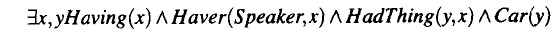

2. 语义网络 (14.5)

   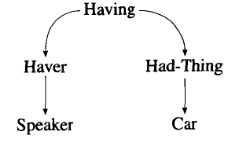

3. 概念依存 (16)

   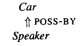

4. 基于框架的表示 (14.5)

   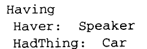

**可以表达语义的原因**: 每个模型都有自己的背景知识

这里的表示含有两个意义:

- 用模型的表示法表示句子的语义
- 通过这个模型的表示, 可以将句子的语义与世界知识进行融合, 或者计算.

### 14.1 意义表示的计算要求

以一个旅游去饭店的场景为例子.

##### 14.1.1 可能性验证

如果旅行者想问这个饭店提供不提供面包.

这个例子说明了语义表达的最基本的需求. 即:

**使用<语义表示>去表达自己的意图和世界知识之间的关系**

可能性验证 : 系统地把 **句子的意义表示** 和 **模型中所储存的世界知识** 进行比较的能力.

##### 14.1.2 无歧义表示

解决的是 (句子)1-N(模型表示) 的问题 .

- **歧义性**

  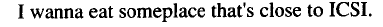

  对于这句话而言, 仅从句法角度就有多种解释方法. 而通过世界知识去从中选择一种合理的解释方法就是语义分析要做的. 比如说通过语义上的概率. 也就是说, 通过统计世界知识, 发现, **someplace** 的在 **eat** 的后面做状语概率要比做宾语的概率高.

- **模糊性**

  模糊性不会造成歧义, 但为句子带来了丰富的可能性. 比如说 :

  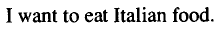

  这个句子并没有给服务员提供到底吃什么的具体信息.

区分这两个性质对于计算机来说并不是一件容易的事.

##### 14.1.3 规范形式

出发点在于, 将指向统一意思的不同句子用一个模型的表征去表达的能力. 

解决的是 (句子)N-1(模型的表示) 的问题. 如下面这个例子:

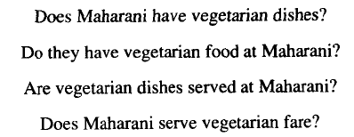

于是, 就有了**规范表示**的定义:

​	**对于一个意义的不同句子表示, 模型应给给出唯一的表示方法.**

对于给出规范形式的方法, WSD(词义消歧)是什么重要的, 以及词义标注(word sense tagging).

根据这些方法, 我们可以给不同的词汇以相同的意义表示.

##### 14.1.4 推论和变元

- **推论**

  上面的三个点都是在将, 如何在没有知识辅助的情况下, 在句子的层次上进行修改. 但是也会有下面的这种情况, 即在人看来是一样的知识, 其实是包含了不同的语义形式的. 例如:

  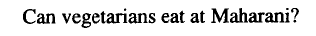

  **素食主义者是否可以在这里吃?** 和 **这里是否可以提供素食?**

  之间的等效性是需要通过世界知识来反馈的, 这个不能用简单的词汇语义消歧等等的方式来实现等价化. 其语义的结构应该是不同的. 但是从 **从不同的语义结构如何得出相同的结果呢?**

  也就是说, 我们需要从模型具有 **推论** 的能力:

  ​	**推论** : 模型可以根据 **某个语义模型表示** 和 **世界知识** 的融合推导出一些结果.

- **变元**

  上面的所有的例子, 其实都可以用一个 **模型表示** 去表达:

  ​	$Serves(Maharani, VegetarianFood)$

  但是对于下面这个提问:

  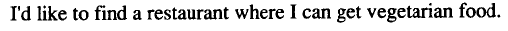

  这个句子就变成了这样的表示:

  $Serves(x, VegetarianFood)$

  其中, $x$ 就是**变元**. 这样的话, 这就不是一个决定性问题, 而变成了寻找最优解的问题, 这就需要对世界知识进行搜索.

##### 14.1.5 表达能力

这个可以类比于深度模型中, 模型的**容量(capacity)**

也就是说, 这个模型的最大的表示能力, 我们要求模型能够恰当的表达任何可以感觉到的自然语言语段.

一阶谓词演算具有这样的能力. 

### 14.2 语言的意义结构

一种**曾经**很重要的表示语义的方式.

##### 14.2.0 谓词逻辑的补充

在谓词逻辑中，一般将原子命题分解为个体词和谓词两个部分。

- **个体词**,（individual）是一个命题里表示思维对象的词，表示独立存在的具体或抽象的客体。个体词就表示各种事物，相当于汉语中的名词。

  > 个体变项的取值范围称做 个体域 或 论域
  >
  > 宇宙间一切事物组成的个体域称做 全总个体域

- **谓词** , 表示个体词性质或相互之间关系的词称做谓词.

  > 有n个个体的谓词 $P(x1,x2,...,xn)$ 称n元（目）谓词. 谓词的基本形式为:
  >
  > $P(x1,x2,...,xn)$

- **量词**, 用来表示个体数量的词, 给谓词加上量词称做谓词的量化，可看作是对个体词所加的限制,约束的词. 但不是语言概念中的几个的量词, 而是 $∀$(”全称量词), $∃$ (存在量词), 这样的量词. 

  > 假设个体 x 的论域是全总个体域， “一切事物都是 运动 的”可以形式描述 为 $(∀x)(x是 运动 的 ) $.

- **谓词与命题**

  谓词 $P(x) 、Q(x ,y)$ 是命题形式而不是命题。其中, $P(x),Q(x,y)$ 是谓词. 

  而 $P(3)$ 、$Q(2,3)$ 这样不包含个体变项的谓词称做 零元谓词 ，当赋予谓词确定含 义时零元谓词为命题。因而可将命题看成是特殊的谓词。

  ​

##### 14.2.1 谓词论元结构

- **什么是谓词论元结构**

  看下面这三个句子:

  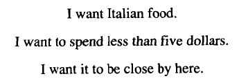

  **每个句子有一个中心, 这个是论元结构的核心.** 一般来说, 谓词都是动词(但不是全部.)

  论元结构认为, 一个句子可以由两个部分组成, **谓词** 和 **论元**, 在上面的三个句子中, 谓词是 "want", 那么这三个句子的谓词论元结构就是:

  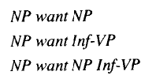

- **语义角色(题元)**

  在一个句子中存在多个论元的情况下, 不同位置的论元其实具有不同的性质, 例如, 在 上面的例子中, wantde前面的论元的属性是 **wanter**

  这是从语义来区分两个论元的角色，即区分施事或受事.

  不同的论元就属于不同的语义角色(题元). 把角色和特定的动词与动词的类别联系起来的研究成为**题元角色分析** 或者 **格角色分析**.

- **语义限制**

  语义角色和语义限制是相辅相成的.

  - 语义角色说的是, 在抽象的意义上, 也就是说, 不把某个谓词的使用应用到某个事例的情况下,比如上面的 *NP want NP* 我们认为这个谓词的前面的词汇拥有某种属性, 这是一种共性.
  - 语义限制是说, 在具体的例子中, 比如说 *He want food* , 论元 *He* 的实际意义被这个位置的语义角色限制. 

  在如今的深度学习的思想去理解这里就是,  context-based word embedding. 就是说, 每个词汇的语义是基于其上下文的, 而这里 **语义限制** 中的上下文主要的指的是 **谓词**

- **并非只有动词能做谓词**

  对于下面这个句子, 介词部分充当了谓词.

  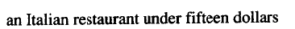

  其谓词论元结构为:

  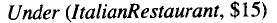

### 14.3 一阶谓词演算

谓词论元结构的出现, 只为我们提供了一种语义表示的基本形式. 但是并不具有14.1上面的那些性质.

而一阶谓词演算为我们提供了这些方法.

即, 一阶谓词演算为意义表示的可能性验证, 推论和表达能力等方面提供了坚实的计算基础. 一阶谓词演算的简写是 **FOPC**

#### 14.3.1 FOPC基础

**基础组成**

- **原子公式(AtomicFormula)**

  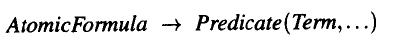

  我们说 FOPC 有生成能力, 但是生成必须要有基础要素, 这个基础要素就是 原子公式.

  原子公式中包含了两个基本部分 **谓词(predicate)** 和 **项(Term)**

  接下来是项的释义.

- **项(term)**

  项的组成是:

  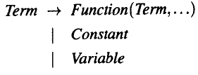

  这个里面包含三个, 先看后两个, **Constant** 和 **Variable**

  - **常量(Constant)**

    常量 : 指的是类似于生成语法中的终端符号的感觉, 也就是基本词汇.

    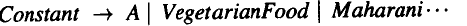

  - **变量(Variable)**

    变量 : 可以带入常量的符号

    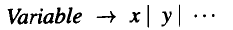

  - **函数(Function)**

    function在这里起的作用类似于生成语法中的 rules, 可以将function的左边是非终端符号, 右边函数中的变量可以有终端符合也可以有非终端符号.

    正因为函数的存在, 一阶谓词逻辑才具有了复杂的表现力. function 本身就可以作为一个单独的论元谓词存在, 也就是 function(para1,...,para_n) 是一个非终端符号, 其也可以作为另外一個函数的参数. 

    但是 function 虽说其可以作为论元谓词, 但是其比谓词具有更光的定义. 谓词是一个状态, 表示整个句子. 但是 function 可以表示句子中的某一个部分. 比如:

    ​	Here is my house.

    my house 只能作为句子中的一部分, 不能作为一个句子. 这个就不能用 谓词 去表达. 但是可以用function 去表达, $My(house)$, 表示的一种所有格关系.

- **公式(Formula)**

  ​
