### 拉普拉斯矩阵在网络热传导中的应用

#### 1. 研究对象

这里的研究对象不局限于词汇, 包含各种类型的信息网络以及社会网络等等. 

这些网络有一个特性就是 : 节点之间拥有非对称关系.  (当然也有完全对称的)

并且本文研究的图对象是 **无向图**

#### 2. 拉普拉斯矩阵

##### 2.1 Graph的表征方法

邻接矩阵去表示Graph.

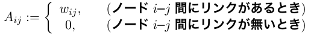

在无向图的时候, 这个矩阵是对称矩阵, 因为 $w_{ij}=w_{ji}$

##### 2.2 拉普拉斯矩阵定义 

$D:$ 度矩阵

$A:$ 邻接矩阵

$L:$ 拉普拉斯矩阵

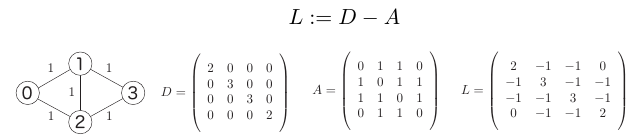

##### 2.3 拉普拉斯矩阵性质

###### 1) 实对称矩阵拥有的性质

- L 的特征值有n个, 并且都是实数
- L 的特征向量组成单位正交矩阵

###### 2) 特有的性质

- L是半正定矩阵, 即特征值均大于等于0

  > 证明: 见 [讲义](http://www.cs.yale.edu/homes/spielman/561/2009/lect02-09.pdf) 2.2部分

- 特征值为0的情况代表有互相不连接的子图, 特征值0的个数代表的就是互相无连接子图的个数.

- 最小的非0特征值代表着图的连接强度, 这个特征值被称为 Algebraic connectivity. 

  > - 非独立于节点数目
  > - 在随机图中, Algebraic connectivity 随着平均度数增加而增加, 随着节点数减少而减少.

- 将非0最小的特征值对应的特征向量称为Fiedler向量. 

  > 它代表了最佳图划分的一个解(即势函数), 至于为什么下面会讲.

#### 3. 网络信息(热)传导

下面考虑信息在网络上的传导过程. 

##### 3.1 热传导

我们最终的目的是将**信息流在网络中的传导**类比为**能量在网络空间中的扩散**

那么先来看下能量的传导方式, 下面是wiki关于热传导的介绍:

###### 1) 热传导的直观感觉

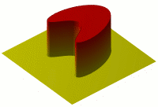

可以看出, 热传导是一种从中心向四周扩散, 并且逐渐减慢速度的过程. 

> 三维空间中的热传导可以发生在多种介质之间, 例如在水中融化的冰, 由于水的导热系数随温度变化而有所变化, 所以其周围的传导率是一直变化的. 

###### 2) 热传导方程

我们是用一个三维的偏微分方程来模拟三维空间中的热传导过程的.

也就是 :

将其扩展到更高维空间中就是:

其中

- $u = u(x, y, z, t)$
- $\frac{\partial u}{\partial t}$ 指的是温度关于时间变化的速率
- 关于空间上的变化可以看出是二次的, 那么 $u_{xx}, u_{yy}$, and $u_{zz}$ 就是二次偏导.
- $\alpha=k/c_p\rho$ 是热传导率, 依据材料不同而变化

###### 3) 热传导方程的解

对于n-variables的情况:

对于1-variable的情况:

##### 3.2 在网络上的热传导

###### 1) 网络上的特点是:

1. 每个节点都是一个能量源 $x_i(t)$
2. 不同节点之间的能量不同, 能量要从高的节点流向低的节点.  移动的速度和两个节点之间的能量差成正比 $\propto |x_i(t)-x_j(t)|$
3. 不同节点之间的连接通路是不同的, 拥有不同的传导率. 

这里我们就知道了一个很重要的提示, 就是两个节点能量的差 $|x_i(t)-x_j(t)|$

###### 2) 网络上的传导速率

设t时刻的能量(信息)分布为 $x(t)=(x_0(t),x_1(t),...,x_{n-1}(t))$.

网络传导微分方程为:

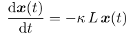

其中 $κ$ 是热传导速率, 在这里就是两点间的距离. 由于这里假设的 $x_i(t)$ 是一个标量, 因此这一个一维空间的热传导问题.

回顾一维热传导的公式:

> 这里由于公式来源不同, 将热量公式 $u(x,t)$ 换为了 $p(x,t)$

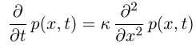

>  (这里缺个负号)

注意两个式子的右边, 可以看到, 拉普拉斯矩阵 $L$ 的效果是等于 $\partial^2/\partial x^2$ 的效果. 

> 不过这里也有不同的地方:
>
> - 网络传导的位置是固定的, 体现在网络传导方程右边的式子的变量只有 t. 

#### 4. 拉普拉斯用于网络信息传导

##### 4.1 网络势能

设点 $i$ 包含的初始信息为 $x_i$. 那么这个节点拥有的信息量就是 $|x_i|$. 

> - 这里的 x_i 是一个标量, 因此,这是一个在一维空间上的能量扩散问题, 因为没有方向
>
>
> - 如果是向量的话会有什么结果?
>
>   如果是向量的话, 这里的信息和热量能量等等不同,  他是一个有方向的向量, 其实这个方向就代表了包含着位置信息, 也就是3节中的 $x,y,z$. 

- 根据网络特点2 : 两个节点拥有的信息差就是 $|x_i-x_j|$
- 根据网络特点3 : 对于无向图而言, 节点之间的连接通路多是指其最短距离, 那么距离越远连通性越差, 传递就越慢. 
- 根据热传导的关于位置的二次性

综合以上三点, 有了以下公式:

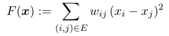

这里的 $x=(x_0,x_1,...,x_{n-1})^T$,  是一个向量. 因此 $F(x)$ 就是整个网络中的信息传递速率, 也就是势能, **注意是整个网络的, 描述的是整个网络中的势能**

##### 4.2 拉普拉斯二次形式

$F(x)$ 其实可以转换为拉普拉斯二次形式, 如下:

- $f^TLf = f^TDf - f^TWf = \sum\limits_{i=1}^{n}d_if_i^2 - \sum\limits_{i,j=1}^{n}w_{ij}f_if_j$
- $d_i=\sum_j^{|E|} w_{ij}$
- $x^TLx =\frac{1}{2}( \sum\limits_{i=1}^{n}d_ix_i^2 - 2 \sum\limits_{i,j=1}^{n}w_{ij}x_ix_j + \sum\limits_{j=1}^{n}d_jx_j^2) \\=\frac{1}{2}( \sum\limits_{i,j=1}^{n}w_{ij}x_i^2 - 2 \sum\limits_{i,j=1}^{n}w_{ij}x_ix_j + \sum\limits_{i,j=1}^{n}w_{ij}x_j^2) \\= \frac{1}{2}\sum\limits_{i,j=1}^{n}w_{ij}(x_i-x_j)^2$

因此, 网络的势能可以用 $x^TLx$ 来进行表示.

这里的 $x$ 储存了各个点的能量信息, 是一个能量分布向量.

##### 4.3 解最优化问题

这里我们设网络的所有信息总和为1. 那么就有 $|x|=1$.

我们要在这个情况下求

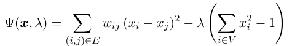

其中, $\lambda$ 是拉格朗日乘数.

根据拉格朗日乘数法的要求 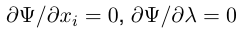

有:

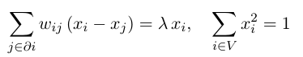

将式子整合起来就是:

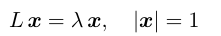

4.3节最后解的意义, 我并没有搞清楚. 搞清楚的还望提示.

#### 5. 求解热传导方程

这一节我们将解释拉普拉斯矩阵特征值的含义. 

##### 5.1 一维热扩散微分方程的解

###### 1) 傅里叶变换

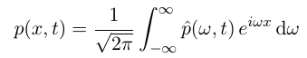

这一步将目标函数转换为了无数热量函数的和. 对原式进行了分解.

###### 2) 代入扩散方程

>  (这里缺个负号)

得:

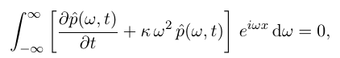

因此, 对每一个 $w$ 都要有, 因此拆除了无限个:

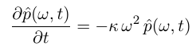

###### 3) 对每一个微分方程求解

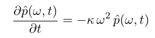

得出无数个:

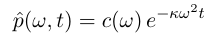

##### 5.2 网络上的扩散公式

###### 1) 利用特征值分解展开 

原扩散方程是:

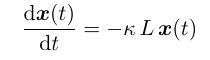

其中, 利用拉普拉斯矩阵$L$对角化的基底将 $x(t)$ 展开:

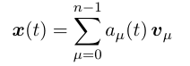

其中, $v_{\mu}​$ 是对应着特征值 $\lambda_\mu​$ 的特征向量. 

###### 2) 代入扩散方程

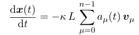

由于 $v_{\mu}$ 是 $L$ 的特征向量, 因此:

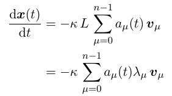

对于每个特征向量, 就有如下一个微分方程, 因此共有n个这样的微分方程, n是节点数:

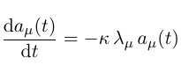

###### 3) 对每一个微分方程求解

##### 5.3 对网络扩散的分析

- 这里通过先将 0 时刻的 $x$ 分散为不同拉普拉斯矩阵对角化基底(特征向量)
  $$
  x(0)=\Sigma_{\mu=0}^{n-1}a_\mu(0)v_\mu
  $$

- 然后, 每个基底方向都有一个扩散速度,这个就是最后的微分方程的解, $a_\mu(t)$. 

  

- 算出每个基底方向的热扩散值后, 在通过拉普拉斯矩阵对角化特征值变换回 $x(t)$

  

  ​

