### 						Lagrangian

#### 1. Dual Vector Space

(对偶空间)

-   **对偶空间定义**

    -   对偶性

        数学中，对偶性是一种普遍的性质.即,对一种性质的陈述中,若用到两个实体,那么,这两个实体互换之后,往往可以通过某种逻辑再次连接起来,如点和线的关系[链接](https://www.zhihu.com/question/38464481)

        下面是维基定义:

        In mathematics, any vector space V has a corresponding dual vector space (or just dual space for short) consisting of all **linear functionals on V**, together with the vector space structure of pointwise addition and scalar multiplication by constants.

        注意这里的,linear functionals(线性泛函)指的是线性函数,即:

        ​	$f(\vec{v}+\vec{w}) = f(\vec{v})+f(\vec{w})$,for all $\vec{v}, \vec{w}\in V$

        ​	$f(a\vec{v}) = af(\vec{v})$ ,for all ,$\vec{v}\in V, a\in k$

        用函数去理解是:

        我们知道一个函数由三个部分确定,参数$\theta$ ,因变量$\vec{x}$,以及运算关系$\alpha$,这里的运算关系范围是线性运算.

        也就是只有线性泛函才具有这种对偶性.

        在 $y=f(\vec{x})$ 中, $\vec{x}$ 是属于一个线性空间的,这个线性空间中的元素全是数域内的值,可以为实数也可以为复数.设这个空间为 $\mathcal{X}$.

        而现在固定 $\vec{x}$ 为$\vec{x}'$ ,而参数可以变化.那么就会有各种各样的函数产生. $f_1{x},f_2{x},...,f_n{x}$,这个函数组成的空间就叫做 $\vec{x}$ 的对偶空间.这个空间的集合内的元素全为函数,叫做泛函空间.设这个空间为 $\mathcal{F}$.

        那么: **$\mathcal{F}$ 就是 $\mathcal{X}$ 的对偶空间**

-   **对偶空间是线性空间**

    -   线性空间定义

        首先先要知道线性空间的定义.

        线性空间的本质是一个集合.

        设一个非空集合V,一向个域P.

        1.  集合中的任意元素加上该集合中的任意元素的结果仍然在这个集合中.

            >   注意,这里的加法是可以自己定义,是针对于V元素的一个运算方法.通常为正常的加法.

        2.  集合中的任意元素乘以任意数的结果仍然在这个集合中.

            >   注意:这里的乘法多为纯量乘法,是针对集合P与域P之间的运算法则,一般P就是实数域.乘法就是普通的乘法

    -   对偶空间是线性空间

        在定义中,我们已经知道前提是, V 是一个线性空间,因此 $f_i{x}+f_k{x},...,f_j{x}$ 也还会是一个线性函数,是在原先的泛函空间里面,这满足了对线性空间的第一个要求;同样的,第二个要求也可以满足,因此,我们可以知道,对偶空间是线性空间.

#### 2. Dual Problem 

-   线性问题的对偶性

    上面我们总结到对偶空间是只针对于线性函数.其实这种对偶的性质存在于任何一种线性问题之中,其原因可能是在于 :**经过线性变换的欧几里德空间仍然是一个欧几里德空间,并且可以通过相应的二次线性变换还原.**

-   对偶问题

    在优化问题中也存在对偶性.

    对于有目标函数,有约束条件的问题,我们称之为规划问题,对于两者都是线性函数的情况,我们称之为线性规划;对应的还有二次规划(有二次函数),还有非线性规划.线性规划有如下的对偶性质:

    1.  对偶问题的对偶是原问题.
    2.  无论原始问题是否是凸的，对偶问题都是凸优化问题
    3.  对偶问题可以给出原始问题一个下界
    4.  当满足一定条件时，原始问题与对偶问题的解是完全等价的

    对于非线性问题,也有对应的对偶问题,具体怎么做见下面的小节,下面是一个例子:

    这个例子将一个非凸的原始问题转化为了一个凸问题.

    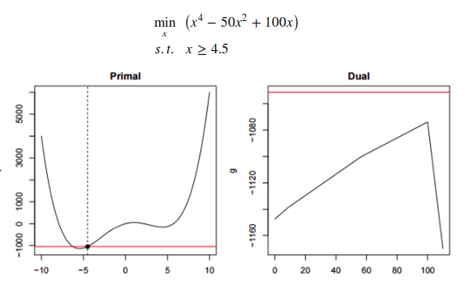

- **原问题转换为对偶问题**

    将原问题转换为对偶问题的方法是,求:

    $\partial L/\partial x=0$ 时候的 $\alpha,\beta$ 的值,如下面这个例子:

    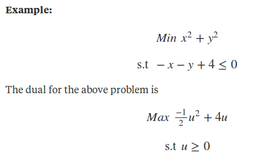

    ​

#### 3. Lagrangian Primal problem 

-   **Lagrangian Primal problem**

    -   *问题形式:*

        这里的原始问题并不是指的是拉格朗日的最初始约束状态,即:

        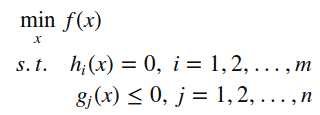

        而是指将其转化为非约束形式,即拉格朗日函数:

        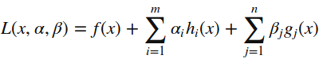

        而根据上面这个公式,我们可以得知:  (具体原因见下下黑点)

        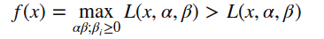

        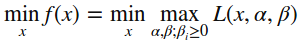

        注意这里是,先假设x固定,求$max_{\alpha,\beta}L(x,\alpha,\beta)$.

        接下来求最小值: $min_xmax_{\alpha,\beta}L(x,\alpha,\beta)$

        在这里, $\alpha,\beta$ 叫做对偶变量.

- **拉格朗日转换思想精髓**

    **为什么 $f(x)=max_{\alpha,\beta}L(x,\alpha,\beta)$,这是将约束条件的信息加入非约束等式的一步**

    由于我们将约束条件取消掉了,因此需要以某种形式在非约束等式中体现出来.就是下面这个式子.

    这里是一个重点:

    

    由拉格朗日函数可以推到这里的原因是在不同的 $\alpha,\beta$ 下,任意满足条件的 $x$ 持着两个性质(也就是说这两个性质与 x 的值无关).

    1.  $x$ 若不满足等式约束,有两种可能性

        -   $h_i(x)<0$ ,那么这个时候,求解 $max_{\alpha,\beta}L(x,\alpha,\beta)$ 会使得 $\alpha$  就会趋近与无穷小,无解.
        -   $h_i(x)<0$ ,那么这个时候,求解 $max_{\alpha,\beta}L(x,\alpha,\beta)$ 会使得 $\alpha$  就会趋近于无穷大,无解.

    2.  当 $x$ 不满足不等式约束公式: 

        -   $\beta_ig_i(x)\ge 0$ 的时候:

            由于要求 $\beta_i\ge 0$ ,求解 $max_{\alpha,\beta}L(x,\alpha,\beta)$ 会使得 $\beta$  就会趋近于无穷大,无解.

        只要当 $\beta_ig_i(x)\le 0$ 的时候,才会有合适的 $\beta$.而在实际的求解中,最后的结果也是,$\beta_i g_i(x)=0$ .这个原因在[deep learning:4.4]中有讲.

    这样一来, $\alpha_ih_i(x)=0$ 和 $\beta_i g_i(x)=0$ ,最后的 $L(x,\alpha,\beta)$ 的值仍然等于 $f(x)$.

    这样我们就完美的将约束信息融合到了非约束形式的公式里去.

-   **拉格朗日函数与KKT条件的关系**

    KKT条件并不是 从拉格朗日函数中,解出的结果.两个都是基于同一个思想,就是上面的这个拉格朗日转换思想精髓,思想在[deep learning:4.4]中有讲.

    根据这个公式蕴含了KKT条件.也就是说,在求解max的过程中,实现了KKT条件.大概示意图如下:

    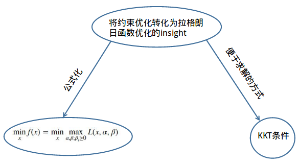

#### 4. Lagrangian Dual  function

拉格朗日函数的对偶函数形式如下:

​		$g(\alpha,\beta)=inf_{x\in \mathcal{D}} \biggl( f(x)+\sum_i\alpha_ih_i(x)+\sum_j\beta_jg_j(x) \biggr)$

这里的 $inf_{x\in \mathcal{D}}(L(x,\alpha,\beta))$ 是指在 $\alpha,\beta$ 固定的情况下,x的定义域内, $L(x,\alpha,\beta)$ 的最小值.

而 $g(\alpha,\beta)$ 关于 $\alpha,\beta$ 的函数.

因为对偶函数是关于 $\alpha,\beta$ 的仿射函数值的集合的逐点最小值.

因此,**对偶函数是一个凹函数.即使原问题是一个非凸问题.**

**下面是证明过程($\alpha,\beta$ 换为 $\lambda,v$):**

-   **对偶性的数学证明:**

    1.  首先明确,要证明 $g(\lambda,v)$ 为凸函数,就要证明:

        $\small g\bigg(\theta\lambda^{1}+(1-\theta)\lambda^{2},\theta\nu^{1}+(1-\theta)\nu^{2}\bigg) \ge \theta g(\lambda^1,v^1)+(1-\theta)g(\lambda^2,v^2)$

    2.  定义拉格朗日对偶函数

        $g(\lambda,\nu)=_{\;\;x}^{min}\textrm{}L(x,\lambda,\nu)=g(\lambda,\nu)$

    3.  选取两个 $\lambda,v$

        $\\ \small g(\lambda^{1},v^{1})=f_{0}(x_{1})+\sum \lambda_{i}^{1}f_{i}(x_{1})+\sum\nu_{i}^{1}h_{i}(x_{1})\leq f_{0}(x)+\sum \lambda_{i}^{1}f_{i}(x)+\sum\nu_{i}^{1}h_{i}(x)\\ \small g(\lambda^{2},v^{2})=f_{0}(x_{2})+\sum \lambda_{i}^{2}f_{i}(x_{2})+\sum\nu_{i}^{2}h_{i}(x_{2})\leq f_{0}(x)+\sum \lambda_{i}^{2}f_{i}(x)+\sum\nu_{i}^{2}h_{i}(x)$

    4.  选取 $(\lambda^{1},v^{1})$ 和 $(\lambda^{2},v^{2})$ 中间的某个点 $(\theta\lambda^{1}+(1-\theta)\lambda^{2},\theta\nu^{1}+(1-\theta)\nu^{2})$:

        由于在确定了 $x$ 的值之后, $x$ 就成了一个与 $\lambda,v$ 无关的值,因此此时,可以将 $g(\lambda,v)$ 看作是一个仿射函数:

        $\small g\bigg(\theta\lambda^{1}+(1-\theta)\lambda^{2},\theta\nu^{1}+(1-\theta)\nu^{2}\bigg) \\ = f_{0}(x_{3})+\sum[\theta\lambda_{i}^{1}+(1-\theta)\lambda_{i}^{2}]f_{i}(x_{3})+\sum[\theta\nu{i}^{1}+(1-\theta)\nu{i}^{2}]h_{i}(x_{3}) \\ = \theta[f_{0}(x_{3})+\sum\lambda_{i}^{1}f_{i}(x_{3})+\sum\nu_{i}^{1}h_{i}(x_{3})]+(1-\theta)[f_{0}(x_{3})+\sum\lambda_{i}^{2}f_{i}(x_{3})+\sum\nu_{i}^{2}h_{i}(x_{3})]\\  $

    5.  根据上面提到的 $inf()$ 的定义,可以知道:

        $\small g\bigg(\theta\lambda^{1}+(1-\theta)\lambda^{2},\theta\nu^{1}+(1-\theta)\nu^{2}\bigg) =\\min\{L\bigg(x_1,\theta\lambda^{1}+(1-\theta)\lambda^{2},\theta\nu^{1}+(1-\theta)\nu^{2}\bigg),...,L\bigg(x_2,\theta\lambda^{1}+(1-\theta)\lambda^{2}),\theta\nu^{1}+(1-\theta)\nu^{2}\bigg)\}$

        而这个函数 $min()$ 中的每一项都是一个仿射函数.其中, $\lambda,v$ 为自变量.根据线性性质,我们可以知道:

        $L\bigg(x_i,\theta\lambda^{i}+(1-\theta)\lambda^{j},\theta\nu^{i}+(1-\theta)\nu^{j}\bigg) > \theta L\bigg(x_i,\lambda^{i},\nu^{i}\bigg)+(1-\theta)L\bigg(x_j,\lambda^{j},\nu^{j}\bigg)$

    6.  下一步便可以得出结论:

        $\small g\bigg(\theta\lambda^{1}+(1-\theta)\lambda^{2},\theta\nu^{1}+(1-\theta)\nu^{2}\bigg) \ge \theta g(\lambda^1,v^1)+(1-\theta)g(\lambda^2,v^2)$

        得证.

-   **对偶性的图像证明:**

    先看这个公式:

    $\small g\bigg(\theta\lambda^{1}+(1-\theta)\lambda^{2},\theta\nu^{1}+(1-\theta)\nu^{2}\bigg) =\\min\{L\bigg(x_1,\theta\lambda^{1}+(1-\theta)\lambda^{2},\theta\nu^{1}+(1-\theta)\nu^{2}\bigg),...,L\bigg(x_2,\theta\lambda^{1}+(1-\theta)\lambda^{2}),\theta\nu^{1}+(1-\theta)\nu^{2}\bigg)\}$

    这个的几何示意如下:

    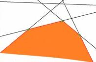

    也就是说,这是一个分段函数,属于仿射函数.根据Boyd 的 Convex Optimization 关于仿射函数的凹凸性定义:

    1.  所有仿射函数都是凸函数
    2.  凸函数的非负加权求和仍然是凸函数
    3.  凸函数的逐点上确界还是凸函数

    可以得证.

#### 5. Lagrangian Dual problem  

-   **Lagrangian Dual problem**

    上面已经给出了一个对偶函数

    ​				$D(α,β)=min_xL(x,α,β)$

    求该函数关于 $\alpha,\beta$ 的最大值,就是拉格朗日对偶问题,即:

    ​				$\max_{α,β;β_i≥0}minxL(x,α,β)$

-   **weak duailty**

    设原问题的解出的值为 $p^*$,即:

    ​				$p^*=min_xmax_{α,β;β_i≥0}L(x,α,β)$

    设对偶问题解出来的值为 $d^*$,即:

    ​				$d^*=\max_{α,β;βi≥0}min_xL(x,α,β)$

    对偶问题和原始问题的最优解并不相等，而是满足的如下关系：

    ​				$d^*\le p^*$

    ​

    那么什么时候会有弱优化的情况出现呢?

    根据 [convex optimization] P225 的解释:

    **The weak duality inequality (5.23) holds when $d^*$ and $p^*$ are infinite.**

    这个非常重要,因为在一开始考虑拉格朗日函数的时候,我是从加约束的惩罚项正则考虑的.这个里面的目标函数包括拉格朗日函数都至少是有限的.因此比较难以理解当 $d^*\le p^*=-\infty$ 或者 $\infty=d^*\le p^*$ 的情况.

    ​

-   **弱对偶性数学证明:**

    **证明:**

    对于任意一个 $L(x,α,β)$, 都有:

    $D(α,β)=min_xL(x,α,β)\le L(x,α,β)\le max_{α,β;β_i≥0}L(x,α,β)=f(x)$

    其意义是,先任意取一个 $(x,α,β)$:

    对于左边的部分而言:在确定 $(α,β)$ , 而 $x$ 不确定的情况下,肯定有 $min_xL(x,α,β)\le L(x,α,β)$

    对于右边的部分而言:在确定 $x$ , 而 $(α,β)$ 不确定的情况下,肯定有 $L(x,α,β)\le max_{α,β}L(x,α,β)$

-   **弱对偶性几何证明:**

    **图像化示意:**

    通过数学公式证明,已经确认了下面这个公式是正确的:

    $D(α,β)=min_xL(x,α,β)\le L(x,α,β)\le max_{α,β;β_i≥0}L(x,α,β)=f(x)$

    下面通过图像示意(一图胜前言):

    先假设 $d^*:L(x^d,\alpha^d,\beta^d)$,  $p^*:L(x^p,\alpha^p,\beta^p)$

    现在观察 $(x^p,α^d,β^d)$

    -   **对偶问题**

        一个已经确认 $(α,β)=(α^d,β^d)$ 的拉格朗日函数,是一个凸性不确定的函数,也许是非凸函数,为了照顾一般性讨论,这里设其为非凸函数,则, $d^*=min_xL(x,α^d,β^d)=L(x^d,α^d,β^d)\le L(x^p,α^d,β^d)$ 的图像大致如下:

        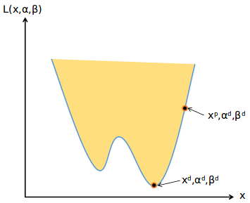

        其中,下面的点 $(x^d,α^d,β^d)$ 则为对偶问题的最佳解,阴影区域边界为随着 $x$ 的变化,$L(x,α^d,β^d)$ 的变化范围:

        ----

        >   这里会有一个疑问:
        >
        >   对偶函数不是凸函数嘛?这里为什么是非凸?
        >
        >   答:对偶函数指的是,求得是关于 $\alpha,\beta$ 的函数:
        >
        >   $g(\alpha,\beta)=inf_{x\in \mathcal{D}} \biggl(f(x)+\sum_i\alpha_ih_i(x)+\sum_j\beta_jg_j(x) \biggr)$
        >
        >   而这里已经将 $\alpha,\beta$ 确定,求得是关于 $x$ 的函数,相当于在对偶函数中考虑的变量不一样,问题也就不一样.
        >
        >   **下面原问题的部分中的图像为凸函数的原因也相同.**

        ---

        ​

    -   **原问题**

        一个已经确认 $x=x^p$ 的拉格朗日函数,是一个仿射函数(分段函数),是一个凸函数,

        $L(x^p,α^d,β^d)\le p^*=max_{\alpha,\beta}L(x^p,α,β)=L(x^p,α^p,β^p)$$的图像大致如下:

        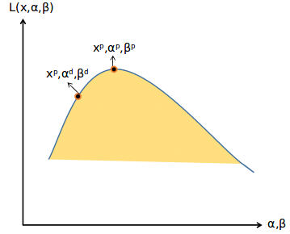

        其中,上面的点 $(x^p,α^p,β^p)$ 设为原问题的最佳解,阴影区域边界为随着 $\alpha,\beta$ 的变化,$L(x^p,α,β)$ 的变化范围.

    -   **$d^*<p^*$ 的原因**:

        那么,两者的关系:

        $D(α,β)=min_xL(x,α,β)\le L(x,α,β)\le max_{α,β;β_i≥0}L(x,α,β)=f(x)$ 的示意图即为:

        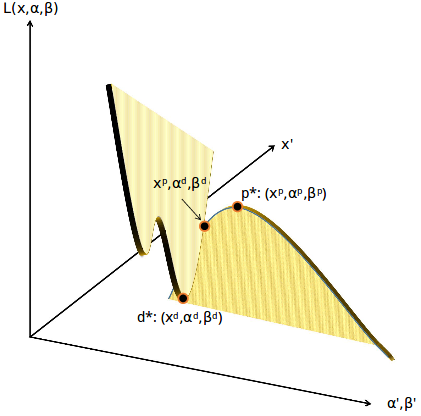

-   **optimal duality gap**

    这里还有两个概念： 

    $f(x)–D(α,β)$ 叫做对偶间隔(duality gap)

    $p^∗–d^∗$ 叫做最优对偶间隔(optimal duality gap).

#### 6. Strong duality

下面取自[博客](https://www.cnblogs.com/ooon/p/5723725.html).

-   **Strong duality**

    当 $p^∗–d^∗=0$ 的时候,称为强对偶性.

    强对偶是一个非常好的性质，**因为在强对偶成立的情况下，可以通过求解对偶问题来得到原始问题的解**.

    不过只有满足一定条件时,强对偶性才会存在:

    1.  KKT条件
    2.  Slater条件

-   **KKT 条件**

    这也是我们能够利用KKT条件解决问题的原因.

    我们的目的是要使:

    $D(α,β)=min_xL(x,α,β)\le L(x,α,β)\le max_{α,β;β_i≥0}L(x,α,β)=f(x)$

    中的等式成立.

    -   首先要注意,这里式子的左右端的 $max_{α,β;β_i≥0}L(x,α,β)=f(x)$ 

        实际上已经是让不等式  $max_{α,β;β_i≥0}L(x,α,β)\le f(x)$中的等式成立了.

        这个等式成立的条件是: $\alpha h(x)=0,\beta v(x)=0$ .是KKT条件中的第三个条件.

    -   其次我们要使得 $min_xL)\le L(x,α,β)$ 的等式成立.

        这个要求 $\partial L(x,α,β)/\partial x=0$.是KKT条件的第一个条件.

    -   而由于已经可以根据KKT条件得知:

        $max_{α,β;β_i≥0}L(x,α,β)=f(x)$,那么,

        $L(x,α,β)=f(x)= max_{α,β;β_i≥0}L(x,α,β)$

    总结来说就是说**任何满足强对偶性的优化问题，只要其目标函数与约束函数可微，任一对原始问题与对偶问题的解都是满足 KKT 条件的**。即满足强对偶性的优化问题中，若 $x^*$ 为原始问题的最优解，$α^∗,β^∗$ 为对偶问题的最优解，则可得 $x^∗,α^∗,β^∗$ 满足 KKT 条件。

-   **Slater 条件**

    若原始问题为凸优化问题，且存在严格满足约束条件的点 x ，这里的“严格”是指 gi(x)≤0 中的“≤”严格取到“<”，即存在 x 满足 $g_i(x)<0 ,i=1,2,…,n$ ，则存在 $x∗,α∗,β∗$ 使得 $x∗$ 是原始问题的解， $α∗,β∗$ 是对偶问题的解，且满足：

    ​				$p^* = d^* = L(x^*,\alpha^* ,\beta^*)$

    也就是说如果原始问题是凸优化问题并且满足 Slater 条件的话，那么强对偶性成立。需要注意的是，这里只是指出了强对偶成立的一种情况，并不是唯一的情况。例如，对于某些非凸优化的问题，强对偶也成立。SVM中的原始问题 是一个凸优化问题（二次规划也属于凸优化问题），Slater 条件在 SVM 
    中指的是存在一个超平面可将数据分隔开，即数据是线性可分的。当数据不可分时，强对偶是不成立的，这个时候寻找分隔平面这个问题本身也就是没有意义了，所以对于不可分的情况预先加个 kernel 就可以了。

#### 7. weak duality

也是刚刚搞明白这个,说下我的个人理解,欢迎纠错.下面主要是对于Boyd的[convex optimization] 第5.3.1节的理解.

1.  **在用几何解释强对偶性和弱对偶性之前,首先对拉格朗日函数作出定义.**

    首先弱对偶性是指: $d^*<p^*$,强对偶性是指 $d^*=p^*$

    对于拉格朗日函数:

    $L(x,\alpha,\beta)=f(x)+\sum_{i}^m\alpha_ih_i(x) +\sum_{j}^n\beta_jv_j(x) $  

    其中, $h_i(x)$ 为不等式约束. $v_i(x)$ 为等式约束.那么,就有:

    ​				$p^*=min_xmax_{\alpha \ge 0,\beta}L(x,\alpha,\beta)$

    ​				$d^*=max_{\alpha \ge 0,\beta}min_xL(x,\alpha,\beta)$

    设 $x\in \mathcal{R}^k, \alpha \in \mathcal{R}^m,\beta \in \mathcal{R}^n,L(x,\alpha,\beta) \in \mathcal{R}^1$.

    那么可以认为拉格朗日函数是处于一个 $\mathcal{R}^k \times \mathcal{R}^m \times \mathcal{R}^n \times \mathcal{R}^1$ 空间的函数.这个空间的各维之间是相互独立的.现在对这个空间进行变换:

    用 $\{h_1(x),...,h_m(x),v_1(x),...,v_n(x) ,f(x)\}$  的 $\mathcal{R}^m \times \mathcal{R}^n\times \mathcal{R}^1$来替代原空间中的 $x \in \mathcal{R}^k$.

    那么这个时候的空间维度为 $\mathcal{R}^{2m} \times \mathcal{R}^{2n} \times \mathcal{R}^1\times \mathcal{R}^1$.

    接着,我们设 $\mathcal{G} = \{h_1(x),...,h_m(x),v_1(x),...,v_n(x) ,f(x) \in \mathcal{R}^m \times \mathcal{R}^n\times \mathcal{R}^1 |x \in \mathcal{R}^k \}$ 

    为在约束条件下以及目标函数的约束下的可行域.

2.  **考虑 $p^*$ 的情况**

    $p^*=inf\bigg\{f(x)\bigg|\bigg(h_1(x),...,h_m(x),v_1(x),...,v_n(x) \bigg) \in \mathcal{G},h_i(x)\le 0,f_j(x)=0 \bigg\}$

    即,在原始约束下的最真实的最小值.

    我们先使得取满足 $max_{\alpha \ge 0,\beta}L(x,\alpha,\beta) $ 的 $\alpha,\beta$ , 那么 $\mathcal{R}^{2m} \times \mathcal{R}^{2n} \times \mathcal{R}^1\times \mathcal{R}^1$ 就变成了 $\mathcal{R}^m \times \mathcal{R}^n\times \mathcal{R}^1\times \mathcal{R}^1$ 的空间.

    现在假设一个可行域为凹集,只有单个不等式约束,输入输出均为一维的约束问题为例,如下图:

    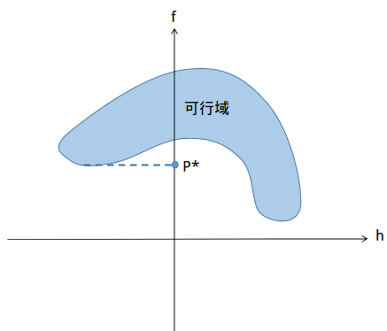

    横轴为不等式 $h(x)$ ,竖轴为目标函数 $f(x)$ .由于我们对不等式的要求是 $h(x)\le 0$ ,因此我们只能在左半轴选,由于我们所求的就是目标函数 $f(x)$ 的值,所以, $p^*$ 点落在竖轴上.即图中的 $p^*$ 点.

3.  **考虑 $d^*$ 的情况**

    $d^*=max_{\alpha \ge 0,\beta}min_xL(x,\alpha,\beta)$

    考虑拉格朗日函数的对偶函数:

    $g(\alpha,\beta)=inf_{x\in \mathcal{D}} \biggl( f(x)+\sum_i\alpha_ih_i(x)+\sum_j\beta_jg_j(x) \biggr) \le f(x)+\sum_i\alpha_ih_i(x)+\sum_j\beta_jg_j(x)​$

    **支撑超平面-对偶函数的几何意义**

    -   **在高维中的逻辑推理**

        我们先来看, $g(\alpha,\beta)$ 的几何定义.先任意  $\alpha,\beta$:

        $g(\alpha,\beta)=inf_{x\in \mathcal{D}} \biggl( f(x)+\sum_i\alpha_ih_i(x)+\sum_j\beta_jg_j(x) \biggr) $

        需要注意的是,这里的 $g(\alpha,\beta)$ 并不是一个点,而是一个超平面.因为我们在转换之后的空间中,是以$\{h_1(x),...,h_m(x),v_1(x),...,v_n(x) ,f(x)\}$ 为坐标系的,因此是一个线性空间,在保持 $g(\alpha,\beta)$的值和 $\alpha,\beta$ 不变的情况下,我们可以通过**线性改变** $\{h_1(x),...,h_m(x),v_1(x),...,v_n(x) ,f(x)\}$ 的值来**保持平衡**.

    -   **在简单问题中的几何示意**

        还是按照上面的最简化约束问题来举例:

        设 $\alpha=3​$ ,则 $g(3)=inf_{x\in \mathcal{D}} \biggl( f(x)+3*h(x) \biggr) ​$.

        假设一个满足该条件的解为 $f_0,h_0$ ,即:
        > 注:$f_0,h_0$ 以$f,h$为坐标系,且在可行域$\mathcal{G}$上) 

        ​						$f_0+3*h_0=g(3)$

        设另外一个点 $f_1=f_0+\Delta f,h_1=h_0+\Delta h$ 时,仍然要使得:

        $f_1+3*h_1=g(3)$ 的话,就要使:

        ​						$\Delta f=-3\Delta h$ ,即

        ​						$f-f_0 = -3(h-h_0)$,

        ​			当 $h=0$ 时, $f=f_0+3*h_0=g(3)$ 

        >   注: $f_1,h_1$ 可不在可行域上.

        就是下图中的那条线, $f-f_0 = -\alpha(h-h_0)$ .

        在这条线上的每个点 $f',h'$ 都可以使得: $\alpha h'+f'=g(\alpha)$

        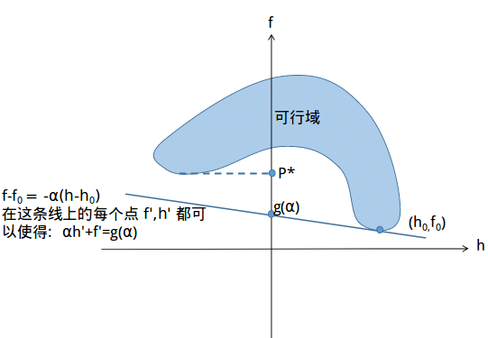

        也就是说,该方程与f轴的交点就是$g(\alpha)$ 的值.该方程上的所有点得出的 $ f(x)+3*h(x)$ 都等于 $g(3)$.

        **因此该方程就是在固定拉格朗日乘数下,这个二维平面上的支撑超平面.**

        ​

    -   **对偶问题最优解**

        这里之所以称为支撑超平面,是因为,超平面只能与可行域相接,而不能相交,这个是依据 $inf()$ 函数的性质来的.

        那么,接下来就好办了,就是要找一条与可行域相交的方程,使得其与 $f$  轴相交的值最大.该方程上所有点(但必须在可行域内)都为对偶问题的解.

        由下图可知,对于凹可行域而言 $d^*<p^*$.

        