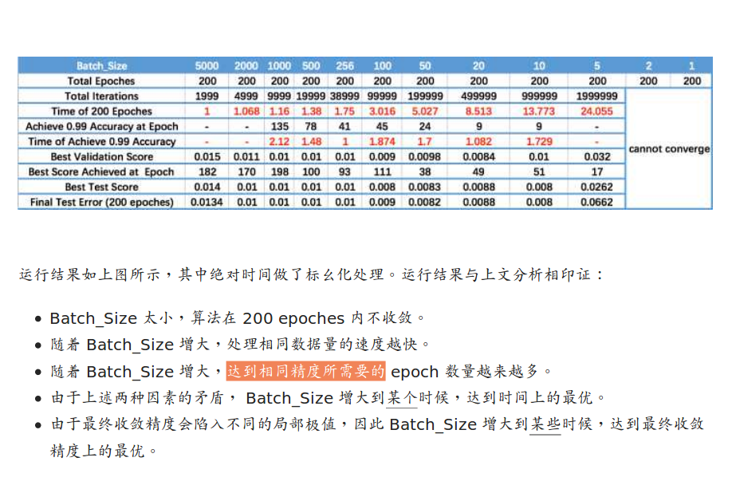
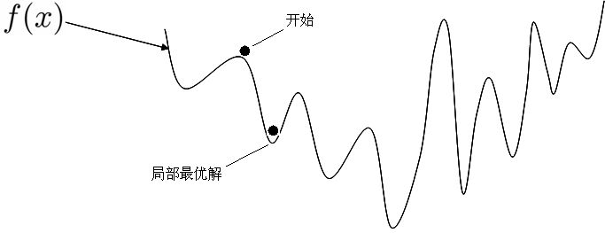
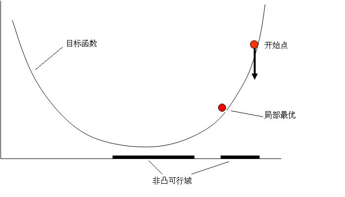

## 梯度下降中的相关概念

### 1. epoch,iteration和batchsize

-   batchsize：批大小。在深度学习中，一般采用SGD训练，即每次训练在训练集中取batchsize个样本训练；
-   iteration：1个iteration等于使用batchsize个样本训练一次；
-   epoch：1个epoch等于使用训练集中的全部样本训练一次；

举个例子，训练集有1000个样本，batchsize=10，那么：

训练完整个样本集需要：

100次iteration，1次epoch。

### 2. BGD,SGD,MGD

-   Batch Gradient Descent:批梯度下降算法是每次利用所有训练集数据的误差期望作为梯度下降的标准，由所有样本共同决定最优的方向。

    -   在数据量较小时,有两个优点:
        -   其一，由全数据集确定的方向能够更好地代表样本总体，从而更准确地朝向极值所在的方向
        -   其二，由于不同权重的梯度值差别巨大，因此选取一个全局的学习率很困难。其二，由于不同权重的梯度值差别巨大，因此选取一个全局的学习率很困难。
    -   在数据量较大时,有两个缺点:
        -   其一，随着数据集的海量增长和内存限制，一次性载入所有的数据进来变得越来越不可行。
        -   其二，以 Rprop 的方式迭代，会由于各个 Batch之间的采样差异性，各次梯度修正值相互抵消，无法修正.

-   stochastic Gradient Descent:随机梯度下降就是每次从所有训练样例中抽取一个样本进行更新，这样每次都不用遍历所有数据集，迭代速度会很快，但是会增加很多迭代次数，因为每次选取的方向不一定是最优的方向.

-   mini-batch Gradient Descent:这是介于以上两种方法的折中，每次随机选取大小为b的mini-batch(b<m), b通常取10，或者(2...100),这样既节省了计算整个批量的时间，同时用mini-batch计算的方向也会更加准确。

    这里的mini-batch的取值里面有学问:

    -   在合理范围内，增大 Batch_Size 有何好处？:
        -   内存利用率提高了，大矩阵乘法的并行化效率提高
        -   跑完一次 epoch（全数据集）所需的迭代次数减少，对于相同数据量的处理速度进一步加快
        -   在一定范围内，一般来说 Batch_Size 越大，其确定的下降方向越准，引起训练震荡越小。

    -   盲目增大 Batch_Size 有何坏处？
        -   内存利用率提高了，但是内存容量可能撑不住了。
        -   跑完一次 epoch（全数据集）所需的迭代次数减少，要想达到相同的精度,其所花费的时间大大增加了，从而对参数的修正也就显得更加缓慢。
        -   Batch_Size 增大到一定程度，其确定的下降方向已经基本不再变化。

    -   那什时候好呢:

        

### 3. 凸优化和非凸优化

为什么要求是凸函数呢？因为如果是下图这样的函数，则无法获得全局最优解。

为什么要求是凸集呢？因为如果可行域不是凸集，也会导致局部最优

-   目标函数 $f$ 如果不是凸函数，则不是凸优化问题
-   决策变量 $x$ 中包含离散变量（0-1变量或整数变量），则不是凸优化问题
-   约束条件写成 $g(x) \le $ 时，如果不是凸函数，则不是凸优化问题

之所以要区分凸优化问题和非凸的问题原因在于凸优化问题中局部最优解同时也是全局最优解，这个特性使凸优化问题在一定意义上更易于解决，而一般的非凸最优化问题相比之下更难解决。

而很容易可以证明,一层以上的神经网络是非凸的,因为很容易找到一个值使得, $f''() < 0$ .