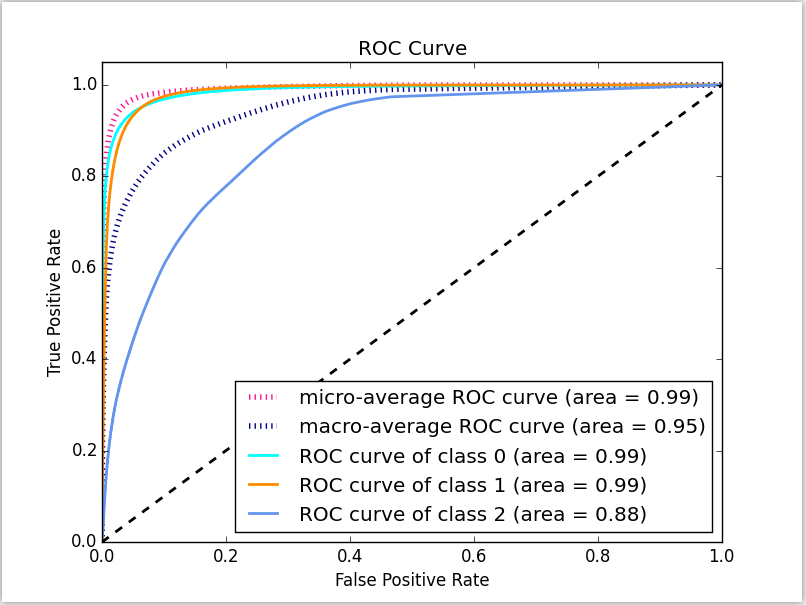

### 评价指标

对机器学习中的评价指标一直是无棱两可的, 今天来解决它!!!!!

#### 1. TP, FP, TN, FN

首先True是说预测是正确的

TP : 预测是positive的, 并且预测正确, 这个就是我们最想要的. 

FP : 预测是positive的, 预测错误 , 这个我们不能要

TN : 预测是negative的,预测正确True, 这个也是我们想要的. 

FN :  预测是negative的, 预测错误,, 这个我们不能要

#### 2. Accuracy,Precision, Recall,F-measure

Accuracy : 理解很简单, 就是预测是正确的比率.

Precision : 精确度, 在他的Positive预测中有多少是正确的. TP/(TP+FP). 关注对象在于预测结果.

Recall : 召回率, 在真实的True中, 有多少被预测正确. TP/(TP+FN). 观测对象在于真实的情况.

F-measure : Precision和Recall的调和平均.

> 调和平均的意义在于:
>
> 分子相同, 但是分母不同, 因此需要将将分母调成平均数后再当分母.
>
> 在这里的意义时, 当一方的效果十分差时, F值的值也会很小.因为, 
>
> $F1 = 1/(\frac{1}{R}+\frac{1}{F})$, 当一方非常小的时候, F1就会非常小.
>
> 而对于简单的平均, 则不会.

#### 3. ROC 曲线

TPR : 在实际为positive的案例里, 预测正确的比例.  TPR = TP/(TP+FN)

FPR : 在实际为negative的案例里, 预测正确的比例.  TPR = TN/(TN+FP)

另外在二分类问题中, 总有一个阈值是用来判断正负的, 一般是0.5. ROC就是判断在这个阈值变化是, TPR和FPR变化的一种曲线. 越强大的算法, 其判断的信息越大, ROC就会越靠近左上角, 如下图所示:

#### 4. AUC值

AUC值就是ROC曲线下方的面积.

