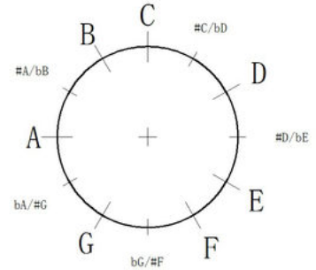

## 乐理

### 1. 音程

#### 1.1 定义

音程指两个音级在音高上的相互关系，就是指两个音在音高上的距离而言，其单位名称叫做度。

两个乐音之间的音高关系。用“度”表示。以简谱为例，从1到1，或从2到2都是一度，从1到3或2到4都是三度，从1到5是五度。

我们通常八度为一个单位,这个是因为,当一个音差一个八度时,实际上听到的感觉是相似的,不会产生八度之内音之间的异样感.

#### 1.2 倍频与八度

音阶的区分以及音程的计算都是靠乘法而不是加法.

在前人的尝试和实践中，他们发现频率为二倍关系的两个音听来有相似性。比如1与低音1与高音1，听起来类似，虽然比较起来高度差很多。倍频关系的音听来有相似性，就是说像220，440，880，这样关系的音，听起来类似，这就成为人们确定音律的重要基础。

而一个八度就是指互为倍频关系的两个音（含）之间，一共有八个自然音级.于是听来有相似性的这种音程关系，被称作八度。

而将互为倍频关系的两个音（含）之间的所有音分为八个自然音级的方法就叫做十二平均律.

**度，就是音与音之间距离的衡量单位。音与音之间音高的距离，就叫做音程。**

#### 1.3 十二平均律

十二平均律，亦称“十二等程律”,世界上通用的把一组音（八度）分成十二个半音音程的律制，各相邻两律之间的振动数之比完全相等。十二平均律是指将八度的音程（一倍频程）按频率等比例地分成十二等份，每一等份称为一个半音即小二度。一个大二度则是两等份。

- **小二度**: 一个半音
- **大二度**:两个半音,一个全音.
- **纯四度**:包含四个音级五个半音.如：C—F
- **大三度**:所谓大三度是指三个音之间的关系是全音的关系，也就是有两个全音，便是大三度。如:C - E
- **小三度**:所谓小三度，是指三个音的构成是按照一个半音，再加一个全音构成。如: D - F

#### 1.4 音程度数

上面已经说过,音程为一个音到另外一个音的距离.而这个距离的单位是用度来表示的.

最基本的音程是纯一度和纯八度。

- 纯一度就是相同的两音，没有距离称为纯一度。
- 纯八度就是一个八度.

还有两个音程的标准,纯四度和纯五度

- 纯四度:包含四个音级五个半音.如：C—F
- 纯五度:包含五个音级七个半音.如：F-B

这就是四个基本的纯音程。

#### 1.5 音程属性

各个音程属性的确定，要通过两个条件来判断。

- 音程所包含的音级数
- 音程所包含的半音的个数。

举例说明，13两个音，它包含了123三个音级，因此可以确定为三度，但此时定性并不完全，再看12和23之间都有两个半音，因此13这个三度包含三个音级四个半音，这样的叫做**大三度**。再例，35包含345三个音级，但是34之间只有一个半音，包含三个音级三个半音的，叫做**小三度**。

像1-4这样，包含四个音级五个半音的，是纯四度。15这样包含五个音级七个半音的，是**纯五度**。如果是1到升4，包含四个音级，但有六个半音的，叫做**增四度**；1到降5这样，包含五个音级，六个半音的，叫**减五度**。

**一、四、五、八这四种度数在和声学上被认为是最和谐的音程**

#### 1.6 快速算法

在没有变化音的情况下：

1．所有的一度都是纯一度。

2．只有3-4、7-1 为小二度 其余为大二度。

3．中间音为3、4、7、1的为小三度，其余为大三度。（比如 3-5中间音为 4所以是 小三度）

4．只有4-7为增四度 其余为纯四度。

5．只有7-4为减五度 其余为纯五度。

6．根音为3、6、7的为小六度 ，其余为大六度。

7．根音为1、4的为大七度，其余为小七度。

8．所有的八度都是纯八度。

### 2. 和弦

#### 2.1 定义:

和弦就是几个音同时震动混在一起的声音.

- **三度和弦:**

  三和弦就是三个音同时震动. 七和弦是四个音,九和弦是五个音,十一和弦是六个音,十三和弦是七个音.

- **非三度和弦:**

  挂留和弦、强力和弦(五和弦)

#### 2.2 三和弦

构成和弦的诸音，叫做该和弦的和弦音。在和弦的基本形态中，最下端的一音，叫做“根音”。其余各音均按它们与根音构成的音程关系来命名

