## 素描

### 1. 笔的介绍

笔分很多种,从2H到12B,我们一般都用偶数型号的笔,因为奇数型号(2n+1)B 与 2nB 的笔很像,不值得专门使用.

其中,2H到 12B ,线质越来越软.如下图:

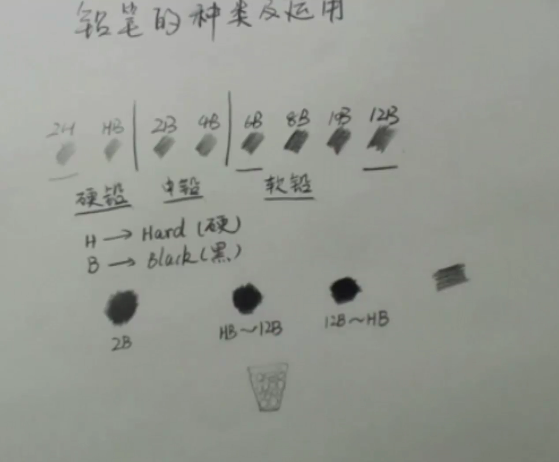

其中,当我们通过覆盖排线的方法加黑某一块时,通常采用软笔来打底,硬笔覆盖的方式,因为这个就像是想被子里面加石头,沙子,水一样的道理.

### 2. 排线

#### 2.1 排线的方法

- **运腕法**

  只有食指和拇指轻轻夹住笔,剩下三指将笔收向手心内侧.且整只手离开纸面.如下图所示:

  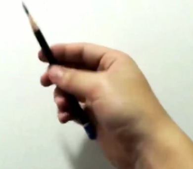

  通过转动腕部来实现排线.

  **最重要的是,排线不是练着不分开的划线,而是独立的分开的,且方向一致的.也就是说,在一块区域中,从上到下的画的话,全部都要是从上到下,不能这一条从上到下,下一条从下到上**

  如下图所示,左图为错误画法,右图为正确画法: 

  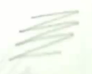 		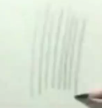

- **小拇指支撑运腕法**

  就是用小拇指支撑住纸面,其他与运腕法相同

  那么他与运腕法的不同是:

  小拇指支撑运腕法的**速度慢,颜色深(用力大),区域小,排线紧密**

  如下图:

  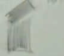

- **运臂法**

  这个方法就是运用手臂.画出更大区域,间隔更大的区域.

- **握笔法**

  就是用平时握笔的方式画图,这个的意义在于,画局部需要精雕细琢的区域.

#### 2.2 不同排线的用处

四个方法的比较见下面这个瓶子的构图:

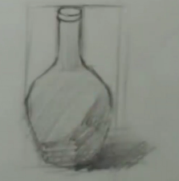

在这个图中,

- **运臂法**:瓶子轮廓底色以及方框

- **运腕法**:瓶子中的阴影
- **小拇指法**:阴影部分以及瓶子下半部分深色地方
- **握笔法**:瓶盖,以及瓶子轮廓的加深.

#### 2.3 如何练习排线

- 不同方向,各个方向要全面
- 长时间练习
- 注意线要直,且线与线之间平行
- 线条要 '轻,重,轻',是为了和别的线段衔接时,轻+轻=重,不会使衔接处显得突兀.(一开始不需要考虑)
- **均匀稳定**

### 3. 三大面

#### 3.1 三大面的基础

以左上方打入光源的正方体为例子:

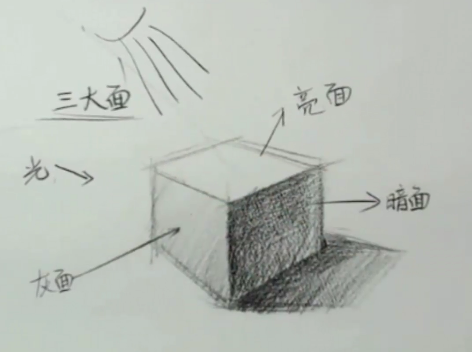

注意,在这个处理中,每个面的每个地方都采取了相同的色度,这个是问题的.

#### 3.2 色度的调整

在下面这个图中,上面的三个横条分别显示了顺面(亮),正面,背面(暗)的线条感觉.

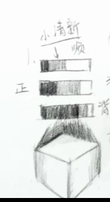

而下面的正方体模拟的是从正面打过来的光造成的效果.

**物体的最亮面代表的是物体的固有色(本身的颜色)**

**因此,物体的颜色比例是很重要的,并且素描时,会从暗面开始画**

### 4. 五调子

- **五调子的概念**

  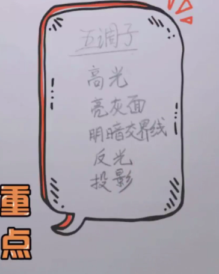

- **明暗交界线**

  明暗交界线是在非方体物体中需要注意的东西

  

  在上图中就是中间那一条线.

  由于这个是想画一个橘子,且橘子不是一个光滑的球体,因此明暗交界线不是一个完美的曲线,这种折线表现的是橘子的不平的特征.

  > 下面顺便说一些画圆形物体的方法:
  >
  > 现在外面通过直线画出六边形或者其他边形,在在直线外部描弧线,使得图形圆润.如下图:
  >
  > 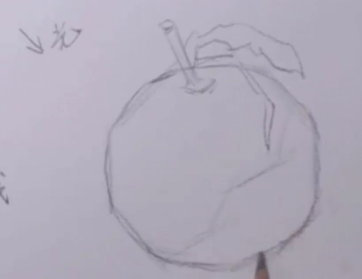
  >
  > ​

- **明暗交界线铺上背光区域**

  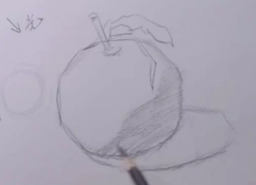

  现在,这个图形有三个调子了

  **反光** **投影**,**明暗交界线**

  注意

  - 这里的明暗交界线是物体受光和背光的一个区域而不只是一条线.

  - 阴影要暗于实体,以区分阴影与实体,如下图:

    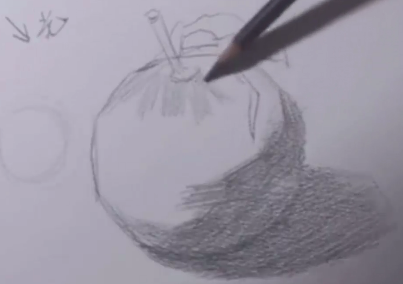

- **构建亮灰面并预留高光**

  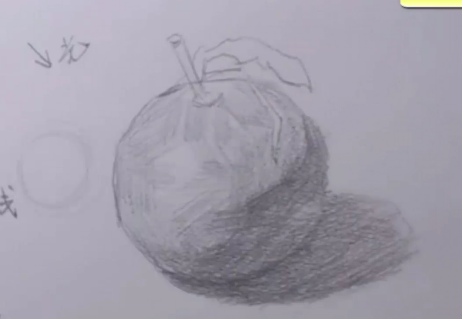

  这一步操作有两点需要注意

  - 在顶部的稍亮的部分的阴影要顺着物体的形状画(这里是发散性的排线)
  - 在其他部位(还是限于亮面),各个部位的排线也要根据光的方向来画.

  下一步就是预留高光的部分,高光部分见下图铅笔指的地方:

  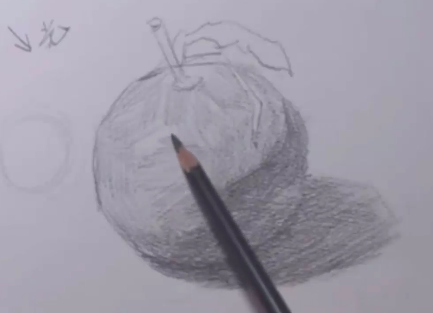

- **给橘子增加色彩深度-在把和叶子上加深颜色以及叶子的阴影**

  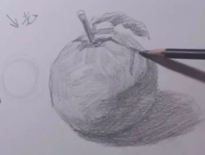

- **最后看看五调子在图中的部位**

  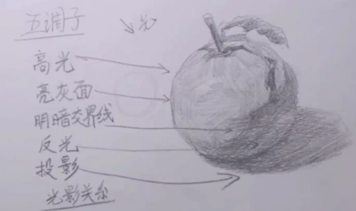

- **抹匀排线使线条柔和**

  用的是纸擦笔

  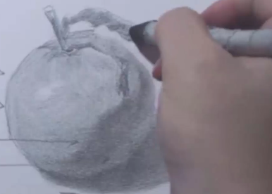

- **在关键区域(明暗交界线)再排一遍线条**

  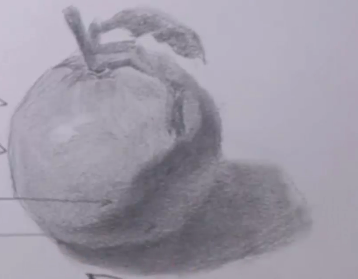

  注意,在之前的构图中,明暗交界线下方全为暗色区,但是在加深明暗交界线之后,整个橘子有了一个:

  **浅 - 深 - 浅** 的层次感,这个层次感中的深的区域就是**反光区.**

  ​

  **注意**:明暗交界线不止一处,由于反光的产生,立体感突显,影子与实体处也有明暗交界线,因此需要对影子区域进行暗色加强.如下:

  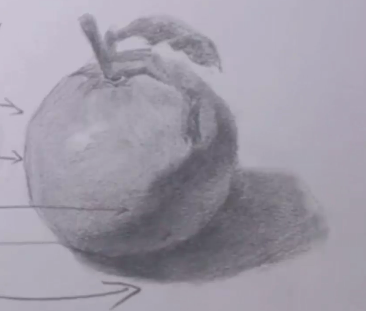

- **一些完善**

  左下部,头部,阴影区和边缘区域的颜色加深:

  **左下部:阴影的补充**

  **头部:把处的起伏感**

  **阴影区:增强物体与桌面的立体感**

  **边缘区域:增强物体与空间的立体感**

  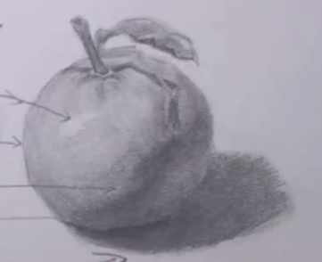

- **回顾五调子**

  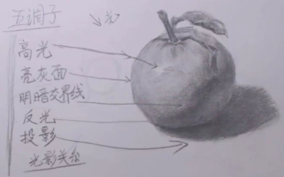

  其中亮灰面是围绕着中间一点高光的区域.在向下走是明暗交界线,再向下走是反光,最后是阴影区.

### 5. 透视

#### 5.1 视平线

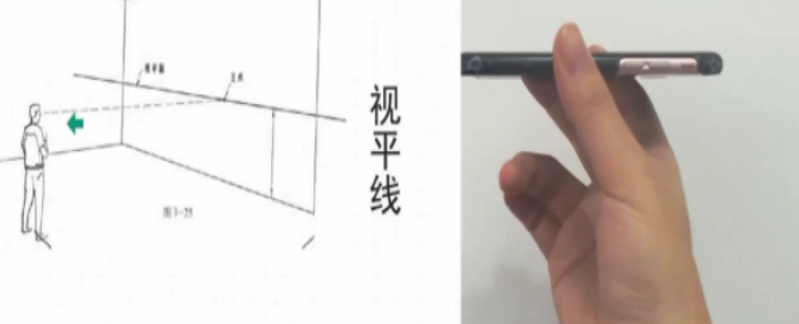

看不见物体的其他面,只能看到一个面,不同于上面的正方的三面.

#### 5.2 灭点(消失点)

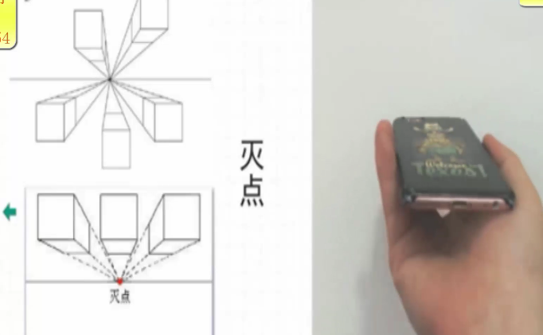

#### 5.3 一点透视

又叫做平行透视,在观察(**正视**)平行的正方体的时候,他们最后是消失于一点的

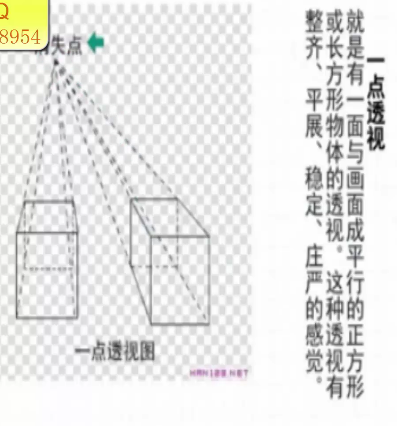

- **透视的作用**

  真实,客观,写实

#### 5.4 两点透视 

不是从正面看物体,而是从一个倾斜的角度:

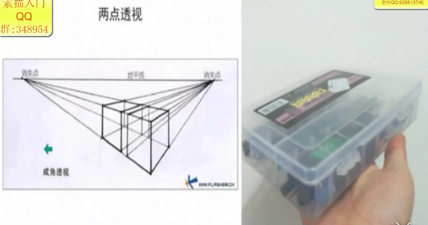

#### 5.5 空气透视

远处的景为虚景,因为中间隔了空气.也就是 **近实远虚**

**实质是:越远对比度降低**

类似的东西还有,**近高远低**,**近宽远窄**

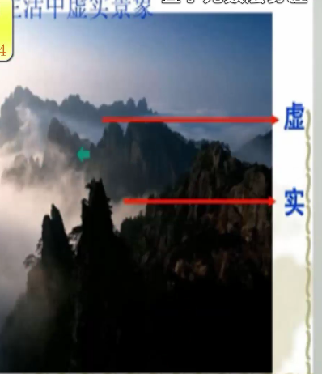

#### 5.6 透视在立体图中的应用

这个图中,上面的为考虑透视的,下面的为不考虑透视的.

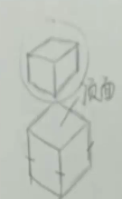

近大远小的应用,在顶面上.

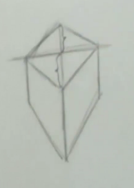

在这个较为夸张的透视图中,可以看出连接顶面的对角线后,上面的三角形的面积应该是小于下面的,符合近大远小的概念.

