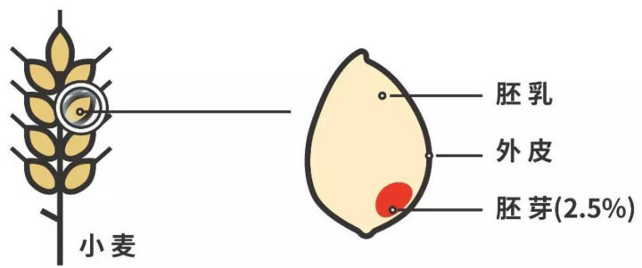

### Flour - 面粉

这里主要记录一些三种面粉,低筋,中筋和高筋面粉的的区别.

#### 1. 三种面粉生产方法的不同

一个小麦分为三个部分,外皮,胚乳和胚芽,具体如下图所示:

其中:

外皮:富含维生素B群,纤维素和铁质

**胚乳:面粉主要由这个部分组成,淀粉含量高,也有蛋白质等等**

胚芽:富含各种维生素,主要为蛋白质

下面就是最重点的地方:

**一个小麦从外向里磨三层,蛋白质含量逐渐提高,而面粉的筋度是由蛋白质含量决定的,蛋白质含量越高,筋度越高**.

> 这里的筋度除了是一种度量方法,还代表着我们吃的时候的粘性,弹性和嚼感.

因此我们知道了最外层生产出来的面粉叫做低筋面粉;中间一层叫做中筋面粉;最里面一层叫做高筋面粉,富含胚芽中的蛋白质

#### 2. 三种面粉组成物质上的不同

上面已经大概说了他们的区别,但是具体的比例又是什么呢?

- **高筋面粉**

  含有约**11.5%~14%的蛋白质**，**吸水量为62~66%**。

  - 颜色白,且偏深.
  - 筋度大,粘性和弹性高
  - 表面光滑,不易抓成团.

- **中筋面粉**

  中筋面粉，含有约**9.5~11.5%的蛋白质**，**吸水量为50~55%**。

  - 颜色乳白
  - 筋度及黏度较均衡，体质半松散

- **低筋面粉**

  含有约**6.5~9.5%的蛋白质**,**吸水量为48~52%**。

  - 颜色很白
  - 筋度和粘性都较低
  - 体质松散，手抓易成团。

#### 3. 三种面粉用途的不同

- **高筋面粉**

  适合做韧性,粘性高的点心.这里才是重点,因为没有对比过正宗或者不正宗的点心,不知道不同的点心到底应该是什么口感.

  适合用来做面包,派皮,松饼,泡芙,千层酥.

  **总而言之,就是西式的硬质甜点,注重韧性,想想最爱吃的手撕面包的感觉**

  ​

- **中筋面粉**

  中筋面粉是中国的点心中最常用的,因为中国在磨面的过程中没有对面粉进行分级.

  馒头、包子、烧饼、芝麻球,面条

  ​

- **低筋面粉**

  适合做西式的各种软式甜点.

  松糕、饼干、挞皮,蛋糕

#### 4. 其他使用TIPs

在日常使用过程中,经常会出现没有某种面粉的情况,下面来介绍解决方法:

- **高筋+低筋=中筋**

  1:1混合

- **中筋+玉米淀粉=低筋**

  4:1混合

- **高筋(微波炉加热)+玉米淀粉=低筋**

  微波炉加热2-3分钟,然后按1:1的比例.

