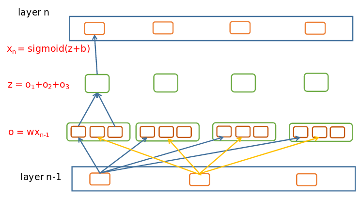

### Tricks

- 在一开始的编程是,先分割出一个小型的数据库进行程序基本能力测试

- 在写的过程中,灵活运用 array.shape 来判断数组的大小,以防出错.

- 使用logging.

- 神经网络训练数据时,要打乱训练集顺序.打乱之后效果会好.

- 输入特征之间最好还是不要相关，但是如果数据量够大，问题也不大。

- 在编程的时候,在旁边备一张纸,画清楚各层次之间的关系,并且,各个层次之间的units要少且不同.

- 实际上,神经网络的两层在编程进行求导的时候,中间还有两层.如下图:

  

  在求导的过程中,可以省略从z到o的这一步,因为从z到$x_{n-1}$的求导过程等于,从z到o,再从o到$x_{n-1}$,因为o里面的其他unit在z到o的过程中全为常数,可以忽略.

- 输入数据的shape一定要是 (n,1),而不是 (n,),而偏移参数b也应该是一个 (m,1) 的形式