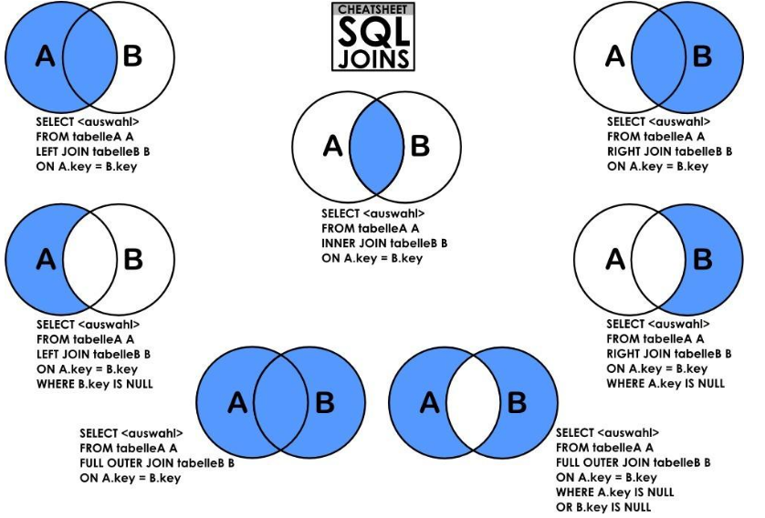
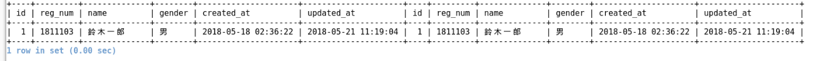
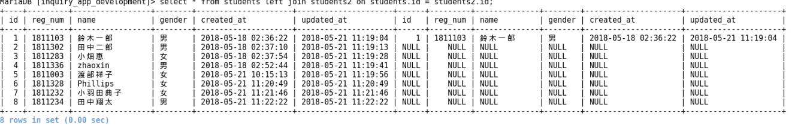
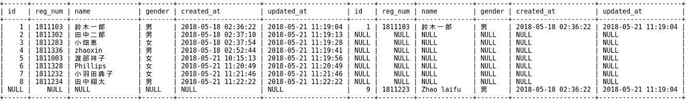
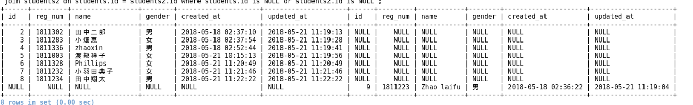

### Set Operation on tables


对集合的运算


#### 1. 和运算(取并集)

**select * from students union select * from students2;**

> 只会显示一列应该有的数据, 会将两个表进行和操作


#### 2. 掛け算(直積演算) cross join

**select * from students, students2**

> 会将两个表的内容相乘.

或者

**select * from students cross join students2;**


#### 3. 差 

**select name from students where id not in ( select id from students2)**

> 这个需要注意的是, 后面调用的mysql语句必须抽出一个具体的列, 而不能是 *
>
> ```mysql
> +----+---------+-----------------+--------+---------------------+---------------------+
> | id | reg_num | name            | gender | created_at          | updated_at          |
> +----+---------+-----------------+--------+---------------------+---------------------+
> |  2 | 1811302 | 田中二郎        | 男     | 2018-05-18 02:37:10 | 2018-05-21 11:19:13 |
> |  3 | 1811283 | 小畑恵          | 女     | 2018-05-18 02:37:54 | 2018-05-21 11:19:28 |
> |  4 | 1811336 | zhaoxin         | 男     | 2018-05-18 02:52:44 | 2018-05-21 11:19:41 |
> |  5 | 1811003 | 渡部祥子        | 女     | 2018-05-21 10:15:13 | 2018-05-21 11:19:56 |
> |  6 | 1811328 | Phillips        | 女     | 2018-05-21 11:20:49 | 2018-05-21 11:20:49 |
> |  7 | 1811232 | 小羽田典子      | 女     | 2018-05-21 11:21:46 | 2018-05-21 11:21:46 |
> |  8 | 1811234 | 田中翔太        | 男     | 2018-05-21 11:22:22 | 2018-05-21 11:22:22 |
> +----+---------+-----------------+--------+---------------------+---------------------+
> ```

**select * from students inner join students2 where students.name=students2.name;**

> 取两个表中id相同的符号.


#### 4. 取交集

**select * from students where id in (select id from students2);**

> 取两个集合中同时有的东西
>
> ```mysql
> +----+---------+--------------+--------+---------------------+---------------------+
> | id | reg_num | name         | gender | created_at          | updated_at          |
> +----+---------+--------------+--------+---------------------+---------------------+
> |  1 | 1811103 | 鈴木一郎     | 男     | 2018-05-18 02:36:22 | 2018-05-21 11:19:04 |
> +----+---------+--------------+--------+---------------------+---------------------+
> ```


#### 5.结合运算

> 注意 , join 运算使用的是 on 进行判断, 而不是where



**select * from students inner students2 on students.id=students2.id**

> select * from students inner students2 会显示出所有的数据, 也就是 N*N 条, 从中, 再进行 on 运算, 从中选择合适的条目, 而inner表示的是 (只返回两个表中联结字段相等的行).也就是说, 要求交集先必须要有on, 也就是要有交并的评价标准.
>
>  而其他的例如left join 会返回包括左表中的所有记录和右表中联结字段相等的记录, 右边的不相等的数据处会写入NULL, 具体见下方 . 
>
> 
>
> 两个表不一定要格式一致, 也可以是完全不一致的例如, students和inquiries_students. 但是一定要有一个可以对两个表进行计算的标准.如:
>
> **select * from students inner join inquiries_students on students.id=inquiries_students.student_id**
>
> 就可以得出,所有人的所有答案. 但是只显示出了students和inquiries_students中能显示的信息.
>
> 如何inner结合三个表呢?

**select students.name ,inquiries.entry ,inquiries_students.answer from (students inner join inquiries_students on students.id=inquiries_students.student_id) inner join inquiries on inquiries.id = inquiries_students.inquiry_id;**
这个就会显示出, 人名-问题-答案 这样的结果, 是所有的问答记录, 注意这里是因为有inner才会有48条记录, 如果用left或者right就会有很多没用的NULL的条目出现.


**select * from students join inquiries_students on inquiries_students.student_id = students.id;**

> 这个是说, 先选出来 n*m 个条目, n,m分别是学生的数量和问题_学生的条目数, 接下来, 从中选择

**select * from students left join students2 on students.id = students2.id;**

> 是将上面的交集加上左边的表, 但是因为是2*N 的宽度, 右边的表不存在的地方设为NULL
>
> 
>
> 而select * from students join inquiries_students;的数据条目是384条.

**select * from students outer join students2 on students.id = students2.id;**

>  求出并集
>
> 
>
> 但是mysql没有outer, 要用以下代替:
>
> select * from students left join students2 on students.id = students2.id union select * from students right join students2 on students.id = students2.id;

**select * from students outer join students2 on students.id = students2.id where student.id is not NULL or student.id is not NULL;**

> 找出非交集
>
> 

#### 6. Join 运算与非join运算

* **非 join on 多表操作方法**

  实现要区别join和 上面的用 复合mysql语句的区别. 符合mysql语句是从一个表中抽出的, 设两个表的列宽为N. 那么通过这个方法选择出的数据宽度也是N.

  **select * from tablesA where in(not in ) (select ....)**

* **join on 多表操作方法**

  但是join是不同的, 不管是左join还是右join, 都统统是基于 cross join 也就是乘法操作后的. 就相当于,  先将两个表进行乘法后, 再对每个条目进行操作, 那么通过这个方法选择出的数据宽度也是N*N.

* **两个方法的区别**

  非join

  ```python
  for list2 in table2:
          condition_set.append(condition2(list2))
  for list1 in table1:
      if condition2(list2) in condition_set:
          print(view(list1))
  ```

  join法:

  (便于理解的伪代码,但是实际上, 这样会造成巨大的开销, 具体是怎么样的并不知道)

  ```python
  for list1 in table1:
        for list2 in table2:
       		if condition(list1, list2) is True:
        		lists.append(concatenate(list1,list2))
  for list in lists:
  	select(list)
  ```

