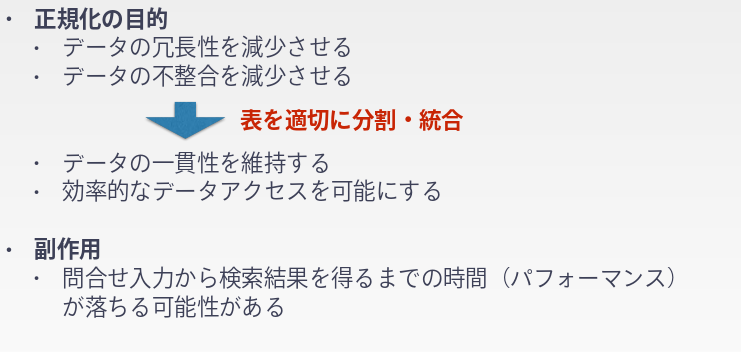
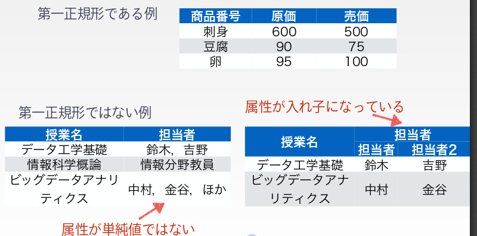
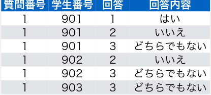

### 范式

#### 1. 什么是范式?

#### 2. 第一范式

一つの属性に含まれる値は単純値のみである

#### 3. 第二范式

- 第二范式的条件:
  - 是第一范式

  - すべての非キー属性がすべての候補キーに対して完全関数従属している

    也就是说没有冗余信息. 	所有的非键值之间不能有一对一的关系.例如学籍号和学生名之间的关系

- 不满足第二范式的后果

  - 修正不整合

    把一个人的学籍号与另外一个人进行交换时,也不得不将条目中的所有人名进行替换.

    *使得每次修正能够最高效率, 在最少的修正下达到目的*

  - 删除不整合

    当删除某个学生唯一的一个信息时, 这个学生的学籍号和人名的对应信息也会消失.

    *尽可能减少每次删除减少的信息量*

  - 插入不整合

    若是某个插入是没有给出学籍号,只给出了学生名 ,这样就好造成主键的缺失.

    *使得每次插入能够在最少的操作下达到目的.*

  - **总结**

    也就是说, 对数据库的每一个小项(格子)进行操作时, 都有时间消耗以及出错的可能性, 因此需要高效率对每个格子的数据进行操作. 

    将数据尽可能的分割储存,提高健壮性

- 不满足第二范式的例子.

  

- **修正方法**

  

#### 4. 第三范式

- 第三范式:

  - 第二正規形であること
  - すべての非キー属性がすべての候補キーに対して推移的に関数従属ではない

- **与第二范式的关系**

  本质都是一样的, 都是降低数据的冗余性. 将数据尽可能的分割储存,提高健壮性.

  不同点在于:

  - 第二范式的条件时, 非主键数据(*从属项*)对主键(*决定项*)的冗余性处理. 
  - 第三范式的条件是, 非主键数据1(*从属项*)对非主键数据2(决定项)的冗余性处理. 其中非主键数据2(*从属项*) 是 主键(*决定项*) 的从属.

- **不满足第三范式的后果**

  整体和第二范式一样, 因为都是为了解决冗余性问题.

- **不满足第三范式的例子**

  

- **解决方法**

  