## Neural Relational Inference for Interacting Systems

### 1. Introduction

#### 1.1 一些先行研究

Use a implicit interaction model to learn a interacting system.

- 一些使用隐含交互模型去学得一个交互系统的动态模型.

This kind of model can be seen as a graph nerual network

- 这些模型可以看做是在 fully-connected graph 中 message passing 的 graph neural networks.

  交互的方式

  - 被 message passing function隐式地模型化.

    > - Learning multiagent communication with backpropagation.
    > - Permutation-equivariant neural networks applied to dynamics prediction.
    > - A simple neural network module for relational reasoning.
    > - Visual interaction networks: Learning a physics simulator from video.

  - 在注意力机制下被模型化

    > - Attentional multi-agent predictive modeling.
    > - Unsupervised discovery of objects and their interactions

#### 1.2 模型描述

**推断出一个显性的交互结构, 与此同时学得一个交互系统动态模型. (利用非监督的方法)**

- 我们的神经关系推理模型, 通过GNN在一个离散的潜在图上学得了动力学系统机制.通过这些潜在变量我们可以实现推理.

- 推断的边的类型对应的交互的一个类别.

- 通过使用概率图可以让我们利用关于这个图结构的先验知识, 比如说具有某种规则的稀疏性.

  (这个地方是我想要的)

- 本文的任务是一个物理系统的模拟. 我们的NRI模型可以学习到一个非常好的关于这个任务的归纳偏置.

- 这个系统在NBA球员的运动位置数据上进行实验, 学得了一些很少的edge types, 可以很好的预测动态系统.

### 2. Background: Graph Neural Networks

#### 2.1 介绍对象

一些通过 passing local messages 直接在 graph-structured data 上进行的神经网络模型.

> - The graph neural network model
> - Gated graph sequence neural networks.
> - Neural message passing for quantum chemistry

我们称这样的模型为 graph neural networks (GNN).

#### 2.2 GNN特性

Variants of GNNs have been shown to be highly effective at relational reasoning tasks

GNNS的一些变种被证明在关系推理任务上是非常有效的

> - A simple neural network module for relational reasoning.

可以用来

- **对于一些multi-agent系统以及动态交互系统进行建模.下面是相关研究**

  > -  Learning multiagent communication with backpropagation
  > - Interaction networks for learning about objects

- **图的分类**

  > -  Spectral networks and locally connected networks on graphs
  > - Convolutional networks on graphs for learning molecular fingerprints.  
  > - Discriminative embeddings of latent variable models for structured data
  > - Learning convolutional neural networks for graphs
  > - Convolutional neural networks on graphs with fast localized spectral filtering.
  > - Molecular graph convolutions: moving beyond fingerprints.

- **classification of nodes in large graphs **

  > - Semi-supervised classification with graph convolutional networks.
  > - Inductive representation learning on large graphs.

**GNN的优点分析**

> - Deep sets
> - Mapping images to scene graphs with permutation-invariant structured prediction

#### 2.3 GNN的基本结构

每个边每个点都有一个embedding.

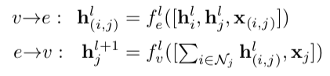

$x$ 代表的是node或者edge的特征. 也就是说, 一个边的向量由它两边的node和这条边本身的特征决定.

$$h^l$$ 指的是在第l层的数据. 这里的层. 在篮球动力学模型中就是指时间, l代表不同的时刻.

一个点的向量由所有连着这个点的边决定.

所有的基于GNN模型都是基于这两个公式的.

- 最开始的2009的论文中, 边的向量只是由sender node和边的特征决定.
- 在battaglia 2016年的论文中的 interaction network中 和 Gilmer 2017年的message passing network 中, 用到了这个更一般的公式.
- 在最新两年的论文中, 有很多将 $f_e^l$ 分为两个分离的函数, 代表了一种gating or attention mechanism.

### 3. Neural Relational Inference Model

#### 3.1 NRI模型简介

两部分

- encoder : 预测不同轨迹之间的相互作用的编码器.
- decoder : 在给定interaction graph下学得一个动力学模型.

这个论文在讲解过程中一直以篮球比赛动力学系统的模型为例. 但是实际实验是在真实准确的物理动力学系统, 例如电子, 弹簧等等.

输入是每个球员的运动轨迹. 设一个有N个球员, 那么一共有N个输入.  其中, $x_i^t$ 代表的是第 i 个object 在t时刻的特征(例如, 位置或速度).

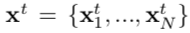

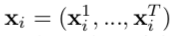

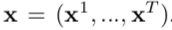

GNN是基于一个未知的图 $z$, 这个图中的 $z_{i,j}$ 代表的是对象 $z_i$ 和 $z_j$ 之间的离散的关系. 这个关系我们也是未知的. 我们的任务是预测某个时刻, 两个对象之间的关系向量的同时, 可以学得动力学模型.

#### 3.2 NRI细节

##### 3.2.1 模型概览

该模型是使用 前面时刻的 $x^1,...,x^t$ 去预测 $x^{t+1}$. 如下:

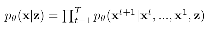

然后, 这个预测过程中是基于一个潜在变量 $z$ 的. 这个 z 就是在任意时刻两个object之间的 relation, 这是一个one-hot向量.

这个模型的图示如下:

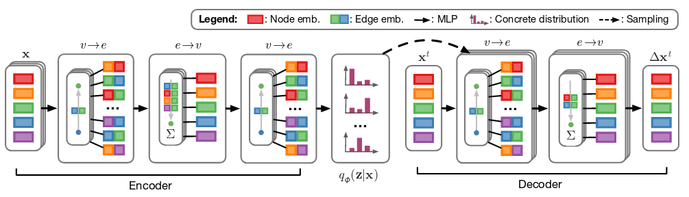

##### 3.2.2 模型的损失函数

这个模型是用变分自编码器实现的.

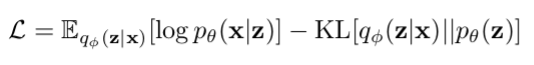

上面的损失函数就是这个变分自编码器 , 我们需要最小化这个公式.

这个损失函数的出发点是要最小化 $p(x,z)$ 和 $q(x,z)$, 由最小化 $KL(p(x,z)||q(x,z))$ 推导.

得到了上面的这个损失函数 - 最大化 $\mathcal{L}$

> **注意**: 这里是最大化 $\mathcal{L}$ 而不是最小化, 因为 $KL(p(x,z)||q(x,z)) = - \mathcal{L}$
>
> 因此最小化 $KL(p(x,z)||q(x,z))$ 就是最大化 $\mathcal{L}$

##### 3.2.3 **encoder**

encoder部分是 $q(z|x)$ , 返回的是一个 $z_{ij}$ 的因式分解分布 .  $z_{ij}$ 是一个离散的分类变量代表着 object v_i 和 object v_j 之间的edge type. 我们使用one-hot向量去表示一个 $z_{ij}$ .

如上图所示, encoder的目的是求出先求出每两个点之间的隐含关系 :

1. 赋予每个点一个向量 : 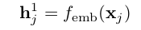

2. 根据 点 $\to$ 边公式得到边的向量: 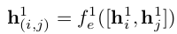

3. 根据 边 $\to$ 点公式得到边的向量 : 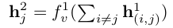

4. 根据 点 $\to$ 边公式再次得到边的向量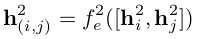
5. 利用边向量去进行softmax预测 :  $q_φ ( z_{ij} | x ) = softmax( h_{(i,j)}^2)$

##### 3.2.4 Sampling
这里用的技术是, 利用一个离散分布的连续近似 (a continuous approximation of the discrete distribution ) 去表达进行对于离散变量的采样.
这里的意思就是说, 在典型的VAE引用中, 采样是从一个连续分布中进行采样的, 而在这里使用的是softmax, 也就是一个离散分布, 那么也就没有办法采用 reparametrization trick 去对采样进行后向传播.那么这个时候我们可以用 <A Continuous Relaxation of Discrete Ran-
dom Variables.> 提到的一个方法去进行采样.
公式如下:
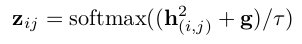
这个里面的 $g$ 采样于分布 $Gumbel(0,1)$, $τ$ 操纵的是采样的 "smoothness"(不懂).
最后产生的 $z_{ij}$ 向量是一个one-hot向量.

##### 3.2.5 Decoder
decoder中, 我们采用的输入有两个, 一个是隐含变量 $z$, 一个是初始的输入 $x^t$
我们的目的是 :
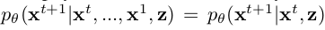
整个的推导过程是:
1. 由z,x到边 : 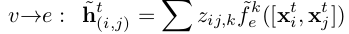

   这个里面z的每个类别对应着一个函数 $\bar{f}_e^k$

1. 由边到点 : 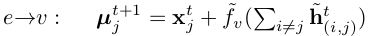

   注意, 这里在前面加上了 $x_j^t$, 以为着我们通过 $\bar{f}_v$ 学到的只是位移$\vartriangle x_j^t$ 而已.

1. 再采样 : 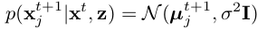

   这里的再采样对应的是队员采取动作的不确定性. 这里的方差是定值.

##### 3.2.6 Avoiding degenerate decoders

- **degenerate decoders 问题**

  对于最原始的 ELBO, 其中有一项是 :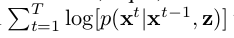

  如果我们对于 该项进行建模的方法只是**一个**深度模型的话, 就会出现decoder退化的问题.

  也就是说, 这中情况下, decoder会忽视 $z$ 的存在, 这个估计是作者实验的时候发现的问题.

- **对策**

  - 预测多步, 在这样的情况下, 忽略z的话,就会产生很大的误差.

    具体的就是, 对于 $x^t$ 进行一次预测后, 得到 $x^{t+1}$ . 再以这个 $x^{t+1}$ 为输入还是使用这次的参数进行下一步预测, 这样反复多步骤后, 累加误差.

  - 对每个z采用一个神经网络, 也就是上面的 $\bar{f}_e^k$

##### 3.2.7  Recurrent decoder

还是对于decoder的修改.

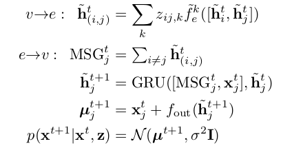

这里主要针对的是第二步, 也就是由边到点的改进.

其中的 $f_{out}$ 是一个MLP层.

但是如果用这个decoder去进行上面的多步预测的话还是有问题的. 需要再改进一下, 这里不赘述.

##### 3.2.8 Training

loss函数分为两部分, 一部分是 reconstruction error, 一部分是 KL 散度.

- **reconstruction error**

  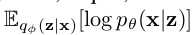

  T是指重复的步骤. j 是objective(篮球运动员).

  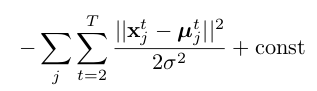

  其中的 $x_j^t$ 就是实际的下一步的位移.

- **KL 散度**

  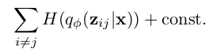

  这里直接用所有softmax中的概率的和来代替, 这里用到了蒙特卡罗方法的思想, 用多次采样去模仿概率.

### 5. Experiments

论文在三个系统上进行了实验.

分别是, 弹簧系统, 电子运动系统以及HASE耦合振荡器系统.

结果如下:

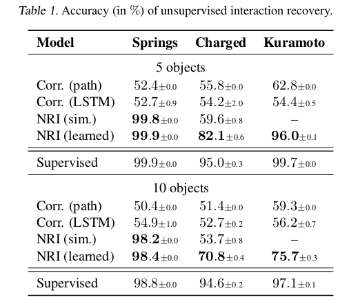

这个提升, 有点恐怖.
