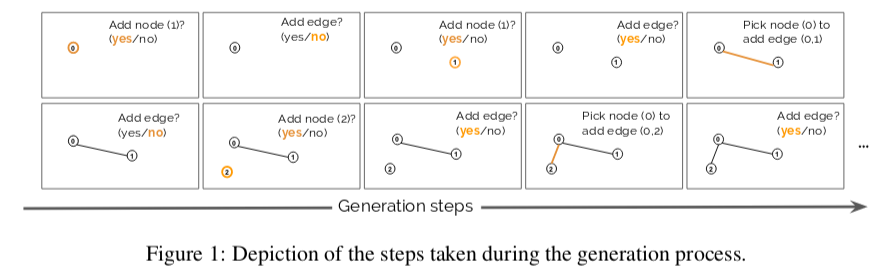
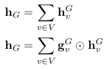
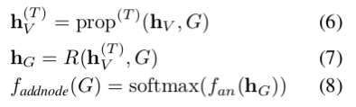
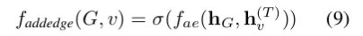
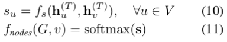
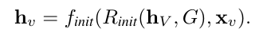
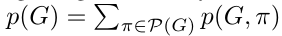
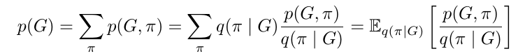
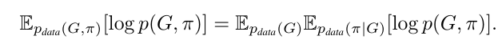

## LEARNING DEEP GENERATIVE MODELS OF GRAPHS

### 0. Abstract

是一种处理图结构数据的生成模型, 可以生成一些与原数据集中数据相近的sample.
比如说, 在生物关系中的drug discovery 和 知识图谱的构建.
生成模型的困难在于, 如何在生成过程中处理图的元素的对称结构以及顺序性.
本论文提出了一个可以生成任意网络结构的模型, 即具有很强灵活性的模型.

### 1. Introduction
- **图的结构特征**

- **应用**

  学习出自然语言基于图结构的语义表征需要对图的分布进行建模.

  图的分布可以给图模型的贝叶斯结构的学习以及应用提供先验.

- **图的概率模型**

  大致分为两种

  - **复杂网络**

    这一类主要集中于图的宏观性质, 可以分析出图的整体特性, 但是对局部不敏感. 可以处理社会网络等等, 但是无法处理分子网络和自然语言网络.

  - **graph grammer模型**

    使用了graph grammer的模型

    >  graph grammer是一种见乔木斯基文法应用到图上的文法, 有 
    >
    > <终端点,终端边,非终端点,非终端边, 生成规则, 开始图> 六个基本要素
    >
    > 可以像文法系统一样依据文法对图进行结构分析. 并且具有生成能力
    >
    > 详见 : http://www.its.caltech.edu/~matilde/GraphGrammarsLing.pdf

    Graph grammars are systems of rewrite rules that incrementally derive an output graph via a sequence of transformations of intermediate graph.

    这个方法有两个缺点:

    - 无法应用于无标注数据, 因为图文法中, rules是必须的.
    - 和线性的文法系统一样, graph grammars无法对什么是在语言中的,什么是不在的, 做出确定性判断.

- **本文目标**

  本文设计了一个可以处理没有任何先验的图的模型, 可以给任意图分配分布. 

  这个模型的生成方法和graph grammer有异曲同工之处, 都是在原先的图上逐渐增加边和点, 不过不同之处是这个不基于硬性的graph grammer的production rules.  处理的模型是基于图结构的神经网络的, 也就是说, 这里是用基于数据和图神经网络的学习来替代了graph grammer 中的先验rules.

  这里还介绍了几个利用图结构去解决图预测问题的论文.

  > Deep convolutional networks on graph-structured data.(2015)
  >
  > Convolutional networks on graphs for learning molecular fingerprints.(2015)
  >
  > Gated graph sequence neural networks.(2016)
  >
  > Interaction networks for learning about object. (2016)
  >
  > Semi-supervised classification with graph convolutional networks.(2016)
  >
  > Neural message passing for quantum chemistry.(2017)

- **实验**

  本文基于三个实验, 我只关注最后一个, conditional generation of parse trees.

### 2. Related work

这里介绍了一些用graph net去做生成任务的研究.

这里详细介绍了一篇论文, 这也是这篇论文的出发点.

>  Learning graphical state transitions. 
>
> 这篇论文大概看了一下, 是使用  Gated  Graph  Transformer  Neural  Network (Johnson)
>
> 这篇论文是采用文本作为输入, graph 是作为中间结构存在的, 在构建了图之后, 就对文本中的entity之间的关系进行建模, 可以用于推理任务.

而这篇文章是去学习和表示unconditional or conditional densities on a space of graphs given a representative sample of graph(不懂,等着看下文).

并且Johnson的这篇论文做了很强的假设:

- 假设每句话都有固定的节点数. 
- 在给定一批新的节点时, 边出现的概率是独立的.

并且还有一点不同是, Johnson中的边都是soft的, 而不是0/1, 我们的是稀疏离散的.

### 3. Model

#### 3.1 序列的图生成过程.

这里只是给出了一个非常抽象原始的生成过程.如下图:

这里把增加点的操作记作 $f_{addnode}$, 判断是否增加边的操作记作 $f_{addedge}$,  增加边的操作记作 $f_{node}$.

这里需要注意的非常重要的一点是, 

**node和edges生成的不同顺序对于决策的判断是不可缺少的**

直观理解就是, 如果node的生成顺序是 0-1-2 的情况和生成顺序是 1-2-0 的状态肯定不是一样的.

对于其中每个操作的建模, 论文中给的一个建议是, 将确定ordering的图视为一个自然语言的sequence, 然后使用LSTM去建模.

#### 3.2 基于图的信息更新和图的表征

- **图局部信息的更新和表征**

  下面是三个图中基本单元的信息更新(propagation).

  

  第一项, $m_{u\to v}$ 代表的是从点u到v的 message vector. 其中, $x_{u,v}$ 代表的是 edge $(u,v)$ 的向量. $h_i$ 代表的是第i个节点的向量.

  第二项, $a_v$ 代表的是与节点 v 相连的边的整合信息.

  第三项, 是将点v所连接边的整合信息  $a_v$ 和自身的 $h_v$ 结合后生成的新节点向量 $h'_v$

  在算法表示中, 我们使用 $h'_V=prop(h_V,G)$ 来表示接受一个 node embedding 的集合和他们之间的关系表征-图, 返回值是更新后的 点向量的集合, (注意这里的边向量并没有更新). 因此可以通过递归套用 $prop$ 函数来进行多次更新. 越多的更新次数使得模型具有更强的**容量(capacity)**.

- **图全局的更新和表征**

  下面是图整体状态的表征和更新.

  

  首先要注意这里的 $h_v^G$ 是将 $h_v$ 进行了维度扩展之后的结果. 原因是, 要对整个图进行加和的话, 原先的维度的表现力会不足.

  这里介绍了两种求图总体状态的方法, 一种是简单的加和. 一种是通过 gating network. 其中, 

  $g_v^G=\sigma(g_m(h_v))$ , 这里的 $\sigma$ 代表的是逻辑回归函数(因为是门操作). $g_m$ 是另外的映射函数. 例如在LSTM中就是和同一个维度的参数向量进行逐点相乘.

  在算法表示中, 把整个图的状态的更新称为 $h_G=R(h_V,G)$.

#### 3.3 结构构建决策的概率计算

- $f_{addnode}$

  这个是通过一下过程进行的.

  

  - 更新每个节点状态T次.
  - 更新全局状态
  - 将全局状态通过一个 MLP $f_{an}$ 处理后, 经过一个 $softmax$ 来进行判断是否加点会终止.

- $f_{addnode}(G,v)$

  更新 v. 公式如下, 这里的 $f_{ae}$ 用到了一哦新的 MLP.

  

- $f_{nodes}(G,v)$

  如果上面的 $f_{addnode}(G,v)$ 判断需要加边的话, 就需要这里去判断加什么边.

  

- **初始化新建的点**

  公式如下:

  

  其中 $h_V$ 是新的点, $R_{init}(h_V,G)$ 是一个更新一个新的图状态, $x_v$ 是一个新建点的所有的特征.

  $f_{init}$ 是一个MLP.

- **条件生成模型**

  这里的**条件**是强调: 在图的已知信息下根据新的信息去确定做出一个决策的概率.

  已知信息就是图的已有信息和各种MLP的信息, 新的信息就是 $x_t$, 决策就是加点加边这些.

  >  在本论文中, 只用到了 $f_n$ 和 $f_{init}$ 这两种MLP.

#### 3.4 Training and Evalution

对于一个确定graph的生成过程可以有多个, 分别对应着不同的ordering, 这里的ordering就成为 $\pi$.

那么对于生成模型就有一个联合分布概率, $p(G,\pi)$ , 这里的 $\pi$ 很像graph grammer里的 rules. 

用形式语言文法系统去理解的话, 可以理解为同一句话可以分解为不同的生成语法树(在有歧义的情况下).

那么, 边缘概率就是 :

但是这里很明显 $\pi$ 的种类随着图的增大成阶乘级增加, 计算出所有的联合概率是不现实的, 因此用重要性采样的思想去转换这个公式:

这里的 $q(G,\pi)$ 就是重要性采样的结果.

##### 3.4.1 Training

理论上的目标是最大化 $log\ p(G)$ , 但是由于这是不现实的我们采样上面提到的重要性分布进行训练, 需要最大化的目标公式如下:

这里的 $p_{data}(G,\pi)$ 中的 $\pi$ 是可以很容易获得的, 通过随即选择一些 permutation的结果.

但是在实际的训练过程中, 论文作者采用的是从均匀分布中生成的随机 $\pi$, 也就是对每个 G 随便选了一个顺序进行训练, 而把挑选合适的 $p_{data}(G,\pi)$ 作为之后的课题. 这是很重要的.然后这个地方, 文章还提到了几个用于计算permutation分布的论文.有兴趣可以看看.

### 4. Experiments

#### 4.3 Parse Tree Generation

这里训练时 ordering是按照数据库中树的从上到下,深度优先的顺序来的.

这个任务的操作与定义的有所不同, 在 $f_{addedge}$ 的过程中, 需要先选择一個node作为父节点, 然后再增加一个节点, 增加一条边这个样子.

这里还使用attention机制去获得更好的条件信息.