## Towards Optimal Transport with Global Invariances

### 1. Introduction

#### 1.1 Background

- Limited definition 

  Optimal transport provide a well-founded, geometrically driven approach to realizing **correspondence between two sets of objects** such as shapes in different images. 

- General definition 

  Can be extend to **domain adaptation** 

- Focus:

  Our focus in this paper is on the **optimal coupling mediating the transport**

#### 1.2 Questions1 - locally greedy

- 传统的 OT 问题 的一个缺陷, 其是对于两个sets的空间的假设太强:
  - 问题中的两个sets都是存在于同一种空间之中的
  - 或者, 其假设至少跨 space 之间的 pairwise distance 是可以计算的. 

- **举个例子:**

  - 例子1 :

    在词向量中, 对于使用**两个方法编码的** 甚至是 **一个方法的不同迭代** 后的 两组vectors, 其两个空间可以是任意翻转(扭曲?)的. 这样, 我们无法去计算两次训练结果之间 某对词汇对之间的距离. 

  - 例子2:

    更简单的例子, 我们先随便得到一个 distribution , 然后将其在其所在空间旋转一个度数, 而仅仅是这个问题, 我们就无法解决. 

  ​

- **导致的问题:**

  这个地方太棒了!!!!!! 注意注意注意!!!!!!!!!!!!!!!!!!!!!!!!!!!!!!!!!!!!!

  - 在真实的问题中, 两个空间往往是不处于一个空间中的. 但是传统的OT问题中, 两个pile(分布) 是处于同一个空间, 且其之间的距离是可以被标度的. 因此, 我们无法使用传统的方法去做到这一点. 

  - 使得其只注重 Individual mass 的转换 , 而忽略了全局的 transformation. 

    > 关于这里 Individual mass 的定义, 可以想想最初1871年的定义. 

#### 1.3 Question2 - Unknown Transformation 

- 如果在 transformation 是已经知道的情况下, 问题是比较好解决的. 
- 而在如今的研究中, 只有 rotation 是已经被研究到的. 

#### 1.4 Task

我们希望能够找到一种能够找到 optimal coupling(最佳耦合) 的 latent transformation 形式的. 

> We would intuitively like the optimal transport problem to also solve for the best latent transformation together with the optimal coupling.

也就是说, 希望能找到一种适应于全局的 optimal transport formulation. 

#### 1.5 Methods

- 提供了一种 离散最佳运输问题的一般化的解决方案, 可以让 transformation 具有全局不变性. 

- 针对的目标问题是 :

   rigid transformations of euclidean space (欧几里得空间的刚性转换)

  > [刚性转换 (rigid transformation)](https://mathbitsnotebook.com/Geometry/Transformations/TRRigidTransformations.html)
  >
  > A rigid transformation (also called an isometry) is a transformation of the plane that preserves length.  **Reflections, translations,  rotations**, and combinations of these three transformations are "rigid transformations".

- 提出了一个具有一般性的框架, 并且整合了一些使用 global transformation 的先行研究:

  - Procrustes mappings 
  - Gromov-Wasserstein distance

#### 1.6 contributions

- 对离散形式的最佳运输问题进行了修改 , 推广到了具有全局不变性的 global geometric transformations
- 设计了一种针对刚性转换的有效的算法. 
- 对 unsupervised word alignment 问题, 提出了一个框架. 

### 2 Related work

#### 2.1 History

这个问题有很多其他的名称:

- manifold alignment :

  Manifold alignment without correspondence

- feature set matching:

  The pyramid match kernel: Discriminative classification with sets of image features.

- feature correspondence finding

#### 2.2 Soft correspondences

Optimal transport 问题有两种形式, 一种是1871年的 hard version, transport matrix 是一个矩阵, 可以实现两个概率空间的转换 : $\Omega \to \Omega$. 

而在后面又有了一个 soft version, 变成了两个概率空间上的有基于概率的转换 : $P(\Omega \to \Omega)$

#### 2.3 Related work

- 结合 optimal transport distances 和 Procrustes alignment 去找到两个 word embedding  space 之间的最佳匹配. 

  > Earth Mover’s Distance Minimization for Unsupervised Bilingual Lexicon Induction

  - 相比于这个研究的改进点:
    - 通过使用一个小问题去启动的方法, 避免使用神经网络去进行初始化. 
    - 通过熵正则化进行退火实现了smooth convergence. 

- 还有一个类似的研究是 :

  > Unsupervised Alignment of Embeddings with Wasserstein Procrustes.

#### 2.4 Unique

- 本研究为更一般的问题提供了解决方法. (之前的研究都是研究正交不变性)
-  通过引入凸退火优化方法，我们省去了任何自组织初始化的需要。 
- Our approach remains robust to the choice of entropy regularization parameter λ. 

#### 2.5 Gromov-Wasserstein distance

> Gromov–Wasserstein distances and the metric approach to object matching. 2011

这也是一篇很有名的论文. 很有必要读. 

##### 1) Gromov–Wasserstein distances

与 classical optimal transport problem 的区别:

Optimal transport problem : 需要两个空间进行完全的匹配. 

Gromov–Wasserstein distances : 完全放弃了 两个空间之间距离的显式地计算. 而使用内空间的相似度进行代替. 

##### 2) 目的

可以 address **lack of intrinsic correspondence** between the spaces

##### 3) 与本文关系 

本文提出的方法是一个 classical optimal transport problem 与 Gromov–Wasserstein distances 折中的方法. 

### 3. Motivation: Correspondences between feature spaces

#### 3.1 问题设定

现在的问题是求两个点集的对应关系 : $\mathcal{X} \to \mathcal{Y}$ 

但是我们没有任何已知的对应数据, 也就是说这是一个无监督学习的问题.  关于数据的更详细的定义如下:

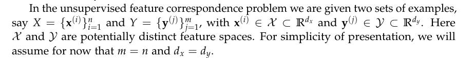

现在在这个设定下有两个子问题:

1. Finding correspondences between the items in X and Y. 只需要找到X和Y中点的对应关系, 是一个离散的问题. 
2. Finding a global correspondence of spaces X and Y . 找到两个空间的整体对应关系. 

下面分开将和这两个问题相关的先行研究以及方法. 

#### 3.2 Space alignment from paired samples

这个问题中, 通常是知道一些数据对的, 即是**监督学习问题**. 假设, 这些监督数据的矩阵分别为 X 和 Y. 那我们的目标就是找一个转换函数 T 使得 :

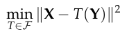

这里的 norm 的计算方法是:

其中, $\mathcal{F}$ 是 T 所代表的函数族, 对于问题的难度以及对齐的质量非常重要. 

一个很经典的假设是使用线性的转换函数. 即:

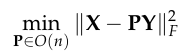

这里的 P 将转换限制在了翻转以及反射上. 

这个问题叫做 Orthogonal Procrustes problem. 简单来说就是:

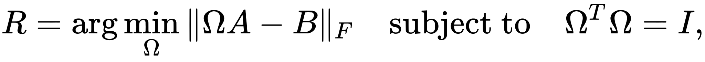

具体见[维基百科](https://en.wikipedia.org/wiki/Orthogonal_Procrustes_problem)

#### 3.3 Finding correspondences between aligned spaces 

##### 1) Hard problem

接下来是一个对两个空间进行对称的方法. 

首先我们知道最有运输问题针对的是 两个经验分布空间的 最佳搬运问题. 两个经验分布的表示方法为:

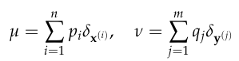

- 离散的原始定义是(本文中定义):

  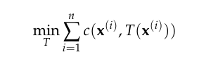

- 连续的原始定义是(其他书中定义):

  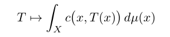

  这里的标记由于不是一本书里面的, 所以两个式子有所不同, 但是大致是可以看出来的. 

##### 2) Soft problem

这个有可能无解, 并且就算有解也会是 NP 难问题, 所以为了软化这个问题, 又有了一个松弛版本的问题. 首先定义了一个联合分布:

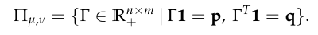

下面是 最小化目标: 

- 离散的原始定义是(本文中定义):

  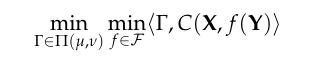

  > 这里的括号代表的Frobenius inner product操作:
  >
  > 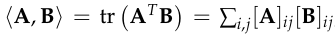
  >
  > 其实就是先 element-wise product -> sum 的复合函数而已. 

- 连续的原始定义是(其他书中定义):

  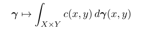

可以看到, soft与hard问题形式的不同在于, soft的形式中, 每个 x 都对应了一个分布, 而hard中, 每个x 都只对应了一个值 $T(x)$.  soft 可以对应分布的原因是, 其假设了一个 x,y 的联合分布, 直观印象如下:

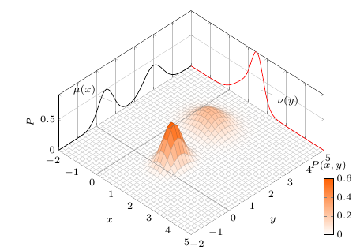

###### 解决方案及存在的问题

这个问题是一个 线性规划问题 ( **DOT问题** ), 可以在 $O(n^3 \log n)$ 下解决, 有很多解决方案, 这里的一个推荐是, 使用熵平滑 (entropic smoothing) 的方法 . 

> 关于这个方法更详细的论文如下:
>
> M. Cuturi. Sinkhorn distances: Lightspeed computation of optimal transport. In Advances in Neural Information Processing Systems, pages 1–9, 2013.
>
> G. Peyré and M. Cuturi. Computational Optimal Transport. Technical report, 2018. URL
> http://arxiv.org/abs/1803.00567.

虽然 DOT 问题就是为了解决 非监督学习问题而生的. 但是, 其还是很难在没有先验知识(即监督数据)的基础上进行对齐的, 问题在于 : **there is no guarantee that their coordinate axes are consistent with each other.** 

也就是说, 两个space中的点的位置都不是绝对的, 只有他们之间的相互距离是有关系的, 因此计算两个空间之间的距离是没有意义的, 我们无法保证两个空间之间的轴是彼此一致, 甚至不能保证其坐标轴是可以通过正交变换转变的. 

##### 3) Duality formula

这里是连续的形式. 其与正常问题的对应关系是:

也就是说, 这里用 $\varphi(x),\psi(y)$ 来分解了 联合分布 $$\gamma(x,y)$$. 

##### 4) 需要解决的问题

总结上面两个问题的缺点, 我们知道了:

我们需要找一个方法可以实现两个空间的整体的变化. (变换的方法限制在一个函数族里, 虽然可能不是线性变化, 但是本篇文章中限定的线性变换)

### 4. Scheme of problem and optimization

#### 4.1 问题设定

接下来就要开始解决问题, 这里先对要解决的问题进行说明.

这里处理的不是最一般的函数族问题, 而是简单的线性转换, 即假定两个 spaces 的坐标系之间有旋转关系. 

首先, 一般化的问题定义如下:

> 对这个式子的理解, 这里使用的是 离散的方式. 

这篇论文中, 集中于线性算子的问题, 即转换函数族是线性函数:

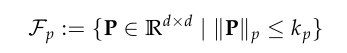

这里我们可以通过设置不同的 小p 来达到对 大P 的不同限制.  (求 Schatten l-p -norm) 的操作仅仅出现在上面的限制大小的过程, 计算cost的过程使用的是 L-2 norm. 

#### 4.2 不同的范数

具体的不同的 p 代表的不同的意思, 见下面的章节. 

- choosing p = 1 encourages solutions with sparse spectra

- choosing  p = ∞ instead seeks solutions with uniform spectra

- Intermediate values of p interpolate between these two extremes.

  - p = 2, recovers a recent popular generalization of the optimal transport problem motivated by a similar goal:  **the Gromov-Wasserstein distance** 

  > F. Mémoli. Gromov–Wasserstein distances and the metric approach to object matching. Foundations of computational mathematics, 11(4):417–487, 2011.

#### 4.3 Cost metric c

两个空间之间的 距离计算 metric 是 $c(x,y)=||x-y||_2^2$

#### 4.4 优化

##### 1) 结果

这样, 我们就有了计算下面这个式子的全部要素:

然后呢, 论文中说上面这个式子就可以**很!明!!显!!!**地转换为这个式子, 给他一个黑人问号脸(自己太差没办法)

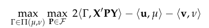

> 这里的 $\langle \Gamma,X'PY \rangle=\langle X\Gamma, PY \rangle$ 

##### 2) 如何得到

那么就来太极式分析看看:

- $\text{u},\text{v}$ : 代表的是向量, 其中 $u_i=||\text{x}^{(i)}||_2^2,v_i=||\text{Py}^{(i)}||_2^2$

- $\mu,\nu$ : 回顾前面经验分布的定义

  

- 这里好像就是简单的二次展开, $C(X,f(Y))=||X-PY||^2_2=X^2-2XPY+Y^2$ 

  然后因为 Frobenius inner product 有如下性质:

  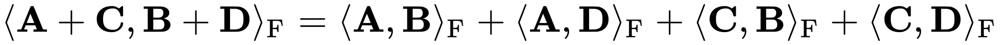

  所以可以展开为这个式子

##### 3) 分析

- 前面的一项 $\langle \Gamma,X'PY \rangle=\langle X\Gamma, PY \rangle$ 中的 $X\Gamma$ 是指 把X通过搬运后的结果, 而PY是将Y进行转换后的目标分布空间. 我们的目标就是让 这两者能尽量一致. 

- 后面的两项其实是, 两个经验分布的期望值:

  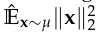 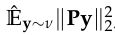

##### 4) 优化

这个式子中, 在 $P,\Gamma$ 任意的一个参数固定的情况下, 关于另外一个参数都是一个凸优化问题, 因此可以使用迭代优化的方法去进行全局优化. 

- 在 $\Gamma$ 不固定, $P$ 固定的情况下, 去优化 $\Gamma$ 就是一个典型的 OT 问题. 优化在 4.4 节中将

- 在 $\Gamma$ 固定, $P$ 不固定的情况下, 去优化 $P$ 就是一个凸优化问题, 并且这里还有对 Schatten p-norm 的设定. 这里使用的算法是 : Frank-Wolfe-type algorithms

  > M. Jaggi. Revisiting frank-wolfe: Projection-free sparse convex optimization. In Proceedings of the 30th International Conference on Machine Learning, 2013.

##### 5) 更多内容

###### Lemma 1

具体的优化方面, 文章中指出

这个式子中, 每一项都依赖 $\Gamma$, 其中只有第一,三项依赖于 $P$, 但是实际上是可以根据下面的这个lemma去把最后一项对 P 的依赖去掉, 这样我们在 $\Gamma$ 固定, $P$ 不固定的情况下的优化就变成了线性.  具体证明见附录.

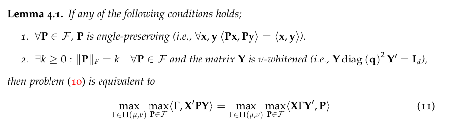

注释 : 这里的 whitened 的 白化 的意思, 就是消除数据中各维度的相关性和使各位具有相同的方差, 也就是对应着一个旋转和伸缩的操作. 

###### Lemma 2

这个是真的看不懂. 

其作用有:

- For a fixed $Γ$, we can use Lemma 4.2 to obtain a closed-from solution P*.
- On the other hand, for a fixed P, optimizing Γ yields a classic discrete optimal transport problem with a cost matrix $\hat{C} = −X'PY$.

### 5. Concrete sitution

#### 5.1 Case P=无穷

#### 5.2 Case P=2

#### 5.3 Case P=1

#### 5.4 Optimization

##### 0) 优化目标式子

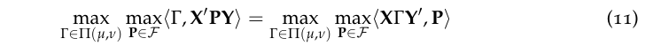

##### 1) $\Gamma$ 固定, P 不固定

用 4.4.5 的 lemma2 去解决. 

有一个 closed-form 的解.

##### 2) $\Gamma$ 不固定, P 固定 

最笨的方法是使用线性规划的方法去解决那个问题, 但是, 还是不够好, 因为

- $O(N^3),N=n*m$. 
- 真正的对称关系并不是一对一的关系, 很可能是 one-to-many 的关系. 也就是说我们需要一个较为 soft 的corresponding关系. 

引出了上面提到过的 熵平滑 算法(Sinkhorn-Knopp algorithm ), 论文如下:

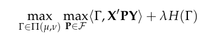

> M. Cuturi. Sinkhorn distances: Lightspeed computation of optimal transport. In Advances
> in Neural Information Processing Systems, pages 1–9, 2013.

其他的一些优化上的诀窍: 使用近似算法

e-approximate solution 和 Inexact alternating minimization methods  :

> J. Altschuler, J. Weed, and P. Rigollet. Near-linear time approximation algorithms for
> optimal transport via Sinkhorn iteration. 
>
> J. Eckstein and W. Yao. Approximate admm algorithms derived from lagrangian splitting.
> Computational Optimization and Applications

##### 3) 其他方面

- 初始化很重要:

  > M. Hardt. Understanding alternating minimization for matrix completion. 

- 还有很多其他kotu, 具体用时具体看吧

