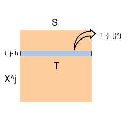

#### 1. What is the task tackled in this paper?

- entity alignment

#### 2. What is the research question in this paper?

- Previous work has too hard constraints on the tranformation mapping. 
- Previous work can only use the alignment information of two-graphs, cannot make full use of multi-graphs(>2).
- High cost when aligning between N graphs, in which order is O(N!).

#### 3. How to solve it/what is the approach of this paper?

##### 1) Model framework

The framework of model is still be a joint model of two parts : 

- relational inference model : Regard as a controlled variable. We will use TransE. 
- Alignment model : release hard constraints, such as linear transformation and translation constraint, to soft constraints -  **nonlinear continuous mapping function**. 

##### 2) Nonlinear continuous mapping function 

- **What is it?**

  It is the mapping between embedding spaces. It can be in two forms:

  -  **Wasserstein transport mapping matrix**  :  $T\in \mathbb{R}^{m*n}$ ,   which $\mathcal{X}=(x_1,...,x_m)\in \Omega^m, \mathcal{Y}=(y_1,...,y_n)\in \Omega^n$ and $T(\mathcal{X})=\mathcal{Y}$. 
  - **Global correspondence** of spaces $\mathcal{X}$ and $\mathcal{Y}$ , which is a function $f:\mathcal{X}\to \mathcal{Y}$

  > Notes : We will use the first notation to explain the plan below. 

- **What constraints conditions should it satisify?** 

  Mapping must be **continuous and nonlinear** with respect to its space metric.

  (In other words, Continuous mapping between two spaces, maybe homeomorphism?)

- **What is it used for?**

  It is a part of Wasserstein metric, which is known as :
  $$
  \inf_{T}\int_{\Omega} c(x,T(x))\mu(dx)
  $$

- **How to optimize nonlinear continuous mapping function ?** 

  Regards as a optimal transportation problem. 

##### 3) Use it in entity alignment task 

  - **Training process:**

    - Wasserstein metric when align **two graph embedding spaces** with alignment pair $(x_i,y_j)$

      - Simplily use Wasserstein distance as loss function. 

      - The transport mapping should satisfy the **constraint** (the most difficult one) below: 

        $T(x_i, y_j)=\sum_k^n T(x_i, y_k)$ 		$ (x_i\in \mathbb{R}^{m}, y_j\in \mathbb{R}^{n})$

    - Wasserstein metric among **multi-graph embedding spaces** with alignment list $(x_{i_1}^1,...,x_{i_k}^k)$: 

      - Firstly, Calculate the Wasserstein barycenter $S\in \Omega^x$ of n graph embedding spaces .

      - Secondly, The transport mapping should satisfy the **constraint** below: 

        Each entity in alignment list $(x_{i_1}^1,...,x_{i_k}^k)$ has a coresponding distribution $P_{i_j}^j$ which is the $i_j$-th row $T_{i_j}^j$ of transport mapping matrix  $T^j$  between graph embedding space $X^j$ and barycenter $S$. 

        We note it as $(P_{i_1}^1,...,P_{i_k}^k)$.  We need all the distributions in this list to be same. 

        > Notes :
        >
        > 1.  $P_{i_j}^j$ and $T_{i_j}^j$ is same here. 
        >
        > 2. Shown in graph:
        >
        >    

- **Predicting process:**

  Predict in the way we trained it on different problems (Two graphs and N-graphs). 

  ​

#### 4. Summary & Questions

##### 1) Questions

- How do you think about this plan, even it's only theoretical and not concrete now?
- **Just an opinion**: I think it may be unsatisfactory of using Wasserstein distance as alignment loss function. Because it only has very weak constraint on embedding space.

##### 2) Summary

- It's a joint model, because alignment loss is related to relational inference loss.
- I think using the first and second items (in section2) as motivations is better than high computation cost deficiency.
- Anyway, The next step is to find the optimization method and do an experiment to verify the effect. 

