## GCN 在 SRL 中的应用

### 1. Introduction

#### 1.1 SRL

Semantic role labeling 是用来发觉一个句子中的语义关系的. 简单来说就是将句子转换为逻辑形式. 如下图:

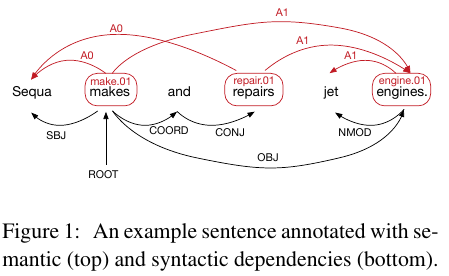

主要功能有:

- 检测谓词项
- 从一个词汇的多词义中选择一个进行标注, 如 make.01
- 找到谓词的参数信息. 比如 Sequa 就是 make.01 的主语, 是一个参数

IE 和 QA 是他的 downstream 任务.

#### 1.2 Motivation

如今做SRL大致有两种方法

- 基于语法树分析的, 因为语法树解析本身和这个就是大同小异
- 基于 sequential neural model (LSTM) , 没有使用语法树信息, 这个最新的模型获得了SoTA. 

但是之所以 LSTM 没有用语法信息, 是因为其无法处理树结构信息.  这个就是本文的出发点.

> 题外话, 利用树状甚至图状 LSTM 的论文也有不少, 详情见 
>
> - [论文笔记]:Graph-LSTM用于跨句间关系抽取
>
> - [论文笔记]: 跨句间关系抽取的远程监督

#### 1.3 本文贡献

##### 1) 关于使用网络模型的改进

这里使用的是 GCN (Graph neural network), 就是 GNN 的一种特殊模式, 是如今被证明最有效的 GNN 模型之一. (基本现在提到 GNN 都是用这个.)

- 以往的多是用于 无label无向图, 这里将其拓展到 有label有向图.
- 在 LSTM 层上 stack 一个 GCN 层后, 得到了一个特别好的效果. 
- 相比于  recursive neural networks 而言, GCN 没有将将结构限制到树上, 因此可以将多个句子甚至文档的信息进行enconder.

##### 2) 本文贡献

- show(并非证明) GCN 在 NLP 中有用.
- 设计了一系列可用于编码 word level 的语义信息的 GCN 模型.
- 利用 GCN-based SRL 模型获得 SoTA.
- show LSTMs 和 GCNs 有互补能力 (这一点看起来挺有意思)

### 2. Graph Convolutional Networks

这个GCN模型的原论文笔记见 : [论文笔记] : Graph Convolutional Networks

尽管原论文出自 ICLR 看起来很厉害(因为我现在还没有具体看). 但是这篇文章中介绍的方法是相当简单的. 

#### 2.1 模型简介

这里的模型的输入是一个语义结构树, 或者是这里的SRL 结构. 

这里只考虑一个两层的结构:

- 第一层 : 与node 1相连的点假设有 (2, 2).  这三个点的向量分别设为 $x_1^{0},x_2^{0},x_3^{0}$ . 那么, 将 (a1, a2) 的初始向量各自经过一个该层的非线性转换, 并且这个非线性变换层是和这相邻点之间的关系决定的, 例如 subj 关系的两个点, 用的就是 subj 特定的一个线性转换层:

  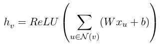

  这样就得到了新的向量, $x_1^{1},x_2^{1},x_3^{1}$

- 第二层和第一层处理关系是一模一样的, 仅仅是输入和参数进行了变换. 得到 $x_1^{2},x_2^{2},x_3^{2}$.

  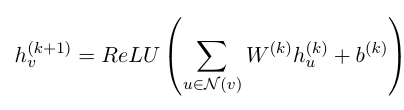

详见下图:

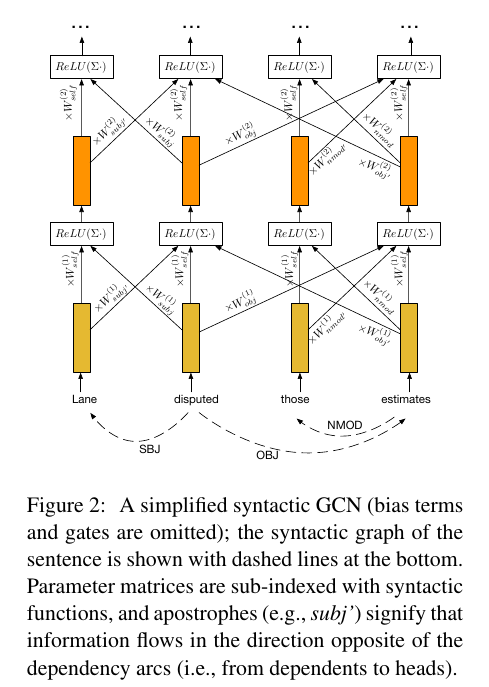

#### 2.2 GCN 和 GNN 的区别

这个模型和 GNN 没什么本质的区别. 上一个我画的图:

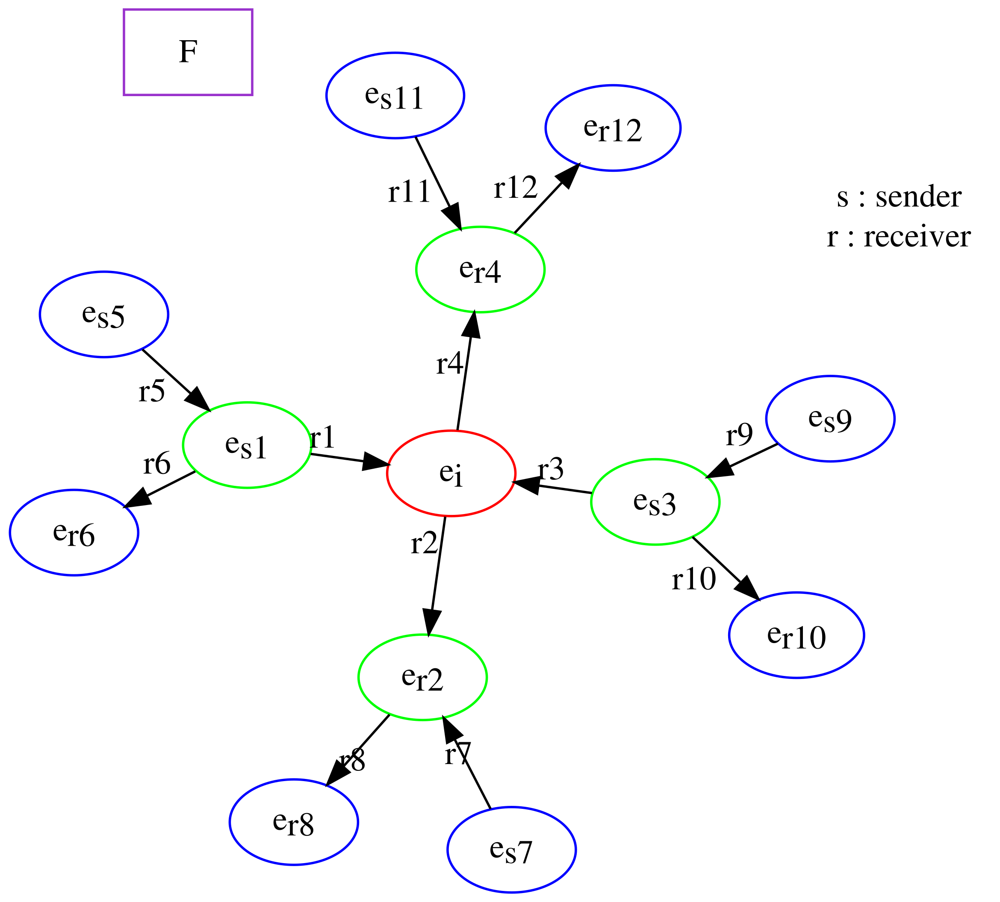

就是从外向里利用邻接节点的信息, 不停地聚集信息, 向外扩的层数就是用 GNN 的距离参数. 

但是在这里有一个特点是, 一个点所在层数是固定的, 也就是说 以目标节点为中心, 与其相距n距离的节点也只是在第n层的信息传递中被利用了而已. 而 GCN 是不一样的, 图示已经在2.1介绍过了.

可以看到这个模型中, Lane和disputed 相连的信息不仅仅在第一层被利用到, 在第二层中也被利用到了. 

### 3. Syntactic GCNs

#### 3.1 Incorporating directions and labels

这一节就是说怎么将句法树的结构引入GCN, 我估计这个作者之前看的是关于 图像 的GCN 的论文. 但是实际上, 在GNN对于知识图谱的应用中, 这是很基本的一项, 根本不能称得上是改进. 反正就是说:

- 对边赋予方向后, 一个节点对互有关系, 例如上面的例子中, (Sequa, makes)既有关系, (makes, Sequa)也有关系. 
- 关系是有label的. (Sequa, makes) 的 label 是 *subj*, (makes, Sequa) 的 label 是 *subj'*

那么 

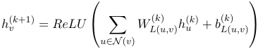

不过这个只是 GCN 中信息传递的基本模型. 下面还有进行一个改进.

#### 3.2 Edge-wise gating

我们刚才的分析全部是基于依存语法树, 但是现在依存关系的解析也还远远不是完美的. 更别说是在其他的训练任务集上. 

因此这里使用了一个将这种误差降低的方法 - 加权, 这个权重为:

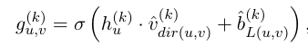

>  这里的根据是:
>
> Aäron van den Oord, Nal Kalchbrenner, Lasse Espeholt, Koray Kavukcuoglu, Oriol Vinyals, and Alex Graves. 2016. **Conditional image generation with PixelCNN decoders**. In Proceedings of NIPS.
>
> Yann N. Dauphin, Angela Fan, Michael Auli, and David Grangier. 2016. **Language modeling with gated convolutional networks**.

最后的结果就是:

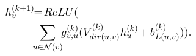

#### 3.3 Complementarity of GCNs and LSTMs

GCNs 和 LSTMs 的相互补充

##### 1) 需要解决问题

只有 GCNs 的话, 会出现无法爬取长距离关系的问题. 因为有很多 SRL 的关系是需要长依存距离去识别的. 因此需要一种可以引进长距离的编码方式. 

##### 2) 解决方法

将上面的输入从单词向量换为经过 LSTMs 处理的输出向量. 结构如下, 也很简单:

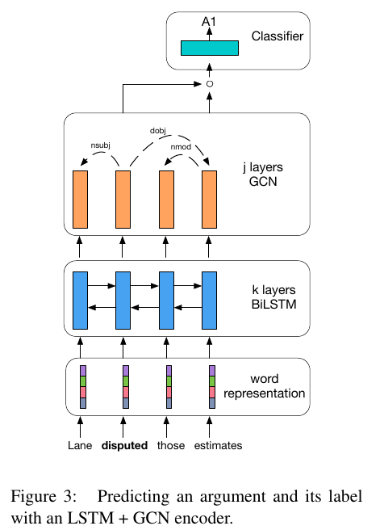

##### 3) 分析

为什么这样能行呢?

LSTM对于很远距离的关系的获取并不好, 这里给出的一个分界线是 5. 但是我不知道他是怎么得到这个的. 但是这里提到了一个论文, 这里嵌入一个子论文笔记, 见论文笔记 : [论文笔记]LSTMs学习语法能力的分析

总而言之, 这里需要知道的就是, 长度越长, 其效果越差.

这里给的数据是, 20%en,30%ch的SRL关系都是远于5的, 但是在上面加一层GCN后, 这个比例将会shrink到9%en,13%ch. 因此, GCN可以帮助进行这种距离的减缩. 

### 4. Syntax-Aware Neural SRL Encoder

模型细节

#### 4.0 Disambiguation

先对谓词进行标注:

make -> make.01

#### 4.1 Word representations

由四部分组成 : 

- random部分 (fine-tuned )
- pre-train部分 (fixed)
- 词性部分 (fine-tuned )
- 词元(lemma)部分 (fine-tuned )

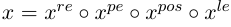

#### 4.2/3/4 BiLSTM+GCN+classifier

这里使用的是, 2017年在SRL上的SoTA., 不详细介绍了

回归是简单的逻辑回归:

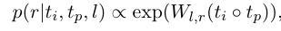

$t_i$ 是经过全部编码后的目标词汇embedding.

$t_p$ 是经过全部编码后谓词词元(lemma) 的embedding.

### 5. Experiment

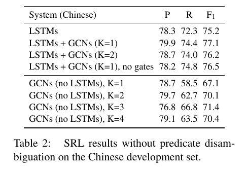

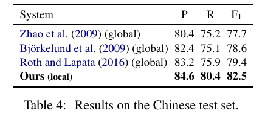

