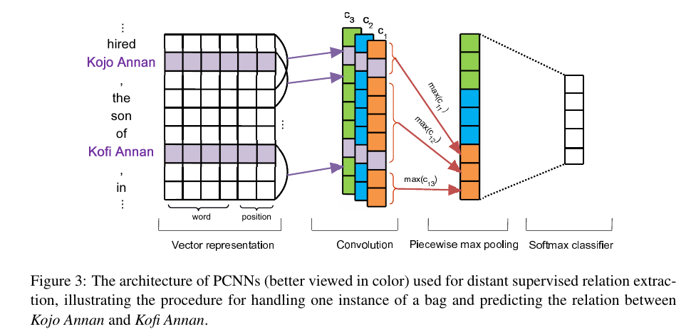
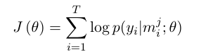
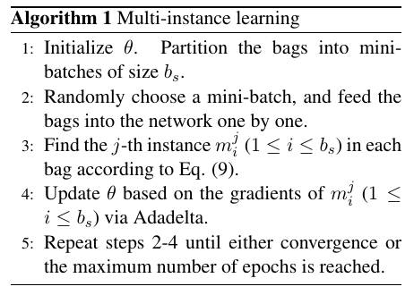

## Distant Supervision for Relation Extraction via Piecewise Convolutional Neural Networks

### 1. Introduction

在这篇论文之前, 进行关系抽出的方法主要是, distant supervision + 使用特征工程的抽出. 但是这者都有很大的缺点.

- Distant supervision:

  含有大量 wrong instance

- 特征工程

  含有主观性以及错误率, 如使用pos tagging的工具的话, pos tagging 工具本身的误差也会给模型带来误差, 而这个误差是随着使用特征工具的个数指数上升的.

针对这两个问题, 论文提出了两个方法去应对:

- Distant supervision 的问题:

  使用了 multi-instance learning 的方法去解决. multi-instance就是从待选实例中, 进行筛选, 只选择可能性高的例子进行模型的训练.

- 特征工程的问题:

  使用CNN结构的模型去自动提取特征, 避免使用额外特征. 

  这里的pooling层使用的是maxpool, 但是这里使用了Piecewise Max Pooling 也就是分段 max pooling.

  原因在于, 之前的基于工程的方法其实也对不同位置的词汇使用了不同的特征提取方法,这里作者也是借鉴了他们的手法, 将一个句子分为三个部分去进行特征特取, 两个entity周围的词汇算两个, 两者中间的词汇也算一个, 一共三个.

### 2. Methodology	

模型大致如下图所示:

#### 2.1 Vector representation

这里不单单是使用了词向量, 还使用了这个单词在句子中与两个实体之间的位置关系 $PF_1, PF_2$.

将词向量和位置向量进行毗连(concatenation)后得到的向量当作输入向量. 在这个图中, 词向量的维度是4, 位置向量均为1, 因为有两个位置向量所以最终的向量长度是 4+1+1=6.

#### 2.2 卷积层

很常规的卷积层.

使用了多个卷子算子对应着多个自动特征提取方案.

#### 2.3 Piecewise Max Pooling

使用了分段式的max pooling, 从每个特征向量矩阵中抽出三个部分. 然后从每部分的vectors中, max 出最大的一个vector作为该特征的该部分的代表特征, 最后将所有特征的所有部分的代表特征进行毗连, 得到了softmax的输入.

看图其实最容易明白.

#### 2.4  Softmax Output 

常规softmax层.

#### 2.5  Multi-instance Learning

上面虽然讲了整个模型,但是没有将损失函数, 这一部分就是将模型的损失函数的部分的.

这里是这篇文章中最有想法的地方, 但是感觉其中有很多问题.

- **符号定义**

  这里要解决的问题就是前面提到的 远距离监督 的 wrong label 问题. 这里的做法是, 对于预测关系为 $l_i$ 的 instances, 只从中选择确信度最大的一个用于训练. 严谨的表达为:

  设上面的模型为 $f$,  那么有 $f(m_i^j|\theta)=y$, 这里的 $m_i^j$ 为训练集中已知关系为 i 的第 j 个实例.  $\theta$ 是模型的所有参数.

  这里设 所有关系的总数组成的集合为 $T$, 其中 $T={M_1,M_2,...,M_T}$, $M_i$ 是关系为 $i$ 的所有实例, 而:

  $M_i={m_i^1,m_i^2,...,m_i^{q_i}}$, 其中 $q_i$ 是这个类别中的实例的个数.

- **挑选可用实例**

  而我们要做的就是从mini-batch中选出我们要找的实例, 找的方法是:

  

- **损失函数**

  然后利用这些实例去得到交叉熵损失函数.

  

- **总结一下算法**

  

### 3. 我的一些想法

看完这个论文后第一个想法是这个怎么work?

从每个关系只选择一个实例的话, 那到最后岂不是只会根据这一个实例进行训练, 那么训练的就不是这个关系的信息, 而成为了偏重与这个关系下的某个实例句子.

但是转念一想, 通过 mini-batch, 这个说不定成为优点. 因为首先 mini-batch的出现保证了每次不可能是同一个instance当选这个其类别下的代表instance. 

接下来, 如果拥有相同标签的实例集看作一个整体, 那么统计这个实例集中的所有信息, 那么我们知道与这个关系本身无关的信息我们可以称之为噪声, **假设**噪声是随机的, 那么通过mini-batch去进行的挑选反而可以平衡噪声, 突出我们需要的关系信息.

注意, 我们上面用了一个**假设**, 假设噪声是随机的, 但是如果不是随机的, 比如说, 史蒂芬和apple之间确实存在 (创建者-公司) 之间的关系, 但是他们在自然语料中还可以体现拥有很多别的关系, 比如 (服务于) 等等, 这些信息是无法被平衡掉的, 这样考虑, 这个模型是有问题. 

