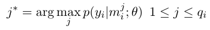
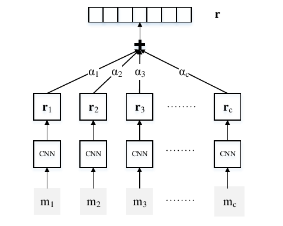
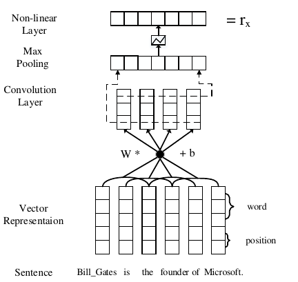
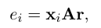
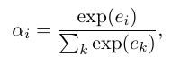
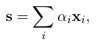
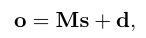
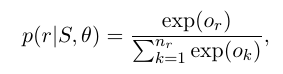
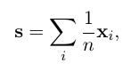
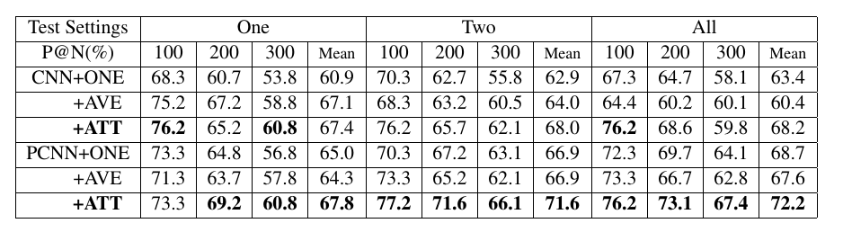

## Neural Relation Extraction with Selective Attention over Instances

### 1. Introduction 

这篇文章主要是基于之前的2015的文章进行的改进.

文章首先介绍了很多被淘汰的研究, 最后说道, 2015的 multi-learning 文是很好, 但是由于每次 mini-batch 每个类别只利用了一个实例, 浪费了很多的信息.

这篇文章中, 作者提出了一个 sentence-level attention-based convolutional neural network.

思想其实很简单, 在上一篇文章中, 我们知道了他们选择可以用来训练的实例的方法是:

也就是根据模型的结果, 选择出确信度最高的一个例子作为这个关系类型进行本次mini-batch 梯度下降的基础. 损失函数如下:

而这个模型的方法是, 并非是N中选一个, 而是**对N个句子都进行训练后的结果进行加权和**.

模型图示如下:

$r_i$ 是每个句子在当前模型上预测出的关系类型softmax向量, 其和为1.

$\alpha_i$ 就是attention机制分配给这个句子的可信度值.

### 2. Methodolgy

模型由两个部分组成. 

- Sentence encoder

  这个 encoder 就是将句子的信息转换为对关系类型的预测向量 $r_x$, 这个和2015年论文中的encoder模型是一样的.

- Selective Attention over instances.

  这个是这篇论文的出发点, 即分配给每个句子 attention 值.

#### 2.1 Sentence encoder

模型如下:

这里其实还稍微有些复杂, 但是和上一篇文章中encoder的结构完全一样, 因此不赘述.

#### 2.2 Selective Attention over instances

其实这里就是一个设定 **损失函数** 的过程

##### 2.2.1 Notation

这里当作字典查看就好, 不要一开始尝试去理解这里.

- $x_i$ : 句子的原始形态
- $r$ : 指定 (head, tail) 中 head 与 tail 的关系的向量.
- $S$ : 包含指定 (head, tail) 的句子的集合.

- $\mathbb{x}_i$ : 注意, 它不是句子 $x_i$ 经过上面的encoder后输出的 $r_x$, 而是倒数第二层提取出的最后的关于句子 $x_i$ 的特征向量.
- $\mathbb{s}$ : 这个是句子集 $S$ 的向量.
- $e_i$ : 句子 $x_i$ 的特征向量 $\mathbb{x}_i$ 与 关系(relation) 的向量 $r$ 之间的相关性信息
- $o$ : 最后的得到的关于各个关系的分数. 注意, o的输入是 $S$, 也就是包含  (head, tail) 的句子的集合.

##### 2.2.2 attention 机制

1. 计算每个句子的句子特征向量

   $\mathbb{x}_i = f(x_i|\theta)$, $\theta$ 是2.1模型的参数.

2. 计算句子特征向量和关系特征向量的关系

   

   这里面 A 是一个加权对角矩阵.

3. 根据上面的关系计算分配给每个句子的权重

   

4. 计算句子集 $S$ 的向量

   这里用到了attention方法.	

   

5. 计算从句子集对于各个关系的预测值

   

   其中, M 是relation向量组成的矩阵.

6. 得出最后的预测softmax值.

   

7. 之后利用这个softmax值求交叉熵作为损失函数.

   详情见2015年文章.

##### 2.2.3 Average 对比模型

为了和不加attention的模型进行对比, 作者还实现了一个在第四步不是用attention权重, 而是简单的取平均的方法.

### 3. Result

效果当然是很不错的.

