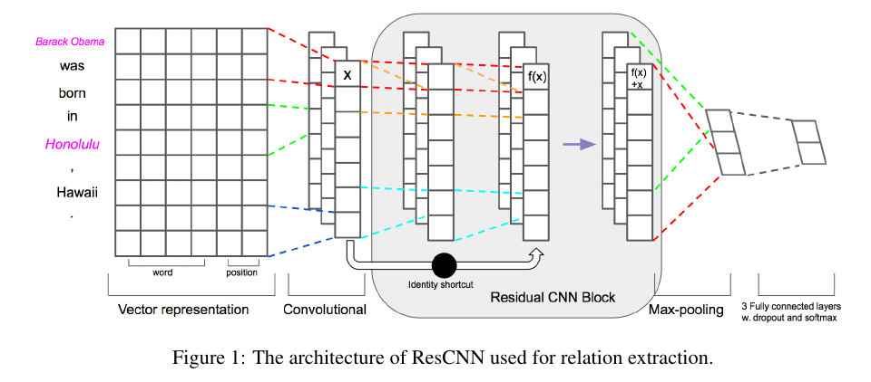
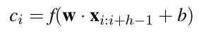
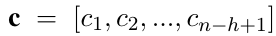
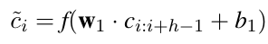
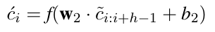
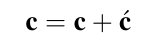
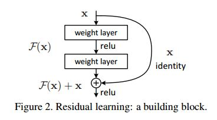

## Deep Residual Learning for Weakly-Supervised Relation Extraction

#### 1 模型介绍

这个模型的思想主要是利用 Residual CNN 去解决 基于远程监督的关系抽出问题. 下面是模型图:

这个模型前面的输入和2015年的论文一致, 唯一不同是在后面的多层卷积上.

- **第一层的卷积层**

  这里的公式是:

  

  这是第一层的卷积层. 

  $c_i$ : 代表第一层中, 根据某个卷积子计算出的 **句子的卷积特征向量**, 中的 **第 i 个元素**.

  $\large{c}$ : 一整条句子的卷积特征向量, 

- **后面的CNN Block**

  这里就用到了參差网路的特点.

  CNN Block 中的第一层:

  

  CNN Block 中的第二层:

  

  第三层, 组成残差结构, 这里时 CNN Block 的输出:

  

  > 注意, 这里每一个卷积层的映射中, 使用的卷积子的size是相同的.

- **多个Block**

  这个图中虽然只画出了一个, 但实际上是有很多的, 其中作者的实验是, 在有九个时有最好效果.

- **最后的全连接层**

  最后使用maxpool来构成了全连接层的输入.

  在参数说明中, 看到作者使用模型中使用的卷积子共有 128 个, 意味着这里的全链接层的输入向量维度是128.

#### 2 Intuition

文中给出了两个解释:

- 深层CNN分别代表了词汇信息, 句法信息, 语义信息, 通过 Residual CNN, 跳过了一些不需要的层次, 比如句法. 

  > 个人感觉有些牵强, 毕竟后面使用了多个Block, 那也不可能每次跳的都正好是句法信息啊. 只能说在一定程度上有这样的趋势.

- ResNet本身就有解决梯度消失的问题, 在这里降低了noise的影响.

  确实是, 从结果来看, 这个模型可以和 基于attention 的模型打平甚至更优秀, 那么肯定也拥有了解决远程监督中的噪声的机制和能力, 但是为什么ResNet 就可以解决这个问题呢? 下面是自己的思考.

#### 3 Why it works?

下面是借鉴了[知乎问题](https://www.zhihu.com/question/64494691/answer/325492405) 中 [pymars](https://www.zhihu.com/people/zhang-shun-long-95) 和 [王峰](https://www.zhihu.com/people/wang-feng-98-82) 的回答.

##### 3.1 ResNet 能力

- **与 highway network 的对比**

  首先, 根据之前写的那片highway network的文章, 我们知道, 那篇文章是 element-wise 进行信息截留和流通, 而 残差网络其实是更直接了, 下面是 ResNet 一个 Block的示意图:

  

  ResNet直接是将之前的整个的结果加在了新的向量上面, 这样就直接将所有的信息全部包含进这一个Block的输出上了. 这样, 即使是通过很多很多层, 在某一层中需要的信息, 比如与这个关系相关的某个语义特征, 也会一直向下直接的传递下去, 而不会向一般的深度网络一样, 逐渐的在非线性变化中失去自己的意义还成为单纯的噪声. 

- **梯度相关性**

  这里王峰大神介绍了一篇文章, [The Shattered Gradients Problem: If resnets are the answer, then what is the question?](https://link.zhihu.com/?target=https%3A//arxiv.org/abs/1702.08591) 这篇我没有看, 但是根据王峰大神的解释, 有了个个人看法, 错了还希望指出.这里定义了一个 梯度反向传播的相关性 的概念, 我的理解是, 最上层的梯度反向传播的更新值与底层更新值的关系, 关系越大说明上层对底层的影响越大. 假设这个公式为 $f(\delta_l,\delta_h)$, 表示第l层得到的更新值与第h层得到的更新值之间的相关度.

  研究发现, 普通的深层网络随着层数的增加, 也就是固定 $\delta_h$ 随着 l 的不断变小(向底层), 这个相关度的值是逐渐降低, 相关性与层数 L 的关系是 $1/2^L$. 这样的话, 对于较深的网络, 上层的更新和下层的更新几乎没什么关系, 几乎到了最后的更新值已经成为噪声了. 但是 ResNet 的是 $1/\sqrt{L}$. 说明, Resnet具有保持网络稳定性的能力. 

- **ResNet解决的问题** 

  我了解 ResNet 的契机是研究室的分享会上, 同学对于梯度爆炸和梯度消失问题的解决中提到了这个模型. 但是按照上面的理解, 它不止是一种简单的数学技巧, 上面讲到的 intuition 的部分才是最重要的. 也就是上面的 相关性衰减的问题.

##### 3.2 ResNet 在关系抽出模型中理解

其实在这里就很好理解了, 在训练过程中, 与relation无关的向量逐渐被忽略, 模型慢慢变成了一种只倾向于使相关信息通过的结构. 也就一定程度上解决了远程监督数据中的noise问题.