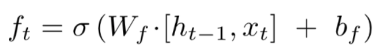
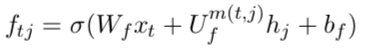
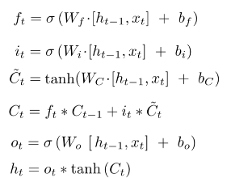
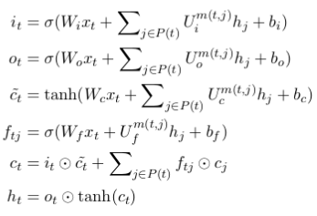
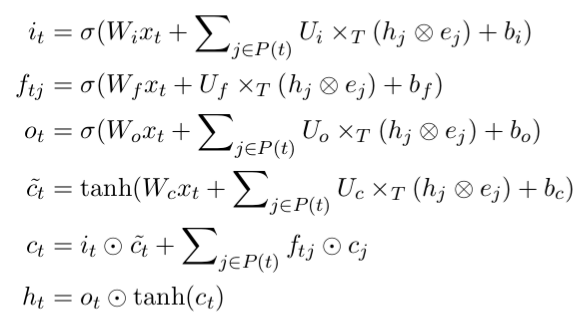
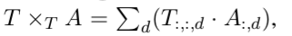

## Cross-Sentence N-ary Relation Extraction with Graph LSTM

### 0. Abstract

- 总述 : 本篇论文提出了一个可以抽取句子之间关系的基于 graph LSTMs 关系抽取模型.
- 模型创新点 : 基于graph 制式的方法提供了一种整合不同LSTM模型以及不同类型的关系的能力. 不同类型的关系包括句内关系和句间关系(包括, 序列,句法以及对话关系). 
- 模型的某些特征 : 模型的输入是一个基于上下文的健壮词向量.这简化了任意数量的关系的处理. 
- 数据 : 基于两个精密医药数据集, 展示了其在传统监督学习以及远距离监督上的有效性. 
- 结论 : 1. 句间关系抽取扩大了知识库. 2. 多任务学习提高了抽取精度.
- insight : 通过这个模型得到了一个insight:语言分析在关系抽取上很重要. 

### 1. Introduction

- **motivation**

  这篇论文呢主要针对的是生物论文中的跨句多元关系抽取, 主要针对的是三元实体关系. 即:

  **disease D**  受 **gene G** 影响,可被 **Medince M** 治愈.

- **Model**

  - 通过应用图式, 我们的框架包含了基于chain或者tree LSTMs的一些方法, 并且可以引入丰富的语言分析去提升关系抽出.
  - 关系的分类采用的输入是实体向量, 实体向量是从全部的text中学来的, 并且可以很容易的推广到任意数量的关系类型.
  - 实验基于两个重要的方法, 并列的, 远程监督和监督学习. 我们的模型-graph LSTMs that encode rich linguistic knowledg 比其他的神经网络的模型变种都要好,和一个完美的特征工程大致效果一样. 
  - Multi-task learning with sub-relations 会更加提升. 这里的意思是说, 使用三元关系中的子关系, 比如说三元中的二元 **disease D** ,可被 **Medince M** 治愈. 如果确实第三实体, 便可利用这个二元实体, 与三元识别任务一起进行训练. 
  - Syntactic analysis (句法分析)也对结果有很大贡献. 

- **Result**

  通过远程监督来进行学习后,相比于单句内的信息抽取, 知识量提升了三倍.

### 2. Cross-sentence n-ary relation extraction

- **一般的单句二元实体抽出**

  在一般的二元实体关系抽出中, 主要的方法是找到两个实体之间最近的依存路径, 或者通过充分的特征(可通过依存树或者深度网络中获取)

- **简单的将其拓展至多元关系抽出**

  一个简单直观的方法时, 在文中找到一个tigger phase. 将n元关系分为n个二元关系, 使得这个 tigger phase 作为标志, 每个实体都要与这个tigger 进行上述的二元关系判断. 但是由于, tigger phase 的大小是多变的, 且不一定每种关系中都会重复出现一样的词汇, 因此这个方法是不健壮的. 

  并且, 跨句子的依存树解析也是无法实现的, 并且进行特征工程的话,需要及其复杂的特征规则制定.

- **我们的方法**

  基于图的LSTMs. 基于子关系的多任务学习, 并且:

  The graph formulation subsumes **prior LSTM approaches based on chains or trees**, and can **incorporate rich linguistic analyses**.

### 3. Graph LSTMs

- **LSTMs**

  首先从RNN开始介绍到了LSTMs. 同时提出了, LSTMs存在只能处理线性数据的问题. 无法从句子中获取结构性(树状)的句法信息. 

- **Graph LSTMs**

  - tree LSTMs

    基于先行研究的[tree LSTMs](nd-to-end relation extraction using LSTMs on sequences and tree structures. | Improved semantic representations from tree-structured long short-term memory networks.) 不得不说, 这个点子听起来很棒, 现在的很多人否认语言学在自然语言中的应用, 但那只是他们不懂怎么将语言学的知识应用到语言处理中, 他们只会一味的强调从数据中自动学习出规则, 有很多信息其实是不用大量数据, 而仅仅通过一些架构的数据便可以获得的. 比如说, 句子中的依存结构信息. 如果说非要从原始线性数据中学得这样的结构, 也是可以的, 但是明明可以通过人工设计解决的问题, 为什么非要通过数据学习, 你家数据就这么多嘛?

  - model骨架介绍

    下面的图是,整个模型的大概感觉图:

    

    第一层是输入, 第二层是通过LSTM对每个单词学得一个上下文向量, 其中的几个实体的上下文向量被链接起来, 作为关系分类器的输入. 对于多词汇的实体, 我们的目前的方法是取其每个单词的平均. 这个graph LSTM部分的模型同关系分类器是互相无关系的.  因此, 两个模型分别采用什么,或者说什么样的分类器和这个Graph LSTMs更相配是一个有趣的问题. 

  - **document graph**

    这个是tree LSTM的核心部分. 可以获取句子中各种各样的依存关系. 

    By choosing what dependencies to include in the document graph, graph LSTMs naturally subsumes linear-chain or tree LSTMs.

    不过这样的graph LSTM(以下简称GL)也有两个挑战:

    - 容易形成环形结构, 这样的情况使得梯度下降无法进行. 
    - 由于依存关系的属性很多, 因此不同的依存关系对应不同的参数, 使得参数化成为一個很重要的问题. 

    ​

    **下面开始详解模型细节**

#### 3.1 Document Graph

原论文: Distant supervision for relation extraction beyond the sentence boundary.

这个DG本身就是一个用来处理句间关系问题时提出的方法. 但是其本身其实是一个更为广义的方法. 其不仅仅是处理句间关系, 其本质是一个图, 图中有节点和边, 节点表示的是词汇, 而边表示的是各种不同的词汇之间的关系, 例如 linear context, syntactic dependency 和 discourse relations. 

> 这个和我的idea_4.19里想要做的东西的出发点是一致的, 都是想将句子的依存结构加入模型中, 不过这个方法更厉害一点, 可以使用各种各样的关系信息. 另外, 关于基于依存结构的词向量的问题, 看论文笔记 paper:基于依存结构的词向量

下面是一个句子的DG实例:

这个就是 GL 的骨架. 我们可以通过定义omit什么关系来定制不同的网络, 如果只保留相邻关系就是一个简单的LSTM网络.

#### 3.2  Backpropagation in Graph LSTMs

- **单向LSTM的后向传递过程**

  详细分析见[博客](https://blog.csdn.net/xuanyuansen/article/details/61913886)

  对于一个简单的单向LSTM而言, 后向传递的过程是, 记住不同time下的模型, 也就是对于一个有n个输入的模型, 我需要记住n对输入以及输出, 在这个博客中说到, 一个时刻下的模型, 是有五个变量, 因此, 就需要记录5*n个变量. 然后依次对前一个时刻的变量做后向传播分析. 

- **cycle LSTM的后向传递**

  但是在这个模型中, 我们看到LSTMs的不用时刻之间的前向传递关系是混乱的, 也就是说是有内循环的. 上面的那个方法就会造成无法训练的后果. 针对这个问题, 有以下几个论文解决:

  - The graph neural network model.
  - Gated graph sequence neural networks
  - Semantic object parsing with graph LSTM

  这里先不深究, 但是大概意思就是说, 将内循环的LSTM部分进行展开, 并且这里有一个超参数-展开的层数. 

  - **这个方法的缺点**

    - 使得训练代价过高, 因为每个步骤都要被训练几次. 

    - 类似于循环置信传播(loopy belief propagation). 会有, 震荡或者无法收敛的缺点. 

      > 置信传播是一种在图模型上进行推断的消息传递算法。其主要思想是：对于马尔科夫随机场中的每一个节点，通过消息传播，把该节点的概率分布状态传递给相邻的节点，从而影响相邻节点的概率分布状态，经过一定次数的迭代，每个节点的概率分布将收敛于一个稳态。为了使用置信传播算法，在马尔科夫随机场中定义了两个概念：消息和置信度。

- **提出的方法**

  本论文目标问题中, 其实像共指关系以及对话关系是很稀少的, 主要的就是线性关系以及依存关系. 

  本论文提出一个简单的方案去解决上面的那些问题:

  将整个graph分为两个方向的图, 一个向右(包含线性关系和依存关系),一个向左(包含线性关系和依存关系). 如下图所示:

  

####  3.3  The Basic Recurrent Propagation Unit

- **LSTMs的单元设计**

  详见笔记 [note:LSTMs]

- **Graph LSTMs的单元设计**

  - **Full Parametrization**

    不同于简单的LSTMs的一点是, 这里针对每一个链接关系都会给出一个向量.

    liner LSTMs:

    

    Graph LSTMs:

    

    并且, 之前是进行的 cell输入和cell输出之间的点积 再乘以一个矩阵. 

    而新的是分别乘以一个矩阵之后再加和. 

    其他的部位都只是内部具体参数计算方法的变化, 数量并没有变化, 数目变化的只有遗忘门的数目. 

    下面是两个算法的对比:

    ​	**liner LSTMs** 						**Graph LSTMs**

    

    **该方法的缺点是:**

    - 在依存关系有很多时, 需要有大量的参数去赋予给不同的关系. 但是即使是通过了远距离监督获取了很多数据, 但是依然无法支撑起如此巨大的参数开销.
    - 因此, 论文并没有针对每个关系赋予一个向量, 而是使用了粗粒度的 : 邻接关系, 语法依存关系 仅仅两个关系种类. 

  - **Edge-Type  Embedding**

    针对上面存在粗粒度问题, 该论文提出了一个可以利用详细关系的细力度方法.

    这个方法的核心思想就是将依存关系的向量的长度变小, 在Full parametrizaiotn中, 我们知道, 由于 依存关系的向量要和cell的输出向量(隐藏状态)进行点乘, 因此其长度必须等于输出向量$h_t$ 的长度,, 在新的方法中, 利用了张量积去解决这个问题:

    ​

    

    其中, $e_j$就是依存关系的向量. $\bigotimes$ 是张量积, 其效果是, L维向量的与D维向量的张量积是 L*D 的矩阵.并且, . 可以生成一个L维的向量. 

#### 3.4  Comparison with Prior LSTM Approaches

主要是就之利用词汇相邻关系的linear LSTMs和只利用句子内的依存关系的Tree LSTMs 之间的比较. 

这个Graph LSTMs还可以利用更多的内容, 比如, 句间的对话关系和共指关系等等. 

#### 3.5  Multi-task Learning with Sub-relations

向模型中加入这个功能,只需要向模型的最后加另外关系的分类器即可. 也就是说, 原先的三元关系的分类器接受的是三个实体上下文向量的输入联结, 输出的是二分类(是三元组或不是三元组). 对于二元关系的话, 就是加一个新的接受两个实体上下文向量的输入联结,输出二分类的(是子关系或不是子关系)即可.

The classifiers share the same graph LSTMs representation learner and the word embeddings, and can potentially help each other by pooling their supervision signals.

### 4. Implementation Details

主要介绍的是模型的一些超参数.

分类器采用的是逻辑回归, 其中超参数的选择是基于在一个小数据集的先前实验.

训练采用的是batch size为8 的SGD法. 30个数据周期, 以及学习率为0.02.

LSTMs的cell输出单元(隐藏状态)是150维, 联结关系的向量维度为3. 单词向量维度为100.

### 5. Domain: Molecular Tumor Board

#### 5.1 Datasets

采用的论文数据集是 PubMed 中的一百万篇文章. 利用distant supervision 法去从中抽取认为有效的数据. 

其他的工具有, 

- tokenization,  part-of-speech  tagging, and syntactic parsing 用的是 SPLAT (Quirk et al., 2012)
- Stanford dependencies using Stanford CoreNLP (Manning et al., 2014).  
- We used the entity taggers from Literome (Poon et al., 2014) to identify drug, gene and mutation mentions

使用了 Gene  Drug  Knowledge  Database和 Clinical Interpretations of Variants In Cance两个数据集去进行远距离监督. 

#### 5.2 Distant Supervision

简单地使用, 三句话之内出现的三个实体(drug-gene-mutation)的关系作为正例. 也就是实体的句间共现作为选择的方法. 

使用的方法参考自 Distant supervision for relation extraction beyond the sentence boundary.

#### 5.3 Automatic Evaluation

验证的部分, 倒时候再说, 应该用不上.

