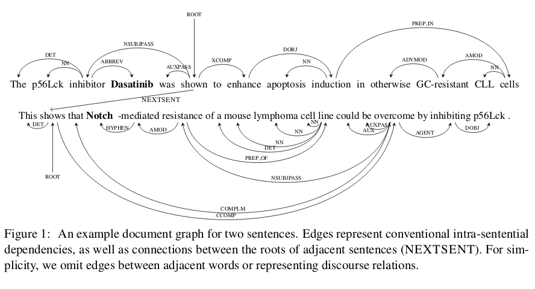

## Distant Supervision for Relation Extraction beyond the Sentence

### 0. Abstract

第一个提出了针对与句间关系的distant supervision方法. 

方法的核心是构建一个graph represetation. 加入了 rhetorical relation, coreference,  narrative structures 等等句间关系.

并且为了提高模型的准确率和鲁棒性, 这个方法选择从graph 表征的不同路径上提取特征的方法, 这样一定程度上降低了语言解析器的误差带来的影响. 

结果: 与现存的远程监督法对比, 我们的方法抽出的关系的数量是原先的两倍左右. 

### 1. Introduction

这篇文章废话比较多, 首先花了半页讲了现在数据量大, 需要句间关系抽取. 

这篇文章提出了 **DISCREX** 方法, 也是第一个将远程监督法应用到句间关系抽取的研究. 其核心在于, 利用一个文本等级的graph represetation 来融合新的句间关系到原来的相邻关系和依存关系中. 并且, 使用多条路径来增强鲁帮性与正确率. 

具体的关系有四个:

- discourse phenomena
- coreference
- narrative structures
- rhetorical relations

在精准制药数据上的测试结果显示, 获得的关系的量翻倍.

### 2. Related Work

这些暂时跳过

这里提到了几个抽取实体以及其属性, 而不是实体与实体关系的论文. 

- Extracting Attributes of Named Entity from Unstructured Textwith Deep Belief Network
- Type-Aware Distantly Supervised Relation Extractionwith Linked Arguments
- Overview of the English Slot Filling Track at the TAC2014 Knowledge Base Population evaluation

### 3. Distant Supervision for Cross-Sentence Relation Extraction

**DISCREX** : Distant Supervision for Cross-Sentence Relation Extraction

#### 3.1 Distant Supervision

DISCREX的来源是: exsiting knowledge database + unlabeled text

大概的方法就是, 在大量的 unlabeled text 中, 寻找KB中已经存在的关系对共存的段落. 因为unlabeled text 有一百万篇左右的论文, 所以可以找出很多这样的例子, 这个作为 positive examples. 其次, 随即挑选共现的实体对, 作为 negative example. 使得正例和负例的数量一致. 

> 那么 ,在我的研究中应该怎么做. 
>
> 第一, 正例就用70篇论文中的数据. 但是严格来说, 我的研究更像是 (实体, 属性, 属性) 的关系抽出. 这里先只考虑他说的这种情况.假设, 那些属性的数值都是实体. 
>
> 第二, 获取unlabeled 数据, 这个是难点, 因为, 这个领域现在不知道有如此大量的文章库.  自己去下的话, 不现实. 其次, 不知道一个物质的属性是否会经常在其他的文章中被提及.

#### 3.2 Minimal-Span Candidate

有时候, 在一篇文章中, 两个实体可能即在一个句子内共现, 也有可能在几个句子内共现, 也就是说, 在一短文字中, 共现超过了一次. 在这种情况下, 我们该采取那个共现作为标准呢? 我们倾向于认为离得近的表现出这种关系. 

由此引发出一个问题, 如果在没有短的共现的情况下, 多少个句子之间我们认为它是有推理关系的?

实验结果, 在K=3时,结果好. 

#### 3.3 Document Graph

这个在跨句间关系抽取的论文中, 介绍过, 这里简单说:

如图所示, 相比于之前的那个论文的图, 增加了两个东西. 

- 句间关系:
  - 粗粒度 : 简单的next sentence 这样的感觉, 然后两个句子的root相连)
  - 细粒度 : 利用discourse  parse: A refined end-to-end discourse parser
- 共指关系, 这样可以减小两个实体间的距离, 增强联系, 提高识别率.
  - Entity-centric coreference resolution with model stacking
  - The life and death of discourse entities:  Identifying singleton mentions
  - 并且, 还可以通过共指增加单句内的候选. 

#### 3.4 Features

这是用来进行关系分类的模型, 采用的根据特征进行分类的方法. 不详细说.

首先是先确定一条由一个实体到另外一個实体的路径. 对路径上的每个词汇或者关系进行特征提取.

主要是利用了词汇的三个性质, lexical item, lemma, part-of-speech tag. 进而, 使用词汇与关系之间的共现组成特征关系对. 大概, 路径中的每个点或线都可以抽取30个特征. 

**模型用的是逻辑回归**

#### 3.5 Multiple paths

采用多条路线来进行特征提取, 提高鲁棒性. 

不同路线的选择可人工选定. 

....

### 4. Experiments

#### 4.1 Knowledge Base

....

#### 4.2  Unlabeled Text

介绍几个工具:

- SPLAT: conduct tokenization, part-of-speech tagging, and syntactic parsing
- dependencies: Stanford  CoreNLP
- entity : Literome(Literome:   Pubmed-scale genomic knowledge base in the cloud.)

