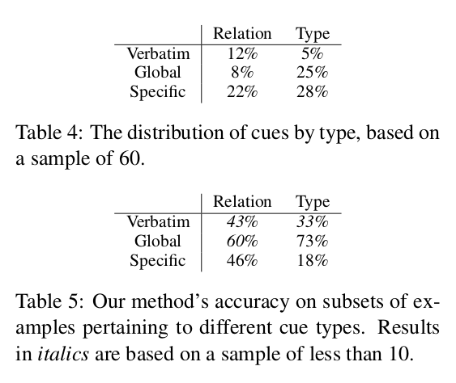

## 基于关系阅读理解的关系抽取

### 1. Abstract

本文的核心就是利用阅读理解的模型去解决关系抽取的问题.其中,这样做有两个好处.

- 可以利用阅读理解现有模型去做关系抽取的工作.
- 可以通过crowding-source和远距离监督的方式获取非常大的训练集
- 可以进行zero-shot抽取训练集中没有的新的relation类型.

实验结果表明,该模型可以根据一个relation以很高的准确率生成一个新的question.也可以以低精确度生成unseen relation.

### 2. Introduction

- **问题描述**

  slot-filling : 

  - 已知: **关系 R，实体 e , 一个句子 s **
  - 目的 : 找出一个 **A** 使得, 任意 $a \in A, R(e,a)$ 成立. 这里的 **A** 是 **s** 里的词汇.

  > **A** 可以为空,即对于关系为R的实体e,在句子s中并未找到与其对应的实体.

- **现有模型的局限性**

  在已有定义好的relation的基础上,我们可以利用crowding-source和远距离监督的方式去获取数据集.但是前提太严厉了,我们很难人工去定义出所有的relations.

  **这里说不定可以作为我以后的课题 : 发现文章中的 unseen relations**

- **改进方案**

  - **从 R(e,a) 到 QA 的映射方案.**

    而,这个模型的重点就在于,他将 $P(A|R,e,s)$ 转变成了一个  $P(A|Q,e,s) + P(Q|R)$ 的问题.

    也就是说,问题分为了两步,一步是将 **R->Q** , 一步是利用阅读理解模型算出  $P(A|R,e,s)$ .

    对于一个具体的relation: educated_at(zhaoxin,NAIST) , 我们希望做到的是抽象出一个 **educate_at(sb., sp.)** 的概念.这个概念被称为 **schema relation**. 并且,将 educate_at(sb., sp.) 映射到一个问答中.

  - **unseen relation**

    在问题描述中,我们知道我们的目标是,根据 relation, entity, sentence 来查找对应 entity(answer). 但并不是直接根据这三个,而是将relation变成了question.

    现在就考虑三种unseen的情况

    - 第一种: relation unseen. 出现在 **R->Q** 的过程中

      解决这个unseen的方法,是将这个relation转换为question(根据relation命名中的语义信息). 然后再利用阅读理解的手段,进行处理.

    - 第二种: entity unseen. 出现在 $P(A|R,e,s)$ 的过程中

      在下面讲解

    - 第三种: question unseen. 出现在 $P(A|R,e,s)$ 的过程中

      在下面讲解

- **创新点**

  - **data**

    利用distant supervision来从wikidata中获取relation数据.特别大,129G.

    接下来使用crowdsourcing方法,即外包给人的方法,对每个relation进行querify(编成问题).

    方法一会介绍,每个relation平均提出十个问题,一个得出了30000000 (question-sentence-answer) 对. 需要注意的是, 这里的 (question-sentence-answer)  对都是自变量缺省的形式. 也就是如下的情况:

    > Q: Where did **X** study in?
    >
    > S: **X** is studying in NAIST.
    >
    > A: **NAIST**

  - **model**

    机器阅读里都会假设答案肯定是在sentence中,但是实际上slot-filling并不能保证这一点.因此,在这一点上需要在使用的RC模型上做出改变.

    并且通过将relation转变为question的方式,我们将可以抽出没有出现过的relation.

  ​

### 3. Approach

- **问题描述**

  slot-filling : 

  - 已知: **关系 R，实体 e , 一个句子 s **
  - 目的 : 找出一个 **A** 使得, 任意 $a \in A, R(e,a)$ 成立. 这里的 **A** 是 **s** 里的词汇.

  > **A** 可以为空,即对于关系为R的实体e,在句子s中并未找到与其对应的实体.

  而,这个模型的重点就在于,他将 $P(A|R,e,s)$ 转变成了一个  $P(A|Q,e,s) + P(Q|R)$ 的问题.

  也就是说,问题分为了两步,一步是将 **R->Q** , 一步是利用阅读理解模型算出  $P(A|R,e,s)$ .

- **R->Q**

  这里的一段强调了,该方法是采用了 schema querification. 也就是是对每个 $R(e,?)$ 且 e 为一个变量进行 querification. 然后再赋予这个Q 一个entitiy e.形成一个真正的问题.

  通过这一步,我们将relation抽出的数据集变成了一个阅读理解的数据集.接下来就可以用阅读理解的模型进行训练.

- **zero-shot**

  上面也提到了我们有三种unseen 情况,这里讨论第一种,也就是 relation unseen data的情况.比如对于 $deciphered(x,y)$ 这种关系,很难有那个relation关系库中可以包含这种关系,但是我们在这里通过将 $deciphered(x,y)$ 转换为 $question$ : "which code did x break?" . 再赋予x一个entitiy的情况下,利用阅读理解系统,既可以进行分析.

  正如你所想的,这里需要的一个很重要的模型就是,**R->Q** 这一步一定要准确.

- **下面要做的**

  - 收集data,包括收集一个大的relation库,其次是将其通过crowdsourcing法,转换为一个高效的阅读理解数据集.
  - 用一个调整过得阅读理解model进行训练.

### 4. Dataset

- **slot filling data**

  在wikidata这个数据集中, 每个实例都有一个relation R, 一个entity e,一个document D, 一个answer a. 接下来,我们采用a和e在D中的同时出现的第一句话作为 sentence s.

  这样,我们再将e抽象出来,得到了 $(R(e,?),s,a)$ 这样的数据对,**注意,这里的e是自变量,而不是具体的实体**. 也就是说 $(R(x,?),s,a)$ .只有 R,S,A是已知的.

- **schame querification**

  这里其实要经过两个步骤:

  - 雇佣工人去看realtion写出问题,要求有如下两点:

    - 指出relation的语义.
    - 在问问题的时候,有一定的词汇创新性.

    在这一步之下还有两点要做,分别是 collection和verification.

    - collection:

      对于每个R,我们提出3个example sets,每个example的特征是,e都是自变量,也就是s.并且标出,在s中的答案a.具体的例子看figure 3. 并且我们要求每个注释者对每一个examples提出三个问题, 然后雇佣了找了三个注释者,也就是对于每个relation,我们有27个初始问题.然后不知道怎么地例子又翻倍了,成了54个,最后大概平均下来40个是有用的.最后对于178个relation,每个relation至少提出了100个例子.

    - verification:

      这一步是用来验证第一步中的数据是否可靠,并挑出可靠的部分.这一步就是把上面的数据集通过人再进行可答验证,反正不知道怎么算得吧,在120个relation之间,我们提出了1920个高质量的提问templates(即e为自变量).

  - 用机器推广

    我们将schema变为实例,对每一个q_x进行实体化,最后得出了3千万的数据.

- **negative examples**

  简单的将不同的问提和不同relation的sentence结合,最后的结果显示,有三分之一的negative含有好的数据集.

  ​

### 5. Model

下面开始讲使用的阅读理解的model.这个其实很简单,不知道这篇文章怎么会花这么大篇幅去讲这个问题.模型具体细节,没有讲. 他的模型的输入为问题和sentence,输出为正确答案在sentence中的每个位置作为start和end的概率值.假设s有N个词汇的话,那么 $z_{start},z_{end}$ 就各有N个值.那么,start在i,end在j的概率就是: $P(a=s_i,...,j) = p_i^{start}p_j^{end}$ 

而他的改进就是在 $z_{start},z_{end}$ 后面各加一位来表示没有答案的概率. 两个最后一位的乘积是没有答案的概率.即 $P(no\_answer) = p_{N+1}^{start}p_{N+1}^{end}$  如果  $P(no\_answer) = p_{N+1}^{start}p_{N+1}^{end} >  P(a=s_i,...,j) = p_i^{start}p_j^{end}$ 

就可以说没有答案.

### 6. Experiments

这一节主要介绍了模型在各个unseen情况上的结果.

测试方法是,将数据分为train/test/dev,根据不同的unseen测试重点不同,设置方法不同.

- 对于 unseen entity ,由于这个方法的主体是基于schema querification的,因此,这一项很高.

- 对于 unseen question, 即已知relation的未知question,这一项其实测试的模型的阅读理解能力.由于本身基于的是阅读理解model,因此这一项也不错.

- 对于unseen relation,这一项其实是最重要的.他的测试方法是按照relation进行数据集分组,train中的relation,test集中是绝对没有的.测试的方法还是将relation对应的问题输入,那么在应用场景中,若用户需要对一个新的relation进行抽取是,需要自己先把relation转化为一个问句,或者通过某种relation->question的模型进行翻译.结果而言,是不好的,原因如下:

  对于阅读理解模型,训练的方法时随机将内容分为train和test两部分,没有进行语义上的分割.也就是说两部分的语义是基本相同.但是这个情况下的分割明显的是语义上的不同.通过 train 训练出的模型里,理论上根本就没有 test 所需要的语义信息.但是这里依然有一定效果的原因是, **question相比于relation而言最大的优点在于,其中包含了答案的type信息,也就是提问,且屏蔽relation关键词的同时,已经包含了一些relation的一部分语义.比如说靠 what,how,when等等关键词,就已经可以一定程度上限定词汇.** 

### 7. Analysis

这里对unseen relation的数据进行了分析,分析利用了100组随即数据,其中60个postive example. 40个negative example.

- **negative example**

  这40个中,有13个包含distractor(错误选择项).

  > 错误选择项: 答案中虽然没有正确选项,不过有和正确选项相同的type.(人名,地名...)

  在unseen relation的测试中,发现有2/14的distractor是被回答了的.而在剩下的26个distractor的negative example中,都是只有一个错了.

- **postive example**

  对于这个分析更复杂一些,论文将问题分为了六种类型.

  - 首先是按照 relation和type分为了两种:

    - relation : 问答内容的判定是主要依靠relation的语义信息.
    - type:  问答内容的判定是主要依靠回答中的词汇类型信息.

  - 其次,在每个下面,又分出了 verbatim, global, specific 三种类型.

    - verbatim : 问题的部分内容在sentence中逐字出现. 就是比较简单的类型.
    - global : question文本中的措辞偏离了问题的主要方式,也就是句法上有创新.
    - specific : question文本的措辞和这个relation的搭配有相当大的匹配性,也就是说这个提问的方式一般不会用于其他提问,并且也不是verbatim类型,例如 (声音类型 - 男高音) 这种组合.也就是词汇上有创新.

  - 这样就有了六种,样本分布,和各个类型的准确率如下:

    

    通过这个分析,我们可以看出,这个模型对于global模型的推理是最好的,但是我认为这个并不能说明什么,因为对于这种unseen relation的分析,本身就没有很大意义,我是指学术上的趣味性,对在train set没有的relation进行test,本身就只能使用一些偏方,这里用的就是 $relation->question$ 的过程中,给该relation添加的附加信息.