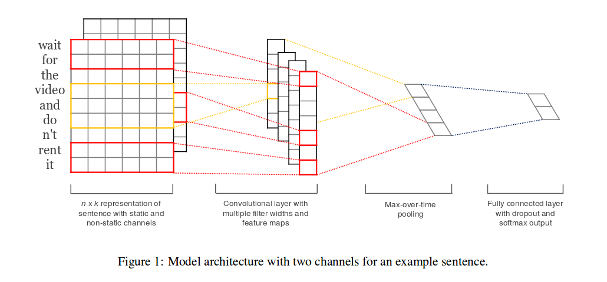

## Convolutional Neural Networks for Sentence Classification

### 1. Inroduction

-   大概介绍了一下语义词向量.说明其在欧式空间的相似性.
-   介绍了CNN是一个利用多层网络和卷积算子(过滤器)来操作局部特征的网络.介绍CNN在NLP取得的成就,在语义分析,搜索查询检索以及句义模型等等方面实现好的效果
-   在之前的工作中,作者利用了一层卷积的CNN网络在2013年,和word2ver的词向量上进行了实验.实验包括static 词向量和动态的的词向量,两者,及其混合模型.前者是只改变模型的一些参数,后者是在训练过程中对词向量也进行了调整.最后是两者的混合结果发现根据任务来适当的调整词向量更有效果.

### 2. Model

这个模型的简图如下:

具体模型介绍如下:

这个模型用了一层卷积神经网络,首先介绍卷积神经网络的结构,分为三层来介绍:

-   卷积层
-   max pool层
-   全连接层

下面开始具体介绍:

-   卷积层:

    首先该模型使用文本中最长的文本作为文本卷积网络的输入词汇长度.长度不足的地方用0代替.

    此处设其为max_length,则每次训练的输入维度为:[max_length*embedding_size],这里embedding_size的默认值为128.

    论该模型默认使用了三种大小的filiter_size,[3\*embedding_size],[4\*embedding_size],[5\*embedding_size],然后每种filiter有128个.

-   max pool层:

    由卷积层可得出128*3=484个卷积结果.

    每个卷积算子的结果的维度和该卷积算子的size有关.

    size = max_length - filiter_size + 1

    max pool通过不同size的卷积结果,使用其对应大小的max pool方法,每个卷积结果经过max pool变成了一个标量.

    因此,经过max pool层之后,得出了484*1的数据

-   全连接层:

    由上面的结果可知,全连接层的输入为484*1的数据,下面就是一个简单的单层神经网络.不过这里使用了dropout,dropout率为50%.

    学习的方法是,先利用隐含层计算出该输入属于不同类别的scores,也就是猜测的分布情况,其次利用交叉熵去定义损失函数,最后的loss函数是:

    self.loss = tf.reduce_mean(losses) + l2\_reg_lambda * l2_loss

    tf.reduce_mean(losses):上面提到的交叉熵

    l2\_reg_lambda*l2_loss:

    ​	l2\_reg_lambda:正则参数

    ​	l2_loss:是中间隐含层参数的平方差loss

    ​

卷积层的介绍就到这里,下面是卷积网络的用法的介绍,论文中使用了两种输入:

-   一个是kept static embedding,也就是说词向量不会变
-   一个是,fine-tune embedding,词向量会在训练中进行微调.

根据这两种输入,模型又分为了三种进行测试:

-   只使用kept static embedding
-   只使用fine-tune embedding
-   两者具使用,在这种情况下,每个过滤器就要重新设计以将两者的信息都使用上.具体不太懂.

就这样,试验结果来看,结合两者的模型效果更拔群.

----

>   模型分为四层
>
>   1.  输入层: 
>
>       n*128 就是一个含有n个词汇的句子,这里的n默认为语料库中最长的那个句子的长度.
>
>       n是词向量维度
>
>   2.  卷积层
>
>       利用到了三种卷积算子(又名过滤器)
>
>       分别是 3*128, 4\*128 ,5\*128,每个过滤器在对句子进行计算(矩阵和向量的乘法再加上非线性转换)之后得出的是一个128的向量.
>
>       这三种算子分别有128种.
>
>       那么可以知道卷积层出来的结果是 484*128的矩阵.其中128是词向量维度,484是卷积算子个数.
>
>   3.  max pool层
>
>       对484*128矩阵的每行进行取最大值操作.也就是从128中取最大的.
>
>       得出484*1
>
>   4.  全连接层
>
>       全连接层的输入是484*1,输出为几个类别,这里的全连接层就是一个最简单的单层神经网络

---

