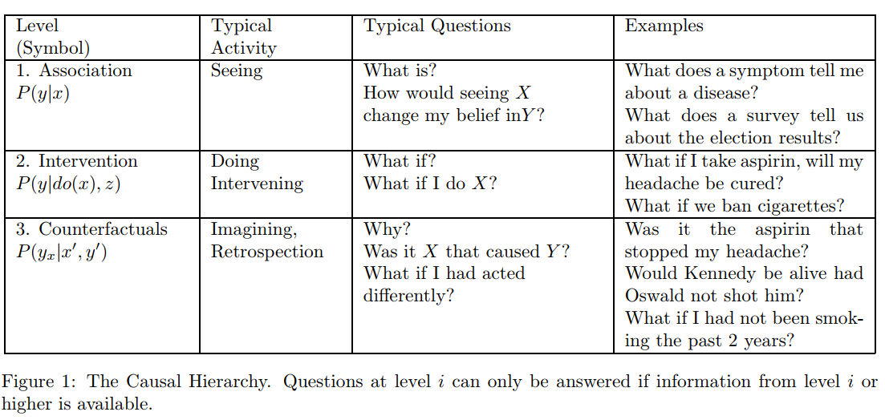
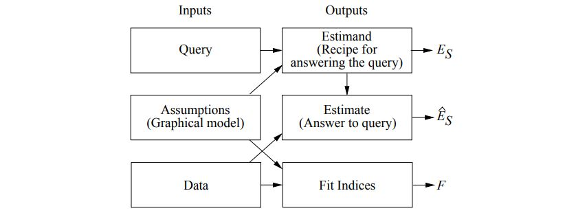

## Theoretical Impediments to Machine Learning With Seven Sparks from the Causal Revolution

### 0.Abstract 

如今的机器学习算法多是采用的统计或者model-free的模型.

>   model-free是指在训练中没有任何的先验的外观或者形状等模型，而model-based是基于人为的外观等模型

但是这样的系统无法表达干预(interventional)以及反思(retrospection)的过程.因此不能为强AI服务.

若要实现人类水平的智力,则要一个基于现实的,可以进行因果推断的模型.为了论证,演示这类模型的 至关重要的作用,本文提出了七个如今机器学习无法解决但是可以通过因果系统解决的任务.

### 1.Scientific Background

-   如今的机器学习算法遵循的是达尔文进化论,这个需要基于一个actual enviroment.

    也许他能解释人类和的动物在几千万年来做到的进化系统,这是一个slow proces.

    但是却无法模拟出人类2000年以来发生的超进化(super-evolutionary process)现象.

-   实现这个东西的关键是: 

    **manipulate at will to imagine alternative hypothetical environments**

    根据意愿去想象一个假想的空间.可以在这个假想空间中增加意志,想象,假设等等.

>   这里联想到了GAN网络,GAN网络确实是通过随机创造出了一个不存在的空间,但是,这个'想象'是无规律性的.而一个**有规律的假象空间或许是我们想要的?**
>
>   就像是哲学一样,哲学的基石是一些不怎么严密的假设,但是基于次可以不断的进行推理得出整体体系,就像最开始的科学一样,多是不准确的猜测.比如说,牛顿去检测加速度的定理,他不是通过成千上万次的实验才得出的结论,还是通过**实验加推理**.
>
>   假设用神经网络去训练的话,一开始的数据可能是大量的,在每次训练的过程中,其结果还有可能仍然是违反常理的,比如说,给小球一个力之后,经过还没怎么训练的神经网络进行计算的话,其可能表现出反向运动的预测结果.而基于人类已经有的知识,这个是不会发生的.这也许是基于一个这样的抽象规则:
>
>   *当一个实体对另一个实体发生了某个含有方向的动作后,被动的实体会产生一种新的与方向有关的动作,且方向相反或相同.*
>
>   而这个规则,私认为是可以通过文本训练去提取的,拿这个例子而说,实体是可以通过文本检测的,而还有方向的动作也可以通过与方向词汇共现的动词来确定,但是如果要进行这样的分析,就必须使用一个使用标准语言的预料库.或者更直接的,使用义原.

-   **利用假想空间做什么呢?**

    1.  首先基于实际的enviroment去构建一个 mental representation of their environment.
    2.  interrogate that representation,审查这个环境(可以理解为找出这个环境的一些基本特性,在图像中可以为,识别物体;在文本中可以为识别实体,并找到他们之间的联系.)
    3.  distort it by mental acts of imagination.改变真实的空间成为一个假想的空间.
    4.  回答问题:
        -    interventional questions: “What if I act?” 
        -    retrospective or explanatory question: “What if I had acted differently?”

-   **反事实推理:**

    反事实推理有一本书,放在book文件夹里了,英语好了之后一定要看.

    在反事实推理的数学化出来之前,就已经有了要在机器学习系统里,加入因果系统的建议了.

    这样可以加速学习.

    现如今图论和结构模型的进步实现了反事实推理计算化,这给利用模型驱动的因果系统在强
    AI上的应用带来了曙光.在下一节中，我将使用三级层次来描述机器学习系统所面临的障碍，这个三级层次管理因果推理中的推理。最后一节总结了如何利用现代因果推断工具规避这些障碍。

    ​

-   **因果推理的三个层次**:

    

    因果推理的逻辑所揭示的一个非常有用的见解是，就每个类别能够回答的问题类型而言，存在对因果信息的一个清晰的分类。

    其中,**反事实是科学思维的基石，法律和道德推理亦是。例如，在民事法庭，被告被认为是造成伤害的罪魁祸首。如果没有被告的行为，伤害很可能就不会发生。“如果没有”的计算意义要求比较现实世界和没有发生被告行为的另一个世界.**

    这个层次是不可逆的,下面的层次的问题可以兼容上面的,反之不可以.

    其数学公式都在左侧.

-   **反事实推理的作用:**

    Counterfactuals are the building blocks of scientific thinking as well as legal and moral reasoning.

     反事实是科学思维的积木以及法律和道德推理.

    虽然深度网络在association层次到达了很高的成就,但是只要不加入外部信息,那么系统就不可能实现更高层次的推理.原因是:

    Interventional expressions cannot be inferred from passive observations(被动观察) alone,regardless of how big the data.也就是说,一个孩子通过对环境的有趣操纵（通常在一个确定性的操场上）来学习干预的效果，人工智能规划人员通过行使他们指定的行为来获得干预知识。我们需要定义一个designated sets of actions.指定的动作集合.不可能通过**只凭借(需要加入外界知识)**大量数据自动推断出可以进行的动作集合.

    ​

### 2. What you can do with a causal model that you could not do without?

The Seven Pillars of the Causal Revolution 

即使在如今能够进行简单因果推理的系统还是寥寥无几,这是甚为高级的技术.但是在一种数学化的解释因果关系的语言被设计出来之后,就不一样了,这个数学语言是把因果关系变成了一个数学游戏.

 这些工具允许我们正式地表达因果关系问题,可以将我们现有的知识编码于图形和代数形式.然后在利用数据估计答案.

Moreover, the theory warns us when the state of existing knowledge or the available data are insufficient to answer our questions; and then suggests additional sources of knowledge or data to make the questions answerable.

只加入已有的知识和数据是不足够的,因此需要加入额外的数据和知识库才可以.

提出了下面的SCM(Structural Causal Model):

-   Structural Causal Model(结构因果模型)

    The SCM deploys three parts

    1.  Graphical models,(图模型) - 用来表示我们知道什么
    2.  Structural equations.(结构方程式) - 用来链接上下两个
    3.  Counterfactual and interventional logic.(反事实和干预逻辑) - 用于表示我们想要知道什么?

    感觉这里的graphical model就是一个知识库.

-   **引擎**

    

    其中，图模型作为表征知识的语言，反事实逻辑帮助表达问题，结构化方程以清晰的语义将前两者关联起来。

-   **SCM 框架的 7 项最重要的特性:**

    ​