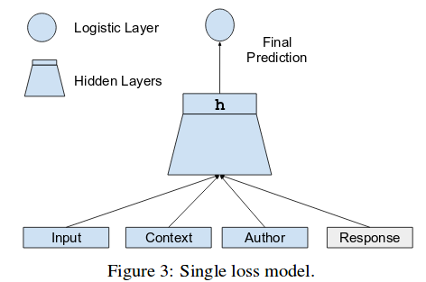
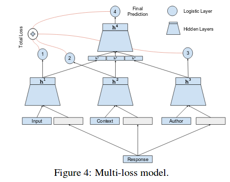

## Conversational Contextual Cues: The Case of Personalization and History for Response Ranking

### 1. Introduction

-   这篇论文中的研究对象是人与人的自然对话,对话的性质是:open-domain,multi-turn,unstructured,multi-participant,   conversational dialogue.(开放领域的,多个来回的,无结构性的,多参与者的交谈型对话)
-   研究的立足点为:对话的建模是受对话的历史,参与者们在对话中的历史来决定的.
-   一般的数据驱动型对话分析模型都是基于前面的对话来预测下一个语句,这个模型将做两个拓展:

    -   **[context]**:对最后一句话之前的所有对话历史进行建模,这里称这些历史为**[context]**.这个使得模型包含了,medium-term signals, presumably references and entities.(不知道怎么翻译,我的理解是,这里将这个对话的主题,提及的东西,以及一些代指等等进行了分析,进而将这个历史中的所有词汇的词义进行了约束) , 消除了一些相近词汇的歧义.
    -   **[personal history]**:按照发言者来区分数据,把每个人的发言作为其**[personal history]**,对每个人进行建模,使得模型可以根据不同人的兴趣点,经历,说话方式等等,进行个性化预测.
-   这篇论文所用的语料库是一个美国大型新闻网站的回复记录,共收录了367000个话题下的,21亿条语句,13.3千万个会话记录.
-   **模型的基本思路是:不是去生成,而是去挑选,在每次面临进行下一个回复的预测是,去随机的语句池中去挑选最争取的一个.这也可以理解为一种对文本的理解能力.这里是使用了一个基于深度网络的二分类器.模型通过分辨一个正的(真实的输入/输出语对)和负的(随机的)来训练模型,最后通过训练好的深度网络的评分来进行打分.**
-   该模型鼓励系统去链接当前对话和他的一个真实回复.而不是随机回复.模型通过**用户的特点**,**在此主题下的会话的历史**,以及**前面的对话信息**来对候选者打分.并且这里在训练过程中还训练出了一个**单词的语义空间**,一个**用户的特征空间**.这个**用户的特征空间**使得我们能够在同一个模型中,对不同的用户做出不同的预测,避免对每一个用户都训练一个预测模型的需要.
-   该模型的贡献有:
    -   对同一个用户在几年的时间在不同模块下的所有回复进行建模,提供了更好的预测.
    -   对long-term历史(长历史)记录的回话进行建模,分析了采用数据的历史长度对模型准确率的影响.
    -   概述了一个训练以及使用辨析分类器去给一个回复打分的方法
    -   使用了一个可扩展性的神经网络去利用超大型的数据
-   文章结构简介:
    -   第二章:数据驱动型对话系统的研究简介
    -   第三章:介绍了采用数据库的多样性,规模以及处理原始数据的方法
    -   第四章:介绍模型具体信息

### 2  Related Work

-   对话分析的基本方法角度:
    -   [Ritter et al.2010](Alan  Ritter,   Colin  Cherry,   and  BillDolan.  2010.  Unsupervised modeling of twitter con-versations.   InHuman  Language  Technologies:  The2010 Annual Conference of the North American Chap-ter of the Association for Computational Linguistics,HLT ’10, pages 172–180, Stroudsburg, PA, USA. As-sociation for Computational Linguistics)利用向量空间模型分布上的相似性,利用推特数据去发觉对话行为.
    -   [Banchs and Li](Rafael  E.  Banchs  and  Haizhou  Li.2012.  Iris:  a chat-oriented dialogue system based onthe  vector  space  model.   InProceedings  of  the  ACL2012  System  Demonstrations,  pages  37–42,  Jeju  Is-land, Korea, July. Association for Computational Lin-guistics.):建立了一个搜索最佳回复的搜索引擎
-   个性化角度:
    -   [Narasimhan et al.2015](KarthikNarasimhan,TejasKulkarni,  and  Regina  Barzilay.2015.Languageunderstanding   for   text-based   games   using   deepreinforcement   learning.InProceedings   of   the2015  Conference  on  Empirical  Methods  in  NaturalLanguage   Processing,   pages   1–11,   Lisbon,   Por-tugal,   September.   Association   for   ComputationalLinguistics):固定领域的问答系统(专家系统),游戏领域
    -   [Walker et al.2012]( Marilyn Walker, Grace Lin, and Jen-nifer Sawyer.  2012.  An annotated corpus of film dia-logue for learning and characterizing character style.In  Nicoletta  Calzolari,  Khalid  Choukri,  Thierry  De-clerck, Mehmet Ŭgur Dŏgan, Bente Maegaard, JosephMariani, Jan Odijk, and Stelios Piperidis, editors,Pro-ceedings  of  the  Eighth  International  Conference  onLanguage  Resources  and  Evaluation  (LREC-2012),pages  1373–1378,  Istanbul,  Turkey,  May.  EuropeanLanguage Resources Association (ELRA).  ACL An-thology Identifier: L12-1657.):个性化对话系统,通过长度,极性,动词长度,对话行为分布等等
    -   [Bonin et al.2014](Francesca Bonin, Jose San Pedro, andNuria Oliver. 2014. A context-aware nlp approach fornoteworthiness  detection  in  cellphone  conversations.InCOLING, pages 25–36):基于such as  gender, income, age,and marital status来个性化对话
-   建模方法的角度:
    -   [Sutskever et al.2014]( Ilya Sutskever,  Oriol Vinyals,  andQuoc V Le. 2014. Sequence to sequence learning withneural networks.   InAdvances in neural informationprocessing systems, pages 3104–3112.):sequence-to-sequence framework,利用RNNs
    -   [Serban et al.2015a](  Iulian  V  Serban,   Alessandro  Sor-doni,  Yoshua  Bengio,  Aaron  Courville,  and  JoellePineau.  2015a.  Building end-to-end dialogue systemsusing generative hierarchical neural network models.arXiv preprint arXiv:1507.04808.):tried end-to-end  training  on  an  RNN  encoder-decoder network. 同时利用了预训练好的词向量.
-   evaluating:
-   Recall@k or Precision@k are  commonly  used for measuring a ranker’s performance on the task of response selection.这两个是评价精确度的术语.

### 3  Reddit Dataset

忽略

### 4 Models

#### 4.1 数据结构

-   conversation: $C = ((M_1 , A_1 ), (M_2 , A_2 ), . . . , (M_k , A_k)).$

-   其中$M_i$和$A_i$分别是信息i和作者i

-   其中,$M_i = (w_{i1}, w_{i2}, ....w_{il})$,w是单词.

-   $A_i$ and $w_j$ are random variables taking values in the user population $P_{user}$ and the word vocabulary $V_{word}$.在$P_{user}$中每个用户对应一个用户的特征向量.

    ​

-   Response: R=$ψ(M_k)$ where $M_k$ is the last message in the sequence.

-   Input Message:I=$ψ(M_{k−1})$where $M_{k−1}$ is the message that the response is addressing.

-   Context:C=$ψ(M_1,M_2,...M_{k−2})$where $(M_1,M_2,...M_{k−2})$is the subsequence of messages that preceded the input message.

-   Author:A=$φ_{user}(A_k)$ where $A_k$ is the user who generated the response message.

至于这里的$ψ()$到底是什么实现方法可以忽略,论文里面也说得不清楚,这块看得我快疯了,效果,只需要知道:

**R:是每个会话中的最后一句所含有的信息,是一个n维向量**

**I:是每个会话中的倒数第二句所含有的信息,是一个n维向量,作为离被预测句子最近的句子,成为输入**

**C:上下文,是每个会话中的除了最后两句外所有的句子所含有的信息,是一个n维向量**

**A:是作者的特征向量**

#### 4.2 训练方式

对于每个会话中的每个句子,采取以下的方式训练.设置两个组:

**({I,C,A},R)**:这个是正确的信息

**({I,C,A},R')**:这个是错误的信息,这里的R'是随机挑选的一条信息.	

-   **Single-loss Network**

    训练模式如下图:

    

    这个模型中,四个值被链接在一起,作为一个向量输入,经过一个深层网络,h是这个深度网络训练的最后一层的参数,通过下面这个公式,做出最后的判断;

    $Pr(R|I,C,A)≈σ(Wh+b)$

    这里的σ()是逻辑函数.We  call  this  model  a  single-loss  model  be-cause it makes one prediction using all the informa-tion available.

-   **Multi-loss Network**

    训练模式如下图:

    

    这个模型是将input,context,author中的每个元素都和response进行一次single-loss Network训练之后,再将三者训练结果级联一起输入一个single-loss Network,最后输出.

    公式如下:

    

### 5 总结

感觉这个模型没啥好说的,论文写的是非常差,不忍直视,就是知道有这么个做法就好了.