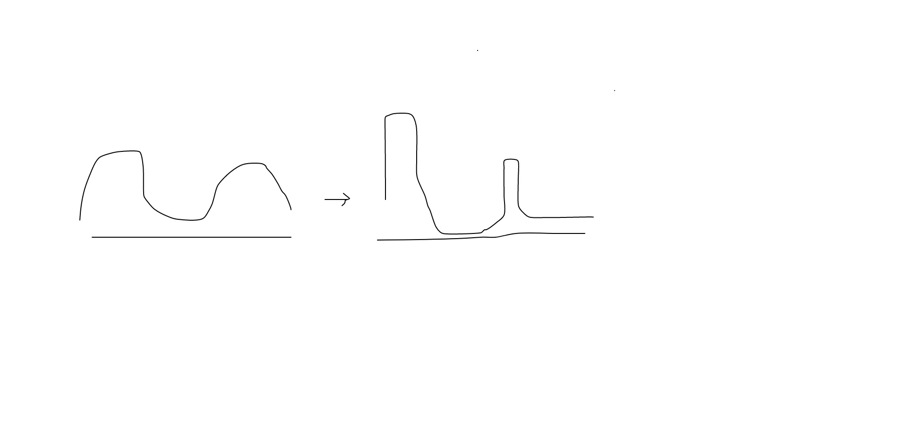

## Reinforced Mnemonic Reader for Machine Reading Comprehension

### 0. Abstract

这篇论文利用了强化助记符阅读器去增强阅读理解模型.

主要是在两个方面进行了增强.

- 一个再注意机制, 为了避免发生 attention dundancy问题和 attention deficiency 问题, 提出了一个方法 , 是, 利用前面的时序列注意力矩阵,来精练当前矩阵的方法.
- 一个新的优化方法,叫做dynamic-critical reinforcement.用于增强标准的监督学习.它还鼓励去预测一个可以接受的答案, 去解决在传统的强化学习中会出现的 convergence supperssion 问题

### 1. Introduction

- attention上的注意点

  - 首先有人提出了用attention去解决机器阅读的问题,包括各种各样attention的变种. 但都是单次的注意力机制. 后来又有人利用了多次注意力机制来增强模型(multi-rounds attention). 但是,在那些方法中, 后面的注意力机制都没有利用到前面的注意力的信息.这样就出现了两个问题.
    - 多层注意力机制都注意力集中与相同的文本,造成 attention redundancy. 
    - 无法注意到文本中的一些突出的地方,造成 attention deficiency.

  - 解决方案:

    这里的 intuition 是, 当两个词汇关于某段文字的注意力向量高度重合时,那么这两个词汇应该是语义相似的. 反之同理. 利用注意力时序列前面的信息去生成后面的注意力信息的话,就会使得:

    - 对于每个注意力点的集中度提高
    - 注意力点之间变得更加独立,更加离散. 

    

- 训练时的注意点

  - 问题

    一般在语言处理中,我们进行评价的标准都是基于最大似然的准确匹配.但是在这里,我们采用的方是, 计算预测词汇和实际的overlap (但是两个离散的单值如何计算overlap呢?). 这里称这一个值为F1值.

    这个情况有一个缺点: convergence superssion(收敛抑制):

    这里可能涉及了强化学习中的一些概念, 特定的, 我们会使用一个baseline 去归一化奖励和减小方差. 但是, 当baseline比奖励要好的时候, convergence 就会被抑制.这样的话,在低级奖励与实际的答案部分重合的时候, 模型将不会鼓励预期与实际结果重合.简单的强化学习介绍见附录.

  - 解决方法

    而这个方法的优越之处在于，这里选择动态的改变baseline和reward的值。动态调整的方法是,通过两个不同的sampling策略, 随即推理和贪婪推理.两个中分数更高的那个作为reward, 另外的那个作为baseline. 这样的话就不会有 convergence suppression的问题.

- **提出了Reinforced Mnemonic Reader**

### 2. MRC with Reattention 

#### 2.1 Task description

- Input: Q(question), C(context)
- output : P(A|Q,C) 其中A是context的词汇.

#### 2.2 Alignment Architecture for MRC

MRC中的对齐机制.

- **MRC中的对齐机制.**

  在机器阅读的最佳模型中,都用到的一个方法就是**对齐**. 这里的对齐是指:

  将context的每一个词汇,通过, 注意力机制,和question中词汇进行对齐. 进而利用question中的注意力信息去增强context的表征.

- **机器阅读中使用注意力机制的现存方法**

  具体的公式化描述见 scan1.png

  我们现在有了一下几个符号:

  **question 词向量序列: V**

  **context 词向量序列 : U**

  **Q,C相似度矩阵	: E**

  **question-aware context representation: H**

  **self-aware context representation : B**

  一般来说,一个 **H** 加一个 **B** 就可以构成一个single-round alignment architecture 

  然而我们认为这样的一个结构没有办法得到问题和上下文之间复杂的互动结构信息. 

  因此,后面又有研究发明了 multi-round alignment architecture .

  用 $V^t, U^t, E^t, H^t, B^t$ 来表示不同层次的各个数据.

- **存在问题**

  后面的层次的信息没有办法对前面层次的信息进行**直接的**关注. 前面的层次的注意力信息,只能通过隐含单元的表征流向后面的层次中. 这就会造成上面提到的两个问题.

  ​