## Teaching Machines to Read and Comprehend

### 0. Abstract

该论文提供了大量可以用于训练的阅读理解数据集.并且,设计了一种在拥有很少语言结构先验知识下的,基于注意力深度模型的,可以实现阅读理解以及回答复杂问题的模型.

### 1. Introduction

-   **以往研究**:

    在此之前,机器阅读理解的方法,通常是:

    -   基于手写的人工语法
    -   利用信息抽取的方式,找到问题的谓词参数三元组后,再去由其为关键词查询由文章构成的数据库.

    由于缺少大量的数据集,因此很少用监督学习的方法去做这个问题.

-   **基于神经网络的方法:**

    由于难以获取数据,因此研究者采取了利用生成综合性叙事和问题的方法,去给神经网络方法提供几乎无限的数据.研究表明,神经网路的方法是有效的.但是基于生成数据的监督学习方法有一个很大的缺陷就是,生成的虚拟的数据很难去适应真实世界的数据.这样的模型难以捕捉自然语言的多样性,复杂度和噪音.

-   **生成可靠数据的方法:**

    在研究中发现,根据总结文段和意译文段,结合与他们相关的文章,可以简单生成context	-query-answer三元组,这个简单的方法是,实体检测和匿名化算法.根据此算法,得到了100万数据.

-   **模型:**

    该模型还是使用的2014年的那个翻译模型的算法,就是将注意力机制和循环网络结合在一起的那个模型.结果证明,在没有对文章和问题结构进行特殊编码的情况下得到了一个更好的结果.

    ​

### 2. Supervised training data for reading comprehension

在之前的设计中,模型目标是:

​				$P(answer | context,query)$

并且希望在这个模型中引入有世界知识(在数据集很大的情况下构建的知识图谱可以认为是拥有世界知识的)的知识图谱,用于检索文本中的实体之间的语义关系.

根据此,很容易就会去想到设计一个监督学习算法,但是这个需要大量数据.因此,在只有少量数据的情况下,就只能采用非监督性学习方法,去利用文章数据构成一个小的知识图谱.

但是该模型提供了一个生成新的数据集的方法.即:

利用长文本和与其相关的summaries,通过将summaries的实体用占位符替代的的方式,构成一个问题(Cloze style questions).并且将被替代的实体,作为答案.

还有,该数据集有一个很重要的特征是:择出了答案中存在原文中不存在的实体的例子.另外很重要的一点是,summaries并不是简单的将文中的句子复制,而是更为抽象的,甚至存在文中没有出现过的实体的句子.

#### 2.1 Qualitative Analysis of Answer Difficulty

为了最后能评价模型效果,这里构建了一套问题难度的评价标准.

-   simple:在不考虑句法和语义的基础上可以解决的问题.
-   Lexical:需要进行词汇的归纳,需要考虑到语义(词向量)
-   Coref:需要进行指代消解
-   Coref/Lex:即需要语义又需要指代消解的问题
-   Complex:需要进行因果关系的推理(已经牵扯到逻辑)
-   unanswerable:....

比例如下:

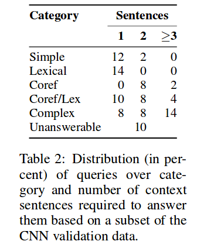

#### 2.2 Entity replacement and permutation

正如上图所示,有很多简单的句子,在这种句子中,答案的推理仅仅是通过词汇的共现关系而已,比如,在问题[小李子再度与?擦肩而过]的问题中,很容易联想到是[奥斯卡奖],这个仅仅是因为共现度较高而已,若是不做任何处理,训练出的模型就会是去向预测共现词汇的方向发展.

模型采用的方法是:**实体的替换和交换**

这一方法有三个步骤:

-   对每一个数据点中的实体建立指代系统.就是用一个抽象的印记去替代实体词汇.
-   根据上面建立好的指代系统将数据中的所有句子中的实体替代为抽象词汇.
-   在录入一个数据点时,随机交换印记(因为,如果不交换的话,相当于没有变化)

可以理解为,屏蔽一组数据(context-query-answer)中的实体词汇的语义.用符号代替.

这样的话,有效的防止了由于共现的先验知识造成的正确推理,而只能利用文本推理去进行推理.但是在实际应用是,还是可以使用不掩盖实体语义的版本的.

具体如图:

但是这里就有一个问题,如果用符号去代替实体,那么i基于词向量作为输入的神经网络结构是如何利用实体呢?

### 3. Models

为了能够与模型进行对比,该论文还设置了两个对比模型(baseline):

-   maximum frequency:picks the entity most frequently observed in the context document
-   exclusive frequency:chooses the entity most frequently observed in the context but  not observed  in the  query

#### 3.1 Symbolic Matching Models

首先看下两个基本概念的解释:

>   Benchmark和baseline都有性能比较的意思。
>
>   benchmark:
>
>   通俗的讲，一个算法之所以被称为benchmark，是因为它的**性能已经被广泛研究，人们对它性能的表现形式、测量方法都非常熟悉，因此可以作为标准方法来衡量其他方法的好坏**。这里需要区别state-of-the-art（SOTA），能够称为SOTA的算法表明其性能在当前属于最佳性能。如果一个新算法以SOTA作为benchmark，这当然是最好的了，但如果比不过SOTA，能比benchmark要好，且方法有一定创新，也是可以发表的。
>
>   baseline:
>
>   通俗的讲，一个算法被称为baseline，基本上表示**比这个算法性能还差的基本上不能接受的**.这里还需要指出其另一个应用语境，就是**在算法优化过程中，一般version1.0是作为baseline的，即这是你的算法能达到的一个基本性能，在算法继续优化和调参数的过程中，你的目标是比这个性能更好**，因此需要在这个base line的基础上往上跳。

下面就介绍两个benchmark.

-   **Frame-Semantic Parsing**

    利用框架语义理论,是基于计算语言学的理论.抽取谓词以及和他有关的参数,然后利用问题和文档中的为此分析来进行问答.例子如下:

    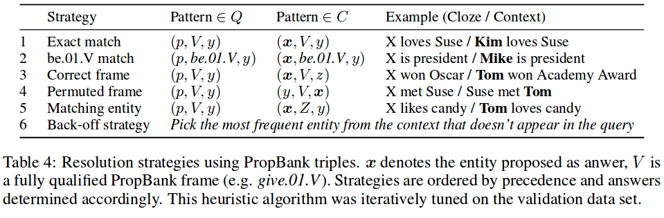

    我们这里为了方便起见,只是用了(e1,V,e2)这么一种 PropBank triples.并且,为了控制变量,这里和设计的模型一样,同样进行了抽象印记替换(即使没有什么意义,因为这里没有含有共现信息语义信息). 

    如上图所示,提供了几种策略,这里 策略按优先级排序，相应地确定答案。该启发式算法在验证数据集上反复调整。 

-   **Word Distance Benchmark**

    这个模型是基于符号距离的算法,不是cos计算的距离.

    方法就是,首先将占位符与context中所有有可能的实体词汇对齐.然后计算query中的没一个词汇和对齐词汇在context中上下文的距离.具体怎么算的我TM的也看不懂.不管了,反正就是个baseline.

#### 3.2 Neural Network Models

该模型使用了三个网络.

-   **The Deep LSTM Reader**

    如下图所示:

    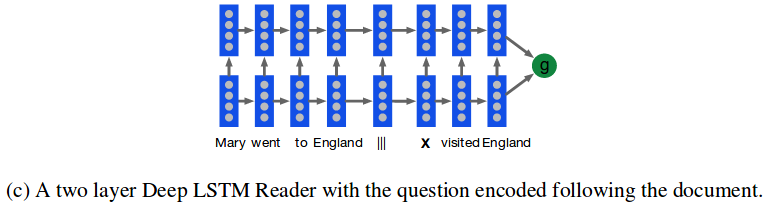

    这个模型很简单了,就是用的deep LSTMs网络去训练.这个模型的论文是(Supervised Sequence Labelling with Recurrent Neural Networks).先把文档一个词一个词的输入到网络中,其次使用一个空格符后,再输入query的embedding.另外,我们还可以选择先输入query在输入documents.输出的是,g,也就是在documents的某个位置,意思是这个位置的词汇是答案.

    具体计算公式如下,就不细看了,看不懂:

    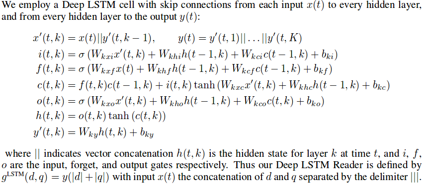

-   **The Attentive Reader**

    如下图所示:

    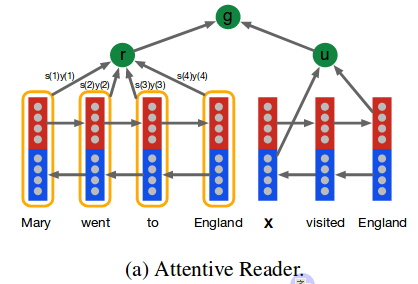

    上面的那个模型有一个长距离传播依赖的特性.固定长度隐含层向量成为这个模型的瓶颈所在(黑人问好脸).

    为了规避这个问题,我们使用注意力模型:

    -   对于document:

        就是一个双向循环网络模型,并且在最上面有一个权重分配器,权重分配器本质是一个单层感知机.这里的双向是指既可以从左向右输入也可以从右向左输入.然后将每个词汇在两个方向的循环网络的隐含层状态级联起来.

        具体的计算公式如下:

        -   document中每一个词汇的输出:

            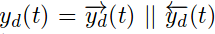

        -   r的计算过程

            

            $m(t)	$ 是将 $y_d(t)$ 和 $u$ 的信息结合了起来,使用了一个非线性变换函数.

            $s(t)$  就是一个经过单层感知机训练后得出的权重参数,这里的权重参数和变量的结合形式不是wx+b,而是指数形式.与之前不同的是,这里的权重的计算函数,包含了变量本身的值$y_d(t)$

            r 就是加权过后的document向量.

    -   对于query:

        与document不同,他将向右循环网络的最左的值和向左循环网络的最右的值级联了起来.

        公式就是:

        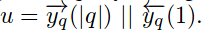

    -   将query信息和document信息结合起来:

        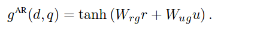

-   **The Impatient Reader**

    具体如下图:

    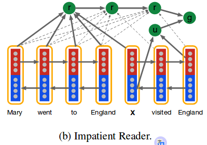

    这个模型就是上面模型的进化版:

    We can go further by equipping the model with the ability to reread from the document as each query token is read.  At each token $i$ of the query $q$ the model computes a document representation vector $r(i)$ using the bidirectional embedding  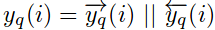

    其中每个 $r(i)$ 的计算公式为:

    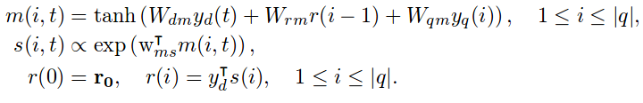

    由上面这个式子可以看出,每个 $r(i)$ 中间都有$r(i-1)$的信息.

    这个模型包含进了document和query中每个词汇的信息.最后的结果是:

    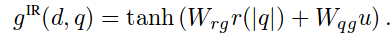

    试验结果证明,这个模型是最好的.

#### 3.3 some questions

-   这个论文在最前面说:"用entity替换和重新排列的方法将数据打乱,为了防止词汇共现对模型的影响".但是在引入神经网路模型的时候又说道,"Note that we do not privilege entities or variables, the model must learn to differentiate these in the input  sequence.".又说这个需要模型不能特殊化其中的实体,是不是有矛盾呢?
-   这个模型的输入词向量是预先设定好的还是跟随着模型训练的?
-   占位符X的输入词向量应该是什么?

### 5. Conclusion

即使是将知识图谱和多文档问答结合起来,注意力机制和嵌入向量也是必须的.这个模型并没有解决推理性的阅读理解,但是这个模型可以为这样的研究开一个基础.