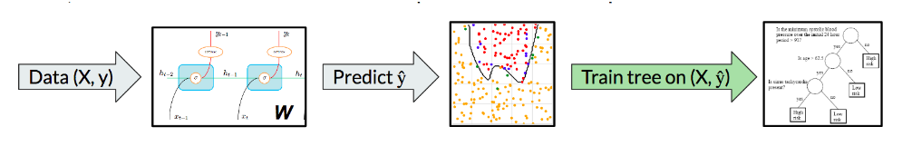
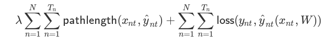
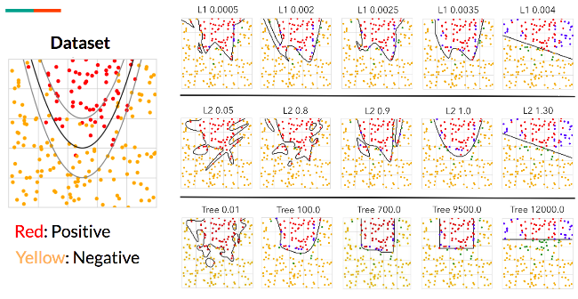
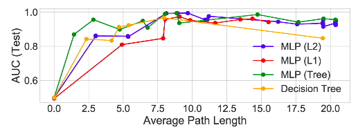
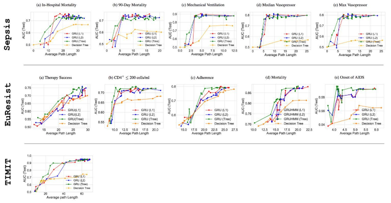

## 深度模型可解释性

### 1. 论文思想

这篇研究的核心思想就是用决策树去模仿深度学习的效果.

做法暴力简单, 就是先使用DNN对数据进行学习, **在每次梯度下降之后, 固定这个模型, 然后获取大量随机输入, 利用随机输入去得出在这个DNN下的预测值**, 利用这大量的 <随即输入,DNN预测值>对去训练一个决策树, 也就是说每次DNN下降都对应着一个决策树.

> 当然, 思想是这样的, 实际上可能会多次下降之后才会训练一个决策树

思想如下图所示:

### 2. 树正则化

#### 2.1 定义

树正则化是为了不让训练出的决策树的长度无限长, 使用了下面的这个公式:

这里的长度计算公式就是, 取所有叶的长度的平均值.

#### 2.2 效果

一图胜千言(x^2曲线模拟任务)

这个图中可以看出

L1正则化: 趋向于锯齿形的线条.

L2正则化: 趋向于球形的线条.

Tree正则化: 趋向于与坐标轴平行的线条.

下图是几个不同正则化以及真正的决策树模型的AUC曲线值,可以看到几者的差距其实不大:

下面的图是对于真实模型的预测.

可以看到, 对于真是数据而言, 虽然纯决策树的效果差, 但是模拟DNN的决策树的效果并不差.

#### 2.3 代理模型

因为每次下降之后都利用大量的随机数据去训练一个新的决策树实在是太费时间了, 因此这里才用了一个简单的MLP模型去预测本次下降后训练出来的决策树的平均长度, 在经过几个epoch的训练之后就可以获得不错的效果, 这样之后就不用每次训练新的决策树模型再去做正则化了.

### 3. 结果

基于专家对于真实数据下的决策树分析, 认为其具有合理性.